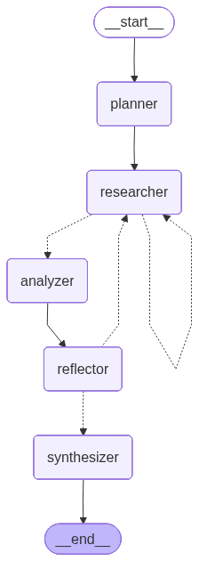

# Tutorial 07: Research Assistant

This capstone tutorial combines all patterns from previous tutorials into a comprehensive research assistant agent.

## What You'll Learn

- **Multi-step planning**: Breaking research tasks into phases
- **Tool integration**: Search, retrieve, and analyze
- **Reflection**: Self-critique and improve findings
- **Synthesis**: Combine results into coherent reports

## Prerequisites

- Completed [Tutorial 06: Plan and Execute](06-plan-and-execute.md)
- Understanding of all previous patterns

---

## Architecture Overview

The research assistant combines:
- **Tutorial 02**: Tool calling for search and retrieval
- **Tutorial 03**: Memory for tracking research context
- **Tutorial 05**: Reflection for quality improvement
- **Tutorial 06**: Plan-and-execute for structured workflow

### The Research Pipeline



The research assistant orchestrates planning, researching, analyzing, reflecting, and synthesizing into a complete pipeline.

---

## Core Concepts

### 1. Research State

Tracks the full research lifecycle:

```python
from typing import Annotated, List
import operator
from typing_extensions import TypedDict
from langgraph.graph.message import add_messages

class ResearchState(TypedDict):
    messages: Annotated[list, add_messages]

    # Task
    query: str                               # Research query

    # Planning
    research_plan: List[str]                 # Research steps
    current_step: int                        # Current step index

    # Research
    sources: Annotated[List[dict], operator.add]  # Gathered sources
    findings: Annotated[List[str], operator.add]  # Key findings

    # Reflection
    critique: str                            # Current critique
    gaps: List[str]                          # Identified gaps
    iteration: int                           # Reflection iteration

    # Output
    report: str                              # Final report
```

### 2. Research Tools

```python
from langchain_core.tools import tool
import json

@tool
def web_search(query: str) -> str:
    """Search the web for information."""
    # In production: use Tavily, SerpAPI, etc.
    return json.dumps([{"title": f"Results for {query}", "snippet": "..."}])

@tool
def fetch_document(url: str) -> str:
    """Fetch content from a URL."""
    # In production: use httpx, requests, etc.
    return f"Document content from {url}..."

@tool
def take_notes(topic: str, notes: str) -> str:
    """Record research notes."""
    return f"Notes recorded: {notes}"
```

### 3. Multi-Phase Workflow

The research assistant uses five distinct phases:

| Phase | Purpose |
|-------|---------|
| **Planner** | Creates structured research steps |
| **Researcher** | Executes steps with tools |
| **Analyzer** | Organizes and interprets findings |
| **Reflector** | Critiques quality, identifies gaps |
| **Synthesizer** | Creates final report |

---

## Building the Research Assistant

### Step 1: Define State

```python
from typing import Annotated, List
import operator
from typing_extensions import TypedDict
from langgraph.graph.message import add_messages

class ResearchState(TypedDict):
    messages: Annotated[list, add_messages]
    query: str
    research_plan: List[str]
    current_step: int
    sources: Annotated[List[dict], operator.add]
    findings: Annotated[List[str], operator.add]
    critique: str
    gaps: List[str]
    iteration: int
    report: str
```

### Step 2: Create Planner Node

```python
import json
import re
from langchain_core.messages import HumanMessage

def planner_node(state: ResearchState) -> dict:
    response = llm.invoke([
        HumanMessage(content=f"Create 3-5 research steps (JSON array): {state['query']}")
    ])

    try:
        plan = json.loads(re.search(r'\[.*?\]', response.content, re.DOTALL).group())
    except:
        plan = [f"Research: {state['query']}"]

    return {"research_plan": plan, "current_step": 0, "iteration": 0}
```

### Step 3: Create Researcher Node

```python
def researcher_node(state: ResearchState) -> dict:
    if state["current_step"] >= len(state["research_plan"]):
        return {}

    step = state["research_plan"][state["current_step"]]
    gaps = state.get("gaps", [])

    gap_context = f"\nAlso address: {gaps}" if gaps else ""
    response = llm_with_tools.invoke([
        HumanMessage(content=f"Research: {step}{gap_context}")
    ])

    # Execute tool calls and gather findings
    findings = [f"{step}: {response.content[:200]}"]

    return {
        "findings": findings,
        "current_step": state["current_step"] + 1,
        "gaps": []  # Clear gaps after addressing
    }
```

### Step 4: Create Analyzer Node

```python
def analyzer_node(state: ResearchState) -> dict:
    findings = state.get("findings", [])

    response = llm.invoke([
        HumanMessage(content=f"Analyze these findings:\n{findings[-5:]}")
    ])

    return {"findings": [f"Analysis: {response.content}"]}
```

### Step 5: Create Reflector Node

```python
MAX_ITERATIONS = 2

def reflector_node(state: ResearchState) -> dict:
    findings = state.get("findings", [])

    response = llm.invoke([
        HumanMessage(content=f"Critique (say COMPLETE if done):\n{findings[-1]}")
    ])

    # Parse gaps if not complete
    gaps = []
    if "COMPLETE" not in response.content.upper():
        try:
            match = re.search(r'\[.*?\]', response.content, re.DOTALL)
            if match:
                gaps = json.loads(match.group())
        except:
            pass

    return {
        "critique": response.content,
        "gaps": gaps,
        "iteration": state["iteration"] + 1
    }
```

### Step 6: Create Synthesizer Node

```python
def synthesizer_node(state: ResearchState) -> dict:
    findings = state.get("findings", [])
    query = state["query"]

    response = llm.invoke([
        HumanMessage(content=f"Write a report on '{query}':\n{findings}")
    ])

    return {"report": response.content}
```

### Step 7: Define Routing

```python
def route_after_research(state: ResearchState) -> str:
    if state["current_step"] < len(state["research_plan"]):
        return "researcher"
    return "analyzer"

def route_after_reflection(state: ResearchState) -> str:
    critique = state.get("critique", "")
    iteration = state.get("iteration", 0)
    gaps = state.get("gaps", [])

    if "COMPLETE" in critique.upper() or iteration >= MAX_ITERATIONS:
        return "synthesizer"
    if gaps:
        return "researcher"  # Fill gaps
    return "synthesizer"
```

### Step 8: Build Graph

```python
from langgraph.graph import StateGraph, START, END

workflow = StateGraph(ResearchState)

# Add nodes
workflow.add_node("planner", planner_node)
workflow.add_node("researcher", researcher_node)
workflow.add_node("analyzer", analyzer_node)
workflow.add_node("reflector", reflector_node)
workflow.add_node("synthesizer", synthesizer_node)

# Add edges
workflow.add_edge(START, "planner")
workflow.add_edge("planner", "researcher")
workflow.add_conditional_edges(
    "researcher", route_after_research,
    {"researcher": "researcher", "analyzer": "analyzer"}
)
workflow.add_edge("analyzer", "reflector")
workflow.add_conditional_edges(
    "reflector", route_after_reflection,
    {"researcher": "researcher", "synthesizer": "synthesizer"}
)
workflow.add_edge("synthesizer", END)

graph = workflow.compile()
```

### Step 9: Use It

```python
result = graph.invoke({
    "query": "What is LangGraph?",
    "messages": [],
    "research_plan": [],
    "current_step": 0,
    "sources": [],
    "findings": [],
    "critique": "",
    "gaps": [],
    "iteration": 0,
    "report": ""
})

print(result["report"])
```

---

## Graph Visualization


The graph shows the full research pipeline with conditional loops for gap-filling.

---

## Complete Code

```python
import json
import re
import operator
from typing import Annotated, List
from typing_extensions import TypedDict
from langchain_core.messages import HumanMessage
from langchain_core.tools import tool
from langchain_ollama import ChatOllama
from langgraph.graph import StateGraph, START, END
from langgraph.graph.message import add_messages
from langgraph_ollama_local import LocalAgentConfig

# === State ===
class ResearchState(TypedDict):
    messages: Annotated[list, add_messages]
    query: str
    research_plan: List[str]
    current_step: int
    sources: Annotated[List[dict], operator.add]
    findings: Annotated[List[str], operator.add]
    critique: str
    gaps: List[str]
    iteration: int
    report: str

# === LLM & Tools ===
config = LocalAgentConfig()
llm = ChatOllama(model=config.ollama.model, base_url=config.ollama.base_url, temperature=0)

@tool
def web_search(query: str) -> str:
    """Search the web."""
    return json.dumps([{"title": f"Results for {query}", "snippet": f"Info about {query}"}])

tools = [web_search]
tools_by_name = {t.name: t for t in tools}
llm_with_tools = llm.bind_tools(tools)

# === Nodes ===
def planner(state):
    response = llm.invoke([HumanMessage(content=f"Create 3-5 research steps (JSON array): {state['query']}")])
    try:
        plan = json.loads(re.search(r'\[.*?\]', response.content, re.DOTALL).group())
    except:
        plan = [f"Research: {state['query']}"]
    return {"research_plan": plan, "current_step": 0, "iteration": 0}

def researcher(state):
    if state["current_step"] >= len(state["research_plan"]):
        return {}
    step = state["research_plan"][state["current_step"]]
    response = llm_with_tools.invoke([HumanMessage(content=f"Research: {step}")])
    return {"findings": [f"{step}: {response.content[:200]}"], "current_step": state["current_step"] + 1, "gaps": []}

def analyzer(state):
    response = llm.invoke([HumanMessage(content=f"Analyze: {state['findings'][-3:]}")])
    return {"findings": [f"Analysis: {response.content}"]}

def reflector(state):
    response = llm.invoke([HumanMessage(content=f"Critique (say COMPLETE if done): {state['findings'][-1]}")])
    gaps = []
    if "COMPLETE" not in response.content.upper():
        try:
            match = re.search(r'\[.*?\]', response.content, re.DOTALL)
            if match:
                gaps = json.loads(match.group())
        except:
            pass
    return {"critique": response.content, "gaps": gaps, "iteration": state["iteration"] + 1}

def synthesizer(state):
    response = llm.invoke([HumanMessage(content=f"Write report on {state['query']}:\n{state['findings']}")])
    return {"report": response.content}

def route_research(state):
    return "researcher" if state["current_step"] < len(state["research_plan"]) else "analyzer"

def route_reflection(state):
    if "COMPLETE" in state.get("critique", "").upper() or state["iteration"] >= 2:
        return "synthesizer"
    return "researcher" if state.get("gaps") else "synthesizer"

# === Graph ===
workflow = StateGraph(ResearchState)
workflow.add_node("planner", planner)
workflow.add_node("researcher", researcher)
workflow.add_node("analyzer", analyzer)
workflow.add_node("reflector", reflector)
workflow.add_node("synthesizer", synthesizer)
workflow.add_edge(START, "planner")
workflow.add_edge("planner", "researcher")
workflow.add_conditional_edges("researcher", route_research, {"researcher": "researcher", "analyzer": "analyzer"})
workflow.add_edge("analyzer", "reflector")
workflow.add_conditional_edges("reflector", route_reflection, {"researcher": "researcher", "synthesizer": "synthesizer"})
workflow.add_edge("synthesizer", END)
graph = workflow.compile()

# === Use ===
result = graph.invoke({
    "query": "What is LangGraph?",
    "messages": [], "research_plan": [], "current_step": 0,
    "sources": [], "findings": [], "critique": "", "gaps": [],
    "iteration": 0, "report": ""
})
print(result["report"])
```

---

## Adding Persistence

For longer research sessions:

```python
from langgraph.checkpoint.memory import MemorySaver

memory = MemorySaver()
persistent_graph = workflow.compile(checkpointer=memory)

config = {"configurable": {"thread_id": "research-session-1"}}
result = persistent_graph.invoke(initial_state, config=config)
```

---

## Common Pitfalls

### 1. Empty Findings List

```python
# WRONG - accessing empty list
def analyzer(state):
    response = llm.invoke([HumanMessage(content=f"Analyze: {state['findings'][-1]}")])
    # Error if findings is empty!

# CORRECT - check before accessing
def analyzer(state):
    findings = state.get("findings", [])
    if not findings:
        return {"findings": ["Analysis: No findings to analyze yet"]}

    response = llm.invoke([HumanMessage(content=f"Analyze: {findings[-3:]}")])
    return {"findings": [f"Analysis: {response.content}"]}
```

### 2. Plan Not Parsed as List

```python
# WRONG - assuming JSON parsing succeeds
def planner(state):
    response = llm.invoke([...])
    plan = json.loads(response.content)  # May fail!

# CORRECT - robust parsing
def planner(state):
    response = llm.invoke([...])
    try:
        match = re.search(r'\[.*?\]', response.content, re.DOTALL)
        if match:
            plan = json.loads(match.group())
        else:
            plan = [response.content]
    except:
        plan = [f"Research: {state['query']}"]

    return {"research_plan": plan, "current_step": 0, "iteration": 0}
```

### 3. Infinite Reflection Loop

```python
# WRONG - gap detection always finds something
def reflector(state):
    response = llm.invoke([...])
    # LLM always suggests improvements = infinite loop

# CORRECT - hard limits and explicit completion
MAX_ITERATIONS = 2

def reflector(state):
    response = llm.invoke([...])

    # Parse gaps
    gaps = []
    if "COMPLETE" not in response.content.upper():
        try:
            match = re.search(r'\[.*?\]', response.content, re.DOTALL)
            if match:
                gaps = json.loads(match.group())
        except:
            pass

    return {
        "critique": response.content,
        "gaps": gaps[:3],  # Limit gaps to prevent explosion
        "iteration": state["iteration"] + 1
    }

def route_after_reflection(state):
    if "COMPLETE" in state.get("critique", "").upper():
        return "synthesizer"
    if state.get("iteration", 0) >= MAX_ITERATIONS:
        return "synthesizer"  # Force completion
    if state.get("gaps"):
        return "researcher"
    return "synthesizer"
```

### 4. State Fields Not Initialized

```python
# WRONG - calling invoke without all fields
result = graph.invoke({
    "query": "What is LangGraph?"
})
# Error: missing required state fields

# CORRECT - initialize all state fields
result = graph.invoke({
    "query": "What is LangGraph?",
    "messages": [],
    "research_plan": [],
    "current_step": 0,
    "sources": [],
    "findings": [],
    "critique": "",
    "gaps": [],
    "iteration": 0,
    "report": ""
})
```

### 5. Not Clearing Gaps After Addressing

```python
# WRONG - gaps accumulate forever
def researcher(state):
    # Process step...
    return {"findings": [...], "current_step": state["current_step"] + 1}
    # gaps remain!

# CORRECT - clear gaps after addressing
def researcher(state):
    gaps = state.get("gaps", [])
    gap_context = f"\nAlso address: {gaps}" if gaps else ""

    # Process step with gap context...
    return {
        "findings": [...],
        "current_step": state["current_step"] + 1,
        "gaps": []  # Clear after addressing
    }
```

---

## Testing the Research Assistant

### Unit Testing Individual Nodes

```python
def test_planner_creates_plan():
    """Test that planner creates a valid research plan."""
    state = {"query": "What is machine learning?"}

    result = planner(state)

    assert "research_plan" in result
    assert isinstance(result["research_plan"], list)
    assert len(result["research_plan"]) >= 1
    assert result["current_step"] == 0

def test_researcher_increments_step():
    """Test that researcher processes one step."""
    state = {
        "research_plan": ["Step 1", "Step 2"],
        "current_step": 0,
        "findings": [],
        "gaps": []
    }

    result = researcher(state)

    assert result["current_step"] == 1
    assert len(result["findings"]) >= 1

def test_synthesizer_creates_report():
    """Test that synthesizer generates final report."""
    state = {
        "query": "Test query",
        "findings": ["Finding 1", "Finding 2", "Analysis: Combined"]
    }

    result = synthesizer(state)

    assert "report" in result
    assert len(result["report"]) > 0
```

### Testing Routing Logic

```python
def test_route_research_continues():
    """Test routing continues when steps remain."""
    state = {"research_plan": ["A", "B"], "current_step": 0}
    assert route_research(state) == "researcher"

def test_route_research_to_analyzer():
    """Test routing to analyzer when done."""
    state = {"research_plan": ["A", "B"], "current_step": 2}
    assert route_research(state) == "analyzer"

def test_route_reflection_complete():
    """Test reflection routes to synthesizer on COMPLETE."""
    state = {"critique": "COMPLETE - research is thorough", "iteration": 1}
    assert route_reflection(state) == "synthesizer"

def test_route_reflection_with_gaps():
    """Test reflection routes back to researcher with gaps."""
    state = {"critique": "Needs more detail", "gaps": ["Missing history"], "iteration": 1}
    assert route_reflection(state) == "researcher"

def test_route_reflection_max_iterations():
    """Test reflection exits at max iterations."""
    state = {"critique": "More work needed", "gaps": ["Gap"], "iteration": 2}
    assert route_reflection(state) == "synthesizer"
```

### Integration Testing

```python
@pytest.mark.integration
def test_full_research_flow():
    """Test complete research pipeline."""
    result = graph.invoke({
        "query": "What are the benefits of Python?",
        "messages": [],
        "research_plan": [],
        "current_step": 0,
        "sources": [],
        "findings": [],
        "critique": "",
        "gaps": [],
        "iteration": 0,
        "report": ""
    })

    # Should have created and executed a plan
    assert len(result["research_plan"]) >= 1
    assert result["current_step"] == len(result["research_plan"])

    # Should have findings
    assert len(result["findings"]) >= 1

    # Should have final report
    assert len(result["report"]) > 100

    # Should have gone through reflection
    assert result["iteration"] >= 1
```

---

## Advanced Patterns

### Real Search API Integration

```python
import httpx

@tool
def tavily_search(query: str) -> str:
    """Search the web using Tavily API."""
    response = httpx.post(
        "https://api.tavily.com/search",
        json={
            "api_key": os.getenv("TAVILY_API_KEY"),
            "query": query,
            "max_results": 5
        }
    )
    results = response.json()
    return json.dumps([
        {"title": r["title"], "url": r["url"], "snippet": r["content"]}
        for r in results.get("results", [])
    ])
```

### Document Processing Pipeline

```python
from langchain_community.document_loaders import WebBaseLoader

@tool
def fetch_and_summarize(url: str) -> str:
    """Fetch a webpage and summarize its content."""
    loader = WebBaseLoader(url)
    docs = loader.load()

    if not docs:
        return "Error: Could not load URL"

    content = docs[0].page_content[:5000]  # Limit length

    summary = llm.invoke([
        HumanMessage(content=f"Summarize this content:\n{content}")
    ])

    return summary.content
```

### Human-in-the-Loop Research Direction

```python
from langgraph.types import interrupt

def planner_with_approval(state: ResearchState) -> dict:
    """Create plan and get human approval."""
    response = llm.invoke([
        HumanMessage(content=f"Create 3-5 research steps: {state['query']}")
    ])

    try:
        plan = json.loads(re.search(r'\[.*?\]', response.content, re.DOTALL).group())
    except:
        plan = [f"Research: {state['query']}"]

    # Interrupt for human approval
    approval = interrupt({
        "proposed_plan": plan,
        "message": "Review the research plan. Approve or modify?"
    })

    if approval.get("modified_plan"):
        plan = approval["modified_plan"]

    return {"research_plan": plan, "current_step": 0, "iteration": 0}
```

### Streaming Progress Updates

```python
async def research_with_streaming(query: str, callback):
    """Execute research with streaming progress updates."""
    config = {"configurable": {"thread_id": f"research-{uuid4()}"}}

    async for event in graph.astream(
        {
            "query": query,
            "messages": [], "research_plan": [], "current_step": 0,
            "sources": [], "findings": [], "critique": "",
            "gaps": [], "iteration": 0, "report": ""
        },
        config=config,
        stream_mode="values"
    ):
        # Send progress updates
        await callback({
            "step": event.get("current_step", 0),
            "total_steps": len(event.get("research_plan", [])),
            "phase": get_current_phase(event),
            "latest_finding": event.get("findings", [""])[-1] if event.get("findings") else ""
        })

    final_state = await graph.aget_state(config)
    return final_state.values["report"]
```

### Multi-Source Research

```python
class MultiSourceResearchState(TypedDict):
    query: str
    # Track sources separately
    web_sources: Annotated[List[dict], operator.add]
    paper_sources: Annotated[List[dict], operator.add]
    expert_sources: Annotated[List[dict], operator.add]
    # Combined findings
    findings: Annotated[List[str], operator.add]
    report: str

def web_researcher(state):
    """Search web sources."""
    results = tavily_search.invoke({"query": state["query"]})
    return {"web_sources": json.loads(results)}

def paper_researcher(state):
    """Search academic papers."""
    # Integration with arXiv, Semantic Scholar, etc.
    return {"paper_sources": [...]}

def synthesizer_multi_source(state):
    """Synthesize from multiple source types."""
    prompt = f"""Create a research report from these sources:

Web: {state['web_sources'][:3]}
Academic: {state['paper_sources'][:3]}
Expert: {state['expert_sources'][:3]}

Query: {state['query']}"""

    response = llm.invoke([HumanMessage(content=prompt)])
    return {"report": response.content}
```

---

## Performance Considerations

### 1. Limiting Research Depth

| Parameter | Recommended | Impact |
|-----------|-------------|--------|
| Plan steps | 3-5 | More steps = more thorough but slower |
| Max iterations | 2 | More iterations = better quality, higher latency |
| Gaps per iteration | 2-3 | More gaps = more research, diminishing returns |
| Sources per step | 3-5 | More sources = more comprehensive, more processing |

### 2. Efficient Prompting

```python
# WRONG - verbose prompts for every step
"""You are a research assistant. Your task is to thoroughly investigate...
   [500 words of instructions]..."""

# CORRECT - concise, focused prompts
RESEARCH_PROMPT = "Research: {step}"
ANALYZE_PROMPT = "Analyze findings: {findings}"
SYNTHESIZE_PROMPT = "Write report on '{query}':\n{findings}"
```

### 3. Caching Research Results

```python
from functools import lru_cache
import hashlib

@lru_cache(maxsize=200)
def cached_web_search(query: str) -> str:
    """Cache search results to avoid duplicate API calls."""
    return web_search.invoke({"query": query})

def researcher(state):
    step = state["research_plan"][state["current_step"]]

    # Use cached search
    search_results = cached_web_search(step)
    ...
```

---

## Production Enhancements

For a production research assistant:

| Enhancement | Description |
|-------------|-------------|
| **Real Search APIs** | Integrate Tavily, SerpAPI, or Brave Search |
| **Document Loaders** | Use LangChain loaders for PDFs, web pages |
| **Vector Storage** | Store and retrieve with embeddings |
| **Human-in-the-Loop** | Add approval for research directions |
| **Streaming** | Stream progress updates to users |

---

## Production Checklist

- [ ] **State initialization**: All fields properly initialized
- [ ] **Iteration limits**: MAX_ITERATIONS prevents runaway
- [ ] **Gap limits**: Cap number of gaps per iteration
- [ ] **Error handling**: Handle search/tool failures gracefully
- [ ] **Timeouts**: Set per-node timeouts
- [ ] **Logging**: Log plan, findings, reflections
- [ ] **Persistence**: Use checkpointer for long research sessions
- [ ] **Caching**: Cache search results to reduce API calls
- [ ] **Rate limiting**: Respect search API limits
- [ ] **Testing**: All paths through graph tested

---

## Running the Notebook

```bash
cd examples
jupyter lab 07_research_assistant.ipynb
```

---

## Key Takeaways

| Pattern | How It's Used |
|---------|---------------|
| **Tool Calling** | web_search, fetch_document for info gathering |
| **Planning** | Structured research steps before execution |
| **Sequential Execution** | Process each research step in order |
| **Reflection** | Critique findings, identify gaps |
| **Conditional Routing** | Loop back if gaps found |
| **Synthesis** | Combine all findings into final report |

---

## Congratulations!

You've completed the LangGraph tutorial series! You now know how to build:

1. **Basic chatbots** (Tutorial 01)
2. **Tool-calling ReAct agents** (Tutorial 02)
3. **Persistent memory systems** (Tutorial 03)
4. **Human-in-the-loop workflows** (Tutorial 04)
5. **Self-improving reflection loops** (Tutorial 05)
6. **Plan-and-execute agents** (Tutorial 06)
7. **Full research assistants** (Tutorial 07)

Happy building!
