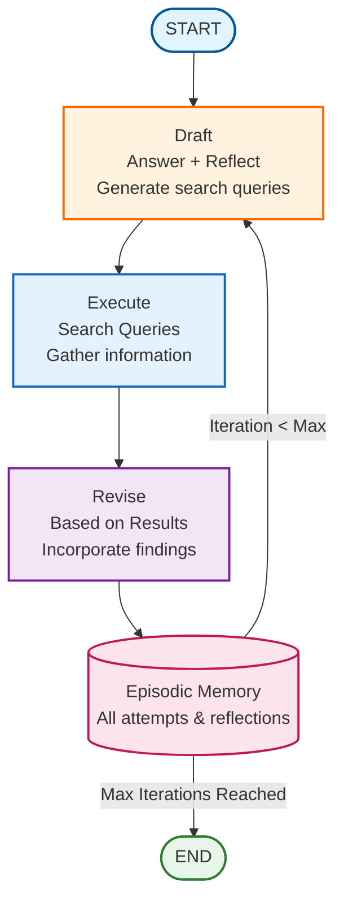

# Reflexion Pattern

## Overview

The Reflexion pattern implements verbal reinforcement learning for language agents. Unlike simple reflection that improves a single output, Reflexion learns from multiple attempts with episodic memory, enabling agents to avoid repeating mistakes across iterations.

Reference: [Reflexion: Language Agents with Verbal Reinforcement Learning](https://arxiv.org/abs/2303.11366)

## Architecture



## When to Use

Use Reflexion when:

- **Research questions**: Need to gather and synthesize external information
- **Knowledge gaps**: Agent lacks information and needs to search
- **Iterative learning**: Want to learn from past failures
- **Multi-attempt tasks**: Quality improves with multiple tries
- **Fact-checking**: Need to verify information from external sources

## Comparison: Reflection vs Reflexion

| Aspect | Reflection | Reflexion |
|--------|-----------|-----------|
| **Memory** | Single output | All attempts (episodic) |
| **Search** | No external search | Active search for information |
| **Learning** | Improve one answer | Learn from failures |
| **Iterations** | Generate-critique-revise | Draft-search-revise |
| **Use Case** | Writing quality | Research questions |

## Key Components

### 1. State Schema

```python
from typing import Annotated
from typing_extensions import TypedDict
from langgraph.graph.message import add_messages
import operator

class ReflexionState(TypedDict):
    messages: Annotated[list, add_messages]              # Tool execution history
    task: str                                             # Original question
    attempts: Annotated[list[dict], operator.add]         # ALL attempts (episodic memory)
    current_attempt: str                                  # Current answer
    reflections: Annotated[list[str], operator.add]       # ALL self-critiques
    current_reflection: str                               # Latest reflection
    iteration: int                                        # Current iteration
    max_iterations: int                                   # Maximum attempts
    success_achieved: bool                                # Task completion flag
```

**Key insight**: `attempts` and `reflections` use `operator.add` to accumulate history across iterations.

### 2. Structured Output Models

Define structured self-critique and answers:

```python
from pydantic import BaseModel, Field

class Reflection(BaseModel):
    """Self-critique of an answer."""
    missing: str = Field(
        description="What critical information is missing?"
    )
    superfluous: str = Field(
        description="What information is unnecessary?"
    )

class AnswerQuestion(BaseModel):
    """Answer with reflection and search queries."""
    answer: str = Field(
        description="Answer to the question (~250 words)"
    )
    reflection: Reflection = Field(
        description="Self-critique identifying gaps"
    )
    search_queries: list[str] = Field(
        description="1-3 search queries to fill gaps",
        max_length=3,
    )

class ReviseAnswer(AnswerQuestion):
    """Revised answer with citations."""
    references: list[str] = Field(
        description="Sources used in revised answer"
    )
```

### 3. Initial Responder Node

Generates first attempt with self-critique:

```python
from langgraph_ollama_local.patterns.reflexion import create_initial_responder

responder = create_initial_responder(llm)
# - Drafts initial answer
# - Immediately reflects on gaps
# - Proposes search queries
# - Includes previous attempts in prompt (episodic memory)
```

### 4. Tool Executor Node

Executes search queries to gather information:

```python
from langgraph_ollama_local.patterns.reflexion import create_tool_executor
from langchain_community.tools.tavily_search import TavilySearchResults

search_tool = TavilySearchResults(max_results=3)
executor = create_tool_executor(search_tool)
# - Extracts search queries from last attempt
# - Executes each query with search tool
# - Stores results in message history
```

### 5. Revisor Node

Revises answer using search results and reflection:

```python
from langgraph_ollama_local.patterns.reflexion import create_revisor

revisor = create_revisor(llm)
# - Reads search results from messages
# - Uses previous reflection to guide revision
# - Incorporates new information
# - Adds citations/references
```

### 6. Graph Construction

Assemble the Reflexion loop:

```python
from langgraph_ollama_local.patterns.reflexion import create_reflexion_graph

graph = create_reflexion_graph(
    llm,
    search_tool,
    checkpointer=None  # Optional for state persistence
)

# Flow:
# START → draft → execute_tools → revise → [draft | END]
#          ↑                               |
#          └───────────────────────────────┘
```

## Usage

### Basic Reflexion Task

```python
from langgraph_ollama_local import LocalAgentConfig
from langgraph_ollama_local.patterns.reflexion import (
    create_reflexion_graph,
    run_reflexion_task,
)
from langchain_community.tools.tavily_search import TavilySearchResults

config = LocalAgentConfig()
llm = config.create_chat_client()

# Setup search tool
search_tool = TavilySearchResults(max_results=3)

# Create Reflexion graph
graph = create_reflexion_graph(llm, search_tool)

# Run task
result = run_reflexion_task(
    graph,
    task="What are the latest developments in quantum computing?",
    max_iterations=3
)

# Access results
print(result["current_attempt"])      # Final answer
print(len(result["attempts"]))        # Number of attempts
print(len(result["reflections"]))     # Number of reflections
```

### Examining Episodic Memory

```python
# View all attempts
for i, attempt in enumerate(result["attempts"], 1):
    print(f"\nAttempt {i}:")
    print(f"Answer: {attempt['answer'][:200]}...")
    if 'search_queries' in attempt:
        print(f"Queries: {attempt['search_queries']}")
    if 'references' in attempt:
        print(f"References: {attempt['references']}")

# View all reflections
for i, reflection in enumerate(result["reflections"], 1):
    print(f"\nReflection {i}:")
    print(reflection)
```

### Custom Search Tool

```python
from langchain_community.tools import DuckDuckGoSearchResults

# Use DuckDuckGo instead of Tavily
search_tool = DuckDuckGoSearchResults(max_results=3)

graph = create_reflexion_graph(llm, search_tool)
```

### With Checkpointing

```python
from langgraph.checkpoint.memory import MemorySaver

# Enable state persistence
checkpointer = MemorySaver()
graph = create_reflexion_graph(llm, search_tool, checkpointer=checkpointer)

# Run with thread ID
result = run_reflexion_task(
    graph,
    task="Explain CRISPR gene editing",
    max_iterations=3,
    thread_id="crispr-research-001"
)
```

## API Reference

### State

- **`ReflexionState`**: TypedDict defining the state schema with episodic memory

### Models

- **`Reflection`**: Pydantic model for structured self-critique
- **`AnswerQuestion`**: Model for answer + reflection + search queries
- **`ReviseAnswer`**: Extends `AnswerQuestion` with references field

### Node Creators

- **`create_initial_responder(llm)`**: Creates draft node with self-critique
- **`create_tool_executor(search_tool)`**: Creates search execution node
- **`create_revisor(llm)`**: Creates answer revision node

### Graph Builder

- **`create_reflexion_graph(llm, search_tool, checkpointer=None)`**: Builds complete Reflexion graph

### Runner

- **`run_reflexion_task(graph, task, max_iterations=3, thread_id="default")`**: Convenience function to run a Reflexion task

## Advanced Usage

### Multi-Criteria Success Detection

```python
def create_advanced_revisor(llm):
    """Revisor with success detection."""
    base_revisor = create_revisor(llm)

    def advanced_revisor(state):
        result = base_revisor(state)

        # Check if answer meets quality threshold
        reflection = state.get("current_reflection", "")
        if "Missing: None" in reflection or "Missing: N/A" in reflection:
            result["success_achieved"] = True

        return result

    return advanced_revisor

# Use in graph
workflow = StateGraph(ReflexionState)
workflow.add_node("draft", create_initial_responder(llm))
workflow.add_node("execute_tools", create_tool_executor(search_tool))
workflow.add_node("revise", create_advanced_revisor(llm))
# ... rest of graph setup
```

### Custom Iteration Control

```python
def run_reflexion_with_quality_check(graph, task, min_quality=0.8):
    """Run until quality threshold or max iterations."""

    state = {
        "task": task,
        "messages": [],
        "attempts": [],
        "reflections": [],
        "current_attempt": "",
        "current_reflection": "",
        "iteration": 0,
        "max_iterations": 5,
        "success_achieved": False,
    }

    for i in range(state["max_iterations"]):
        result = graph.invoke(state)

        # Custom quality check
        if len(result["attempts"]) > 1:
            improvement = analyze_improvement(
                result["attempts"][-2],
                result["attempts"][-1]
            )
            if improvement > min_quality:
                break

        state = result

    return result
```

### Parallel Search Execution

```python
from concurrent.futures import ThreadPoolExecutor

def create_parallel_tool_executor(search_tool):
    """Execute search queries in parallel."""

    def executor(state):
        attempts = state.get("attempts", [])
        if not attempts:
            return {"messages": []}

        queries = attempts[-1].get("search_queries", [])

        # Execute in parallel
        with ThreadPoolExecutor(max_workers=3) as executor:
            futures = [executor.submit(search_tool.invoke, q) for q in queries]
            results = [f.result() for f in futures]

        combined = "\\n---\\n".join([
            f"Query: {q}\\nResults: {r}"
            for q, r in zip(queries, results)
        ])

        return {"messages": [ToolMessage(content=combined, tool_call_id="search")]}

    return executor
```

## Best Practices

1. **Iteration limits**: Start with 2-3 iterations; more rarely improves quality
2. **Quality search tools**: Use TavilySearchResults or DuckDuckGoSearch in production
3. **Monitor episodic memory**: Verify previous attempts inform new ones
4. **Structured output**: Essential for reliable reflection parsing
5. **Limit search queries**: 1-3 queries per iteration prevents information overload
6. **Track references**: Citations improve answer credibility and verifiability
7. **Compare attempts**: Review improvements across iterations for debugging
8. **Set clear tasks**: Specific questions yield better results than vague prompts

## Common Patterns

### Research Assistant

```python
research_graph = create_reflexion_graph(llm, TavilySearchResults(max_results=5))

topics = [
    "What are the environmental impacts of microplastics?",
    "How does CRISPR gene editing work?",
    "What are the latest developments in fusion energy?",
]

for topic in topics:
    result = run_reflexion_task(research_graph, task=topic, max_iterations=3)
    print(f"Topic: {topic}")
    print(f"Final Answer: {result['current_attempt']}")
    print(f"Attempts: {len(result['attempts'])}")
    print("-" * 60)
```

### Fact-Checking Agent

```python
def create_fact_checking_graph(llm, search_tool):
    """Reflexion graph optimized for fact-checking."""

    # Custom responder that focuses on claims
    def fact_check_responder(state):
        task = state["task"]
        prompt = f"""Analyze this claim and identify specific facts to verify:

Claim: {task}

List:
1. Key factual claims
2. What evidence would verify each claim
3. Search queries to find verification"""

        # ... implementation

    workflow = StateGraph(ReflexionState)
    workflow.add_node("draft", fact_check_responder)
    # ... rest of graph
    return workflow.compile()

# Use for fact-checking
claim = "Quantum computers can break all encryption"
graph = create_fact_checking_graph(llm, search_tool)
result = run_reflexion_task(graph, task=claim, max_iterations=2)
```

## Troubleshooting

### Issue: Search queries too generic

**Solution**: Add specificity to the prompt:

```python
def create_specific_responder(llm):
    """Responder that generates specific queries."""

    prompt = """Generate 1-3 SPECIFIC search queries.

Good: "CRISPR off-target effects 2024 research"
Bad: "CRISPR information"

Focus on:
- Recent information (include year)
- Specific aspects (not general overviews)
- Authoritative sources (research, government, etc.)"""

    # ... implementation
```

### Issue: Answers not improving

**Solution**: Verify episodic memory is used:

```python
# Check if previous attempts are in prompt
def create_debug_responder(llm):
    def responder(state):
        previous_attempts = state.get("attempts", [])
        print(f"Using {len(previous_attempts)} previous attempts")

        # ... rest of implementation

    return responder
```

### Issue: Too many iterations without improvement

**Solution**: Implement early stopping:

```python
def should_continue_with_early_stop(state):
    """Stop if no improvement for 2 iterations."""
    attempts = state.get("attempts", [])

    if len(attempts) >= 3:
        # Compare last 3 attempts
        if all_similar(attempts[-3:]):
            return END

    # Standard check
    if state["iteration"] >= state["max_iterations"]:
        return END

    return "draft"
```

## Performance Considerations

### Token Usage

Each iteration consumes:
- Draft: ~500-1000 tokens
- Search results: ~300-800 tokens per query
- Revision: ~600-1200 tokens

**Total per iteration**: ~1500-3000 tokens

For 3 iterations: ~4500-9000 tokens total

### Latency

Typical timings (with Ollama local models):
- Draft generation: 2-5 seconds
- Search execution: 1-3 seconds (per query)
- Revision: 2-5 seconds

**Total per iteration**: 5-13 seconds
**For 3 iterations**: 15-40 seconds

### Optimization

```python
# Use faster model for initial drafts
fast_llm = ChatOllama(model="llama3.2:3b")
slow_llm = ChatOllama(model="llama3.1:70b")

graph = create_reflexion_graph(
    llm=fast_llm,      # Use fast model
    search_tool=search_tool
)

# Use slow model only for final revision
# (requires custom graph modification)
```

## Examples

See the complete tutorial at: `examples/advanced_reasoning/23_reflexion.ipynb`

## References

- [Reflexion Paper](https://arxiv.org/abs/2303.11366)
- [LangGraph Reflexion Tutorial](https://langchain-ai.github.io/langgraph/tutorials/reflexion/reflexion/)
- Tutorial 22: Reflection Pattern
- Tutorial 24: LATS Pattern
