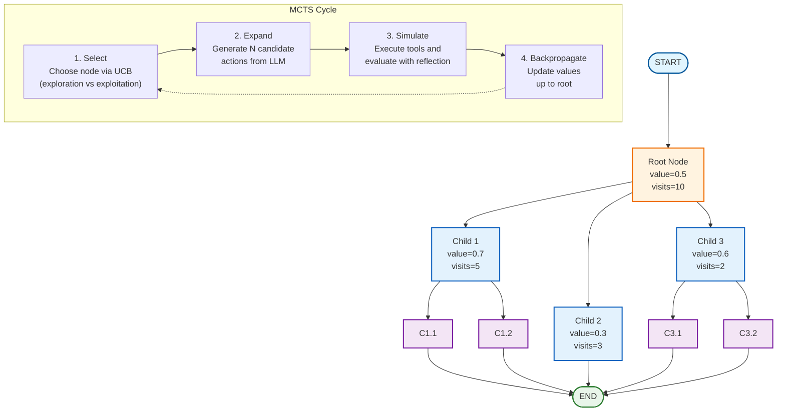

# Tutorial 24: LATS (Language Agent Tree Search)

## Overview

**LATS (Language Agent Tree Search)** applies Monte Carlo Tree Search (MCTS) algorithms to language agents for complex reasoning tasks. Instead of exploring a single solution path like traditional agents, LATS explores multiple candidate solutions in parallel using tree search with backpropagation.

### Key Innovation

LATS brings game-playing AI techniques (like AlphaGo) to language agents:

- **Tree Search**: Explore multiple solution paths simultaneously
- **UCB Selection**: Balance exploration (trying new paths) vs exploitation (using what works)
- **Reflection-Based Scoring**: LLM evaluates quality of each candidate
- **Backpropagation**: Child success/failure propagates to ancestors

### When to Use LATS

✅ **Use LATS when:**
- Task requires complex multi-step reasoning
- Multiple solution approaches should be explored
- Quality matters more than speed
- You want to balance trying new ideas vs using proven approaches

❌ **Avoid LATS when:**
- Simple, straightforward tasks
- Tight latency requirements
- Limited compute resources
- Single obvious solution path

## Architecture

### MCTS Algorithm Flow



### MCTS Cycle

The algorithm repeats four phases until a solution is found or limits reached:

**1. Selection**
```python
# Start at root, recursively select child with highest UCB
# until reaching a leaf node
selected_node = select(root)
```

**2. Expansion**
```python
# Generate N candidate actions from the selected node
# Each candidate is a different LLM response
candidates = llm.generate(messages, n=max_width)
```

**3. Simulation**
```python
# Execute tools for each candidate
# Get reflection/score for quality evaluation
for candidate in candidates:
    tools_output = execute_tools(candidate)
    reflection = llm.reflect(candidate, tools_output)
    score = reflection.normalized_score  # 0.0 to 1.0
```

**4. Backpropagation**
```python
# Update node values from child to root
node.backpropagate(score)
# Increments visits, updates average value for all ancestors
```

## UCB (Upper Confidence Bound)

UCB is the core of MCTS selection, balancing **exploration** vs **exploitation**:

### Formula

```
UCB(node) = avg_reward + exploration_weight * sqrt(ln(parent_visits) / node_visits)
            └─────────┘   └────────────────────────────────────────────────────┘
            Exploitation              Exploration
```

### Components

1. **Average Reward (Exploitation)**
   - `avg_reward = node.value / node.visits`
   - Higher for nodes that have performed well
   - Encourages using proven approaches

2. **Exploration Term (Exploration)**
   - `sqrt(ln(parent_visits) / node_visits)`
   - Higher for less-visited nodes
   - Encourages trying new approaches

3. **Exploration Weight**
   - Hyperparameter controlling the balance
   - Low (0.3-0.7): Focus on best paths
   - Medium (1.0): Balanced
   - High (1.5-2.0): Try diverse paths

### Example

```python
# Node A: High reward, well-explored
# value = 0.8, visits = 10
# UCB = 0.8/10 + 1.0 * sqrt(ln(20)/10) = 0.08 + 0.38 = 0.46

# Node B: Lower reward, less explored
# value = 0.6, visits = 3
# UCB = 0.6/3 + 1.0 * sqrt(ln(20)/3) = 0.20 + 0.84 = 1.04

# Node B has higher UCB due to exploration bonus!
# MCTS will select Node B to explore it more.
```

## Components

### 1. Reflection Model

Structured evaluation of candidate solutions:

```python
class Reflection(BaseModel):
    """LLM-based value estimate for a tree node."""

    reflections: str  # Textual critique
    score: int        # 0-10 quality score
    found_solution: bool  # Whether complete/correct

    @property
    def normalized_score(self) -> float:
        """Get score in 0.0-1.0 range."""
        return self.score / 10.0
```

**Example Reflections:**

```python
# Incomplete attempt
Reflection(
    reflections="Good approach using calculator tool, but only completed step 1 of 3",
    score=4,
    found_solution=False
)

# Complete solution
Reflection(
    reflections="Perfect! Correct reasoning, used tools appropriately, answer verified",
    score=10,
    found_solution=True
)
```

### 2. Node Class

Represents a state in the search tree:

```python
class Node:
    """Tree node with MCTS statistics."""

    # State
    messages: list          # Conversation at this node
    reflection: Reflection  # Quality evaluation

    # Tree structure
    parent: Node | None
    children: list[Node]
    depth: int

    # MCTS statistics
    value: float   # Average reward
    visits: int    # Times visited

    def upper_confidence_bound(self, exploration_weight=1.0) -> float:
        """Calculate UCB for selection."""

    def backpropagate(self, reward: float) -> None:
        """Update values from this node to root."""

    def get_trajectory(self) -> list:
        """Get full message path from root to this node."""
```

**Key Properties:**

- `is_solved`: Whether this node or any descendant found a solution
- `is_terminal`: Whether this is a leaf node (no children)
- `height`: Maximum depth of subtree

### 3. Selection Function

Chooses best leaf node to expand:

```python
def select(root: Node) -> Node:
    """Select best leaf node via UCB."""
    node = root

    # Traverse down tree following highest UCB
    while node.children:
        max_child = max(
            node.children,
            key=lambda c: c.upper_confidence_bound()
        )
        node = max_child

    return node
```

### 4. Expansion Node

Generates multiple candidates and evaluates them:

```python
def create_expansion_node(
    llm: BaseChatModel,
    tools: list[BaseTool],
    max_width: int = 3,
    exploration_weight: float = 1.0,
):
    """Create expansion node that generates N candidates."""

    def expand(state: TreeState) -> dict:
        # 1. Select best leaf
        best_node = select(state["root"])

        # 2. Generate N candidates
        candidates = llm.generate(messages, n=max_width)

        # 3. Execute tools for each
        for candidate in candidates:
            tool_results = execute_tools(candidate, tools)

            # 4. Reflect on quality
            reflection = llm.reflect(candidate, tool_results)

            # 5. Create child (auto-backpropagates)
            child = Node(
                messages=candidate + tool_results,
                reflection=reflection,
                parent=best_node
            )
            best_node.children.append(child)

        return state

    return expand
```

### 5. Termination Conditions

Search stops when any condition is met:

```python
def should_loop(
    state: TreeState,
    max_depth: int = 5,
    max_iterations: int = 20,
) -> Literal["expand", "__end__"]:
    """Determine whether to continue search."""
    root = state["root"]

    # Condition 1: Solution found
    if root.is_solved:
        return END

    # Condition 2: Max depth reached
    if root.height >= max_depth:
        return END

    # Condition 3: Max nodes created
    total_nodes = 1 + len(root._get_all_children())
    if total_nodes >= max_iterations:
        return END

    return "expand"
```

### 6. Best Solution Extraction

Retrieves best result from tree:

```python
def get_best_solution(root: Node) -> Node:
    """Return best solution from tree."""
    terminal_nodes = [n for n in all_nodes if n.is_terminal]

    # Prioritize: solved > high value
    return max(
        terminal_nodes,
        key=lambda n: (
            int(n.reflection.found_solution),  # Solved first
            n.value                             # Then by value
        )
    )
```

## Complexity Limits for Local Models

LATS is computationally expensive. Each expansion requires:
- `max_width` LLM generations
- Tool execution for each candidate
- Reflection LLM call for each candidate

### Recommended Limits

| Model Size | Max Depth | Max Width | Max Nodes | Timeout | Notes |
|------------|-----------|-----------|-----------|---------|-------|
| **3B-8B**  | 3-4       | 2-3       | 10-15     | 30s     | Conservative for small models |
| **13B-34B** | 4-5      | 3-4       | 20-30     | 45s     | Moderate complexity |
| **70B+**   | 5-6       | 4-5       | 30-50     | 60s     | Higher complexity allowed |

### Calculating Total LLM Calls

With `max_depth=3`, `max_width=2`:

```
Iteration 1: 2 generations + 2 reflections = 4 calls
Iteration 2: 2 generations + 2 reflections = 4 calls
Iteration 3: 2 generations + 2 reflections = 4 calls
Total: 12 LLM calls minimum

Compare to ReAct: typically 3-5 calls for same task
```

### Configuration Examples

**Small Model (3B-8B):**
```python
graph = create_lats_graph(
    llm=ChatOllama(model="llama3.2:3b", temperature=0.7),
    tools=tools,
    max_depth=3,           # Conservative depth
    max_width=2,           # Few candidates
    max_iterations=10,     # Limit total nodes
    exploration_weight=1.0,
)
```

**Medium Model (13B-34B):**
```python
graph = create_lats_graph(
    llm=ChatOllama(model="llama3.1:13b", temperature=0.7),
    tools=tools,
    max_depth=4,
    max_width=3,
    max_iterations=20,
    exploration_weight=1.2,
)
```

**Large Model (70B+):**
```python
graph = create_lats_graph(
    llm=ChatOllama(model="llama3.1:70b", temperature=0.7),
    tools=tools,
    max_depth=5,
    max_width=4,
    max_iterations=30,
    exploration_weight=1.5,
)
```

## Usage Example

### Basic LATS Agent

```python
from langchain_ollama import ChatOllama
from langchain_core.tools import tool
from langgraph_ollama_local.patterns.lats import (
    create_lats_graph,
    run_lats_task,
)

# Define tools
@tool
def calculator(expression: str) -> str:
    """Evaluate mathematical expression."""
    return str(eval(expression))

@tool
def search(query: str) -> str:
    """Search for information."""
    # Your search implementation
    return results

tools = [calculator, search]

# Create LATS graph (3B model limits)
llm = ChatOllama(model="llama3.2:3b", temperature=0.7)
graph = create_lats_graph(
    llm=llm,
    tools=tools,
    max_depth=3,
    max_width=2,
    max_iterations=10,
)

# Run tree search
result = run_lats_task(
    graph,
    "What is the square of the sum of the first 5 prime numbers?"
)

# Examine results
print(f"Total nodes explored: {result['total_nodes']}")
print(f"Tree height: {result['root'].height}")
print(f"Solution found: {result['best_solution'].reflection.found_solution}")

# Get best trajectory
for msg in result['best_trajectory']:
    print(f"{msg.__class__.__name__}: {msg.content}")
```

### Advanced: Analyzing the Search Tree

```python
def print_tree(node, prefix="", is_last=True):
    """Visualize tree structure."""
    connector = "└── " if is_last else "├── "

    if node.reflection:
        info = f"score={node.reflection.score}/10, visits={node.visits}, value={node.value:.2f}"
        if node.reflection.found_solution:
            info += " ✓"
    else:
        info = f"ROOT, visits={node.visits}"

    print(f"{prefix}{connector}{info}")

    extension = "    " if is_last else "│   "
    for i, child in enumerate(node.children):
        print_tree(child, prefix + extension, i == len(node.children)-1)

# Visualize search tree
print_tree(result['root'])
```

**Example Output:**
```
└── ROOT, visits=7
    ├── score=4/10, visits=3, value=0.40
    │   └── score=6/10, visits=2, value=0.60
    └── score=8/10, visits=4, value=0.80
        ├── score=7/10, visits=1, value=0.70
        └── score=10/10, visits=1, value=1.00 ✓
```

### Tuning Exploration Weight

```python
# Conservative: stick to proven approaches
graph_exploit = create_lats_graph(
    llm=llm,
    tools=tools,
    exploration_weight=0.3,  # Low exploration
)

# Balanced: moderate exploration
graph_balanced = create_lats_graph(
    llm=llm,
    tools=tools,
    exploration_weight=1.0,  # Balanced
)

# Exploratory: try diverse approaches
graph_explore = create_lats_graph(
    llm=llm,
    tools=tools,
    exploration_weight=2.0,  # High exploration
)
```

## Best Practices

### 1. Start Conservative

Begin with minimal complexity and increase gradually:

```python
# Initial configuration
graph = create_lats_graph(
    llm=llm,
    tools=tools,
    max_depth=2,
    max_width=2,
    max_iterations=6,  # ~6 nodes max
)

# Monitor performance
result = run_lats_task(graph, task)
print(f"Took {result['total_nodes']} nodes, {duration}s")

# If fast enough, increase complexity
graph = create_lats_graph(
    llm=llm,
    tools=tools,
    max_depth=3,
    max_width=3,
    max_iterations=15,
)
```

### 2. Monitor Tree Growth

Always analyze search statistics:

```python
def analyze_search(result):
    """Analyze LATS performance."""
    root = result['root']
    all_nodes = [root] + root._get_all_children()

    terminal = [n for n in all_nodes if n.is_terminal]
    solved = [n for n in all_nodes if n.reflection and n.reflection.found_solution]

    print(f"Total nodes: {len(all_nodes)}")
    print(f"Terminal nodes: {len(terminal)}")
    print(f"Solved nodes: {len(solved)}")
    print(f"Tree height: {root.height}")
    print(f"Avg node value: {sum(n.value for n in all_nodes) / len(all_nodes):.3f}")

    if solved:
        best_score = max(n.reflection.score for n in solved)
        print(f"Best score: {best_score}/10")
```

### 3. Temperature Matters

LATS requires temperature > 0 for diverse candidates:

```python
# ❌ Bad: No diversity
llm = ChatOllama(model="llama3.2:3b", temperature=0.0)

# ✅ Good: Diverse candidates
llm = ChatOllama(model="llama3.2:3b", temperature=0.7)

# ✅ Also good: Higher temperature for more exploration
llm = ChatOllama(model="llama3.2:3b", temperature=0.9)
```

### 4. Use Appropriate Limits

Match limits to your model and task:

```python
# Simple task, small model
graph = create_lats_graph(llm, tools, max_depth=2, max_width=2)

# Complex task, medium model
graph = create_lats_graph(llm, tools, max_depth=4, max_width=3)

# Very complex task, large model
graph = create_lats_graph(llm, tools, max_depth=5, max_width=4)
```

## Pattern Comparison

### LATS vs Other Patterns

| Pattern | Exploration | LLM Calls | Best For |
|---------|-------------|-----------|----------|
| **ReAct** | Single path | Low (3-5) | Simple tasks, fast response |
| **Reflection** | Iterative improvement | Medium (5-10) | Quality refinement |
| **Reflexion** | Multi-attempt | Medium (5-15) | Learning from failures |
| **LATS** | Tree search | High (10-30+) | Complex reasoning, best solution |
| **ReWOO** | Parallel execution | Low (2) | Efficient multi-tool tasks |

### When to Choose LATS

Choose **LATS** when:
- Multiple approaches should be explored
- Balancing exploration vs exploitation is valuable
- Quality matters more than speed
- You have compute budget for tree search

Choose **Alternatives** when:
- **ReAct**: Simple task, need fast response
- **Reflection**: Iterative refinement of single output
- **Reflexion**: Learn from multiple attempts on same task
- **ReWOO**: Efficient execution with known tool sequence

## Common Issues

### Issue 1: Tree Grows Too Large

**Problem:** Tree exceeds complexity limits

**Solution:**
```python
# Reduce limits
graph = create_lats_graph(
    llm=llm,
    tools=tools,
    max_depth=2,      # Reduce from 3
    max_width=2,      # Reduce from 3
    max_iterations=8, # Reduce from 15
)
```

### Issue 2: All Candidates Similar

**Problem:** LLM generates similar candidates

**Solution:**
```python
# Increase temperature for diversity
llm = ChatOllama(model="llama3.2:3b", temperature=0.9)

# Or use higher exploration weight
graph = create_lats_graph(
    llm=llm,
    tools=tools,
    exploration_weight=2.0,  # Encourage trying diverse paths
)
```

### Issue 3: Poor Reflections

**Problem:** Reflection scores don't distinguish quality

**Solution:**
- Improve reflection prompt with specific criteria
- Use larger model for reflections
- Add examples of good/bad reflections

### Issue 4: Timeout Before Solution

**Problem:** Search terminates before finding solution

**Solution:**
```python
# Increase iteration limit
graph = create_lats_graph(
    llm=llm,
    tools=tools,
    max_iterations=30,  # Allow more nodes
)

# Or increase depth
graph = create_lats_graph(
    llm=llm,
    tools=tools,
    max_depth=5,  # Allow deeper search
)
```

## References

### Papers

- **[LATS: Language Agent Tree Search](https://arxiv.org/abs/2310.04406)**
  - Original paper introducing LATS
  - Demonstrates performance on reasoning tasks

- **[Tree of Thoughts](https://arxiv.org/abs/2305.10601)**
  - Related work on tree search for LLMs

- **MCTS (Classic)**
  - UCB formula and tree search algorithms
  - AlphaGo/AlphaZero papers

### LangGraph Resources

- [LATS Tutorial](https://langchain-ai.github.io/langgraph/tutorials/lats/)
- [Tree Search Patterns](https://langchain-ai.github.io/langgraph/concepts/multi_agent/)

## Summary

**LATS** brings powerful tree search to language agents:

✅ **Strengths:**
- Explores multiple solution paths
- Balances exploration vs exploitation via UCB
- Learns which approaches work (backpropagation)
- Can recover from wrong paths

❌ **Limitations:**
- Computationally expensive (many LLM calls)
- Requires complexity limits for local models
- Slower than single-path agents

**Use LATS when** complex reasoning justifies the computational cost and you want the best possible solution from exploring alternatives.
