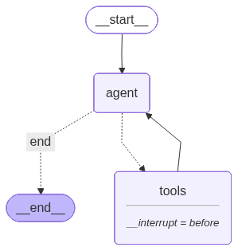

# Tutorial 04: Human-in-the-Loop

This tutorial teaches how to pause agent execution for human review and approval before taking sensitive actions.

## What You'll Learn

- **Interrupts**: Pausing graph execution at specific points
- **interrupt_before**: Static breakpoints defined at compile time
- **interrupt()**: Dynamic breakpoints at runtime
- **Command**: Resuming execution with human input
- **Approval workflows**: Review and approve agent actions

## Prerequisites

- Completed [Tutorial 03: Memory & Persistence](03-memory-persistence.md)
- Understanding of checkpointers (required for interrupts)

---

## Why Human-in-the-Loop?

Agents are powerful but need oversight. Before an agent:
- Sends an email or message
- Makes a purchase or payment
- Deletes or modifies data
- Calls external APIs with side effects

You want a human to review and approve the action.

### Common Patterns

According to the [LangGraph documentation](https://docs.langchain.com/oss/python/langgraph/interrupts), there are four typical patterns:

1. **Approve/Reject**: Pause before a critical step, review, and approve or reject
2. **Edit State**: Pause to review and modify the graph state
3. **Review Tool Calls**: Inspect and edit tool calls before execution
4. **Provide Input**: Ask the human for additional information

---

## Core Concepts

### 1. Interrupts and Checkpointers

Interrupts use LangGraph's persistence layer. When you call an interrupt:
1. Graph execution pauses
2. Current state is saved to the checkpointer
3. The thread is marked as "interrupted"
4. You can inspect the state and decide what to do
5. Resume with `invoke(None, config)` or `invoke(Command(resume=value), config)`

**Important**: Interrupts require a checkpointer. Without one, there's no way to save and resume state.

### 2. interrupt_before and interrupt_after

These are the simplest ways to add interrupts - specify them at compile time:

```python
graph = workflow.compile(
    checkpointer=memory,
    interrupt_before=["tools"],  # Pause BEFORE tools node
    interrupt_after=["agent"],   # Pause AFTER agent node
)
```

### 3. Checking Interrupt Status

After invoking a graph, check if it's paused:

```python
state = graph.get_state(config)

if state.next:  # If there's a next node, we're paused
    print(f"Paused before: {state.next}")
else:
    print("Execution complete")
```

### 4. Resuming Execution

To continue after approval:

```python
# Simple resume (continue as-is)
result = graph.invoke(None, config=config)

# Resume with input (using Command)
from langgraph.types import Command
result = graph.invoke(Command(resume="approved"), config=config)
```

---

## Building an Approval Workflow

### Step 1: Define Sensitive Tools

```python
from langchain_core.tools import tool

@tool
def send_email(to: str, subject: str, body: str) -> str:
    """Send an email (sensitive action!)."""
    return f"Email sent to {to}"

@tool
def get_weather(location: str) -> str:
    """Get weather (safe action)."""
    return f"Weather in {location}: Sunny, 72°F"

# Mark which tools are sensitive
SENSITIVE_TOOLS = {"send_email"}
```

### Step 2: Build the Graph

```python
from langgraph.graph import StateGraph, START, END
from langgraph.checkpoint.memory import MemorySaver

workflow = StateGraph(State)
workflow.add_node("agent", agent_node)
workflow.add_node("tools", tool_node)
workflow.add_edge(START, "agent")
workflow.add_conditional_edges("agent", should_continue, {"tools": "tools", "end": END})
workflow.add_edge("tools", "agent")

# Compile with interrupt
memory = MemorySaver()
graph = workflow.compile(
    checkpointer=memory,
    interrupt_before=["tools"]  # Pause before ANY tool execution
)
```

### Step 3: Run with Approval

```python
config = {"configurable": {"thread_id": "approval-1"}}

# Start execution
result = graph.invoke(
    {"messages": [("user", "Send email to alice@example.com")]},
    config=config
)

# Check if paused
state = graph.get_state(config)
if state.next:
    # Show pending action
    last_msg = state.values["messages"][-1]
    for tc in last_msg.tool_calls:
        print(f"Pending: {tc['name']}({tc['args']})")

    # Get human approval
    if input("Approve? (y/n): ").lower() == 'y':
        result = graph.invoke(None, config=config)
    else:
        print("Rejected!")
```

---

## Graph Visualization



The graph pauses before the `tools` node, allowing human review of pending tool calls.

---

## Selective Interrupts

Not all tools need approval. Route sensitive tools to a node with interrupts:

```python
def should_continue(state: State) -> str:
    last_msg = state["messages"][-1]

    if hasattr(last_msg, "tool_calls") and last_msg.tool_calls:
        # Check if any tool is sensitive
        for tc in last_msg.tool_calls:
            if tc["name"] in SENSITIVE_TOOLS:
                return "sensitive_tools"
        return "safe_tools"
    return "end"

# Build graph with separate paths
workflow.add_node("sensitive_tools", tool_node)
workflow.add_node("safe_tools", tool_node)
workflow.add_conditional_edges(
    "agent", should_continue,
    {"sensitive_tools": "sensitive_tools", "safe_tools": "safe_tools", "end": END}
)

# Only interrupt for sensitive tools
graph = workflow.compile(
    checkpointer=memory,
    interrupt_before=["sensitive_tools"]  # NOT safe_tools
)
```

---

## Complete Code

```python
import json
from typing import Annotated
from typing_extensions import TypedDict
from langchain_core.tools import tool
from langchain_core.messages import ToolMessage
from langchain_ollama import ChatOllama
from langgraph.graph import StateGraph, START, END
from langgraph.graph.message import add_messages
from langgraph.checkpoint.memory import MemorySaver
from langgraph_ollama_local import LocalAgentConfig

# === Tools ===
@tool
def send_email(to: str, subject: str, body: str) -> str:
    """Send an email."""
    return f"Email sent to {to} with subject: {subject}"

tools = [send_email]
tools_by_name = {t.name: t for t in tools}

# === LLM ===
config = LocalAgentConfig()
llm = ChatOllama(
    model=config.ollama.model,
    base_url=config.ollama.base_url,
    temperature=0,
).bind_tools(tools)

# === State ===
class State(TypedDict):
    messages: Annotated[list, add_messages]

# === Nodes ===
def agent_node(state: State) -> dict:
    return {"messages": [llm.invoke(state["messages"])]}

def tool_node(state: State) -> dict:
    outputs = []
    for tc in state["messages"][-1].tool_calls:
        result = tools_by_name[tc["name"]].invoke(tc["args"])
        outputs.append(ToolMessage(
            content=json.dumps(result),
            name=tc["name"],
            tool_call_id=tc["id"],
        ))
    return {"messages": outputs}

def should_continue(state: State) -> str:
    last = state["messages"][-1]
    if hasattr(last, "tool_calls") and last.tool_calls:
        return "tools"
    return "end"

# === Graph ===
workflow = StateGraph(State)
workflow.add_node("agent", agent_node)
workflow.add_node("tools", tool_node)
workflow.add_edge(START, "agent")
workflow.add_conditional_edges("agent", should_continue, {"tools": "tools", "end": END})
workflow.add_edge("tools", "agent")

# === Compile with Interrupt ===
memory = MemorySaver()
graph = workflow.compile(
    checkpointer=memory,
    interrupt_before=["tools"]
)

# === Approval Helper ===
def run_with_approval(user_input: str, thread_id: str):
    config = {"configurable": {"thread_id": thread_id}}
    result = graph.invoke({"messages": [("user", user_input)]}, config=config)

    while True:
        state = graph.get_state(config)
        if not state.next:
            break

        # Show pending action
        last_msg = state.values["messages"][-1]
        print(f"Pending: {last_msg.tool_calls}")

        # In production: get approval from UI
        result = graph.invoke(None, config=config)  # Auto-approve for demo

    return result["messages"][-1].content

# === Use ===
response = run_with_approval("Send email to test@example.com", "demo-1")
print(response)
```

---

## Advanced Patterns

### 1. Dynamic Interrupts with `interrupt()`

Instead of compile-time `interrupt_before`, use runtime `interrupt()`:

```python
from langgraph.types import interrupt

def tool_node(state: State) -> dict:
    outputs = []
    for tc in state["messages"][-1].tool_calls:
        # Dynamic interrupt for sensitive tools only
        if tc["name"] in SENSITIVE_TOOLS:
            approval = interrupt({
                "action": tc["name"],
                "args": tc["args"],
                "message": f"Approve {tc['name']} with args {tc['args']}?"
            })

            if approval.get("approved") != True:
                outputs.append(ToolMessage(
                    content="Action rejected by user",
                    name=tc["name"],
                    tool_call_id=tc["id"],
                ))
                continue

        result = tools_by_name[tc["name"]].invoke(tc["args"])
        outputs.append(ToolMessage(
            content=json.dumps(result),
            name=tc["name"],
            tool_call_id=tc["id"],
        ))

    return {"messages": outputs}
```

### 2. Editing State Before Resuming

Modify tool calls before execution:

```python
from langgraph.types import Command

# Get paused state
state = graph.get_state(config)
last_msg = state.values["messages"][-1]

# Review tool calls
for tc in last_msg.tool_calls:
    print(f"Tool: {tc['name']}, Args: {tc['args']}")

# Modify if needed
edited_args = {"to": "safe@example.com", "subject": "Modified", "body": "Safe content"}
last_msg.tool_calls[0]["args"] = edited_args

# Update state with modifications
graph.update_state(config, {"messages": [last_msg]})

# Resume with edited state
result = graph.invoke(None, config=config)
```

### 3. Providing Input During Interrupt

Use `Command(resume=...)` to pass data:

```python
def chatbot_with_confirmation(state: State) -> dict:
    # Ask for confirmation
    confirmation = interrupt({"question": "Should I proceed?"})

    if confirmation == "yes":
        response = llm.invoke(state["messages"])
    else:
        response = AIMessage(content="Okay, I won't proceed.")

    return {"messages": [response]}

# Resume with user input
from langgraph.types import Command
result = graph.invoke(Command(resume="yes"), config=config)
```

### 4. Multi-Stage Approvals

Require multiple approvals for critical actions:

```python
def critical_action_node(state: State) -> dict:
    action = state["pending_action"]

    # First approval
    manager_approval = interrupt({
        "stage": "manager",
        "action": action,
        "message": "Manager approval required"
    })

    if not manager_approval.get("approved"):
        return {"status": "rejected_by_manager"}

    # Second approval
    security_approval = interrupt({
        "stage": "security",
        "action": action,
        "message": "Security team approval required"
    })

    if not security_approval.get("approved"):
        return {"status": "rejected_by_security"}

    # Execute action
    result = execute_critical_action(action)
    return {"status": "completed", "result": result}
```

---

## Common Pitfalls

### 1. No Checkpointer

```python
# WRONG - interrupts without checkpointer
graph = workflow.compile(interrupt_before=["tools"])
# RuntimeError: Checkpointer required for interrupts

# CORRECT - always include checkpointer
memory = MemorySaver()
graph = workflow.compile(
    checkpointer=memory,
    interrupt_before=["tools"]
)
```

### 2. Resuming Without Interrupt

```python
# WRONG - trying to resume when not paused
result = graph.invoke({"messages": [("user", "Hi")]}, config=config)
result = graph.invoke(None, config=config)  # Nothing to resume!

# CORRECT - check if paused first
state = graph.get_state(config)
if state.next:
    result = graph.invoke(None, config=config)
```

### 3. Wrong Config After Resume

```python
# WRONG - different thread_id loses state
result = graph.invoke(input, config={"configurable": {"thread_id": "a"}})
result = graph.invoke(None, config={"configurable": {"thread_id": "b"}})
# Error: No state to resume

# CORRECT - same thread_id
config = {"configurable": {"thread_id": "consistent-id"}}
result = graph.invoke(input, config=config)
# ... later ...
result = graph.invoke(None, config=config)  # Same config
```

### 4. Infinite Approval Loop

```python
# WRONG - always routes back to interrupted node
def route(state):
    return "tools"  # Always goes to tools, never ends

# CORRECT - check for completion
def route(state):
    last = state["messages"][-1]
    if hasattr(last, "tool_calls") and last.tool_calls:
        return "tools"
    return "end"  # Exit when no more tool calls
```

### 5. Not Handling Rejections

```python
# WRONG - no path for rejection
if input("Approve? ") == "y":
    graph.invoke(None, config)
# What happens if user says "n"?

# CORRECT - handle rejection
state = graph.get_state(config)
if input("Approve? ").lower() == "y":
    result = graph.invoke(None, config)
else:
    # Option 1: Update state to skip action
    graph.update_state(config, {"messages": [AIMessage(content="Action cancelled")]})
    result = graph.invoke(None, config)

    # Option 2: Start a new conversation
    new_config = {"configurable": {"thread_id": f"new-{uuid4()}"}}
    result = graph.invoke({"messages": [...]}, config=new_config)
```

---

## Testing Interrupts

### Unit Testing Interrupt Points

```python
def test_graph_pauses_before_tools():
    """Test that graph pauses before sensitive actions."""
    memory = MemorySaver()
    graph = workflow.compile(
        checkpointer=memory,
        interrupt_before=["tools"]
    )

    config = {"configurable": {"thread_id": "test-1"}}

    # Invoke with a message that triggers tool use
    graph.invoke(
        {"messages": [("user", "Send email to test@example.com")]},
        config=config
    )

    # Check that we're paused
    state = graph.get_state(config)
    assert state.next == ("tools",)
```

### Testing Resume Behavior

```python
def test_resume_after_approval():
    """Test that graph resumes correctly after approval."""
    memory = MemorySaver()
    graph = workflow.compile(
        checkpointer=memory,
        interrupt_before=["tools"]
    )

    config = {"configurable": {"thread_id": "test-2"}}

    # Trigger pause
    graph.invoke(
        {"messages": [("user", "Send email to test@example.com")]},
        config=config
    )

    # Resume
    result = graph.invoke(None, config=config)

    # Verify execution completed
    state = graph.get_state(config)
    assert state.next == ()  # Empty = complete
    assert any("sent" in str(m.content).lower() for m in result["messages"])
```

### Testing State Modification

```python
def test_state_modification_before_resume():
    """Test that state edits are applied."""
    memory = MemorySaver()
    graph = workflow.compile(
        checkpointer=memory,
        interrupt_before=["tools"]
    )

    config = {"configurable": {"thread_id": "test-3"}}

    # Trigger pause
    graph.invoke(
        {"messages": [("user", "Send email to danger@example.com")]},
        config=config
    )

    # Get and modify state
    state = graph.get_state(config)
    last_msg = state.values["messages"][-1]

    # Change recipient to safe address
    last_msg.tool_calls[0]["args"]["to"] = "safe@example.com"
    graph.update_state(config, {"messages": [last_msg]})

    # Resume
    result = graph.invoke(None, config=config)

    # Verify modification was applied
    assert "safe@example.com" in str(result["messages"])
```

---

## Timeout Handling

### Implementing Approval Timeouts

```python
import time
from datetime import datetime, timedelta

def run_with_timeout(
    graph,
    input_data: dict,
    config: dict,
    timeout_seconds: int = 300  # 5 minutes
) -> dict:
    """Run graph with approval timeout."""
    deadline = datetime.now() + timedelta(seconds=timeout_seconds)

    result = graph.invoke(input_data, config=config)

    while True:
        state = graph.get_state(config)
        if not state.next:
            break  # Completed

        if datetime.now() > deadline:
            # Timeout - cancel the action
            graph.update_state(config, {
                "messages": [AIMessage(content="Action timed out waiting for approval")]
            })
            # Skip to end
            return graph.invoke(None, config=config)

        # Check for approval (in production, this would be async)
        if check_approval_queue(config["configurable"]["thread_id"]):
            result = graph.invoke(None, config=config)
        else:
            time.sleep(1)  # Poll every second

    return result
```

### Async Approval Pattern

```python
import asyncio

async def async_approval_flow(graph, input_data: dict, config: dict):
    """Async approval with timeout."""
    result = await graph.ainvoke(input_data, config=config)

    while True:
        state = graph.get_state(config)
        if not state.next:
            return result

        try:
            # Wait for approval with timeout
            approval = await asyncio.wait_for(
                wait_for_approval(config),
                timeout=300  # 5 minutes
            )

            if approval:
                result = await graph.ainvoke(None, config=config)
            else:
                # Rejection handling
                raise RejectionError("User rejected the action")

        except asyncio.TimeoutError:
            raise TimeoutError("Approval timed out")
```

---

## Integration with UI/API

### REST API Pattern

```python
from fastapi import FastAPI, HTTPException
from pydantic import BaseModel

app = FastAPI()

class InvokeRequest(BaseModel):
    thread_id: str
    message: str

class ApprovalRequest(BaseModel):
    thread_id: str
    approved: bool

@app.post("/chat")
async def chat(request: InvokeRequest):
    config = {"configurable": {"thread_id": request.thread_id}}
    result = graph.invoke(
        {"messages": [("user", request.message)]},
        config=config
    )

    state = graph.get_state(config)
    return {
        "response": result["messages"][-1].content,
        "pending_approval": bool(state.next),
        "pending_action": get_pending_action(state) if state.next else None
    }

@app.post("/approve")
async def approve(request: ApprovalRequest):
    config = {"configurable": {"thread_id": request.thread_id}}
    state = graph.get_state(config)

    if not state.next:
        raise HTTPException(400, "No pending action")

    if request.approved:
        result = graph.invoke(None, config=config)
        return {"response": result["messages"][-1].content}
    else:
        # Handle rejection
        graph.update_state(config, {
            "messages": [AIMessage(content="Action cancelled by user")]
        })
        return {"response": "Action cancelled"}
```

### WebSocket Pattern

```python
from fastapi import WebSocket

@app.websocket("/ws/{thread_id}")
async def websocket_endpoint(websocket: WebSocket, thread_id: str):
    await websocket.accept()
    config = {"configurable": {"thread_id": thread_id}}

    while True:
        data = await websocket.receive_json()

        if data["type"] == "message":
            result = await graph.ainvoke(
                {"messages": [("user", data["content"])]},
                config=config
            )

            state = graph.get_state(config)
            await websocket.send_json({
                "type": "response",
                "content": result["messages"][-1].content,
                "pending_approval": bool(state.next)
            })

        elif data["type"] == "approve":
            if data["approved"]:
                result = await graph.ainvoke(None, config=config)
                await websocket.send_json({
                    "type": "response",
                    "content": result["messages"][-1].content
                })
            else:
                await websocket.send_json({
                    "type": "cancelled",
                    "content": "Action cancelled"
                })
```

---

## Production Checklist

- [ ] **Checkpointer configured**: Using appropriate persistence backend
- [ ] **Timeout handling**: Approvals expire after reasonable period
- [ ] **Rejection handling**: Clear path when user rejects action
- [ ] **Audit logging**: All approvals/rejections logged
- [ ] **Notification system**: Users notified of pending approvals
- [ ] **Error recovery**: Handle network failures during approval
- [ ] **Testing**: Interrupt/resume paths tested
- [ ] **Monitoring**: Track approval latency and completion rates
- [ ] **Security**: Verify approver identity and permissions
- [ ] **Escalation**: Process for stale approvals

---

## Running the Notebook

```bash
cd examples
jupyter lab 04_human_in_the_loop.ipynb
```

---

## Key Takeaways

| Concept | What It Does |
|---------|--------------|
| **interrupt_before** | Pause before a node runs (compile-time) |
| **interrupt_after** | Pause after a node runs (compile-time) |
| **interrupt()** | Pause at runtime with custom data |
| **state.next** | Tuple of next nodes (empty if done) |
| **invoke(None, config)** | Resume paused execution |
| **Command(resume=value)** | Resume with input value |
| **update_state()** | Modify state before resuming |

## Best Practices

1. **Always use checkpointer**: Interrupts require persistence
2. **Check state.next**: Determine if graph is paused
3. **Selective interrupts**: Only interrupt for sensitive actions
4. **Timeout handling**: Set reasonable expiry for approvals
5. **Handle rejections**: Clear path when user says no
6. **Test both paths**: Approval and rejection flows

---

## What's Next?

[Tutorial 05: Reflection](05-reflection.md) - Learn how to build self-critiquing agents that iteratively improve their outputs.

---

## Sources

- [LangGraph Interrupts Documentation](https://docs.langchain.com/oss/python/langgraph/interrupts)
- [Human-in-the-Loop Blog Post](https://blog.langchain.com/making-it-easier-to-build-human-in-the-loop-agents-with-interrupt/)
- [LangGraph Human-in-the-Loop Concepts](https://github.com/langchain-ai/langgraph/blob/main/docs/docs/concepts/human_in_the_loop.md)
