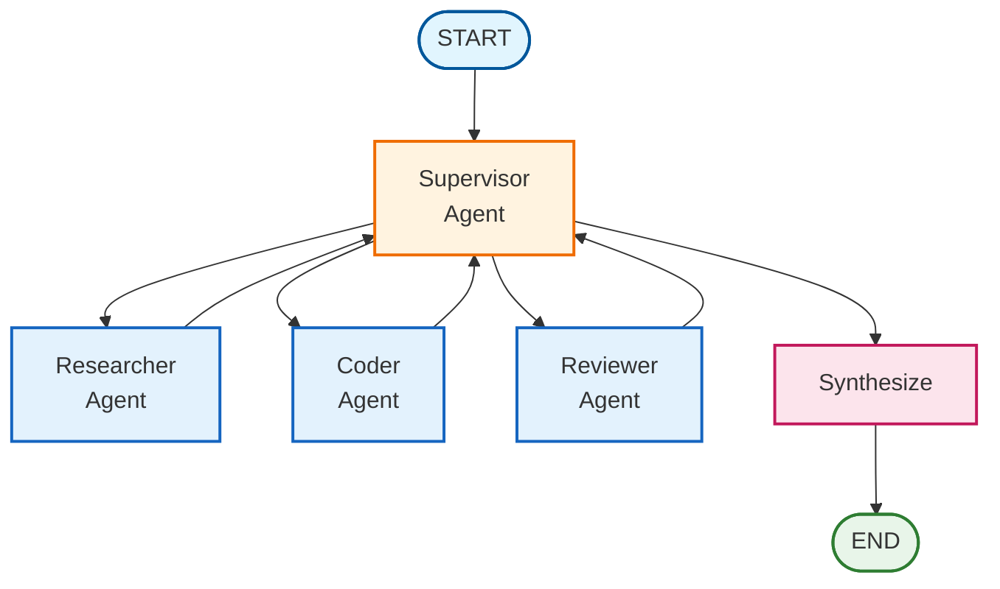

# Multi-Agent Collaboration

## Overview

Multi-agent collaboration enables complex tasks by coordinating multiple specialized agents under a central supervisor. This pattern is ideal when tasks require different skills (research, coding, review) or benefit from iterative refinement.

## Architecture



## When to Use

Use multi-agent collaboration when:

- **Tasks require multiple skill sets**: Research, implementation, and review
- **Quality matters**: Review cycles catch errors before final output
- **Tasks are complex**: Breaking down into specialized steps improves results
- **Iteration helps**: Multiple passes refine the output

## Key Components

### 1. State Schema

```python
from typing import Annotated
from typing_extensions import TypedDict
from langgraph.graph.message import add_messages
import operator

class MultiAgentState(TypedDict):
    messages: Annotated[list, add_messages]  # Conversation history
    task: str                                 # Current task
    next_agent: str                           # Supervisor's routing decision
    agent_outputs: Annotated[list[dict], operator.add]  # Accumulated outputs
    iteration: int                            # Current iteration
    max_iterations: int                       # Safety limit
    final_result: str                         # Synthesized result
```

### 2. Supervisor Node

The supervisor uses structured output to make reliable routing decisions:

```python
from pydantic import BaseModel, Field
from typing import Literal

class SupervisorDecision(BaseModel):
    next_agent: Literal["researcher", "coder", "reviewer", "FINISH"]
    reasoning: str

def create_supervisor_node(llm):
    structured_llm = llm.with_structured_output(SupervisorDecision)

    def supervisor(state):
        # Build context from progress
        # Ask LLM to decide next agent
        decision = structured_llm.invoke(messages)
        return {"next_agent": decision.next_agent, "iteration": state["iteration"] + 1}

    return supervisor
```

### 3. Specialized Agents

Each agent has a focused role:

```python
def create_agent_node(llm, agent_name):
    def agent(state):
        response = llm.invoke([
            SystemMessage(content=AGENT_PROMPTS[agent_name]),
            HumanMessage(content=f"Task: {state['task']}")
        ])
        return {"agent_outputs": [{"agent": agent_name, "output": response.content}]}
    return agent
```

### 4. Routing Logic

```python
def route_supervisor(state):
    if state["iteration"] >= state["max_iterations"]:
        return "synthesize"
    if state["next_agent"] == "FINISH":
        return "synthesize"
    return state["next_agent"].lower()
```

### 5. Graph Construction

```python
from langgraph.graph import StateGraph, START, END

workflow = StateGraph(MultiAgentState)

# Add nodes
workflow.add_node("supervisor", create_supervisor_node(llm))
workflow.add_node("researcher", create_agent_node(llm, "researcher"))
workflow.add_node("coder", create_agent_node(llm, "coder"))
workflow.add_node("reviewer", create_agent_node(llm, "reviewer"))
workflow.add_node("synthesize", synthesize_node)

# Add edges
workflow.add_edge(START, "supervisor")
workflow.add_conditional_edges("supervisor", route_supervisor, {...})
workflow.add_edge("researcher", "supervisor")
workflow.add_edge("coder", "supervisor")
workflow.add_edge("reviewer", "supervisor")
workflow.add_edge("synthesize", END)

graph = workflow.compile()
```

## Usage

### Basic Usage

```python
from langgraph_ollama_local import LocalAgentConfig
from langgraph_ollama_local.agents import create_multi_agent_graph, run_multi_agent_task

config = LocalAgentConfig()
llm = config.create_chat_client()
graph = create_multi_agent_graph(llm)

result = run_multi_agent_task(
    graph,
    "Create a Python function to validate email addresses",
    max_iterations=5
)
print(result["final_result"])
```

### With Custom Tools

```python
from langchain_core.tools import tool

@tool
def search_docs(query: str) -> str:
    """Search documentation."""
    return "Search results..."

graph = create_multi_agent_graph(
    llm,
    researcher_tools=[search_docs],
)
```

## Best Practices

1. **Set reasonable max_iterations**: 5-10 is usually sufficient
2. **Use structured output**: Ensures reliable routing decisions
3. **Keep agent prompts focused**: Each agent should have a clear, limited role
4. **Accumulate outputs**: Use `operator.add` reducer to collect all work
5. **Include synthesis**: Combine outputs into a coherent final result

## Common Pitfalls

| Pitfall | Solution |
|---------|----------|
| Infinite loops | Always set `max_iterations` |
| Unclear routing | Use structured output with Pydantic |
| Lost context | Include previous work in agent prompts |
| Over-iteration | Guide supervisor to finish when task is complete |

## Related Patterns

- [Hierarchical Teams](15-hierarchical-teams.md) - Nested team structures
- [Subgraph Patterns](16-subgraphs.md) - Composable graph components
- [Research Assistant](../core_patterns/07-research-assistant.md) - Single-agent orchestration
