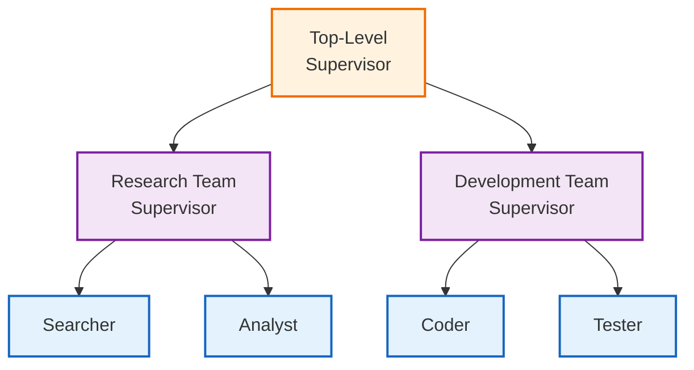

# Hierarchical Agent Teams

## Overview

Hierarchical agent teams extend the supervisor pattern with nested team structures. A top-level supervisor coordinates team supervisors, who in turn manage specialized team members. This enables complex organizational structures for sophisticated tasks.

## Architecture



## When to Use

Use hierarchical teams when:

- **Many agents**: More than 5-6 agents become hard for one supervisor
- **Clear domains**: Research, development, QA are distinct areas
- **Independent work**: Teams can make progress without constant coordination
- **Scalability**: Adding teams shouldn't require restructuring

## Key Components

### 1. Team State

```python
class TeamState(TypedDict):
    messages: Annotated[list, add_messages]
    task: str
    team_name: str
    next_member: str
    member_outputs: Annotated[list[dict], operator.add]
    iteration: int
    max_iterations: int
    team_result: str
```

### 2. Hierarchical State

```python
class HierarchicalState(TypedDict):
    messages: Annotated[list, add_messages]
    task: str
    active_team: str
    team_results: dict[str, str]
    iteration: int
    max_iterations: int
    final_result: str
```

### 3. Team Building

```python
from langgraph_ollama_local.agents.hierarchical import create_team_graph

research_team = create_team_graph(
    llm,
    "research",
    members=[
        ("searcher", "Search for information.", None),
        ("analyst", "Analyze and summarize.", None),
    ]
)
```

### 4. Hierarchical Graph

```python
from langgraph_ollama_local.agents.hierarchical import create_hierarchical_graph

graph = create_hierarchical_graph(
    llm,
    {
        "research": research_team,
        "development": dev_team,
    }
)
```

## Usage

```python
from langgraph_ollama_local.agents.hierarchical import (
    create_team_graph,
    create_hierarchical_graph,
    run_hierarchical_task,
)

# Create teams
research = create_team_graph(llm, "research", [
    ("searcher", "Search for solutions.", None),
    ("analyst", "Analyze findings.", None),
])

dev = create_team_graph(llm, "development", [
    ("coder", "Write code.", None),
    ("tester", "Write tests.", None),
])

# Create hierarchical graph
graph = create_hierarchical_graph(llm, {"research": research, "development": dev})

# Run task
result = run_hierarchical_task(graph, "Build a password validator")
print(result["final_result"])
```

## State Transformation

Teams need state transformation when wrapped as nodes:

```python
def create_team_wrapper(team_graph, team_name):
    def team_node(state: HierarchicalState) -> dict:
        # Transform to team state
        team_input = {
            "messages": [],
            "task": state["task"],
            "team_name": team_name,
            "next_member": "",
            "member_outputs": [],
            "iteration": 0,
            "max_iterations": 4,
            "team_result": "",
        }

        # Run team
        team_output = team_graph.invoke(team_input)

        # Update hierarchical state
        new_results = state.get("team_results", {}).copy()
        new_results[team_name] = team_output["team_result"]

        return {"team_results": new_results}

    return team_node
```

## Best Practices

1. **Keep teams focused**: Each team should have a clear domain
2. **Limit team size**: 2-4 members per team works best
3. **Set iteration limits**: Both team and top-level iterations
4. **Clear handoffs**: Teams should produce complete, usable outputs

## Comparison: Flat vs Hierarchical

| Aspect | Flat Multi-Agent | Hierarchical |
|--------|------------------|--------------|
| Agents | 3-5 | 6+ |
| Structure | Single supervisor | Nested supervisors |
| Communication | Direct to all | Through team leads |
| Complexity | Lower | Higher |
| Scalability | Limited | Better |

## Common Patterns

### Sequential Team Flow
Research → Development → QA

### Parallel Team Work
Multiple teams work simultaneously, results merged

### Iterative Refinement
Teams can be called multiple times

## Related Patterns

- [Multi-Agent Collaboration](14-multi-agent-collaboration.md) - Flat supervisor pattern
- [Subgraph Patterns](16-subgraphs.md) - Composable graph components
