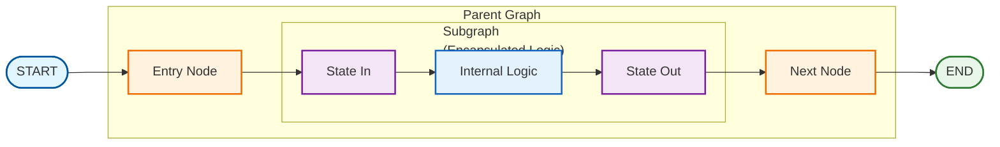

# Subgraph Patterns

## Overview

Subgraphs enable modular, reusable graph components that can be embedded within larger parent graphs. This pattern supports encapsulation, testing, and composition of complex agent systems.

## Architecture



## Key Concepts

### State Transformation

Subgraphs can have different state schemas than parent graphs. Transformation functions bridge the gap:

- **state_in**: Convert parent state to subgraph input
- **state_out**: Convert subgraph output to parent state updates

```python
def state_in(parent_state: ParentState) -> SubgraphState:
    """Transform parent state to subgraph input."""
    return {
        "query": parent_state["user_question"],
        "documents": [],
        "answer": "",
    }

def state_out(subgraph_state: SubgraphState, parent_state: ParentState) -> dict:
    """Transform subgraph output to parent updates."""
    return {
        "rag_answer": subgraph_state["answer"],
        "sources": subgraph_state["documents"],
    }
```

## Usage

### Basic Subgraph Wrapping

```python
from langgraph_ollama_local.patterns.subgraphs import create_subgraph_node

# Create wrapped node
rag_node = create_subgraph_node(
    rag_graph,
    state_in,
    state_out,
)

# Add to parent graph
parent.add_node("rag", rag_node)
```

### Field Mappers

For simple field renaming:

```python
from langgraph_ollama_local.patterns.subgraphs import (
    field_mapper_in,
    field_mapper_out,
)

state_in = field_mapper_in(
    ("user_question", "query"),  # parent_field -> subgraph_field
    ("context", "documents"),
)

state_out = field_mapper_out(
    ("answer", "rag_response"),  # subgraph_field -> parent_field
)
```

### Chaining Subgraphs

```python
from langgraph_ollama_local.patterns.subgraphs import chain_subgraphs

chained = chain_subgraphs([
    (retrieval_graph, retrieve_in, retrieve_out),
    (grading_graph, grade_in, grade_out),
    (generation_graph, generate_in, generate_out),
])

parent.add_node("rag_pipeline", chained)
```

### Conditional Subgraphs

```python
from langgraph_ollama_local.patterns.subgraphs import conditional_subgraph

def needs_web_search(state):
    return len(state.get("documents", [])) < 2

node = conditional_subgraph(
    needs_web_search,
    (web_search_graph, ws_in, ws_out),
    (direct_answer_graph, da_in, da_out),
)
```

### Retry Pattern

```python
from langgraph_ollama_local.patterns.subgraphs import retry_subgraph

def should_retry(output, state):
    return output.get("quality_score", 0) < 0.7

node = retry_subgraph(
    generation_graph,
    gen_in, gen_out,
    should_retry,
    max_retries=3,
)
```

## Available Functions

| Function | Purpose |
|----------|---------|
| `create_subgraph_node` | Wrap subgraph as parent node |
| `create_subgraph_node_async` | Async version |
| `field_mapper_in` | Create state_in from field mappings |
| `field_mapper_out` | Create state_out from field mappings |
| `passthrough_state_in` | Identity transform (same schema) |
| `passthrough_state_out` | Identity transform (same schema) |
| `chain_subgraphs` | Run subgraphs sequentially |
| `conditional_subgraph` | Choose subgraph based on condition |
| `parallel_subgraphs` | Run subgraphs and merge outputs |
| `retry_subgraph` | Add retry logic to subgraph |

## Best Practices

1. **Keep subgraphs focused**: One responsibility per subgraph
2. **Test independently**: Verify subgraphs work before composing
3. **Clear interfaces**: Document state_in and state_out contracts
4. **Handle errors**: Consider what happens if subgraph fails

## Common Patterns

### RAG as Subgraph

```python
class RAGState(TypedDict):
    query: str
    documents: list
    answer: str

# Build RAG subgraph
rag_graph = build_rag_graph(retriever, llm)

# Embed in agent
agent.add_node("rag", create_subgraph_node(
    rag_graph,
    lambda s: {"query": s["question"], "documents": [], "answer": ""},
    lambda out, s: {"rag_answer": out["answer"]},
))
```

### Tool as Subgraph

Complex tools can be subgraphs with their own logic:

```python
# Calculator subgraph with validation and computation
calc_graph = build_calculator_graph()

# Wrap as tool-like node
agent.add_node("calculator", create_subgraph_node(
    calc_graph,
    lambda s: {"expression": s["tool_input"]},
    lambda out, s: {"tool_result": out["result"]},
))
```

## When to Use Subgraphs

| Use Subgraphs | Use Regular Nodes |
|---------------|-------------------|
| Reusable across multiple graphs | Single-use logic |
| Different state schema needed | Same state schema |
| Complex multi-step logic | Simple operations |
| Need independent testing | Tightly coupled to parent |
| Swappable implementations | Fixed implementation |

## Related Patterns

- [Multi-Agent Collaboration](14-multi-agent-collaboration.md)
- [Hierarchical Teams](15-hierarchical-teams.md)
