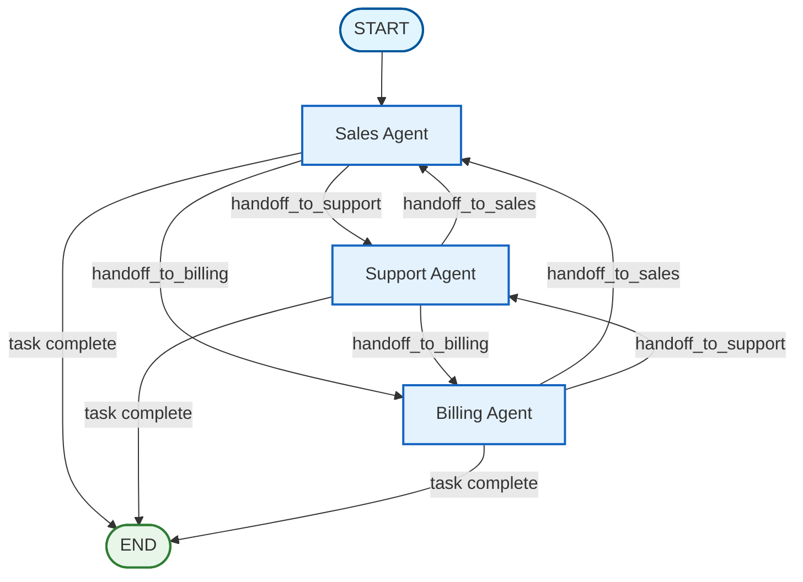

# Agent Handoffs

## Overview

Agent handoffs enable peer-to-peer collaboration where agents explicitly transfer control to other agents based on their expertise boundaries. Unlike the supervisor pattern where a central coordinator makes routing decisions, handoffs give individual agents the autonomy to decide when and to whom to transfer conversations.

## Architecture



## When to Use

Use agent handoffs when:

- **Clear role boundaries**: Each agent has well-defined expertise areas
- **Service scenarios**: Customer service, triage, support workflows
- **Agent autonomy**: Agents can assess their own capabilities
- **Peer collaboration**: Direct agent-to-agent communication is natural
- **Linear handoff chains**: Expected flow is mostly sequential transfers

## Supervisor vs Handoffs

| Aspect | Supervisor Pattern | Handoff Pattern |
|--------|-------------------|-----------------|
| **Decision Making** | Central supervisor decides routing | Individual agents decide handoffs |
| **Structure** | Hierarchical (supervisor + workers) | Peer-to-peer (equal agents) |
| **Routing Mechanism** | Supervisor analyzes task + progress | Agents use tools to signal handoff |
| **Communication** | All through supervisor | Direct agent-to-agent |
| **Agent Autonomy** | Low (supervisor controls) | High (agents control) |
| **Best For** | Complex multi-step tasks | Service/triage scenarios |
| **Example** | Research → Code → Review | Sales → Support → Billing |

## Key Components

### 1. State Schema

```python
from typing import Annotated
from typing_extensions import TypedDict
from langgraph.graph.message import add_messages
import operator

class HandoffState(TypedDict):
    messages: Annotated[list, add_messages]      # Conversation history
    task: str                                     # User's request
    current_agent: str                            # Currently active agent
    handoff_target: str                           # Agent to hand off to
    context: Annotated[list[dict], operator.add]  # Accumulated work
    handoff_history: Annotated[list[str], operator.add]  # Handoff chain
    iteration: int                                # Handoff count
    max_iterations: int                           # Safety limit
    final_result: str                             # Final response
```

### 2. Handoff Tools

Handoff tools enable agents to explicitly transfer control:

```python
from langgraph_ollama_local.patterns.handoffs import create_handoff_tool

# Create handoff tools
handoff_to_support = create_handoff_tool(
    target_agent="support",
    description="Transfer to support for technical issues or bugs",
)

handoff_to_billing = create_handoff_tool(
    target_agent="billing",
    description="Transfer to billing for payment or invoice questions",
)

handoff_to_sales = create_handoff_tool(
    target_agent="sales",
    description="Transfer to sales for product questions or purchases",
)
```

**Tool Behavior:**
- Tool name format: `handoff_to_<agent>`
- Takes `reason` parameter: Brief explanation for the handoff
- Returns confirmation message
- Signals routing system to transfer control

### 3. Agent Nodes

Each agent can:
1. Process requests in their domain
2. Use handoff tools when requests are outside their expertise

```python
from langgraph_ollama_local.patterns.handoffs import create_handoff_agent_node

sales_agent = create_handoff_agent_node(
    llm,
    agent_name="sales",
    agent_role="Handle product inquiries, pricing, and sales",
    handoff_tools=[handoff_to_support, handoff_to_billing],
)

support_agent = create_handoff_agent_node(
    llm,
    agent_name="support",
    agent_role="Handle technical issues and troubleshooting",
    handoff_tools=[handoff_to_billing, handoff_to_sales],
)

billing_agent = create_handoff_agent_node(
    llm,
    agent_name="billing",
    agent_role="Handle payments, invoices, and refunds",
    handoff_tools=[handoff_to_sales, handoff_to_support],
)
```

**Agent Behavior:**
- Receives task and previous context
- Decides whether to handle or hand off
- If handling: Provides response, sets `handoff_target = ""`
- If handing off: Uses handoff tool, sets `handoff_target = <agent>`

### 4. Routing Logic

Routing is based on agent decisions:

```python
from langgraph_ollama_local.patterns.handoffs import route_handoffs

def route_handoffs(state):
    """
    Route based on handoff decisions.

    - If handoff_target is set → route to that agent
    - If no handoff → agent completed task → go to completion
    - If at max iterations → force completion
    """
    if state["iteration"] >= state["max_iterations"]:
        return "complete"

    if state["handoff_target"]:
        return state["handoff_target"]  # Route to specified agent

    return "complete"  # No handoff means task complete
```

### 5. Graph Construction

```python
from langgraph.graph import StateGraph, START, END
from langgraph_ollama_local.patterns.handoffs import create_handoff_graph

# Method 1: Using the builder function
graph = create_handoff_graph(
    llm,
    agents={
        "sales": ("Handle sales inquiries", [handoff_to_support, handoff_to_billing]),
        "support": ("Handle technical issues", [handoff_to_billing, handoff_to_sales]),
        "billing": ("Handle payments", [handoff_to_sales, handoff_to_support]),
    },
    entry_agent="sales",  # First agent handles all requests
    max_iterations=10,
)

# Method 2: Manual construction
workflow = StateGraph(HandoffState)

# Add agent nodes
workflow.add_node("sales", sales_agent)
workflow.add_node("support", support_agent)
workflow.add_node("billing", billing_agent)
workflow.add_node("complete", complete_node)

# Entry point
workflow.add_edge(START, "sales")

# Conditional edges for each agent
for agent_name in ["sales", "support", "billing"]:
    workflow.add_conditional_edges(
        agent_name,
        route_handoffs,
        {
            "sales": "sales",
            "support": "support",
            "billing": "billing",
            "complete": "complete",
        },
    )

# End
workflow.add_edge("complete", END)

graph = workflow.compile()
```

## Usage

### Basic Usage

```python
from langgraph_ollama_local import LocalAgentConfig
from langgraph_ollama_local.patterns.handoffs import (
    create_handoff_graph,
    create_handoff_tool,
    run_handoff_conversation,
)

config = LocalAgentConfig()
llm = config.create_chat_client()

# Create handoff tools
handoff_to_support = create_handoff_tool("support", "Technical issues")
handoff_to_billing = create_handoff_tool("billing", "Payment questions")
handoff_to_sales = create_handoff_tool("sales", "Product questions")

# Build graph
graph = create_handoff_graph(
    llm,
    agents={
        "sales": (
            "Handle product inquiries and sales",
            [handoff_to_support, handoff_to_billing],
        ),
        "support": (
            "Handle technical issues",
            [handoff_to_billing, handoff_to_sales],
        ),
        "billing": (
            "Handle payments and invoices",
            [handoff_to_sales, handoff_to_support],
        ),
    },
    entry_agent="sales",
)

# Run conversation
result = run_handoff_conversation(
    graph,
    "My app keeps crashing when I export data",
    entry_agent="sales",
    max_iterations=5,
)

print(result["final_result"])
print("Handoff chain:", " -> ".join(result["handoff_history"]))
```

### Manual Invocation

```python
from langchain_core.messages import HumanMessage

initial_state = {
    "messages": [HumanMessage(content="I need help with my invoice")],
    "task": "I need help with my invoice",
    "current_agent": "sales",
    "handoff_target": "",
    "context": [],
    "handoff_history": [],
    "iteration": 0,
    "max_iterations": 5,
    "final_result": "",
}

result = graph.invoke(initial_state)

# Access results
print("Final result:", result["final_result"])
print("Agents involved:", [c["agent"] for c in result["context"]])
print("Handoffs:", result["handoff_history"])
print("Total iterations:", result["iteration"])
```

## API Reference

### `create_handoff_tool()`

Create a tool that enables handoffs to a specific agent.

```python
def create_handoff_tool(
    target_agent: str,
    description: str | None = None,
) -> BaseTool
```

**Parameters:**
- `target_agent`: Name of the agent to hand off to
- `description`: When to use this handoff (guides LLM decision-making)

**Returns:** Tool that can be bound to an agent's LLM

**Example:**
```python
handoff_to_support = create_handoff_tool(
    "support",
    "Transfer to support for technical issues, bugs, or how-to questions",
)
```

### `create_handoff_agent_node()`

Create an agent node that can process work and initiate handoffs.

```python
def create_handoff_agent_node(
    llm: BaseChatModel,
    agent_name: str,
    agent_role: str,
    handoff_tools: list[BaseTool] | None = None,
) -> callable
```

**Parameters:**
- `llm`: Language model for the agent
- `agent_name`: Name of this agent
- `agent_role`: Description of the agent's responsibilities
- `handoff_tools`: List of handoff tools this agent can use

**Returns:** Node function compatible with StateGraph

**Example:**
```python
sales_agent = create_handoff_agent_node(
    llm,
    "sales",
    "Handle product inquiries, pricing questions, and sales",
    handoff_tools=[handoff_to_support, handoff_to_billing],
)
```

### `route_handoffs()`

Routing function based on agent handoff decisions.

```python
def route_handoffs(state: HandoffState) -> str
```

**Parameters:**
- `state`: Current handoff state

**Returns:** Name of next node ("complete" or agent name)

**Logic:**
1. Check iteration limit → "complete" if exceeded
2. Check `handoff_target` → route to target if set
3. No handoff → "complete" (agent finished task)

### `create_handoff_graph()`

Build a complete handoff graph with multiple agents.

```python
def create_handoff_graph(
    llm: BaseChatModel,
    agents: dict[str, tuple[str, list[BaseTool]]],
    entry_agent: str | None = None,
    max_iterations: int = 10,
    checkpointer: Any | None = None,
) -> CompiledStateGraph
```

**Parameters:**
- `llm`: Language model for all agents
- `agents`: Dict mapping agent names to `(role_description, handoff_tools)`
- `entry_agent`: Which agent handles requests first (default: first in dict)
- `max_iterations`: Maximum handoffs before forcing completion
- `checkpointer`: Optional checkpointer for persistence

**Returns:** Compiled StateGraph ready for invocation

**Example:**
```python
graph = create_handoff_graph(
    llm,
    agents={
        "sales": ("Handle sales", [handoff_to_support, handoff_to_billing]),
        "support": ("Handle tech support", [handoff_to_billing, handoff_to_sales]),
        "billing": ("Handle billing", [handoff_to_sales, handoff_to_support]),
    },
    entry_agent="sales",
    max_iterations=5,
)
```

### `run_handoff_conversation()`

Convenience function to run a conversation through the handoff system.

```python
def run_handoff_conversation(
    graph: CompiledStateGraph,
    task: str,
    entry_agent: str,
    max_iterations: int = 10,
    thread_id: str = "default",
) -> dict
```

**Parameters:**
- `graph`: Compiled handoff graph
- `task`: User's request or query
- `entry_agent`: Which agent to start with
- `max_iterations`: Maximum handoffs allowed
- `thread_id`: Thread ID for checkpointing

**Returns:** Final state dict with `final_result`, `handoff_history`, `context`, etc.

**Example:**
```python
result = run_handoff_conversation(
    graph,
    "I need to cancel my subscription and get a refund",
    entry_agent="sales",
    max_iterations=5,
)
```

## Best Practices

### 1. Define Clear Agent Boundaries

```python
# Good: Clear, distinct roles
agents = {
    "sales": ("Product questions, pricing, purchases", [...]),
    "support": ("Technical issues, troubleshooting, how-to", [...]),
    "billing": ("Payments, invoices, refunds, account billing", [...]),
}

# Bad: Overlapping responsibilities
agents = {
    "general": ("Handle everything", [...]),
    "specialist": ("Also handle everything", [...]),
}
```

### 2. Provide Handoff Guidance

```python
# Good: Specific, actionable descriptions
handoff_to_support = create_handoff_tool(
    "support",
    "Transfer for: app crashes, error messages, login issues, feature not working",
)

# Bad: Vague descriptions
handoff_to_support = create_handoff_tool(
    "support",
    "Transfer for support stuff",
)
```

### 3. Set Reasonable Iteration Limits

```python
# Good: Prevents infinite loops, allows necessary handoffs
graph = create_handoff_graph(llm, agents, max_iterations=5)

# Bad: Too low (prevents necessary handoffs)
graph = create_handoff_graph(llm, agents, max_iterations=1)

# Bad: Too high (allows excessive handoffs)
graph = create_handoff_graph(llm, agents, max_iterations=50)
```

### 4. Choose the Right Entry Agent

```python
# Good: Triage agent handles all requests first
graph = create_handoff_graph(llm, agents, entry_agent="sales")

# Also good: Specialized entry based on channel
graph = create_handoff_graph(llm, agents, entry_agent="support")  # For tech support line
```

### 5. Preserve Context Across Handoffs

The system automatically accumulates context, but ensure agents reference it:

```python
# The system prompt already includes:
# "Previous work from other agents: {previous_context}"

# Agents see what previous agents did and can build on it
```

## Common Patterns

### Customer Service Triage

```python
# Entry: Sales handles all requests, hands off as needed
agents = {
    "sales": ("Product info, pricing", [to_support, to_billing]),
    "support": ("Technical help", [to_billing, to_sales]),
    "billing": ("Payments, refunds", [to_sales, to_support]),
}
entry_agent = "sales"
```

### Technical Support Escalation

```python
# Entry: L1 support, escalates to L2/L3
agents = {
    "l1_support": ("Basic troubleshooting", [to_l2, to_billing]),
    "l2_support": ("Advanced troubleshooting", [to_l3, to_l1]),
    "l3_support": ("Engineering escalation", [to_l2]),
    "billing": ("Account issues", [to_l1]),
}
entry_agent = "l1_support"
```

### Medical Triage

```python
# Entry: Intake nurse, routes to specialists
agents = {
    "intake": ("Initial assessment", [to_general, to_urgent, to_mental]),
    "general": ("General medicine", [to_specialist]),
    "urgent": ("Urgent care", [to_emergency]),
    "mental": ("Mental health", [to_crisis]),
}
entry_agent = "intake"
```

## Common Pitfalls

| Pitfall | Solution |
|---------|----------|
| **Infinite handoff loops** | Set `max_iterations` to reasonable value (5-10) |
| **Unclear handoff reasons** | Provide specific tool descriptions |
| **Lost context** | System preserves context automatically |
| **Too many handoffs** | Review agent roles for overlap |
| **Wrong entry agent** | Choose triage/generalist as entry |
| **Agents don't complete tasks** | Instruct agents to avoid unnecessary handoffs |

## Comparison with Other Patterns

### vs Supervisor Pattern

**Use Handoffs When:**
- Clear expertise boundaries
- Service/triage scenarios
- Agent autonomy is beneficial
- Mostly linear handoff chains

**Use Supervisor When:**
- Complex task decomposition
- Iterative refinement needed
- Central orchestration required
- Research/development workflows

### vs Hierarchical Teams

**Use Handoffs When:**
- Flat organizational structure
- Peer-to-peer collaboration
- Simple routing logic

**Use Hierarchical Teams When:**
- Nested organizational structure
- Team-level coordination needed
- Complex multi-level workflows

### vs Subgraphs

**Use Handoffs When:**
- Same state schema across agents
- Dynamic routing based on content
- Conversational context matters

**Use Subgraphs When:**
- Different state schemas needed
- Reusable components
- Encapsulated logic modules

## Related Patterns

- [Multi-Agent Collaboration](14-multi-agent-collaboration.md) - Supervisor pattern for comparison
- [Hierarchical Teams](15-hierarchical-teams.md) - Nested team structures
- [Subgraph Patterns](16-subgraphs.md) - Composable graph components

## Examples

See the complete tutorial with working code examples:
- [Tutorial 17: Agent Handoffs](../../examples/multi_agent_patterns/17_agent_handoffs.ipynb)
