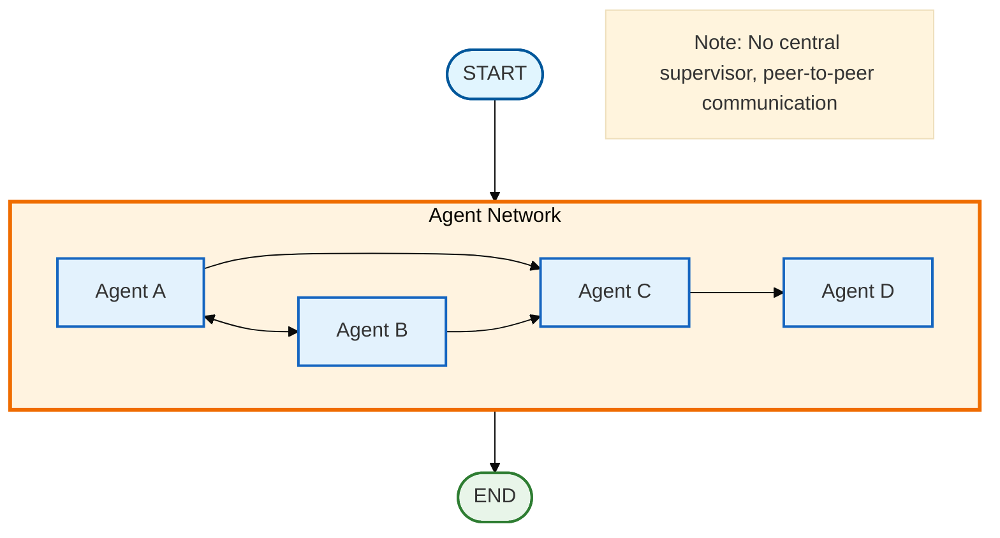

# Agent Swarm/Network

## Overview

The agent swarm pattern enables decentralized, peer-to-peer agent collaboration without a central supervisor. Agents communicate directly, share context, and dynamically decide which peer should work next. This creates flexible, adaptive systems where complex behaviors emerge from simple local interactions.

## Architecture



## When to Use

Use agent swarms when:

- **Decentralized decision-making is preferred**: No single point of control
- **Tasks benefit from adaptive routing**: Agents choose best peers dynamically
- **Rich context sharing is needed**: All agents see all work
- **Emergent behavior is desired**: Complex patterns from simple rules
- **Network topology matters**: Define specific agent connections
- **Flexible collaboration**: Agents adapt based on peer outputs

## Key Components

### 1. State Schema

The swarm state differs from supervisor state in key ways:

```python
from typing import Annotated, Any
from typing_extensions import TypedDict
from langgraph.graph.message import add_messages
import operator

class SwarmState(TypedDict):
    messages: Annotated[list, add_messages]         # Conversation history
    task: str                                        # Overall task
    agents_state: dict[str, dict[str, Any]]         # Per-agent state
    shared_context: Annotated[list[dict], operator.add]  # Accumulated outputs
    current_agent: str                               # Current agent (set by peer)
    iteration: int                                   # Current iteration
    max_iterations: int                              # Safety limit
    final_result: str                                # Aggregated result
```

**Key differences from supervisor pattern:**
- `agents_state`: Per-agent state tracking (not centralized)
- `shared_context`: All agents see all outputs (full transparency)
- `current_agent`: Set by previous agent, not by supervisor

### 2. Agent Configuration

Define agents with their connections (network topology):

```python
from pydantic import BaseModel, Field

class SwarmAgent(BaseModel):
    name: str = Field(description="Unique name for the agent")
    system_prompt: str = Field(description="System prompt defining role")
    connections: list[str] = Field(
        default_factory=list,
        description="List of agent names this agent can hand off to"
    )
    tools: list | None = Field(default=None, description="Optional tools")
```

Example swarm configuration:

```python
agents = [
    SwarmAgent(
        name="researcher",
        system_prompt="Research and gather information",
        connections=["analyst", "fact_checker"],  # Can route to either
    ),
    SwarmAgent(
        name="analyst",
        system_prompt="Analyze findings",
        connections=["writer"],  # Routes to writer
    ),
    SwarmAgent(
        name="fact_checker",
        system_prompt="Verify claims",
        connections=["analyst", "writer"],  # Can route to either
    ),
    SwarmAgent(
        name="writer",
        system_prompt="Write final report",
        connections=[],  # Terminal node
    ),
]
```

### 3. Swarm Agent Node

Each agent:
1. Sees shared context from all previous agents
2. Performs its work
3. Decides which connected agent goes next
4. Shares output with swarm

```python
from langgraph_ollama_local.patterns.swarm import create_swarm_node

def create_swarm_node(llm, agent_config: SwarmAgent):
    """Create a node for a swarm agent.

    The agent:
    - Receives shared context from entire swarm
    - Performs specialized work
    - Routes to a connected peer
    - Shares findings with swarm
    """
    structured_llm = llm.with_structured_output(SwarmRouting)

    def swarm_agent_node(state: SwarmState) -> dict:
        # Build context from all agents
        context = build_shared_context(state["shared_context"])

        # Do work
        work_output = llm.invoke([
            SystemMessage(content=agent_config.system_prompt),
            HumanMessage(content=f"Task: {state['task']}\nContext: {context}")
        ])

        # Decide next agent
        routing = structured_llm.invoke([
            SystemMessage(content=f"Your connections: {agent_config.connections}"),
            HumanMessage(content=f"Your work: {work_output.content}\nWho next?")
        ])

        return {
            "agents_state": update_agent_state(...),
            "current_agent": routing.next_agent,
            "shared_context": [{"agent": name, "content": work_output.content}],
            "iteration": state["iteration"] + 1,
        }

    return swarm_agent_node
```

### 4. Routing Decision

Agents use structured output to decide routing:

```python
from pydantic import BaseModel, Field

class SwarmRouting(BaseModel):
    next_agent: str = Field(
        description="Name of next agent to work, or 'DONE' if complete"
    )
    reasoning: str = Field(
        description="Brief explanation for routing decision"
    )
    share_context: bool = Field(
        default=True,
        description="Whether to share output with swarm"
    )
```

### 5. Swarm Routing Function

Unlike supervisor pattern, routing simply reads the peer's decision:

```python
def route_swarm(state: SwarmState) -> str:
    """Route based on previous agent's decision."""
    if state["iteration"] >= state["max_iterations"]:
        return "aggregate"
    if state["current_agent"] == "DONE" or not state["current_agent"]:
        return "aggregate"
    return state["current_agent"]  # Route to peer's choice
```

**Key difference**: No central decision-maker! Each agent sets `current_agent` for the next peer.

### 6. Graph Construction

```python
from langgraph.graph import StateGraph, START, END
from langgraph_ollama_local.patterns.swarm import create_swarm_graph

graph = create_swarm_graph(llm, agents, entry_agent="researcher")
```

Full manual construction:

```python
workflow = StateGraph(SwarmState)

# Add agent nodes
for agent in agents:
    workflow.add_node(agent.name, create_swarm_node(llm, agent))

# Add aggregate node
workflow.add_node("aggregate", create_aggregate_node())

# Entry point
workflow.add_edge(START, "researcher")

# Dynamic routing for all agents
routing_map = {agent.name: agent.name for agent in agents}
routing_map["aggregate"] = "aggregate"

for agent in agents:
    workflow.add_conditional_edges(agent.name, route_swarm, routing_map)

workflow.add_edge("aggregate", END)

graph = workflow.compile()
```

## Usage

### Basic Usage

```python
from langgraph_ollama_local import LocalAgentConfig
from langgraph_ollama_local.patterns import (
    SwarmAgent,
    create_swarm_graph,
    run_swarm_task,
)

config = LocalAgentConfig()
llm = config.create_chat_client()

# Define swarm
agents = [
    SwarmAgent(
        name="researcher",
        system_prompt="Research and gather information",
        connections=["analyst"],
    ),
    SwarmAgent(
        name="analyst",
        system_prompt="Analyze findings and draw insights",
        connections=["writer"],
    ),
    SwarmAgent(
        name="writer",
        system_prompt="Write comprehensive report",
        connections=[],  # Terminal
    ),
]

# Create and run
graph = create_swarm_graph(llm, agents)
result = run_swarm_task(
    graph,
    "Research the benefits of microservices architecture",
    max_iterations=8
)

print(result["final_result"])
```

### With Tools

```python
from langchain_core.tools import tool

@tool
def search_web(query: str) -> str:
    """Search the web."""
    # Implementation
    return "Search results..."

agents = [
    SwarmAgent(
        name="researcher",
        system_prompt="Research using web search",
        connections=["analyst"],
        tools=[search_web],  # Provide tools
    ),
    # ... other agents
]

graph = create_swarm_graph(llm, agents)
```

### Custom Entry Agent

```python
# Start with a specific agent
graph = create_swarm_graph(
    llm,
    agents,
    entry_agent="fact_checker"  # Start here instead of first agent
)
```

## API Reference

### Core Functions

#### `create_swarm_node`

```python
def create_swarm_node(
    llm: BaseChatModel,
    agent_config: SwarmAgent,
) -> Callable[[SwarmState], dict]
```

Create a node for a swarm agent.

**Parameters:**
- `llm`: Language model for the agent
- `agent_config`: SwarmAgent configuration

**Returns:** Node function for use in StateGraph

#### `create_swarm_graph`

```python
def create_swarm_graph(
    llm: BaseChatModel,
    agents: list[SwarmAgent],
    entry_agent: str | None = None,
    checkpointer: Any | None = None,
) -> CompiledStateGraph
```

Create an agent swarm graph.

**Parameters:**
- `llm`: Language model for all agents
- `agents`: List of SwarmAgent configurations
- `entry_agent`: Name of first agent (defaults to agents[0])
- `checkpointer`: Optional checkpointer for persistence

**Returns:** Compiled StateGraph

**Raises:**
- `ValueError`: If agents list is empty or connections are invalid

#### `run_swarm_task`

```python
def run_swarm_task(
    graph: CompiledStateGraph,
    task: str,
    max_iterations: int = 10,
    thread_id: str = "default",
) -> dict
```

Run a task through the swarm.

**Parameters:**
- `graph`: Compiled swarm graph
- `task`: Task description
- `max_iterations`: Maximum iterations (default: 10)
- `thread_id`: Thread ID for checkpointing

**Returns:** Final state dict with:
- `final_result`: Aggregated outputs
- `shared_context`: All agent outputs
- `agents_state`: Per-agent state
- `iteration`: Final iteration count

#### `broadcast_message`

```python
def broadcast_message(
    state: SwarmState,
    message: str,
    sender: str,
) -> dict
```

Broadcast a message to all swarm agents.

**Parameters:**
- `state`: Current swarm state
- `message`: Message to broadcast
- `sender`: Name of sending agent

**Returns:** State update with broadcasted message

### State Types

#### `SwarmState`

```python
class SwarmState(TypedDict):
    messages: Annotated[list, add_messages]
    task: str
    agents_state: dict[str, dict[str, Any]]
    shared_context: Annotated[list[dict], operator.add]
    current_agent: str
    iteration: int
    max_iterations: int
    final_result: str
```

#### `SwarmAgent`

```python
class SwarmAgent(BaseModel):
    name: str
    system_prompt: str
    connections: list[str] = Field(default_factory=list)
    tools: list | None = None
```

#### `SwarmRouting`

```python
class SwarmRouting(BaseModel):
    next_agent: str
    reasoning: str
    share_context: bool = True
```

## Network Topologies

### Fully Connected

Every agent can communicate with every other agent:

```python
agents = [
    SwarmAgent(name="a", system_prompt="...", connections=["b", "c", "d"]),
    SwarmAgent(name="b", system_prompt="...", connections=["a", "c", "d"]),
    SwarmAgent(name="c", system_prompt="...", connections=["a", "b", "d"]),
    SwarmAgent(name="d", system_prompt="...", connections=["a", "b", "c"]),
]
```

**Use when:** Maximum flexibility needed

### Linear Pipeline

Agents form a sequential pipeline:

```python
agents = [
    SwarmAgent(name="a", system_prompt="...", connections=["b"]),
    SwarmAgent(name="b", system_prompt="...", connections=["c"]),
    SwarmAgent(name="c", system_prompt="...", connections=["d"]),
    SwarmAgent(name="d", system_prompt="...", connections=[]),
]
```

**Use when:** Clear sequential workflow

### Star Network

One central agent connects to all others:

```python
agents = [
    SwarmAgent(name="hub", system_prompt="...", connections=["a", "b", "c"]),
    SwarmAgent(name="a", system_prompt="...", connections=["hub"]),
    SwarmAgent(name="b", system_prompt="...", connections=["hub"]),
    SwarmAgent(name="c", system_prompt="...", connections=["hub"]),
]
```

**Use when:** Central coordination with peer specialization

### Custom Topology

Define specific communication patterns:

```python
agents = [
    SwarmAgent(name="researcher", connections=["analyst", "fact_checker"]),
    SwarmAgent(name="analyst", connections=["writer"]),
    SwarmAgent(name="fact_checker", connections=["analyst", "writer"]),
    SwarmAgent(name="writer", connections=[]),
]
```

## Best Practices

1. **Design clear connections**: Define agent connections that match your task structure
2. **Set reasonable max_iterations**: Swarms can iterate more than supervisors (8-12 typical)
3. **Share context wisely**: Use `share_context=False` for internal work
4. **Validate topology**: Ensure all connections reference valid agents
5. **Use terminal nodes**: Have at least one agent with no connections
6. **Monitor iterations**: Track which agents contribute and how often
7. **Test routing logic**: Verify agents make sensible routing decisions

## Common Patterns

### Research Swarm

```python
agents = [
    SwarmAgent(name="researcher", connections=["analyst", "fact_checker"]),
    SwarmAgent(name="analyst", connections=["writer"]),
    SwarmAgent(name="fact_checker", connections=["analyst"]),
    SwarmAgent(name="writer", connections=[]),
]
```

### Analysis Pipeline

```python
agents = [
    SwarmAgent(name="collector", connections=["preprocessor"]),
    SwarmAgent(name="preprocessor", connections=["analyzer"]),
    SwarmAgent(name="analyzer", connections=["reporter", "validator"]),
    SwarmAgent(name="validator", connections=["reporter"]),
    SwarmAgent(name="reporter", connections=[]),
]
```

### Collaborative Editing

```python
agents = [
    SwarmAgent(name="drafter", connections=["reviewer", "editor"]),
    SwarmAgent(name="reviewer", connections=["editor", "drafter"]),
    SwarmAgent(name="editor", connections=["reviewer", "finalizer"]),
    SwarmAgent(name="finalizer", connections=[]),
]
```

## Comparison: Swarm vs Supervisor

| Aspect | Supervisor Pattern | Swarm Pattern |
|--------|-------------------|---------------|
| **Control** | Centralized (supervisor decides) | Decentralized (peers decide) |
| **Routing** | Supervisor routes all agents | Each agent routes to peers |
| **Context** | Supervisor sees all, agents see subset | All agents see all context |
| **Topology** | Star (hub-and-spoke) | Any (define connections) |
| **Iteration** | Supervisor controls flow | Emerges from peer decisions |
| **Scalability** | Supervisor is bottleneck | Distributed decision-making |
| **Predictability** | More predictable | Less predictable (emergent) |
| **Debugging** | Easier (central control) | Harder (distributed) |
| **Flexibility** | Fixed routing logic | Adaptive routing |
| **Best for** | Structured, hierarchical tasks | Flexible, collaborative tasks |

## When to Use Each

### Use Swarm Pattern when:
- Tasks benefit from flexible, adaptive routing
- No clear hierarchical structure exists
- Agents need rich context from all peers
- Emergent behavior is desired
- Decentralized decision-making is preferred
- Network topology is important

### Use Supervisor Pattern when:
- Clear task structure and agent roles
- Centralized control and monitoring needed
- Predictable routing is important
- Quality control via central oversight
- Simpler to reason about and debug
- Sequential or parallel agent execution

### Hybrid Approach:
- Use hierarchical teams where each team is a swarm
- Combine supervisor coordination with swarm sub-teams
- Use swarms for exploration, supervisors for orchestration

## Troubleshooting

### Infinite Loops

**Problem:** Agents keep routing to each other without completion

**Solution:**
```python
# Set appropriate max_iterations
result = run_swarm_task(graph, task, max_iterations=8)

# Ensure at least one terminal agent
SwarmAgent(name="finalizer", connections=[])

# Monitor iteration counts
for agent, data in result["agents_state"].items():
    print(f"{agent}: {data['work_count']} iterations")
```

### Poor Routing Decisions

**Problem:** Agents make suboptimal routing choices

**Solution:**
```python
# Improve routing prompts
system_prompt = """You are {name}.
Your connections: {connections}

Routing guidelines:
- Route to 'analyst' if data needs analysis
- Route to 'writer' if ready for final output
- Route to 'DONE' only when task is complete"""

# Use structured output (not text parsing)
structured_llm = llm.with_structured_output(SwarmRouting)
```

### Context Overload

**Problem:** Shared context becomes too large

**Solution:**
```python
# Limit context in agent prompts
if len(content) > 500:
    content = content[:500] + "..."

# Use share_context selectively
routing_decision.share_context = is_important(work_output)

# Summarize context periodically
def summarize_context(contexts):
    # Summarize older contexts
    return summarized
```

## Advanced Topics

### Dynamic Agent Addition

Add agents to swarm at runtime (future enhancement):

```python
def add_agent_to_swarm(graph, new_agent):
    # Update graph with new agent
    # Update connections
    pass
```

### Agent Communication Protocols

Define communication standards:

```python
class SwarmMessage(BaseModel):
    sender: str
    recipient: str | None  # None for broadcast
    content: str
    metadata: dict
```

### Swarm Metrics

Track swarm performance:

```python
def analyze_swarm_metrics(result):
    return {
        "total_iterations": result["iteration"],
        "agent_contributions": {
            agent: data["work_count"]
            for agent, data in result["agents_state"].items()
        },
        "routing_path": extract_routing_path(result),
        "context_sharing_rate": calculate_sharing_rate(result),
    }
```

## Related Patterns

- [Multi-Agent Collaboration](14-multi-agent-collaboration.md) - Supervisor pattern
- [Hierarchical Teams](15-hierarchical-teams.md) - Nested team structures
- [Subgraph Patterns](16-subgraphs.md) - Composable graph components

## References

- LangGraph Documentation: https://langchain-ai.github.io/langgraph/
- Agent Swarms in AI: https://en.wikipedia.org/wiki/Swarm_intelligence
- Multi-Agent Systems: https://en.wikipedia.org/wiki/Multi-agent_system
