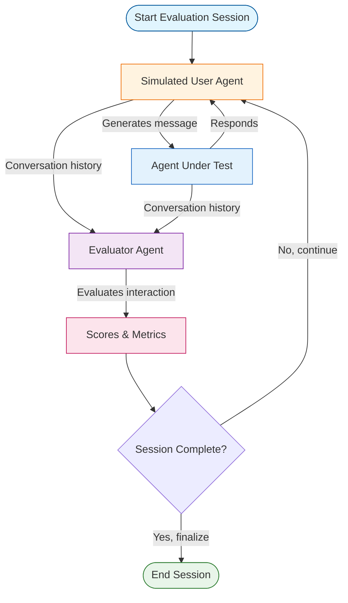

# Multi-Agent Evaluation

## Overview

Multi-agent evaluation enables systematic testing of agents through simulated user interactions and automated scoring. This pattern combines simulated user agents, evaluator agents, and metrics aggregation to provide objective quality assessment.

## Architecture



## When to Use

Use multi-agent evaluation when:

- **Systematic testing needed**: Manual testing doesn't scale
- **Quality metrics required**: Need objective, consistent scores
- **Multiple scenarios**: Test agent with various user behaviors
- **Regression testing**: Ensure changes don't degrade quality
- **A/B testing**: Compare different agent implementations

## Key Components

### 1. State Schema

```python
from typing import Annotated
from typing_extensions import TypedDict
from langgraph.graph.message import add_messages
import operator

class EvaluationState(TypedDict):
    messages: Annotated[list, add_messages]              # Conversation history
    conversation: str                                     # Formatted for evaluator
    evaluator_scores: Annotated[list[dict], operator.add]  # Accumulated scores
    turn_count: int                                       # Current turn
    max_turns: int                                        # Maximum turns
    session_complete: bool                                # Done flag
    final_metrics: dict[str, float]                       # Aggregated metrics
```

### 2. Simulated User Configuration

Define realistic user behavior:

```python
from pydantic import BaseModel, Field
from typing import Literal

class SimulatedUser(BaseModel):
    persona: str = Field(
        description="User's background and situation"
    )
    goals: list[str] = Field(
        description="What the user wants to accomplish"
    )
    behavior: Literal["friendly", "impatient", "confused", "technical", "casual"] = "friendly"
    initial_message: str | None = None

# Example
user = SimulatedUser(
    persona="Frustrated customer with damaged product",
    goals=["Get refund", "Express dissatisfaction"],
    behavior="impatient",
    initial_message="My order arrived damaged and I want a refund!"
)
```

### 3. Evaluation Criteria

Structured scoring with Pydantic:

```python
class EvaluationCriteria(BaseModel):
    helpfulness: int = Field(ge=1, le=5, description="How helpful? (1-5)")
    accuracy: int = Field(ge=1, le=5, description="How accurate? (1-5)")
    empathy: int = Field(ge=1, le=5, description="How empathetic? (1-5)")
    efficiency: int = Field(ge=1, le=5, description="How efficient? (1-5)")
    goal_completion: int = Field(ge=0, le=1, description="Goals met? (0/1)")
    reasoning: str = Field(description="Explanation of scores")
```

### 4. Simulated User Node

Creates user messages based on persona:

```python
from langgraph_ollama_local.patterns.evaluation import create_simulated_user_node

user_config = SimulatedUser(
    persona="Tech-savvy customer",
    goals=["Troubleshoot issue"],
    behavior="technical"
)

user_node = create_simulated_user_node(llm, user_config)
```

### 5. Evaluator Node

Scores conversations objectively:

```python
from langgraph_ollama_local.patterns.evaluation import create_evaluator_node

evaluator = create_evaluator_node(llm)
# Uses structured output to ensure consistent scoring
```

### 6. Graph Construction

Orchestrate agent, user, and evaluator:

```python
from langgraph_ollama_local.patterns.evaluation import create_evaluation_graph

graph = create_evaluation_graph(
    llm,
    agent_node,              # Agent being tested
    user_config,             # Simulated user config
    evaluate_every_n_turns=2 # Score every 2 turns
)
```

## Usage

### Basic Evaluation

```python
from langgraph_ollama_local import LocalAgentConfig
from langgraph_ollama_local.patterns.evaluation import (
    SimulatedUser,
    create_evaluation_graph,
    run_evaluation_session,
)

config = LocalAgentConfig()
llm = config.create_chat_client()

# Define agent to test
def my_agent(state):
    # Agent implementation
    return {"messages": [AIMessage(content="How can I help?")]}

# Configure simulated user
user = SimulatedUser(
    persona="Customer with billing question",
    goals=["Understand charge", "Get refund if incorrect"],
    behavior="friendly"
)

# Create and run evaluation
graph = create_evaluation_graph(llm, my_agent, user)
result = run_evaluation_session(graph, max_turns=10)

print(result["final_metrics"])
# {
#   'helpfulness_avg': 4.2,
#   'accuracy_avg': 4.0,
#   'empathy_avg': 4.5,
#   'efficiency_avg': 3.8,
#   'goal_completion_rate': 1.0,
#   'num_scores': 5
# }
```

### Multiple Evaluation Sessions

Test with multiple runs for robustness:

```python
from langgraph_ollama_local.patterns.evaluation import run_multiple_evaluations

results = run_multiple_evaluations(
    graph,
    num_sessions=5,    # Run 5 evaluation sessions
    max_turns=10
)

# Access aggregate metrics
print(results["aggregate_metrics"])
# {
#   'helpfulness_avg': 4.1,
#   'accuracy_avg': 4.2,
#   'empathy_avg': 4.3,
#   'efficiency_avg': 3.9,
#   'goal_completion_rate': 0.8,
#   'num_sessions': 5
# }

# Access individual session results
for i, session in enumerate(results["sessions"]):
    print(f"Session {i+1}: {session['final_metrics']}")
```

### Testing Different Scenarios

```python
# Scenario 1: Impatient customer
impatient_user = SimulatedUser(
    persona="Frustrated customer waiting 2 weeks for refund",
    goals=["Get immediate refund", "Express anger"],
    behavior="impatient"
)

# Scenario 2: Confused user
confused_user = SimulatedUser(
    persona="Elderly user not tech-savvy",
    goals=["Track order", "Understand website"],
    behavior="confused"
)

# Scenario 3: Technical user
tech_user = SimulatedUser(
    persona="Developer troubleshooting API",
    goals=["Debug API error", "Get technical details"],
    behavior="technical"
)

# Test all scenarios
for user_config in [impatient_user, confused_user, tech_user]:
    graph = create_evaluation_graph(llm, my_agent, user_config)
    result = run_evaluation_session(graph)
    print(f"Scenario: {user_config.persona}")
    print(f"Metrics: {result['final_metrics']}\n")
```

### Custom Metrics Aggregation

```python
from langgraph_ollama_local.patterns.evaluation import aggregate_scores

# Manually aggregate scores
scores = [
    {"helpfulness": 4, "accuracy": 5, "empathy": 3, "efficiency": 4, "goal_completion": 1},
    {"helpfulness": 5, "accuracy": 4, "empathy": 4, "efficiency": 5, "goal_completion": 1},
]

metrics = aggregate_scores(scores)
print(metrics)
# {
#   'helpfulness_avg': 4.5,
#   'accuracy_avg': 4.5,
#   'empathy_avg': 3.5,
#   'efficiency_avg': 4.5,
#   'goal_completion_rate': 1.0,
#   'num_scores': 2
# }
```

## API Reference

### State

**EvaluationState**
- `messages: Annotated[list, add_messages]` - Conversation history
- `conversation: str` - Formatted conversation text
- `evaluator_scores: Annotated[list[dict], operator.add]` - Accumulated scores
- `turn_count: int` - Current conversation turn
- `max_turns: int` - Maximum allowed turns
- `session_complete: bool` - Whether session is done
- `final_metrics: dict[str, float]` - Aggregated metrics

### Configuration Models

**SimulatedUser**
- `persona: str` - User's background and situation
- `goals: list[str]` - Objectives to accomplish
- `behavior: Literal[...]` - Communication style
- `initial_message: str | None` - Optional first message

**EvaluationCriteria**
- `helpfulness: int` - Score 1-5
- `accuracy: int` - Score 1-5
- `empathy: int` - Score 1-5
- `efficiency: int` - Score 1-5
- `goal_completion: int` - 0 or 1
- `reasoning: str` - Explanation

### Node Creators

**create_simulated_user_node(llm, user_config)**
- Creates simulated user agent
- Returns node function

**create_evaluator_node(llm)**
- Creates evaluator agent with structured output
- Returns node function

**create_check_completion_node()**
- Checks if session should end
- Returns node function

**create_finalize_node()**
- Aggregates scores into final metrics
- Returns node function

### Graph Builder

**create_evaluation_graph(llm, agent_node, user_config, evaluate_every_n_turns=2, checkpointer=None)**
- `llm` - Language model for user and evaluator
- `agent_node` - Agent being tested
- `user_config` - SimulatedUser configuration
- `evaluate_every_n_turns` - Evaluation frequency
- `checkpointer` - Optional state persistence
- Returns compiled graph

### Runners

**run_evaluation_session(graph, max_turns=10, thread_id="default")**
- Runs single evaluation session
- Returns state dict with metrics

**run_multiple_evaluations(graph, num_sessions=3, max_turns=10)**
- Runs multiple sessions
- Returns dict with sessions and aggregate_metrics

### Utilities

**aggregate_scores(scores)**
- Combines scores into summary metrics
- Returns dict with averaged scores

## Evaluation Metrics

### Score Dimensions

| Metric | Range | Description |
|--------|-------|-------------|
| **Helpfulness** | 1-5 | How helpful were the agent's responses? |
| **Accuracy** | 1-5 | How factually correct was the information? |
| **Empathy** | 1-5 | How empathetic was the agent? |
| **Efficiency** | 1-5 | How concise and direct were responses? |
| **Goal Completion** | 0-1 | Were user's goals achieved? |

### Aggregated Metrics

From `aggregate_scores()`:
- `helpfulness_avg` - Average helpfulness score
- `accuracy_avg` - Average accuracy score
- `empathy_avg` - Average empathy score
- `efficiency_avg` - Average efficiency score
- `goal_completion_rate` - Percentage of goals completed
- `num_scores` - Number of evaluations aggregated

## Best Practices

### 1. Diverse Test Scenarios

Test multiple user types:
```python
scenarios = [
    ("friendly", "Happy customer with simple question"),
    ("impatient", "Frustrated customer demanding refund"),
    ("confused", "User struggling with technical interface"),
    ("technical", "Developer needing API documentation"),
]

for behavior, persona in scenarios:
    user = SimulatedUser(persona=persona, goals=[...], behavior=behavior)
    # Run evaluation
```

### 2. Clear User Goals

Define specific, measurable objectives:
```python
# Good: Specific and measurable
goals = ["Get refund processed", "Receive confirmation number", "Understand timeline"]

# Bad: Vague
goals = ["Be satisfied", "Resolve issue"]
```

### 3. Multiple Evaluation Runs

Run 3-5 sessions per scenario for reliability:
```python
results = run_multiple_evaluations(graph, num_sessions=5)
# More reliable than single run
```

### 4. Periodic Evaluation

Score conversations as they progress:
```python
# Evaluate every 2 turns to track quality over time
graph = create_evaluation_graph(
    llm, agent, user,
    evaluate_every_n_turns=2  # Not just at the end
)
```

### 5. Track Improvements

Compare metrics before/after changes:
```python
# Before changes
baseline_metrics = run_evaluation_session(graph_v1)

# After changes
improved_metrics = run_evaluation_session(graph_v2)

# Compare
for metric in ["helpfulness_avg", "empathy_avg"]:
    delta = improved_metrics[metric] - baseline_metrics[metric]
    print(f"{metric}: {delta:+.2f}")
```

## Common Patterns

### A/B Testing Agents

```python
def compare_agents(agent_a, agent_b, user_config, num_sessions=5):
    """Compare two agent implementations."""

    graph_a = create_evaluation_graph(llm, agent_a, user_config)
    graph_b = create_evaluation_graph(llm, agent_b, user_config)

    results_a = run_multiple_evaluations(graph_a, num_sessions)
    results_b = run_multiple_evaluations(graph_b, num_sessions)

    print("Agent A vs Agent B:")
    for metric in ["helpfulness_avg", "accuracy_avg", "empathy_avg"]:
        a_score = results_a["aggregate_metrics"][metric]
        b_score = results_b["aggregate_metrics"][metric]
        print(f"{metric}: {a_score:.2f} vs {b_score:.2f}")
```

### Regression Testing

```python
def regression_test(agent, test_suite, threshold=4.0):
    """Ensure agent meets quality threshold."""

    all_passing = True

    for scenario_name, user_config in test_suite.items():
        graph = create_evaluation_graph(llm, agent, user_config)
        result = run_evaluation_session(graph)

        avg_score = (
            result["final_metrics"]["helpfulness_avg"] +
            result["final_metrics"]["accuracy_avg"]
        ) / 2

        passing = avg_score >= threshold
        all_passing = all_passing and passing

        print(f"{scenario_name}: {'PASS' if passing else 'FAIL'} ({avg_score:.2f})")

    return all_passing
```

### Custom Evaluator

Create domain-specific evaluators:

```python
class TechnicalSupportCriteria(BaseModel):
    """Custom criteria for technical support."""
    troubleshooting_quality: int = Field(ge=1, le=5)
    technical_accuracy: int = Field(ge=1, le=5)
    documentation_provided: int = Field(ge=0, le=1)
    escalation_appropriate: int = Field(ge=0, le=1)
    reasoning: str

def create_tech_support_evaluator(llm):
    structured_llm = llm.with_structured_output(TechnicalSupportCriteria)

    def evaluator(state):
        # Custom evaluation logic
        ...

    return evaluator
```

## Common Pitfalls

| Pitfall | Solution |
|---------|----------|
| **Single test scenario** | Test multiple user behaviors and personas |
| **Vague user goals** | Define specific, measurable objectives |
| **Single evaluation run** | Run 3-5 sessions for statistical reliability |
| **Only end-of-conversation scoring** | Use periodic evaluation to track quality |
| **Ignoring edge cases** | Test impatient, confused, and difficult users |
| **No baseline comparison** | Track metrics over time to measure improvement |
| **Fixed max_turns too low** | Allow enough turns for realistic conversations |

## Related Patterns

- [Multi-Agent Collaboration](14-multi-agent-collaboration.md) - Supervisor pattern basics
- [Hierarchical Teams](15-hierarchical-teams.md) - Nested team evaluation
- [Subgraph Patterns](16-subgraphs.md) - Modular evaluation components
