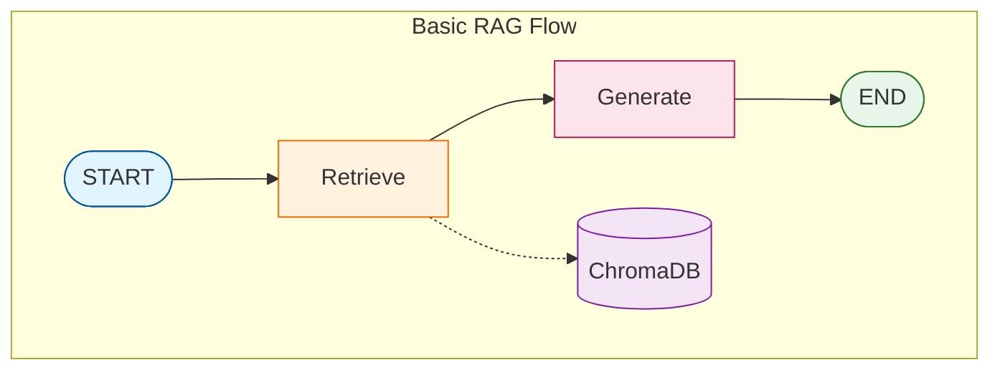

# Tutorial 08: Basic RAG (Retrieval-Augmented Generation)

This tutorial introduces the foundational RAG pattern - combining document retrieval with LLM generation for grounded, accurate responses.

## Overview

**RAG** (Retrieval-Augmented Generation) enhances LLM responses by:
1. **Retrieving** relevant documents for the user's question
2. **Augmenting** the prompt with retrieved context
3. **Generating** an answer grounded in the retrieved information

This addresses key LLM limitations:
- Knowledge cutoffs (outdated information)
- Hallucinations (making up facts)
- Lack of domain-specific knowledge

## Architecture



## RAG Pipeline Components

### 1. Document Loading

Load documents from various formats:

```python
from langgraph_ollama_local.rag import DocumentLoader

loader = DocumentLoader()

# Load single file
docs = loader.load_pdf("paper.pdf")

# Load directory
docs = loader.load_directory("sources/")
```

**Supported formats:**
- PDF (`.pdf`)
- Text (`.txt`)
- Markdown (`.md`, `.markdown`)

### 2. Document Chunking

Split documents into searchable pieces:

```python
from langgraph_ollama_local.rag import DocumentIndexer
from langgraph_ollama_local.rag.indexer import IndexerConfig

config = IndexerConfig(
    chunk_size=1000,      # Characters per chunk
    chunk_overlap=200,    # Overlap between chunks
)

indexer = DocumentIndexer(config=config)
chunks = indexer.chunk_documents(documents)
```

**Chunking considerations:**
| Parameter | Recommendation | Trade-off |
|-----------|---------------|-----------|
| `chunk_size` | 500-1500 chars | Larger = more context, but less precise |
| `chunk_overlap` | 10-20% of size | More overlap = better continuity |

### 3. Embeddings

Convert text to vectors using sentence-transformers:

```python
from langgraph_ollama_local.rag import LocalEmbeddings

embeddings = LocalEmbeddings(model_name="all-mpnet-base-v2")

# Embed documents
vectors = embeddings.embed_documents(["text1", "text2"])

# Embed query
query_vector = embeddings.embed_query("What is RAG?")
```

**Available models:**
| Model | Dimensions | Quality | Size |
|-------|------------|---------|------|
| `all-mpnet-base-v2` | 768 | High | 420MB |
| `all-MiniLM-L6-v2` | 384 | Good | 90MB |

### 4. Vector Storage (ChromaDB)

Store and query embeddings:

```python
# Index documents
indexer.index_documents(chunks)

# Query later
from langgraph_ollama_local.rag import LocalRetriever

retriever = LocalRetriever()
results = retriever.retrieve("query", k=4)
```

ChromaDB features:
- Persistent storage (survives restarts)
- Cosine similarity search
- Metadata filtering

### 5. RAG Generation

Combine retrieval with LLM generation:

```python
RAG_PROMPT = """Answer based on the context.

Context:
{context}

Question: {question}

Answer:"""
```

## Complete Implementation

### State Definition

```python
from typing import List
from typing_extensions import TypedDict
from langchain_core.documents import Document

class RAGState(TypedDict):
    question: str              # User's question
    documents: List[Document]  # Retrieved documents
    generation: str            # Generated answer
```

### Node Functions

```python
def retrieve(state: RAGState) -> dict:
    """Retrieve relevant documents."""
    docs = retriever.retrieve_documents(state["question"], k=4)
    return {"documents": docs}

def generate(state: RAGState) -> dict:
    """Generate answer using context."""
    context = "\n\n".join([d.page_content for d in state["documents"]])
    messages = rag_prompt.format_messages(
        context=context,
        question=state["question"]
    )
    response = llm.invoke(messages)
    return {"generation": response.content}
```

### Graph Construction

```python
from langgraph.graph import StateGraph, START, END

graph = StateGraph(RAGState)
graph.add_node("retrieve", retrieve)
graph.add_node("generate", generate)
graph.add_edge(START, "retrieve")
graph.add_edge("retrieve", "generate")
graph.add_edge("generate", END)

rag_app = graph.compile()
```

### Usage

```python
result = rag_app.invoke({"question": "What is Self-RAG?"})
print(result["generation"])
```

## Adding Source Citations

Track and display sources for transparency:

```python
def format_sources(documents: List[Document]) -> str:
    """Format sources for citation."""
    sources = []
    for doc in documents:
        filename = doc.metadata.get('filename', 'Unknown')
        page = doc.metadata.get('page', '')
        if page:
            sources.append(f"- {filename} (page {page})")
        else:
            sources.append(f"- {filename}")
    return "\n".join(sources)
```

## Indexing Pipeline

One-time setup to index your documents:

```python
from langgraph_ollama_local.rag import DocumentIndexer, DocumentLoader

# 1. Load documents
loader = DocumentLoader()
docs = loader.load_directory("sources/")

# 2. Create indexer
indexer = DocumentIndexer()

# 3. Index (chunks, embeds, and stores)
indexer.index_directory("sources/")

# 4. Check stats
print(indexer.get_stats())
```

## Configuration

Environment variables for customization:

```bash
# .env
RAG_CHUNK_SIZE=1000
RAG_CHUNK_OVERLAP=200
RAG_COLLECTION_NAME=documents
RAG_PERSIST_DIRECTORY=.chromadb
EMBEDDING_MODEL_NAME=all-mpnet-base-v2
```

## Limitations

Basic RAG has limitations addressed in later tutorials:

| Limitation | Solution | Tutorial |
|------------|----------|----------|
| No relevance check | Document grading | Self-RAG (09) |
| Hallucinations | Answer grading | Self-RAG (09) |
| Retrieval failures | Web search fallback | CRAG (10) |
| Single strategy | Query routing | Adaptive RAG (11) |
| Single retrieval | Multi-step retrieval | Agentic RAG (12) |

## Best Practices

1. **Chunk size tuning**: Start with 1000 chars, adjust based on results
2. **Overlap**: Use 10-20% overlap to maintain context
3. **K value**: Start with k=4, increase for complex questions
4. **Temperature**: Use 0 for factual RAG, higher for creative tasks
5. **Prompt engineering**: Be explicit about using only the context

## Graph Visualization


## Next Steps

Continue to [Tutorial 09: Self-RAG](09-self-rag.md) to learn about:
- Document relevance grading
- Hallucination detection
- Quality-aware generation loops
