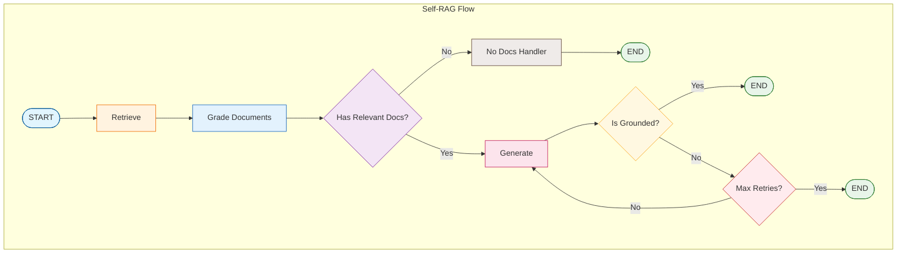

# Tutorial 09: Self-RAG (Self-Reflective RAG)

Self-RAG enhances traditional RAG with self-reflection capabilities - the system grades its own work to ensure quality.

## Overview

**Self-RAG** adds reflection at multiple stages:
1. **Document Grading**: Are retrieved documents relevant?
2. **Hallucination Detection**: Is the answer grounded in facts?
3. **Answer Grading**: Does the answer address the question?
4. **Retry Logic**: Re-generate when checks fail

## Architecture



## Graders

### Document Grader

Filters irrelevant documents before generation:

```python
from langgraph_ollama_local.rag import DocumentGrader

doc_grader = DocumentGrader(llm)

# Grade single document
is_relevant = doc_grader.grade(document, question)

# Grade multiple documents
relevant, irrelevant = doc_grader.grade_documents(documents, question)
```

### Hallucination Grader

Checks if the answer is grounded in the provided documents:

```python
from langgraph_ollama_local.rag import HallucinationGrader

hallucination_grader = HallucinationGrader(llm)

# Check if grounded
is_grounded = hallucination_grader.grade(documents, generation)
```

### Answer Grader

Verifies the answer actually addresses the question:

```python
from langgraph_ollama_local.rag import AnswerGrader

answer_grader = AnswerGrader(llm)

# Check if useful
is_useful = answer_grader.grade(question, generation)
```

## State Definition

```python
class SelfRAGState(TypedDict):
    question: str                      # User's question
    documents: List[Document]          # Retrieved documents
    filtered_documents: List[Document] # After relevance grading
    generation: str                    # Generated answer
    retry_count: int                   # Current retry count
    max_retries: int                   # Maximum allowed retries
```

## Node Functions

### Retrieve
```python
def retrieve(state: SelfRAGState) -> dict:
    docs = retriever.retrieve_documents(state["question"], k=5)
    return {"documents": docs}
```

### Grade Documents
```python
def grade_documents(state: SelfRAGState) -> dict:
    relevant, _ = doc_grader.grade_documents(
        state["documents"],
        state["question"]
    )
    return {"filtered_documents": relevant}
```

### Generate
```python
def generate(state: SelfRAGState) -> dict:
    if not state["filtered_documents"]:
        return {"generation": "No relevant documents found."}

    context = "\n".join([d.page_content for d in state["filtered_documents"]])
    response = llm.invoke(prompt.format(context=context, question=state["question"]))
    return {"generation": response.content}
```

## Conditional Routing

```python
def route_after_generation(state: SelfRAGState) -> str:
    """Route based on hallucination check."""
    is_grounded = hallucination_grader.grade(
        state["filtered_documents"],
        state["generation"]
    )

    if is_grounded:
        return "end"
    elif state["retry_count"] < state["max_retries"]:
        return "retry"
    else:
        return "end"  # Max retries reached
```

## Graph Construction

```python
from langgraph.graph import StateGraph, START, END

graph = StateGraph(SelfRAGState)

# Add nodes
graph.add_node("retrieve", retrieve)
graph.add_node("grade_documents", grade_documents)
graph.add_node("generate", generate)
graph.add_node("retry", lambda s: {"retry_count": s["retry_count"] + 1})

# Add edges
graph.add_edge(START, "retrieve")
graph.add_edge("retrieve", "grade_documents")
graph.add_edge("grade_documents", "generate")

# Conditional routing after generation
graph.add_conditional_edges(
    "generate",
    route_after_generation,
    {"end": END, "retry": "retry"}
)

graph.add_edge("retry", "generate")

self_rag = graph.compile()
```

## Usage

```python
result = self_rag.invoke({
    "question": "What is Self-RAG?",
    "retry_count": 0,
    "max_retries": 3,
})

print(result["generation"])
print(f"Retries needed: {result['retry_count']}")
```

## Benefits Over Basic RAG

| Aspect | Basic RAG | Self-RAG |
|--------|-----------|----------|
| Document quality | Uses all retrieved | Filters irrelevant |
| Answer accuracy | May hallucinate | Verifies grounding |
| Error handling | None | Retry mechanism |
| Transparency | Black box | Grading visible |

## Configuration

```bash
# Environment variables
SELF_RAG_MAX_RETRIES=3
SELF_RAG_GRADING_MODEL=llama3.2:3b
```

## Best Practices

1. **Use smaller models for grading**: Grading is simple yes/no, doesn't need large models
2. **Set reasonable retry limits**: 2-3 retries usually sufficient
3. **Log grading decisions**: Helps debug quality issues
4. **Consider async grading**: Grade documents in parallel

## Next Steps

Continue to [Tutorial 10: CRAG](10-crag.md) to learn:
- Web search as a fallback
- Corrective retrieval strategies
- Multi-source knowledge fusion
