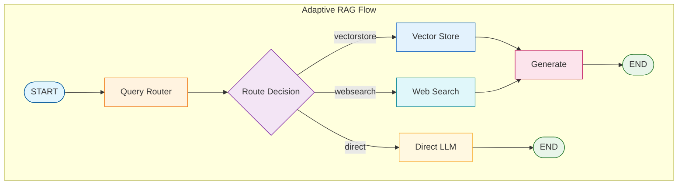

# Tutorial 11: Adaptive RAG

Adaptive RAG intelligently routes queries to the optimal retrieval strategy based on question type.

## Overview

Not all questions need the same approach:
- **Document questions** → Vector store
- **Current events** → Web search
- **Simple factual** → Direct LLM response

Adaptive RAG classifies and routes accordingly.

## Architecture



## Query Router

The QueryRouter classifies questions:

```python
from langgraph_ollama_local.rag.graders import QueryRouter

router = QueryRouter(llm)

# Route examples
router.route("What is Self-RAG?")         # → "vectorstore"
router.route("Latest AI news today?")     # → "websearch"
router.route("What is 2 + 2?")            # → "direct"
```

## State Definition

```python
class AdaptiveRAGState(TypedDict):
    question: str
    query_type: Literal["vectorstore", "websearch", "direct"]
    documents: List[Document]
    generation: str
```

## Routing Logic

```python
def route_query(state: AdaptiveRAGState) -> str:
    """Route based on query classification."""
    return state["query_type"]

# In graph construction
graph.add_conditional_edges(
    "classify",
    route_query,
    {
        "vectorstore": "vectorstore",
        "websearch": "websearch",
        "direct": "direct",
    }
)
```

## Benefits

| Aspect | Fixed RAG | Adaptive RAG |
|--------|-----------|--------------|
| Simple questions | Full retrieval | Direct answer |
| Coverage | Local only | Multi-source |
| Efficiency | Same for all | Optimized per query |

## Next Steps

Continue to [Tutorial 12: Agentic RAG](12-agentic-rag.md)
