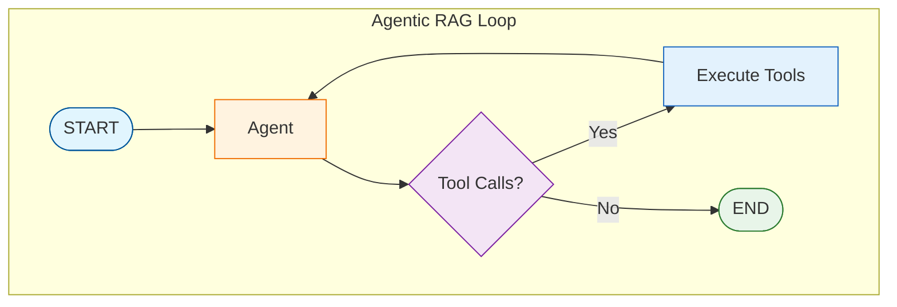

# Tutorial 12: Agentic RAG

Agentic RAG gives an LLM agent control over the retrieval process - deciding when, what, and how to retrieve.

## Overview

Previous patterns use fixed retrieval flows. Agentic RAG:
- Agent decides when to retrieve
- Multiple retrieval rounds possible
- Query decomposition for complex questions
- Iterative refinement

## Architecture



## Retrieval as a Tool

```python
from langchain_core.tools import tool

@tool
def search_documents(query: str) -> str:
    """Search the document database for information.

    Args:
        query: The search query.

    Returns:
        Retrieved document contents.
    """
    docs = retriever.retrieve_documents(query, k=3)
    return "\n\n".join([doc.page_content for doc in docs])

tools = [search_documents]
llm_with_tools = llm.bind_tools(tools)
```

## Agent System Prompt

```python
SYSTEM_PROMPT = """You are a research assistant with document search.

Strategy:
1. Break complex questions into sub-questions
2. Search for each aspect separately
3. Synthesize information from multiple searches
4. Provide comprehensive answers with sources

You can search multiple times if needed."""
```

## ReAct Loop

```python
def should_continue(state: AgenticRAGState) -> str:
    last_message = state["messages"][-1]

    if hasattr(last_message, "tool_calls") and last_message.tool_calls:
        return "tools"
    return "end"

graph.add_conditional_edges(
    "agent",
    should_continue,
    {"tools": "tools", "end": END}
)
graph.add_edge("tools", "agent")  # Loop back
```

## Benefits

| Aspect | Standard RAG | Agentic RAG |
|--------|--------------|-------------|
| Control | Fixed flow | Agent decides |
| Queries | Single | Multiple |
| Complexity | Simple | Complex supported |

## Next Steps

Continue to [Tutorial 13: Perplexity Clone](13-perplexity-clone.md)
