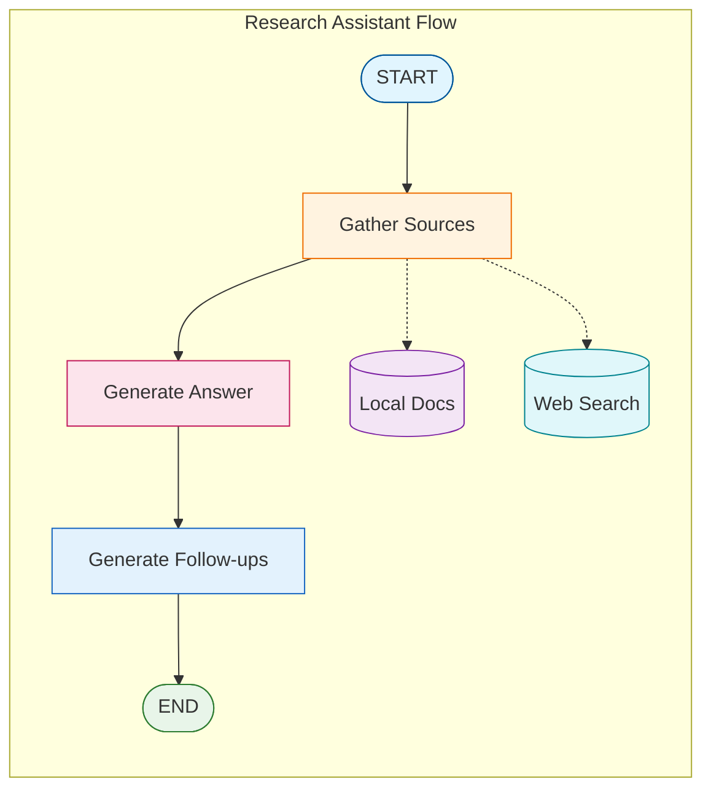

# Tutorial 13: Perplexity-Style Research Assistant

Build a full-featured research assistant with in-text citations, source metadata, and follow-up suggestions.

## Overview

This tutorial combines all RAG patterns into a polished research experience:
- In-text citations `[1]`, `[2]`
- Source cards with metadata
- Multi-source synthesis
- Follow-up question suggestions

## Architecture



## Source Data Model

```python
@dataclass
class Source:
    index: int              # Citation number [1], [2], etc.
    title: str              # Source title
    url: str                # URL or file path
    content: str            # Relevant excerpt
    source_type: str        # "local" or "web"
    page: Optional[int]     # Page number if applicable
    relevance_score: float  # Similarity score
```

## Citation Prompt

```python
RESEARCH_PROMPT = """You are a research assistant.

IMPORTANT: Cite sources using [1], [2], etc. inline.
Every factual claim should have a citation.

Sources:
{sources}

Question: {question}

Answer with inline citations:"""
```

## Web Search Setup

### Tavily API (Recommended)

1. Sign up at https://tavily.com
2. Get your free API key
3. Add to `.env`:
   ```
   TAVILY_API_KEY=tvly-your-key-here
   ```

### Usage in Code

```python
from tavily import TavilyClient
import os

client = TavilyClient(api_key=os.environ["TAVILY_API_KEY"])
results = client.search(query, max_results=3)
```

## Output Formatting

```python
def format_response(result: dict) -> str:
    output = []

    # Answer with citations
    output.append(result["answer"])

    # Sources section
    output.append("─" * 50)
    output.append("📚 Sources:")
    for src in result["sources"]:
        icon = "🌐" if src.source_type == "web" else "📄"
        output.append(f"[{src.index}] {icon} {src.title}")

    # Follow-ups
    output.append("─" * 50)
    output.append("🔍 Related Questions:")
    for q in result["follow_up_questions"]:
        output.append(f"• {q}")

    return "\n".join(output)
```

## Example Output

```
Self-RAG is a framework that enhances LLMs with self-reflection [1].
It grades retrieved documents for relevance and checks answers for
hallucinations [1][2]. CRAG differs by adding web search as a
fallback mechanism [3].

──────────────────────────────────────────────────
📚 Sources:
[1] 📄 self_rag_paper.pdf (page 3) [92%]
[2] 📄 rag_survey.pdf (page 12) [87%]
[3] 🌐 "Corrective RAG Explained" - example.com

──────────────────────────────────────────────────
🔍 Related Questions:
• What are the performance benchmarks for Self-RAG?
• How does CRAG handle web search failures?
• Can Self-RAG and CRAG be combined?
```

## Configuration

```bash
# .env
TAVILY_API_KEY=tvly-your-key-here
RAG_COLLECTION_NAME=documents
EMBEDDING_MODEL_NAME=all-mpnet-base-v2
```

## Congratulations!

You've completed the RAG Patterns tutorial series. You can now build:
- Basic RAG systems
- Self-reflective RAG with quality grading
- Corrective RAG with web fallback
- Adaptive RAG with query routing
- Agentic RAG with agent control
- Full research assistants with citations

All running locally with Ollama!
