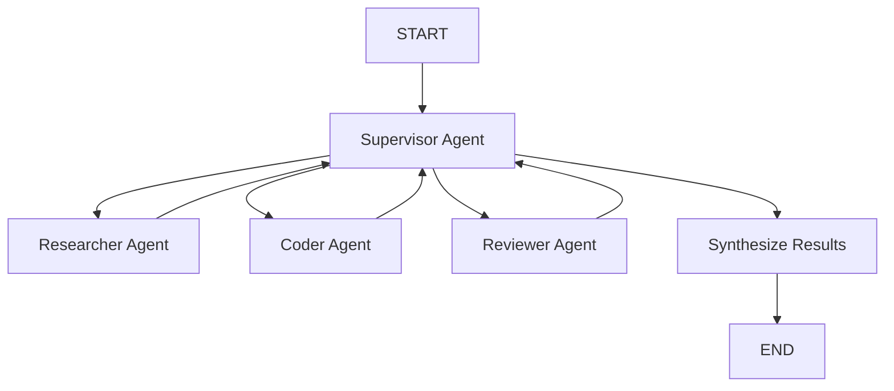
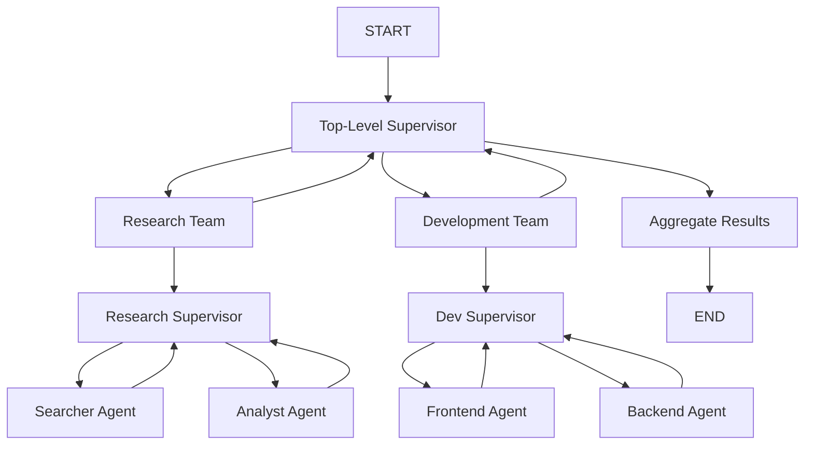

# Multi-Agent API

Complete reference for multi-agent collaboration patterns including supervisor-based coordination and hierarchical team structures.

## create_multi_agent_graph()

Creates a supervisor-based multi-agent collaboration graph. The supervisor coordinates three specialized agents (researcher, coder, reviewer) to complete complex tasks.

### Signature

```python
def create_multi_agent_graph(
    llm: BaseChatModel,
    researcher_tools: list | None = None,
    coder_tools: list | None = None,
    reviewer_tools: list | None = None,
    checkpointer: Any | None = None,
) -> CompiledStateGraph
```

### Parameters

| Parameter | Type | Default | Description |
|-----------|------|---------|-------------|
| `llm` | `BaseChatModel` | Required | Language model for all agents |
| `researcher_tools` | `list \| None` | `None` | Optional tools for the researcher agent |
| `coder_tools` | `list \| None` | `None` | Optional tools for the coder agent |
| `reviewer_tools` | `list \| None` | `None` | Optional tools for the reviewer agent |
| `checkpointer` | `Any \| None` | `None` | Optional checkpointer for state persistence |

### Returns

`CompiledStateGraph` - A compiled graph ready for execution

### Architecture



### Agent Roles

- **Supervisor**: Coordinates the team, decides which agent should work next
- **Researcher**: Gathers information, analyzes requirements, searches for solutions
- **Coder**: Writes code, implements solutions, handles technical tasks
- **Reviewer**: Reviews work quality, checks for issues, provides feedback

### Basic Example

```python
from langgraph_ollama_local import LocalAgentConfig
from langgraph_ollama_local.agents import create_multi_agent_graph

# Setup
config = LocalAgentConfig()
llm = config.create_chat_client()

# Create multi-agent graph
graph = create_multi_agent_graph(llm)

# Run a task
result = graph.invoke({
    "messages": [],
    "task": "Create a Python function to calculate fibonacci numbers",
    "next_agent": "",
    "agent_outputs": [],
    "iteration": 0,
    "max_iterations": 10,
    "final_result": "",
})

print(result["final_result"])
```

### Advanced Example with Tools

```python
from langchain_core.tools import tool

@tool
def search_web(query: str) -> str:
    """Search the web for information."""
    # Implementation here
    return f"Search results for: {query}"

@tool
def execute_python(code: str) -> str:
    """Execute Python code safely."""
    # Implementation here
    return "Code executed successfully"

# Create graph with tools
graph = create_multi_agent_graph(
    llm=llm,
    researcher_tools=[search_web],
    coder_tools=[execute_python],
    checkpointer=config.create_checkpointer(backend="memory")
)

# Run with persistence
result = graph.invoke(
    {
        "messages": [],
        "task": "Research and implement a sorting algorithm",
        "next_agent": "",
        "agent_outputs": [],
        "iteration": 0,
        "max_iterations": 10,
        "final_result": "",
    },
    config={"configurable": {"thread_id": "task-123"}}
)
```

---

## run_multi_agent_task()

Convenience function to run a task through the multi-agent system with simplified input.

### Signature

```python
def run_multi_agent_task(
    graph: CompiledStateGraph,
    task: str,
    max_iterations: int = 10,
    thread_id: str = "default",
) -> dict
```

### Parameters

| Parameter | Type | Default | Description |
|-----------|------|---------|-------------|
| `graph` | `CompiledStateGraph` | Required | Compiled multi-agent graph |
| `task` | `str` | Required | Task description for the team |
| `max_iterations` | `int` | `10` | Maximum supervisor iterations |
| `thread_id` | `str` | `"default"` | Thread ID for checkpointing |

### Returns

Dictionary containing:
- `final_result` (str): Synthesized output from all agents
- `agent_outputs` (list): List of individual agent outputs
- `messages` (list): Full conversation history
- `iteration` (int): Final iteration count

### Example

```python
from langgraph_ollama_local.agents import (
    create_multi_agent_graph,
    run_multi_agent_task
)

graph = create_multi_agent_graph(llm)

result = run_multi_agent_task(
    graph,
    task="Create a Python function to validate email addresses",
    max_iterations=5
)

print(result["final_result"])
print(f"Completed in {result['iteration']} iterations")
```

---

## MultiAgentState

State schema for multi-agent collaboration. This TypedDict defines all fields that flow through the multi-agent graph.

### Fields

```python
class MultiAgentState(TypedDict):
    messages: Annotated[list, add_messages]
    task: str
    next_agent: str
    agent_outputs: Annotated[list[dict], operator.add]
    iteration: int
    max_iterations: int
    final_result: str
```

| Field | Type | Description |
|-------|------|-------------|
| `messages` | `list` | Conversation history (accumulates via add_messages reducer) |
| `task` | `str` | The current task description |
| `next_agent` | `str` | Which agent should run next (set by supervisor) |
| `agent_outputs` | `list[dict]` | Accumulated outputs from all agents |
| `iteration` | `int` | Current iteration count |
| `max_iterations` | `int` | Maximum allowed iterations |
| `final_result` | `str` | The synthesized final result |

### Example

```python
from langgraph_ollama_local.agents import MultiAgentState
from langchain_core.messages import HumanMessage

initial_state: MultiAgentState = {
    "messages": [HumanMessage(content="Task: Build a calculator")],
    "task": "Build a calculator app",
    "next_agent": "",
    "agent_outputs": [],
    "iteration": 0,
    "max_iterations": 10,
    "final_result": "",
}

result = graph.invoke(initial_state)
```

---

## Hierarchical Teams

Create nested agent teams where team supervisors coordinate sub-teams of specialized agents.

### create_team_graph()

Create a team subgraph with supervisor and members.

#### Signature

```python
def create_team_graph(
    llm: BaseChatModel,
    team_name: str,
    members: list[tuple[str, str, list | None]],
    max_iterations: int = 5,
) -> CompiledStateGraph
```

#### Parameters

| Parameter | Type | Default | Description |
|-----------|------|---------|-------------|
| `llm` | `BaseChatModel` | Required | Language model for all team agents |
| `team_name` | `str` | Required | Name of the team |
| `members` | `list[tuple]` | Required | List of (name, prompt, tools) tuples |
| `max_iterations` | `int` | `5` | Maximum iterations for the team |

#### Returns

`CompiledStateGraph` - A compiled team graph

#### Example

```python
from langgraph_ollama_local.agents.hierarchical import create_team_graph

# Create a research team
research_team = create_team_graph(
    llm,
    "research",
    members=[
        ("searcher", "Search the web for information.", [search_tool]),
        ("analyst", "Analyze and summarize findings.", None),
    ]
)

# Create a development team
dev_team = create_team_graph(
    llm,
    "development",
    members=[
        ("frontend", "Build user interfaces.", [ui_tool]),
        ("backend", "Implement backend logic.", [db_tool]),
    ]
)
```

---

### create_hierarchical_graph()

Create a hierarchical graph with multiple teams coordinated by a top-level supervisor.

#### Signature

```python
def create_hierarchical_graph(
    llm: BaseChatModel,
    teams: dict[str, CompiledStateGraph],
    max_iterations: int = 10,
    checkpointer: Any | None = None,
) -> CompiledStateGraph
```

#### Parameters

| Parameter | Type | Default | Description |
|-----------|------|---------|-------------|
| `llm` | `BaseChatModel` | Required | Language model for the top supervisor |
| `teams` | `dict[str, CompiledStateGraph]` | Required | Dict mapping team names to compiled graphs |
| `max_iterations` | `int` | `10` | Maximum top-level iterations |
| `checkpointer` | `Any \| None` | `None` | Optional checkpointer for persistence |

#### Returns

`CompiledStateGraph` - A compiled hierarchical graph

#### Architecture



#### Complete Example

```python
from langgraph_ollama_local import LocalAgentConfig
from langgraph_ollama_local.agents.hierarchical import (
    create_team_graph,
    create_hierarchical_graph,
    run_hierarchical_task
)

config = LocalAgentConfig()
llm = config.create_chat_client()

# Create research team
research_team = create_team_graph(
    llm,
    "research",
    members=[
        ("searcher", "Search for information online", [search_tool]),
        ("analyst", "Analyze research findings", None),
    ]
)

# Create development team
dev_team = create_team_graph(
    llm,
    "development",
    members=[
        ("frontend_dev", "Build user interfaces", None),
        ("backend_dev", "Implement backend systems", None),
    ]
)

# Create hierarchical structure
graph = create_hierarchical_graph(
    llm,
    teams={
        "research": research_team,
        "development": dev_team
    }
)

# Run hierarchical task
result = run_hierarchical_task(
    graph,
    task="Build a web application for task management",
    max_iterations=10
)

print(result["final_result"])
```

---

## TeamState

State schema for a single team within a hierarchical structure.

### Fields

```python
class TeamState(TypedDict):
    messages: Annotated[list, add_messages]
    task: str
    team_name: str
    next_member: str
    member_outputs: Annotated[list[dict], operator.add]
    iteration: int
    max_iterations: int
    team_result: str
```

| Field | Type | Description |
|-------|------|-------------|
| `messages` | `list` | Team conversation history |
| `task` | `str` | Task assigned to the team |
| `team_name` | `str` | Name of this team |
| `next_member` | `str` | Which team member should work next |
| `member_outputs` | `list[dict]` | Accumulated outputs from team members |
| `iteration` | `int` | Current iteration within the team |
| `max_iterations` | `int` | Maximum iterations for this team |
| `team_result` | `str` | Final synthesized result from the team |

---

## HierarchicalState

State schema for hierarchical agent teams with multiple sub-teams.

### Fields

```python
class HierarchicalState(TypedDict):
    messages: Annotated[list, add_messages]
    task: str
    active_team: str
    team_results: dict[str, str]
    iteration: int
    max_iterations: int
    final_result: str
```

| Field | Type | Description |
|-------|------|-------------|
| `messages` | `list` | Top-level conversation history |
| `task` | `str` | Overall task description |
| `active_team` | `str` | Which team is currently working |
| `team_results` | `dict[str, str]` | Results from each team (team_name -> result) |
| `iteration` | `int` | Top-level iteration count |
| `max_iterations` | `int` | Maximum top-level iterations |
| `final_result` | `str` | Final synthesized result from all teams |

---

## run_hierarchical_task()

Convenience function to run a task through the hierarchical agent system.

### Signature

```python
def run_hierarchical_task(
    graph: CompiledStateGraph,
    task: str,
    max_iterations: int = 10,
    thread_id: str = "default",
) -> dict
```

### Parameters

| Parameter | Type | Default | Description |
|-----------|------|---------|-------------|
| `graph` | `CompiledStateGraph` | Required | Compiled hierarchical graph |
| `task` | `str` | Required | Task description |
| `max_iterations` | `int` | `10` | Maximum top-level iterations |
| `thread_id` | `str` | `"default"` | Thread ID for checkpointing |

### Returns

Dictionary with:
- `final_result` (str): Complete output from all teams
- `team_results` (dict): Individual team results
- `messages` (list): Full conversation
- `iteration` (int): Total iterations

### Example

```python
result = run_hierarchical_task(
    graph,
    task="Design and implement a microservices architecture",
    max_iterations=15
)

# Access team-specific results
print("Research team output:", result["team_results"]["research"])
print("Dev team output:", result["team_results"]["development"])

# Access final aggregated result
print("Final result:", result["final_result"])
```

---

## Node Creation Functions

Advanced users can create custom agent nodes for specialized use cases.

### create_supervisor_node()

Create a supervisor node that routes work to specialized agents.

```python
def create_supervisor_node(llm: BaseChatModel) -> callable
```

### create_agent_node()

Create an agent node for a specialized role.

```python
def create_agent_node(
    llm: BaseChatModel,
    agent_name: str,
    tools: list | None = None,
) -> callable
```

### create_team_supervisor_node()

Create a team supervisor node for hierarchical teams.

```python
def create_team_supervisor_node(
    llm: BaseChatModel,
    team_name: str,
    member_names: list[str],
) -> callable
```

### create_team_member_node()

Create a team member node within a hierarchical structure.

```python
def create_team_member_node(
    llm: BaseChatModel,
    member_name: str,
    member_prompt: str,
    tools: list | None = None,
) -> callable
```

### Example: Custom Agent

```python
from langgraph_ollama_local.agents.multi_agent import create_agent_node

# Create a custom data analyst agent
analyst_node = create_agent_node(
    llm,
    agent_name="data_analyst",
    tools=[pandas_tool, viz_tool]
)

# Use in a custom graph
workflow.add_node("analyst", analyst_node)
```

---

## Best Practices

### Iteration Limits

Set appropriate `max_iterations` based on task complexity:

```python
# Simple tasks
graph = create_multi_agent_graph(llm)
result = run_multi_agent_task(graph, task, max_iterations=5)

# Complex tasks
result = run_multi_agent_task(graph, task, max_iterations=15)

# Hierarchical tasks (allow more iterations)
result = run_hierarchical_task(graph, task, max_iterations=20)
```

### Tool Assignment

Assign tools based on agent specialization:

```python
graph = create_multi_agent_graph(
    llm=llm,
    researcher_tools=[search_tool, wikipedia_tool],  # Information gathering
    coder_tools=[python_repl, code_analyzer],  # Code execution
    reviewer_tools=[linter, test_runner],  # Quality checks
)
```

### State Persistence

Use checkpointers for long-running tasks:

```python
checkpointer = config.create_checkpointer(backend="sqlite")

graph = create_multi_agent_graph(llm, checkpointer=checkpointer)

# Each thread maintains separate state
result1 = run_multi_agent_task(graph, task1, thread_id="project-a")
result2 = run_multi_agent_task(graph, task2, thread_id="project-b")
```

---

## Related

- [Tutorial: Multi-Agent Collaboration](/tutorials/multi-agent/14-multi-agent-collaboration)
- [Tutorial: Hierarchical Teams](/tutorials/multi-agent/15-hierarchical-teams)
- [Patterns API](/api/patterns) - Swarm and handoff patterns
- [Types API](/api/types) - State type reference
