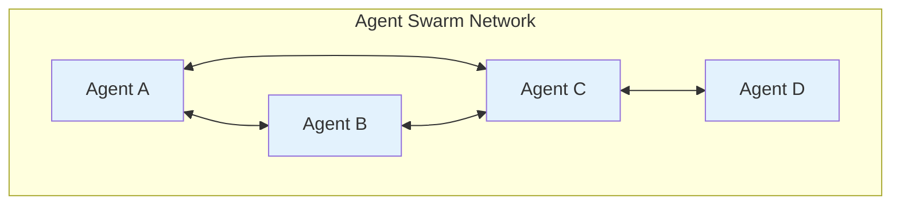
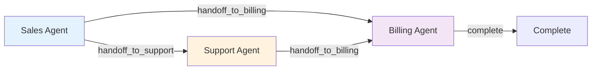
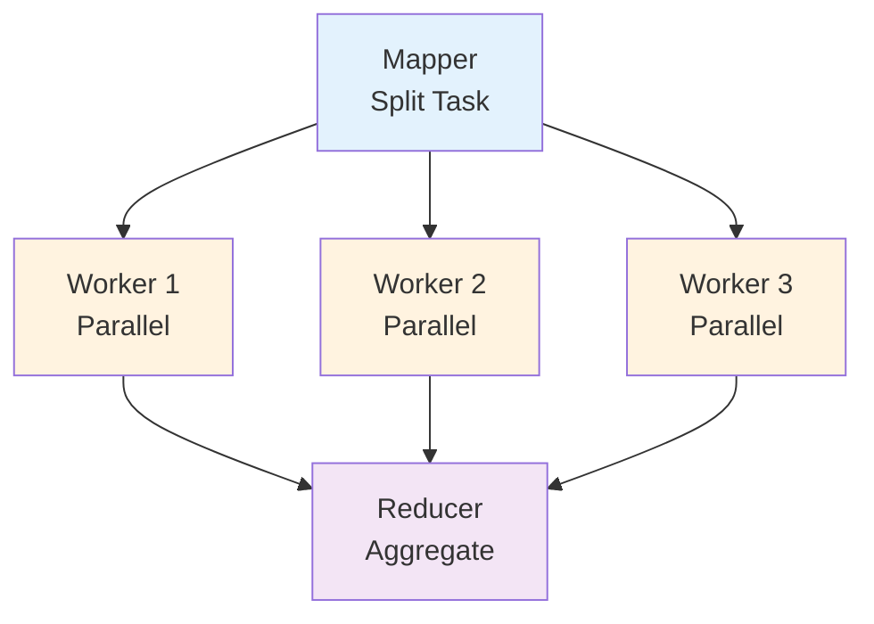
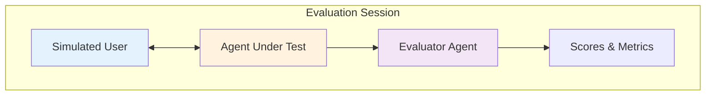

# Patterns API

Complete reference for advanced multi-agent patterns beyond basic collaboration.

## Swarm Pattern

Decentralized agent network where agents communicate peer-to-peer without a central supervisor. Agents broadcast messages, share context, and collaborate dynamically.

### Architecture



**Key Concepts:**
- No central supervisor - agents decide independently
- Network topology defines communication paths
- Shared context across all agents
- Dynamic routing based on agent responses

### SwarmAgent

Configuration for a swarm agent defining its role and connections.

#### Fields

```python
class SwarmAgent(BaseModel):
    name: str  # Unique identifier for the agent
    system_prompt: str  # System prompt defining agent's role
    connections: list[str]  # List of agent names this agent can hand off to
    tools: list | None  # Optional tools for this agent
```

#### Example

```python
from langgraph_ollama_local.patterns.swarm import SwarmAgent

agents = [
    SwarmAgent(
        name="researcher",
        system_prompt="Research and gather information on topics",
        connections=["analyst", "writer"],
        tools=[search_tool]
    ),
    SwarmAgent(
        name="analyst",
        system_prompt="Analyze findings and extract insights",
        connections=["writer"],
        tools=None
    ),
    SwarmAgent(
        name="writer",
        system_prompt="Write comprehensive reports",
        connections=[],  # Terminal node
        tools=[formatter_tool]
    ),
]
```

---

### create_swarm_graph()

Create an agent swarm/network graph with peer-to-peer communication.

#### Signature

```python
def create_swarm_graph(
    llm: BaseChatModel,
    agents: list[SwarmAgent],
    entry_agent: str | None = None,
    checkpointer: Any | None = None,
) -> CompiledStateGraph
```

#### Parameters

| Parameter | Type | Default | Description |
|-----------|------|---------|-------------|
| `llm` | `BaseChatModel` | Required | Language model for all agents |
| `agents` | `list[SwarmAgent]` | Required | List of SwarmAgent configurations |
| `entry_agent` | `str \| None` | `None` | Name of first agent to run (defaults to first in list) |
| `checkpointer` | `Any \| None` | `None` | Optional checkpointer for persistence |

#### Returns

`CompiledStateGraph` - Compiled swarm graph

#### Example

```python
from langgraph_ollama_local import LocalAgentConfig
from langgraph_ollama_local.patterns.swarm import (
    SwarmAgent,
    create_swarm_graph,
    run_swarm_task
)

config = LocalAgentConfig()
llm = config.create_chat_client()

# Define swarm agents
agents = [
    SwarmAgent(
        name="researcher",
        system_prompt="Research topics thoroughly",
        connections=["analyst"],
    ),
    SwarmAgent(
        name="analyst",
        system_prompt="Analyze and synthesize information",
        connections=["writer"],
    ),
    SwarmAgent(
        name="writer",
        system_prompt="Write clear, concise reports",
        connections=[],
    ),
]

# Create swarm graph
graph = create_swarm_graph(llm, agents)

# Run task
result = run_swarm_task(graph, "Research quantum computing trends")
print(result["final_result"])
```

---

### SwarmState

State schema for agent swarm/network with shared context.

#### Fields

```python
class SwarmState(TypedDict):
    messages: Annotated[list, add_messages]
    task: str
    agents_state: dict[str, dict[str, Any]]
    shared_context: Annotated[list[dict], operator.add]
    current_agent: str
    iteration: int
    max_iterations: int
    final_result: str
```

| Field | Type | Description |
|-------|------|-------------|
| `messages` | `list` | Conversation history |
| `task` | `str` | The overall task for the swarm |
| `agents_state` | `dict` | Per-agent state (agent_name -> agent_data) |
| `shared_context` | `list[dict]` | Accumulated findings from all agents |
| `current_agent` | `str` | Name of currently active agent |
| `iteration` | `int` | Current iteration count |
| `max_iterations` | `int` | Maximum iterations before completion |
| `final_result` | `str` | Synthesized final result |

---

### run_swarm_task()

Convenience function to run a task through the agent swarm.

#### Signature

```python
def run_swarm_task(
    graph: CompiledStateGraph,
    task: str,
    max_iterations: int = 10,
    thread_id: str = "default",
) -> dict
```

#### Parameters

| Parameter | Type | Default | Description |
|-----------|------|---------|-------------|
| `graph` | `CompiledStateGraph` | Required | Compiled swarm graph |
| `task` | `str` | Required | Task description for the swarm |
| `max_iterations` | `int` | `10` | Maximum iterations |
| `thread_id` | `str` | `"default"` | Thread ID for checkpointing |

#### Returns

Dictionary with:
- `final_result` (str): Aggregated output from all agents
- `shared_context` (list): All agent outputs
- `agents_state` (dict): Per-agent state information

#### Example

```python
result = run_swarm_task(
    graph,
    task="Research and write a report on AI safety",
    max_iterations=8
)

print(result["final_result"])

# Check which agents contributed
for ctx in result["shared_context"]:
    print(f"{ctx['agent']}: {ctx['content'][:100]}...")
```

---

## Handoff Pattern

Agents explicitly transfer control to other agents, enabling peer-to-peer collaboration without a central supervisor. Uses tools to signal handoff intentions.

### Architecture



**Key Concepts:**
- Explicit handoffs via tool calls
- Peer-to-peer communication
- Context preservation across handoffs
- Each agent decides when to transfer control

---

### create_handoff_tool()

Create a tool that allows an agent to hand off to another agent.

#### Signature

```python
def create_handoff_tool(
    target_agent: str,
    description: str | None = None,
) -> BaseTool
```

#### Parameters

| Parameter | Type | Default | Description |
|-----------|------|---------|-------------|
| `target_agent` | `str` | Required | Name of the agent to hand off to |
| `description` | `str \| None` | `None` | Description of when to use this handoff |

#### Returns

`BaseTool` - Tool that signals a handoff to the target agent

#### Example

```python
from langgraph_ollama_local.patterns.handoffs import create_handoff_tool

# Create handoff tools
handoff_to_support = create_handoff_tool(
    target_agent="support",
    description="Transfer to support agent for technical issues or bugs"
)

handoff_to_billing = create_handoff_tool(
    target_agent="billing",
    description="Transfer to billing agent for payment or pricing questions"
)

handoff_to_sales = create_handoff_tool(
    target_agent="sales",
    description="Transfer to sales agent for product information"
)
```

---

### create_handoff_graph()

Create a graph where agents can hand off control to each other.

#### Signature

```python
def create_handoff_graph(
    llm: BaseChatModel,
    agents: dict[str, tuple[str, list[BaseTool]]],
    entry_agent: str | None = None,
    max_iterations: int = 10,
    checkpointer: Any | None = None,
) -> CompiledStateGraph
```

#### Parameters

| Parameter | Type | Default | Description |
|-----------|------|---------|-------------|
| `llm` | `BaseChatModel` | Required | Language model for all agents |
| `agents` | `dict[str, tuple]` | Required | Dict mapping agent names to (role_description, handoff_tools) |
| `entry_agent` | `str \| None` | `None` | Which agent handles requests first |
| `max_iterations` | `int` | `10` | Maximum handoffs before completion |
| `checkpointer` | `Any \| None` | `None` | Optional checkpointer |

#### Returns

`CompiledStateGraph` - Compiled handoff graph

#### Complete Example

```python
from langgraph_ollama_local import LocalAgentConfig
from langgraph_ollama_local.patterns.handoffs import (
    create_handoff_tool,
    create_handoff_graph,
    run_handoff_conversation
)

config = LocalAgentConfig()
llm = config.create_chat_client()

# Define handoff tools
handoff_to_support = create_handoff_tool(
    "support",
    "Transfer for technical issues"
)
handoff_to_billing = create_handoff_tool(
    "billing",
    "Transfer for payment issues"
)
handoff_to_sales = create_handoff_tool(
    "sales",
    "Transfer for product questions"
)

# Create handoff graph
graph = create_handoff_graph(
    llm,
    agents={
        "sales": (
            "Handle sales and product questions",
            [handoff_to_support, handoff_to_billing]
        ),
        "support": (
            "Handle technical issues and troubleshooting",
            [handoff_to_billing]
        ),
        "billing": (
            "Handle payments, invoices, and billing questions",
            []  # No handoffs - terminal agent
        ),
    },
    entry_agent="sales",
)

# Run conversation
result = run_handoff_conversation(
    graph,
    task="I'm having trouble with my invoice",
    entry_agent="sales",
    max_iterations=5
)

print(result["final_result"])
print("Handoff chain:", " -> ".join(result["handoff_history"]))
```

---

### HandoffState

State schema for agent handoff pattern.

#### Fields

```python
class HandoffState(TypedDict):
    messages: Annotated[list, add_messages]
    task: str
    current_agent: str
    handoff_target: str
    context: Annotated[list[dict], operator.add]
    handoff_history: Annotated[list[str], operator.add]
    iteration: int
    max_iterations: int
    final_result: str
```

| Field | Type | Description |
|-------|------|-------------|
| `messages` | `list` | Conversation history |
| `task` | `str` | The original task or query |
| `current_agent` | `str` | Currently active agent name |
| `handoff_target` | `str` | Agent to hand off to (empty if no handoff) |
| `context` | `list[dict]` | Shared context across handoffs |
| `handoff_history` | `list[str]` | List of handoff events |
| `iteration` | `int` | Number of handoffs that have occurred |
| `max_iterations` | `int` | Maximum allowed handoffs |
| `final_result` | `str` | The final response |

---

### run_handoff_conversation()

Run a conversation through the handoff system.

#### Signature

```python
def run_handoff_conversation(
    graph: CompiledStateGraph,
    task: str,
    entry_agent: str,
    max_iterations: int = 10,
    thread_id: str = "default",
) -> dict
```

#### Parameters

| Parameter | Type | Default | Description |
|-----------|------|---------|-------------|
| `graph` | `CompiledStateGraph` | Required | Compiled handoff graph |
| `task` | `str` | Required | User's request or query |
| `entry_agent` | `str` | Required | Which agent to start with |
| `max_iterations` | `int` | `10` | Maximum handoffs allowed |
| `thread_id` | `str` | `"default"` | Thread ID for checkpointing |

#### Returns

Dictionary with:
- `final_result` (str): Complete conversation with all agent contributions
- `handoff_history` (list): List of handoffs that occurred
- `context` (list): All agent work items
- `iteration` (int): Total number of handoffs

---

## Map-Reduce Pattern

Parallel agent execution with aggregation. Splits tasks into subtasks, processes them in parallel with worker agents, and aggregates results.

### Architecture



**Key Concepts:**
- Fan-out: Distribute work to multiple parallel workers
- Parallel execution: Workers process independently
- Fan-in: Collect and aggregate results
- Scalability: Add more workers for larger workloads

---

### create_map_reduce_graph()

Create a map-reduce graph for parallel agent execution.

#### Signature

```python
def create_map_reduce_graph(
    llm: BaseChatModel,
    num_workers: int = 3,
    worker_prompt: str = "",
    checkpointer: Any | None = None,
) -> CompiledStateGraph
```

#### Parameters

| Parameter | Type | Default | Description |
|-----------|------|---------|-------------|
| `llm` | `BaseChatModel` | Required | Language model for all agents |
| `num_workers` | `int` | `3` | Number of parallel workers |
| `worker_prompt` | `str` | `""` | Custom instructions for workers |
| `checkpointer` | `Any \| None` | `None` | Optional checkpointer |

#### Returns

`CompiledStateGraph` - Compiled map-reduce graph

#### Example

```python
from langgraph_ollama_local import LocalAgentConfig
from langgraph_ollama_local.patterns.map_reduce import (
    create_map_reduce_graph,
    run_map_reduce_task
)

config = LocalAgentConfig()
llm = config.create_chat_client()

# Create map-reduce graph with 5 workers
graph = create_map_reduce_graph(
    llm,
    num_workers=5,
    worker_prompt="Analyze your assigned section thoroughly and extract key insights."
)

# Run task
result = run_map_reduce_task(
    graph,
    task="Analyze the main themes and arguments in this research paper"
)

print(result["final_result"])
print(f"Processed {len(result['worker_results'])} subtasks in parallel")
```

---

### MapReduceState

State schema for map-reduce pattern.

#### Fields

```python
class MapReduceState(TypedDict):
    task: str
    subtasks: list[str]
    worker_results: Annotated[list[dict], operator.add]
    final_result: str
```

| Field | Type | Description |
|-------|------|-------------|
| `task` | `str` | The main task to be processed |
| `subtasks` | `list[str]` | List of subtasks created by mapper |
| `worker_results` | `list[dict]` | Accumulated results from all workers |
| `final_result` | `str` | Aggregated final result from reducer |

---

### run_map_reduce_task()

Run a task through the map-reduce system.

#### Signature

```python
def run_map_reduce_task(
    graph: CompiledStateGraph,
    task: str,
    thread_id: str = "default",
) -> dict
```

#### Parameters

| Parameter | Type | Default | Description |
|-----------|------|---------|-------------|
| `graph` | `CompiledStateGraph` | Required | Compiled map-reduce graph |
| `task` | `str` | Required | Task description to process |
| `thread_id` | `str` | `"default"` | Thread ID for checkpointing |

#### Returns

Dictionary with:
- `final_result` (str): Aggregated output from reducer
- `worker_results` (list): Individual worker outputs
- `subtasks` (list): Subtasks created by mapper

---

### create_custom_map_reduce_graph()

Create a map-reduce graph with different LLMs for each role (advanced).

#### Signature

```python
def create_custom_map_reduce_graph(
    mapper_llm: BaseChatModel,
    worker_llm: BaseChatModel,
    reducer_llm: BaseChatModel,
    num_workers: int = 3,
    worker_prompts: list[str] | None = None,
    checkpointer: Any | None = None,
) -> CompiledStateGraph
```

#### Parameters

| Parameter | Type | Default | Description |
|-----------|------|---------|-------------|
| `mapper_llm` | `BaseChatModel` | Required | Language model for the mapper |
| `worker_llm` | `BaseChatModel` | Required | Language model for workers |
| `reducer_llm` | `BaseChatModel` | Required | Language model for the reducer |
| `num_workers` | `int` | `3` | Number of parallel workers |
| `worker_prompts` | `list[str] \| None` | `None` | Custom prompts per worker |
| `checkpointer` | `Any \| None` | `None` | Optional checkpointer |

#### Returns

`CompiledStateGraph` - Compiled map-reduce graph

#### Example

```python
from langchain_ollama import ChatOllama

# Use larger model for mapper and reducer, smaller for workers
mapper_llm = ChatOllama(model="llama3.1:70b", base_url="http://localhost:11434")
worker_llm = ChatOllama(model="llama3.1:8b", base_url="http://localhost:11434")
reducer_llm = ChatOllama(model="llama3.1:70b", base_url="http://localhost:11434")

# Custom prompts for specialized workers
worker_prompts = [
    "Focus on technical details and implementation",
    "Focus on user experience and usability",
    "Focus on performance and scalability",
]

graph = create_custom_map_reduce_graph(
    mapper_llm,
    worker_llm,
    reducer_llm,
    num_workers=3,
    worker_prompts=worker_prompts
)
```

---

## Evaluation Pattern

Automated agent evaluation through simulated user interactions and scoring.

### Architecture



**Key Concepts:**
- Simulated users mimic real users with personas
- Evaluator agents score conversations on metrics
- Automated testing via simulation
- Metrics aggregation for multiple sessions

---

### SimulatedUser

Configuration for a simulated user agent.

#### Fields

```python
class SimulatedUser(BaseModel):
    persona: str  # User's background and situation
    goals: list[str]  # What the user wants to accomplish
    behavior: Literal["friendly", "impatient", "confused", "technical", "casual"]
    initial_message: str | None  # First message (auto-generated if None)
```

#### Example

```python
from langgraph_ollama_local.patterns.evaluation import SimulatedUser

user_config = SimulatedUser(
    persona="Frustrated customer who received a defective product",
    goals=[
        "Get a refund or replacement",
        "Express dissatisfaction with quality",
        "Understand what went wrong"
    ],
    behavior="impatient",
    initial_message="I received my order but it's completely broken!"
)
```

---

### create_evaluation_graph()

Create an evaluation graph with agent, simulated user, and evaluator.

#### Signature

```python
def create_evaluation_graph(
    llm: BaseChatModel,
    agent_node: Any,
    user_config: SimulatedUser,
    evaluate_every_n_turns: int = 2,
    checkpointer: Any | None = None,
) -> CompiledStateGraph
```

#### Parameters

| Parameter | Type | Default | Description |
|-----------|------|---------|-------------|
| `llm` | `BaseChatModel` | Required | Language model for simulated user and evaluator |
| `agent_node` | `Any` | Required | The agent node being evaluated |
| `user_config` | `SimulatedUser` | Required | Configuration for simulated user |
| `evaluate_every_n_turns` | `int` | `2` | How often to run evaluator |
| `checkpointer` | `Any \| None` | `None` | Optional checkpointer |

#### Returns

`CompiledStateGraph` - Compiled evaluation graph

#### Example

```python
from langgraph_ollama_local import LocalAgentConfig
from langgraph_ollama_local.patterns.evaluation import (
    SimulatedUser,
    create_evaluation_graph,
    run_evaluation_session,
    run_multiple_evaluations
)

config = LocalAgentConfig()
llm = config.create_chat_client()

# Define agent to test
def my_customer_service_agent(state):
    # Your agent implementation
    messages = state["messages"]
    response = llm.invoke(messages)
    return {"messages": [response]}

# Configure simulated user
user_config = SimulatedUser(
    persona="Customer with billing question",
    goals=["Understand charges on invoice", "Get explanation"],
    behavior="friendly"
)

# Create evaluation graph
graph = create_evaluation_graph(
    llm,
    my_customer_service_agent,
    user_config
)

# Run single evaluation
result = run_evaluation_session(graph, max_turns=10)
print(result["final_metrics"])

# Run multiple evaluations for statistical significance
results = run_multiple_evaluations(graph, num_sessions=5)
print(results["aggregate_metrics"])
```

---

### EvaluationCriteria

Criteria for evaluating conversations with scores (1-5).

#### Fields

```python
class EvaluationCriteria(BaseModel):
    helpfulness: int  # 1-5: How helpful were responses?
    accuracy: int  # 1-5: How accurate was the information?
    empathy: int  # 1-5: How empathetic was the agent?
    efficiency: int  # 1-5: How concise and direct?
    goal_completion: int  # 0-1: Were goals achieved?
    reasoning: str  # Explanation of scores
```

---

### run_evaluation_session()

Run a complete evaluation session.

#### Signature

```python
def run_evaluation_session(
    graph: CompiledStateGraph,
    max_turns: int = 10,
    thread_id: str = "default",
) -> dict
```

#### Parameters

| Parameter | Type | Default | Description |
|-----------|------|---------|-------------|
| `graph` | `CompiledStateGraph` | Required | Compiled evaluation graph |
| `max_turns` | `int` | `10` | Maximum conversation turns |
| `thread_id` | `str` | `"default"` | Thread ID for checkpointing |

#### Returns

Dictionary with:
- `messages` (list): Full conversation
- `evaluator_scores` (list): All scores from evaluator
- `final_metrics` (dict): Aggregated metrics
- `turn_count` (int): Total turns taken

---

### run_multiple_evaluations()

Run multiple evaluation sessions and aggregate results.

#### Signature

```python
def run_multiple_evaluations(
    graph: CompiledStateGraph,
    num_sessions: int = 3,
    max_turns: int = 10,
) -> dict
```

#### Parameters

| Parameter | Type | Default | Description |
|-----------|------|---------|-------------|
| `graph` | `CompiledStateGraph` | Required | Compiled evaluation graph |
| `num_sessions` | `int` | `3` | Number of sessions to run |
| `max_turns` | `int` | `10` | Maximum turns per session |

#### Returns

Dictionary with:
- `sessions` (list): Individual session results
- `aggregate_metrics` (dict): Overall metrics across all sessions

#### Example

```python
# Run 10 evaluation sessions
results = run_multiple_evaluations(
    graph,
    num_sessions=10,
    max_turns=8
)

# Access aggregate metrics
metrics = results["aggregate_metrics"]
print(f"Average Helpfulness: {metrics['helpfulness_avg']:.2f}/5")
print(f"Average Accuracy: {metrics['accuracy_avg']:.2f}/5")
print(f"Average Empathy: {metrics['empathy_avg']:.2f}/5")
print(f"Goal Completion Rate: {metrics['goal_completion_rate']:.2%}")

# Access individual sessions
for i, session in enumerate(results["sessions"], 1):
    print(f"\nSession {i}:")
    print(f"  Turns: {session['turn_count']}")
    print(f"  Metrics: {session['final_metrics']}")
```

---

## Related

- [Tutorial: Multi-Agent Collaboration](/tutorials/multi-agent/14-multi-agent-collaboration)
- [Tutorial: Agent Handoffs](/tutorials/multi-agent/17-agent-handoffs)
- [Tutorial: Agent Swarm](/tutorials/multi-agent/18-agent-swarm)
- [Tutorial: Map-Reduce](/tutorials/multi-agent/19-map-reduce-agents)
- [Tutorial: Evaluation](/tutorials/multi-agent/20-multi-agent-evaluation)
- [Agents API](/api/agents) - Multi-agent and hierarchical patterns
- [Types API](/api/types) - State type reference
