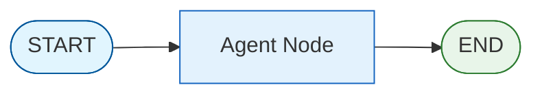
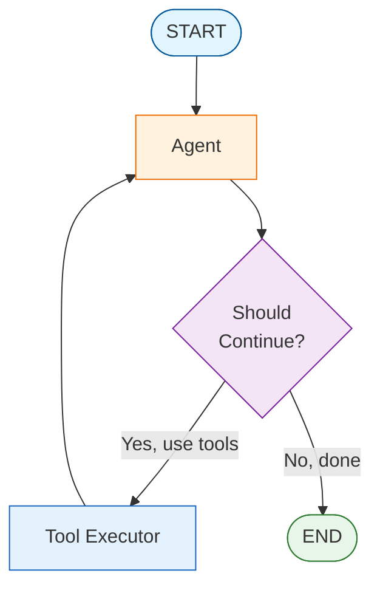
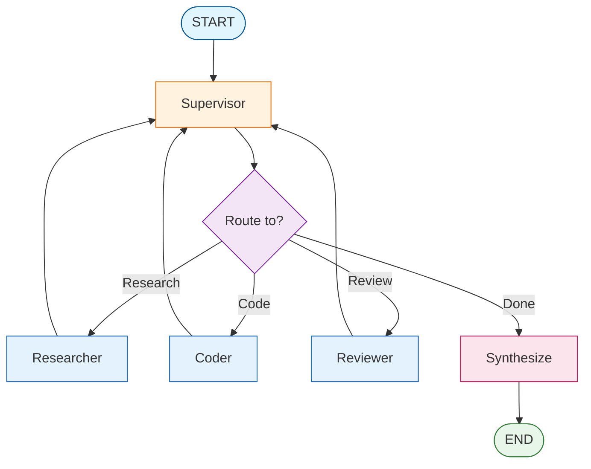
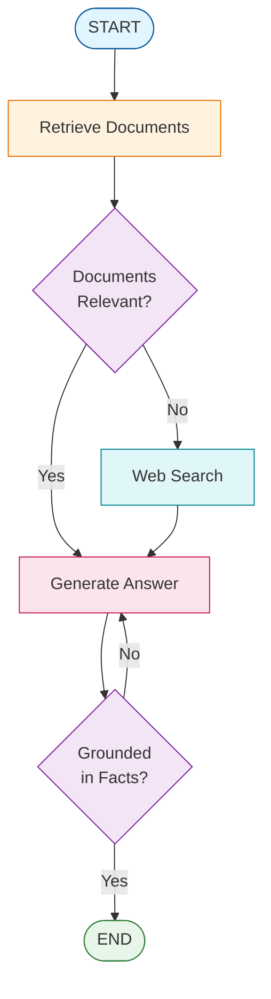
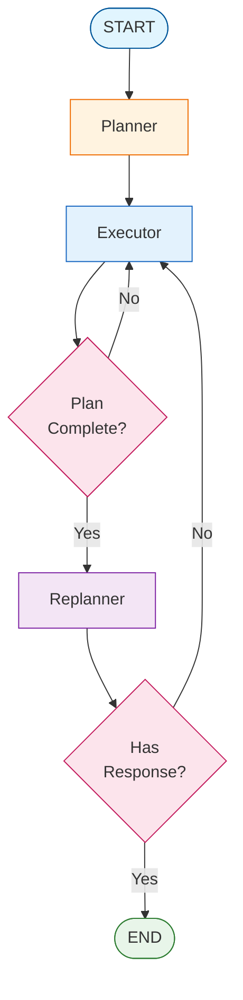

# Graph Visualizer

Visualize and understand LangGraph state machine flows.

## How Graphs Work

LangGraph uses a **state machine** architecture where:

1. **Nodes** are functions that process and update state
2. **Edges** define the flow between nodes
3. **Conditional edges** enable dynamic routing based on state

## Example Architectures

### Simple Chatbot

### ReAct Agent with Tools

### Multi-Agent Supervisor

### RAG Pipeline

### Plan-and-Execute

## Color Legend

| Color | Meaning |
|-------|---------|
|  Light Blue | START node |
|  Green | END node |
|  Orange | Supervisor/Planner |
|  Blue | Worker/Agent nodes |
|  Purple | Decision/Routing |
|  Pink | Output/Generate |

## Building Your Own

Learn to build these patterns step-by-step in our [tutorials](/tutorials/).
