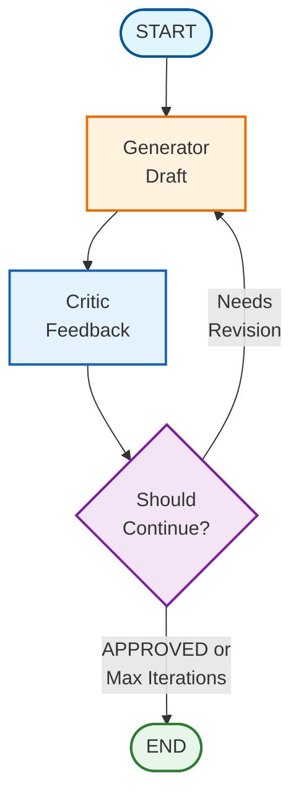

# Tutorial 22: Reflection Pattern

## Overview

The **Reflection Pattern** is an iterative improvement technique where an LLM generates output, critiques it, and revises it repeatedly until the output meets quality standards. This pattern mirrors how humans improve their work through drafts and revisions.

## Architecture



## Core Components

### 1. State Schema

```python
class ReflectionState(TypedDict):
    """State for reflection pattern."""
    messages: Annotated[list, add_messages]  # Conversation history
    task: str                                 # Original task
    draft: str                                # Current draft
    critique: str                             # Latest critique
    iteration: int                            # Current iteration
    max_iterations: int                       # Safety limit
```

**Key fields:**
- `task`: The original request (immutable)
- `draft`: Current version being refined
- `critique`: Feedback from the critic
- `iteration`: Tracks refinement cycles
- `max_iterations`: Prevents infinite loops

### 2. Generator Node

The generator creates initial drafts and revisions:

```python
def create_generator_node(llm: BaseChatModel):
    """Create generator that creates or revises drafts."""
    def generator(state: ReflectionState) -> dict:
        iteration = state.get("iteration", 0)

        if iteration == 0:
            # First draft
            prompt = f"Write a response to: {state['task']}"
        else:
            # Revision based on critique
            prompt = f"""Revise this draft:

Draft: {state['draft']}
Critique: {state['critique']}

Provide improved version addressing all feedback."""

        response = llm.invoke([HumanMessage(content=prompt)])

        return {
            "draft": response.content,
            "iteration": iteration + 1,
        }

    return generator
```

**Generator behavior:**
- **First iteration**: Creates complete initial draft
- **Subsequent iterations**: Revises based on critique feedback
- **Focus**: Address specific concerns raised by critic

### 3. Critic Node

The critic evaluates drafts and provides feedback:

```python
CRITIC_PROMPT = """You are a thoughtful editor.

Evaluate the draft on:
1. Completeness: Does it fully address the task?
2. Clarity: Is it clear and well-organized?
3. Accuracy: Is the information correct?
4. Tone: Is the tone appropriate?

If the draft is excellent, respond with exactly: "APPROVED"
Otherwise, provide specific, actionable feedback."""

def create_critic_node(llm: BaseChatModel):
    """Create critic that evaluates drafts."""
    def critic(state: ReflectionState) -> dict:
        prompt = f"""Review this draft:

Task: {state['task']}
Draft: {state['draft']}

Provide critique or "APPROVED" if excellent."""

        response = llm.invoke([
            SystemMessage(content=CRITIC_PROMPT),
            HumanMessage(content=prompt)
        ])

        return {"critique": response.content}

    return critic
```

**Critic responsibilities:**
- Evaluate against multiple criteria
- Provide specific, actionable feedback
- Use explicit approval signal ("APPROVED")

### 4. Routing Logic

```python
def should_continue(state: ReflectionState) -> str:
    """Determine whether to continue refining or finish."""
    iteration = state["iteration"]
    max_iterations = state["max_iterations"]
    critique = state.get("critique", "")

    # Stop if approved
    if "APPROVED" in critique.upper():
        return END

    # Stop if max iterations reached
    if iteration >= max_iterations:
        return END

    # Continue refining
    return "generator"
```

**Termination conditions:**
1. Critic approves (responds with "APPROVED")
2. Maximum iterations reached (safety limit)

## Usage Examples

### Basic Reflection

```python
from langgraph_ollama_local.patterns.reflection import (
    create_reflection_graph,
    run_reflection_task,
)
from langchain_ollama import ChatOllama

llm = ChatOllama(model="llama3.1:8b")

# Create graph
graph = create_reflection_graph(
    llm=llm,
    max_iterations=3,
)

# Run reflection
result = run_reflection_task(
    graph=graph,
    task="Write a brief explanation of neural networks",
    max_iterations=3,
)

print(result["draft"])
```

### Multi-Criteria Reflection

Use structured scoring across multiple dimensions:

```python
# Create multi-criteria graph
graph = create_reflection_graph(
    llm=llm,
    max_iterations=4,
    use_multi_criteria=True,
    approval_threshold=8,  # Require 8/10 or higher
)

result = run_reflection_task(
    graph=graph,
    task="Write a technical blog post introduction",
    max_iterations=4,
)

# Critique includes structured scores
print(result["critique"])
# Output:
# Clarity: 8/10
# Accuracy: 9/10
# Completeness: 7/10
# Overall: Needs more concrete examples
```

**Multi-criteria benefits:**
- Structured feedback across dimensions
- Quantitative scoring (1-10)
- Clearer improvement targets
- Auto-approval when all scores meet threshold

### Multi-Model Reflection

Use different models for generation and critique:

```python
from langgraph_ollama_local.patterns.reflection import (
    create_multi_model_reflection_graph,
)

# Fast model for generation
generator_llm = ChatOllama(model="llama3.2:3b", temperature=0.8)

# Stronger model for critique
critic_llm = ChatOllama(model="llama3.1:70b", temperature=0.3)

graph = create_multi_model_reflection_graph(
    generator_llm=generator_llm,
    critic_llm=critic_llm,
    max_iterations=3,
)

result = run_reflection_task(
    graph=graph,
    task="Write a creative product description",
)
```

**Multi-model benefits:**
- **Generation**: Use fast, creative model
- **Critique**: Use stronger, more analytical model
- **Cost/Speed**: Optimize for performance
- **Quality**: Better critiques improve output

## Advanced Patterns

### Custom Critic Criteria

Define domain-specific evaluation criteria:

```python
TECHNICAL_CRITIC_PROMPT = """Evaluate technical writing on:
1. Accuracy: Are technical details correct?
2. Completeness: Are all concepts explained?
3. Code Examples: Are examples correct and relevant?
4. Clarity: Is it accessible to the target audience?

If all criteria are met, respond with "APPROVED"."""

def create_technical_critic(llm):
    def critic(state):
        # Custom evaluation logic
        pass
    return critic
```

### Iterative Refinement Tracking

Track improvements across iterations:

```python
def run_tracked_reflection(graph, task):
    """Run reflection with iteration tracking."""
    drafts = []
    critiques = []

    # Stream graph execution
    for event in graph.stream({
        "task": task,
        "draft": "",
        "critique": "",
        "iteration": 0,
        "max_iterations": 3,
    }):
        if "generator" in event:
            drafts.append(event["generator"]["draft"])
        if "critic" in event:
            critiques.append(event["critic"]["critique"])

    return {
        "drafts": drafts,
        "critiques": critiques,
        "final": drafts[-1],
    }
```

## API Reference

### `create_reflection_graph()`

Create a reflection graph with iterative improvement loop.

**Parameters:**
- `llm` (BaseChatModel): Language model for generator and critic
- `max_iterations` (int): Maximum refinement iterations (default: 3)
- `use_multi_criteria` (bool): Use structured scoring (default: False)
- `approval_threshold` (int): Score threshold for approval (default: 7)
- `checkpointer` (Any): Optional checkpointer for persistence

**Returns:** Compiled StateGraph

### `create_multi_model_reflection_graph()`

Create reflection graph with different models for generation and critique.

**Parameters:**
- `generator_llm` (BaseChatModel): Model for generation
- `critic_llm` (BaseChatModel): Model for critique
- `max_iterations` (int): Maximum iterations (default: 3)
- `checkpointer` (Any): Optional checkpointer

**Returns:** Compiled StateGraph

### `run_reflection_task()`

Run a reflection task through the graph.

**Parameters:**
- `graph` (CompiledStateGraph): Compiled reflection graph
- `task` (str): Task description
- `max_iterations` (int): Maximum iterations (default: 3)
- `thread_id` (str): Thread ID for checkpointing (default: "default")

**Returns:** Final state dict with `draft`, `critique`, `iteration`

### Node Creators

- `create_generator_node(llm)`: Create generator node
- `create_critic_node(llm)`: Create basic critic node
- `create_multi_criteria_critic_node(llm, approval_threshold)`: Create structured critic

### Routing Functions

- `should_continue(state)`: Routing logic for reflection loop

## When to Use Reflection

### Ideal Use Cases

✅ **Content Creation**
- Essays, reports, documentation
- Professional emails and communications
- Marketing copy and product descriptions
- Technical writing and explanations

✅ **Code Generation**
- Generate, review, refactor code
- Documentation generation with quality checks
- Test case generation with coverage review

✅ **Analysis Tasks**
- Initial assessment followed by deeper analysis
- Multi-stage research with refinement
- Data analysis with iterative insights

### When NOT to Use Reflection

❌ **Simple Queries**: One-shot questions don't need iteration
❌ **Time-Critical Tasks**: Reflection adds latency
❌ **Token-Constrained**: Multiple iterations consume more tokens
❌ **Learning Across Attempts**: Use Reflexion instead for episodic memory

## Reflection vs Reflexion

| Aspect | Reflection | Reflexion |
|--------|-----------|-----------|
| **Goal** | Improve single output | Learn across attempts |
| **Memory** | Current draft only | Episodic memory of past attempts |
| **Iterations** | Refine one draft | Multiple fresh attempts |
| **Tools** | Not required | Often includes search/tools |
| **Use Case** | Writing, content | Problem-solving, research |

**Key difference**: Reflection refines a single draft iteratively, while Reflexion makes multiple fresh attempts and learns from failures.

## Performance Considerations

### Iteration Limits

Recommended max iterations by model size:

| Model Size | Max Iterations | Time/Iteration | Total Time |
|------------|----------------|----------------|------------|
| 3B-8B | 3 | 3-5s | 9-15s |
| 13B-34B | 3-4 | 5-8s | 15-32s |
| 70B+ | 2-3 | 10-15s | 20-45s |

### Token Usage

Token consumption per iteration:

```
Iteration 1: Task + Draft Generation + Critique
Iteration 2: Task + Old Draft + Critique + New Draft + New Critique
Iteration 3: Task + Old Draft + Old Critique + New Draft + New Critique
```

**Optimization strategies:**
1. Limit max iterations (3-5 typically sufficient)
2. Use concise prompts
3. Consider multi-model (fast for generation, strong for critique)
4. Cache common critique patterns

## Best Practices

1. **Set Reasonable Iteration Limits**
   - 3-5 iterations usually sufficient
   - More iterations != better quality beyond a point

2. **Use Clear Approval Signals**
   - Explicit "APPROVED" keyword in critique
   - Avoid ambiguous approval language

3. **Provide Specific Critique Prompts**
   - Define clear evaluation criteria
   - Ask for actionable, specific feedback
   - Avoid generic "make it better" feedback

4. **Consider Multi-Model Approach**
   - Fast model for generation (creative)
   - Strong model for critique (analytical)
   - Balance quality and speed

5. **Track Improvements**
   - Log drafts across iterations
   - Monitor critique patterns
   - Identify common failure modes

6. **Use Multi-Criteria for Complex Tasks**
   - Structured scoring across dimensions
   - Clearer feedback signals
   - Better improvement tracking

## Troubleshooting

### Issue: Infinite Approval/Rejection Loop

**Problem**: Critic never approves or always approves

**Solution**:
```python
# Make approval criteria explicit in prompt
CRITIC_PROMPT = """Evaluate on these EXACT criteria:
1. Addresses all parts of task: Yes/No
2. Clear and well-organized: Yes/No
3. No errors: Yes/No

Respond "APPROVED" ONLY if all three are Yes."""
```

### Issue: Minimal Changes Between Iterations

**Problem**: Generator makes cosmetic changes, not substantive improvements

**Solution**:
```python
GENERATOR_PROMPT = """When revising, focus on SUBSTANTIVE improvements:
- Address the specific concerns in the critique
- Don't just rephrase, improve the content
- Add missing information or remove errors
- Improve structure if needed"""
```

### Issue: High Token Consumption

**Problem**: Too many tokens used per iteration

**Solution**:
1. Reduce max iterations
2. Use concise prompts
3. Consider multi-model approach
4. Summarize critique feedback

## Examples

### Example 1: Essay Writing

```python
graph = create_reflection_graph(llm, max_iterations=3)

result = run_reflection_task(
    graph=graph,
    task="Write a 300-word essay on the importance of AI safety research"
)

print(f"Final essay ({result['iteration']} iterations):")
print(result['draft'])
```

### Example 2: Professional Email

```python
result = run_reflection_task(
    graph=graph,
    task="""Write a professional email declining a meeting due to conflict.
    Include: acknowledgment, brief reason, alternative suggestion."""
)
```

### Example 3: Technical Documentation

```python
graph = create_reflection_graph(
    llm=llm,
    max_iterations=4,
    use_multi_criteria=True,
    approval_threshold=8,
)

result = run_reflection_task(
    graph=graph,
    task="Write API documentation for a REST endpoint with examples"
)
```

## Related Patterns

- **Tutorial 23: Reflexion** - Learning across multiple attempts
- **Tutorial 21: Plan-and-Execute** - Break down tasks before execution
- **Tutorial 20: Multi-Agent Patterns** - Multiple agents with specialization

## Further Reading

- [LangGraph Reflection Tutorial](https://langchain-ai.github.io/langgraph/tutorials/reflection/)
- [Self-Refine Paper](https://arxiv.org/abs/2303.17651)
- [Constitutional AI](https://arxiv.org/abs/2212.08073)

## Summary

The Reflection Pattern enables iterative improvement of LLM outputs through:
- Generate → Critique → Revise loop
- Explicit approval signals
- Configurable iteration limits
- Multi-criteria scoring options
- Multi-model flexibility

Use Reflection for content creation tasks where quality improvement through iteration adds value without requiring episodic memory or learning across attempts.

## Quiz

Test your understanding of the Reflection pattern:

<Quiz
  question="What are the two main termination conditions for the Reflection pattern?"
  tutorial-id="22-reflection"
  :options="[
    { text: 'Timeout or user cancellation', correct: false },
    { text: 'Critic explicitly approves (APPROVED) or maximum iterations reached', correct: true },
    { text: 'Perfect score achieved or no more changes possible', correct: false },
    { text: 'Context limit exceeded or memory exhausted', correct: false }
  ]"
  explanation="The Reflection pattern terminates when either: 1) The Critic explicitly approves the draft by responding with 'APPROVED', indicating quality standards are met, or 2) The maximum number of iterations is reached, which serves as a safety limit to prevent infinite loops."
  :hints="[
    { text: 'Look at the should_continue routing function in the tutorial', penalty: 10 },
    { text: 'One condition is explicit approval, the other is a safety mechanism', penalty: 15 }
  ]"
/>

<Quiz
  question="What is the key architectural difference between Reflection and Reflexion patterns?"
  tutorial-id="22-reflection"
  :options="[
    { text: 'Reflection uses external tools while Reflexion does not', correct: false },
    { text: 'Reflection is always faster than Reflexion', correct: false },
    { text: 'Reflection refines a single draft iteratively, while Reflexion makes multiple fresh attempts with episodic memory of all past attempts', correct: true },
    { text: 'They are the same pattern with different naming conventions', correct: false }
  ]"
  explanation="Reflection refines ONE draft iteratively through a generate-critique-revise loop (like editing a document). Reflexion makes MULTIPLE fresh attempts and maintains episodic memory of ALL past attempts and reflections, learning from failures across iterations (like trying different approaches to solve a problem)."
  :hints="[
    { text: 'Think about whether past attempts are remembered or discarded', penalty: 10 },
    { text: 'The comparison table shows Memory: Current draft only vs All attempts (episodic)', penalty: 15 }
  ]"
/>

<Quiz
  question="Why would you use a multi-model approach in Reflection?"
  tutorial-id="22-reflection"
  :options="[
    { text: 'To reduce costs only without any quality benefits', correct: false },
    { text: 'To use a fast, creative model for generation and a stronger, analytical model for critique', correct: true },
    { text: 'Because single models are incapable of performing reflection', correct: false },
    { text: 'To intentionally slow down the process for more thorough results', correct: false }
  ]"
  explanation="A multi-model approach optimizes both quality and performance. Use a fast, creative model (like 3B) for generation since it runs more frequently. Use a stronger, more analytical model (like 70B) for critique since it requires better judgment. This balances speed, cost, and quality effectively."
  :hints="[
    { text: 'Consider which task needs more reasoning capability: generating or evaluating', penalty: 10 },
    { text: 'The example shows using llama3.2:3b for generation and llama3.1:70b for critique', penalty: 15 }
  ]"
/>

<Quiz
  question="What should the Critic prompt include to ensure effective evaluation?"
  tutorial-id="22-reflection"
  :options="[
    { text: 'Only a generic request to make the draft better', correct: false },
    { text: 'Multiple specific evaluation criteria (completeness, clarity, accuracy, tone) and an explicit approval signal keyword', correct: true },
    { text: 'A numerical score without any explanation', correct: false },
    { text: 'Just the original task without the current draft', correct: false }
  ]"
  explanation="An effective Critic prompt should include: 1) Multiple specific evaluation criteria (like completeness, clarity, accuracy, tone), 2) An explicit approval signal keyword ('APPROVED') for when quality is met, and 3) Instructions to provide specific, actionable feedback rather than vague suggestions."
  :hints="[
    { text: 'Look at the CRITIC_PROMPT example in the tutorial', penalty: 10 },
    { text: 'The prompt should make it clear exactly when to approve vs provide feedback', penalty: 15 }
  ]"
/>

<Quiz
  question="When should you NOT use the Reflection pattern?"
  tutorial-id="22-reflection"
  :options="[
    { text: 'For content creation tasks like essays and documentation', correct: false },
    { text: 'For code generation with quality reviews', correct: false },
    { text: 'For simple one-shot queries, time-critical tasks, or when you need to learn from multiple independent attempts', correct: true },
    { text: 'For professional email writing', correct: false }
  ]"
  explanation="Reflection is NOT ideal for: 1) Simple queries that don't need iteration, 2) Time-critical tasks since reflection adds latency, 3) Token-constrained scenarios since multiple iterations consume more tokens, and 4) Tasks requiring learning across attempts (use Reflexion instead for episodic memory)."
  :hints="[
    { text: 'Consider the overhead that iteration adds to the process', penalty: 10 },
    { text: 'The When NOT to Use Reflection section lists specific scenarios', penalty: 15 }
  ]"
/>

<Quiz
  question="What is the recommended maximum number of iterations for the Reflection pattern?"
  tutorial-id="22-reflection"
  type="fill-blank"
  :accepted-answers="['3-5', '3 to 5', 'three to five', '3-4', '3', '4', '5']"
  explanation="The tutorial recommends 3-5 iterations as usually sufficient for the Reflection pattern. More iterations rarely improve quality beyond this point and add unnecessary latency and token consumption. The exact number depends on model size and task complexity."
  :hints="[
    { text: 'Look at the Best Practices section about iteration limits', penalty: 10 },
    { text: 'The Performance Considerations table shows iteration counts by model size', penalty: 15 }
  ]"
/>

---

<div class="tutorial-nav">
  <a href="/tutorials/advanced/21-plan-and-execute" class="prev">← Tutorial 21: Plan-and-Execute</a>
  <a href="/tutorials/advanced/23-reflexion" class="next">Tutorial 23: Reflexion →</a>
</div>
