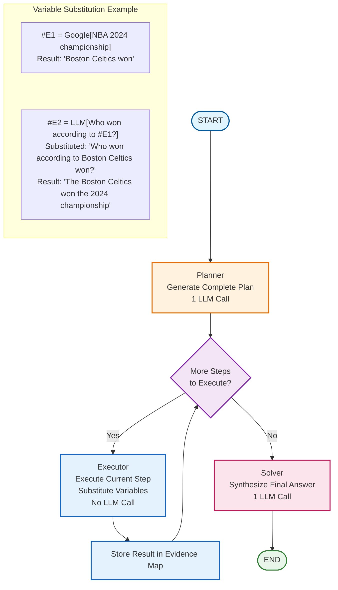

# Tutorial 25: ReWOO Pattern

## Overview

ReWOO (Reasoning WithOut Observation) is a token-efficient agent pattern that decouples planning from execution. Instead of interleaving reasoning with tool calls like ReAct, ReWOO generates a complete plan upfront, executes all tools sequentially with variable substitution, and synthesizes a final answer.

**Key advantage**: Reduces LLM calls from ~10 (ReAct) to 2 (ReWOO) for multi-step tasks.

## Architecture



## When to Use

Use ReWOO when:

- **Token efficiency is critical**: Minimize LLM calls for cost/latency
- **Task structure is predictable**: Can plan all steps upfront
- **Tool execution is fast**: Sequential execution is acceptable
- **Multi-step workflows**: Task requires multiple tool calls

Don't use ReWOO when:

- **Adaptive planning needed**: Tool results determine next steps
- **Highly exploratory tasks**: Cannot predict plan in advance
- **Real-time interaction**: Need immediate feedback after each tool
- **Complex branching**: Tool results lead to different paths

## Comparison: ReAct vs ReWOO

| Aspect | ReAct | ReWOO |
|--------|-------|-------|
| **LLM Calls** | ~10 (Think → Act → Observe × N) | 2 (Plan + Synthesize) |
| **Token Usage** | High (repeated context) | Low (single planning context) |
| **Adaptability** | High (replan after each step) | Low (fixed plan) |
| **Latency** | Higher (many LLM calls) | Lower (fewer LLM calls) |
| **Use Case** | Exploratory, adaptive tasks | Predictable, multi-step tasks |

## Key Components

### 1. State Schema

```python
from typing_extensions import TypedDict

class ReWOOState(TypedDict):
    task: str                              # Original user query
    plan_string: str                       # Raw plan from planner
    steps: list[tuple[str, str, str, str]] # Parsed: (reasoning, var, tool, args)
    results: dict[str, str]                # Evidence map: {"#E1": "...", "#E2": "..."}
    result: str                            # Final synthesized answer
```

### 2. Plan Format

The planner generates plans in this specific format:

```
Plan: [reasoning for this step]
#E[number] = [ToolName][input]

Plan: [reasoning for next step, can reference previous variables]
#E[number] = [ToolName][input that may include #E1, #E2, etc.]
```

**Example**:
```
Plan: Search for information about the 2024 NBA championship
#E1 = Google[2024 NBA championship winner]

Plan: Find out who was the Finals MVP from the search results
#E2 = LLM[According to #E1, who was the Finals MVP?]
```

### 3. Plan Parsing

The plan is parsed using regex to extract structured steps:

```python
from langgraph_ollama_local.patterns.rewoo import parse_plan

plan_string = """
Plan: Search for NBA information
#E1 = Google[2024 NBA finals winner]

Plan: Analyze the results
#E2 = LLM[Based on #E1, who won?]
"""

steps = parse_plan(plan_string)
# [
#   ('Search for NBA information', '#E1', 'Google', '2024 NBA finals winner'),
#   ('Analyze the results', '#E2', 'LLM', 'Based on #E1, who won?')
# ]
```

### 4. Planner Node

Generates complete plan with evidence variables:

```python
from langgraph_ollama_local.patterns.rewoo import create_planner_node

planner = create_planner_node(llm)

state = {"task": "Who won the 2024 NBA championship?"}
result = planner(state)

# result["plan_string"] contains the full plan
# result["steps"] contains parsed steps
```

### 5. Tool Executor

Executes tools with variable substitution:

```python
from langgraph_ollama_local.patterns.rewoo import create_tool_executor

tools = {
    "Google": search_tool,
    "Calculator": calc_tool,
}

executor = create_tool_executor(tools, llm)

# If current step is: #E2 = LLM[Analyze #E1]
# And results = {"#E1": "Boston Celtics won"}
# Then the executor will substitute #E1 with actual value:
#   "Analyze Boston Celtics won"
```

**Variable Substitution**:
- Before execution: `#E2 = LLM[Analyze #E1]`
- After substitution: `#E2 = LLM[Analyze Boston Celtics won the 2024 championship]`
- Result stored: `{"#E1": "...", "#E2": "The Celtics won..."}`

### 6. Solver Node

Synthesizes final answer from all evidence:

```python
from langgraph_ollama_local.patterns.rewoo import create_solver_node

solver = create_solver_node(llm)

# Takes all evidence (#E1, #E2, ...) and generates final answer
# This is the second and final LLM call
```

## Usage

### Basic Usage

```python
from langgraph_ollama_local import LocalAgentConfig
from langgraph_ollama_local.patterns.rewoo import (
    create_rewoo_graph,
    run_rewoo_task,
    format_tool_descriptions,
)
from langchain_core.tools import tool

# Setup
config = LocalAgentConfig()
llm = config.create_chat_client()

# Define tools
@tool
def search(query: str) -> str:
    """Search for information."""
    # Implementation
    return "Search results..."

@tool
def calculator(expression: str) -> str:
    """Calculate mathematical expressions."""
    return str(eval(expression))

tools = {
    "Google": search,
    "Calculator": calculator,
}

# Create graph
graph = create_rewoo_graph(llm, tools)

# Format tool descriptions for planner
tool_descriptions = format_tool_descriptions(tools)

# Run task
result = run_rewoo_task(
    graph,
    "How many days until the next leap year from 2024?",
    tool_descriptions=tool_descriptions
)

print(result["result"])
```

### Inspecting the Plan

```python
result = run_rewoo_task(graph, task, tool_descriptions=tool_descriptions)

# View the generated plan
print("Plan:")
print(result["plan_string"])

# View parsed steps
print("\nSteps:")
for reasoning, var, tool, args in result["steps"]:
    print(f"{var} = {tool}[{args}]")
    print(f"  Reasoning: {reasoning}")

# View collected evidence
print("\nEvidence:")
for var, value in result["results"].items():
    print(f"{var}: {value[:100]}...")
```

### Custom Tool Descriptions

Provide custom descriptions to guide the planner:

```python
tool_descriptions = """
(1) Google[input]: Searches the web for current information.
(2) Calculator[input]: Performs arithmetic calculations.
(3) LLM[input]: Reasons about information and answers questions.
"""

result = run_rewoo_task(
    graph,
    task,
    tool_descriptions=tool_descriptions
)
```

## Advanced Patterns

### With Real Search Tool

```python
from langchain_community.tools import DuckDuckGoSearchRun

search_tool = DuckDuckGoSearchRun()

tools = {
    "Google": search_tool,
}

graph = create_rewoo_graph(llm, tools)
tool_descriptions = format_tool_descriptions(tools)

result = run_rewoo_task(
    graph,
    "What is the current price of Bitcoin and has it increased this week?",
    tool_descriptions=tool_descriptions
)
```

### Multi-Step Calculations

```python
task = """
Calculate the following:
1. (25 + 15) × 2
2. Add 10 to the result
3. Divide by 5
What's the final answer?
"""

result = run_rewoo_task(graph, task, tool_descriptions=tool_descriptions)

# The planner will create:
# Plan: Calculate first part
# #E1 = Calculator[(25 + 15) * 2]
#
# Plan: Add 10 to the result
# #E2 = Calculator[#E1 + 10]
#
# Plan: Divide by 5
# #E3 = Calculator[#E2 / 5]
```

### Error Handling

The executor handles tool errors gracefully:

```python
# If a tool fails, the error message is stored in results
# The solver receives the error and can work around it

result = run_rewoo_task(graph, task, tool_descriptions=tool_descriptions)

# Check for errors in evidence
for var, value in result["results"].items():
    if "Error" in value:
        print(f"Tool execution failed for {var}: {value}")
```

## Token Efficiency Analysis

For a task requiring 3 tool calls:

**ReAct Pattern**:
1. Think (LLM call)
2. Act with Tool 1 (LLM call to decide)
3. Observe Tool 1 result
4. Think (LLM call)
5. Act with Tool 2 (LLM call to decide)
6. Observe Tool 2 result
7. Think (LLM call)
8. Act with Tool 3 (LLM call to decide)
9. Observe Tool 3 result
10. Final answer (LLM call)

**Total**: ~7-10 LLM calls

**ReWOO Pattern**:
1. Plan all steps (1 LLM call)
2. Execute Tool 1 (no LLM call)
3. Execute Tool 2 (no LLM call)
4. Execute Tool 3 (no LLM call)
5. Synthesize answer (1 LLM call)

**Total**: 2 LLM calls

**Token savings**: ~70-80% fewer LLM calls

## Best Practices

### 1. Clear Tool Descriptions

Provide clear, concise tool descriptions:

```python
tool_descriptions = """
(1) Google[input]: Searches web for recent information. Use for facts, news, current events.
(2) Calculator[input]: Evaluates math expressions. Use for any numerical calculations.
(3) Weather[input]: Gets weather for a location. Input should be city name.
(4) LLM[input]: Analyzes information and answers questions. Use to combine evidence.
"""
```

### 2. Validate Plans

Check that the planner generates valid plans:

```python
from langgraph_ollama_local.patterns.rewoo import parse_plan

result = run_rewoo_task(graph, task, tool_descriptions=tool_descriptions)

if not result["steps"]:
    print("Warning: No valid steps parsed from plan")
    print("Raw plan:", result["plan_string"])
```

### 3. Handle Missing Variables

Ensure all referenced variables exist:

```python
# In custom executor, check for undefined variables
def safe_substitute(tool_input, results):
    for var in re.findall(r'#E\d+', tool_input):
        if var not in results:
            return f"Error: {var} not found in results"
    # Continue with substitution
```

### 4. Limit Plan Complexity

For complex tasks, consider breaking into subtasks:

```python
# Instead of one massive plan, break into phases
phase1 = run_rewoo_task(graph, "Gather initial data...", ...)
phase2 = run_rewoo_task(graph, f"Analyze {phase1['result']}...", ...)
```

## Integration with Checkpointing

```python
from langgraph.checkpoint.memory import MemorySaver

checkpointer = MemorySaver()
graph = create_rewoo_graph(llm, tools, checkpointer=checkpointer)

# Run with persistence
config = {"configurable": {"thread_id": "rewoo-session-1"}}
result = graph.invoke(initial_state, config=config)
```

## Debugging

### Enable Verbose Output

```python
# Add print statements to trace execution
def trace_executor(state):
    print(f"Executing step: {state['steps'][len(state['results'])]}")
    result = executor(state)
    print(f"Result: {result}")
    return result
```

### Inspect Intermediate Results

```python
# After each invocation, check state
for event in graph.stream(initial_state, config=config):
    print(event)
    # Shows state after each node
```

## Limitations

1. **Fixed Plans**: Cannot adapt based on tool results
2. **Error Propagation**: Errors in early steps affect later steps
3. **No Branching**: Cannot conditionally execute different paths
4. **Context Size**: Very long plans may exceed context limits

## When to Upgrade to Other Patterns

- **Need adaptive planning** → Use Plan-and-Execute (Tutorial 21)
- **Need error recovery** → Use Reflexion (Tutorial 23)
- **Need exploration** → Use LATS (Tutorial 24)
- **Need self-improvement** → Use Reflection (Tutorial 22)

## References

- **Paper**: [ReWOO: Decoupling Reasoning from Observations for Efficient Augmented Language Models](https://arxiv.org/abs/2305.18323)
- **LangGraph Tutorial**: [Official ReWOO Implementation](https://langchain-ai.github.io/langgraph/tutorials/rewoo/rewoo/)
- **Related Patterns**:
  - Plan-and-Execute (Tutorial 21)
  - ReAct (Tutorial 02)

## Examples

See the complete examples in:
- **Tutorial Notebook**: `/examples/advanced_reasoning/25_rewoo.ipynb`
- **Pattern Implementation**: `/langgraph_ollama_local/patterns/rewoo.py`
- **Tests**: `/tests/test_rewoo.py`

## Quiz

Test your understanding of the ReWOO pattern:

<Quiz
  question="What is the main advantage of ReWOO over ReAct for multi-step tasks?"
  tutorial-id="25-rewoo"
  :options="[
    { text: 'ReWOO can handle more complex tasks than ReAct', correct: false },
    { text: 'ReWOO reduces LLM calls from ~10 (ReAct) to just 2 (Plan + Synthesize) by planning all steps upfront', correct: true },
    { text: 'ReWOO provides better accuracy on all tasks', correct: false },
    { text: 'ReWOO can use more external tools simultaneously', correct: false }
  ]"
  explanation="ReWOO's key advantage is TOKEN EFFICIENCY. ReAct uses ~7-10 LLM calls (Think-Act-Observe cycle repeated). ReWOO uses only 2 LLM calls total: 1) Planner generates complete plan upfront, 2) Solver synthesizes final answer. Tool execution between these requires NO LLM calls, achieving ~70-80% token savings."
  :hints="[
    { text: 'Consider what happens between the plan and final answer in ReWOO vs ReAct', penalty: 10 },
    { text: 'The Token Efficiency Analysis section breaks down the exact number of LLM calls', penalty: 15 }
  ]"
/>

<Quiz
  question="What is the purpose of evidence variables like #E1, #E2 in ReWOO plans?"
  tutorial-id="25-rewoo"
  :options="[
    { text: 'To count and track the number of execution steps', correct: false },
    { text: 'To store intermediate tool results that can be referenced in later steps through variable substitution', correct: true },
    { text: 'To mark steps that encountered errors during execution', correct: false },
    { text: 'To define and name the tools being used', correct: false }
  ]"
  explanation="Evidence variables (#E1, #E2, etc.) serve as placeholders that store intermediate results from tool executions. When a later step references #E1, the executor SUBSTITUTES the variable with the actual result before execution. This enables building complex multi-step reasoning chains WITHOUT additional LLM calls to interpret results."
  :hints="[
    { text: 'Look at the Variable Substitution example in the architecture diagram', penalty: 10 },
    { text: 'Consider how step #E2 can use the result of #E1 without an LLM call', penalty: 15 }
  ]"
/>

<Quiz
  question="When should you NOT use ReWOO?"
  tutorial-id="25-rewoo"
  :options="[
    { text: 'When you need maximum token efficiency for cost savings', correct: false },
    { text: 'When the task structure is predictable and well-defined', correct: false },
    { text: 'When tool results need to determine the next steps (adaptive planning required)', correct: true },
    { text: 'When you have multiple tools to use in sequence', correct: false }
  ]"
  explanation="ReWOO should NOT be used when ADAPTIVE PLANNING is needed - when the results of one tool call should determine what steps come next. ReWOO creates a FIXED plan upfront and executes it without modification. If you need to change the plan based on intermediate results, use Plan-and-Execute (Tutorial 21) instead."
  :hints="[
    { text: 'Consider what happens if a tool returns unexpected results', penalty: 10 },
    { text: 'The Limitations section lists Fixed Plans as a key constraint', penalty: 15 }
  ]"
/>

<Quiz
  question="What is the standard plan format that ReWOO uses?"
  tutorial-id="25-rewoo"
  :options="[
    { text: 'JSON objects with tool names and parameters', correct: false },
    { text: 'Plan: [reasoning] followed by #E[n] = [ToolName][input]', correct: true },
    { text: 'XML tags with nested tool definitions', correct: false },
    { text: 'Markdown lists with bullet points', correct: false }
  ]"
  explanation="ReWOO uses a specific text format: 'Plan: [reasoning for this step]' followed by '#E[number] = [ToolName][input]'. The reasoning explains why the step is needed, and the evidence variable format enables variable substitution. This format is parsed using regex to extract structured steps."
  :hints="[
    { text: 'Look at the Plan Format section with the example', penalty: 10 },
    { text: 'The format includes both reasoning text and a structured tool call line', penalty: 15 }
  ]"
/>

<Quiz
  question="How many LLM calls does ReWOO make for a task requiring 3 tool executions?"
  tutorial-id="25-rewoo"
  type="fill-blank"
  :accepted-answers="['2', 'two', 'Two']"
  explanation="ReWOO makes exactly 2 LLM calls regardless of how many tools are executed: 1) The Planner generates the complete plan (1 call), and 2) The Solver synthesizes the final answer from all evidence (1 call). Tool execution happens WITHOUT any LLM calls - the executor simply runs tools and stores results in the evidence map."
  :hints="[
    { text: 'Tool execution in ReWOO does not require LLM reasoning', penalty: 10 },
    { text: 'Look at the Token Efficiency Analysis comparison between ReAct and ReWOO', penalty: 15 }
  ]"
/>

<Quiz
  question="What should you do if ReWOO is insufficient because you need error recovery or adaptive planning?"
  tutorial-id="25-rewoo"
  :options="[
    { text: 'Add more tools to the ReWOO configuration', correct: false },
    { text: 'Increase the number of evidence variables', correct: false },
    { text: 'Upgrade to Plan-and-Execute (adaptive planning), Reflexion (error recovery), or LATS (exploration)', correct: true },
    { text: 'Use a larger language model', correct: false }
  ]"
  explanation="The tutorial explicitly recommends upgrading to other patterns when ReWOO limitations are encountered: Plan-and-Execute for adaptive planning, Reflexion for error recovery and learning from failures, LATS for exploration of multiple paths, and Reflection for iterative self-improvement. Each pattern addresses specific limitations of ReWOO."
  :hints="[
    { text: 'Look at the When to Upgrade to Other Patterns section', penalty: 10 },
    { text: 'Each advanced pattern addresses specific ReWOO limitations', penalty: 15 }
  ]"
/>

---

<div class="tutorial-nav">
  <a href="/tutorials/advanced/24-lats" class="prev">← Tutorial 24: LATS</a>
  <a href="/" class="next">Back to Home →</a>
</div>
