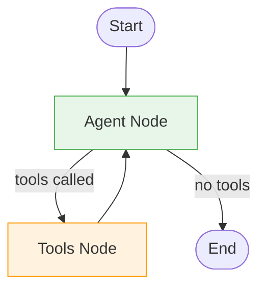

# Tutorial 02: Tool Calling & ReAct Agent

This tutorial teaches how to build a ReAct (Reasoning + Acting) agent from scratch using LangGraph and local Ollama. You'll learn how to give your LLM the ability to take actions in the real world.

## What You'll Learn

- How to define **tools** for your agent
- **Binding tools** to an LLM
- **Conditional edges** for dynamic routing
- The **ReAct loop**: Agent → Tools → Agent
- Building agents that can take real actions

## Prerequisites

- Completed [Tutorial 01: Chatbot Basics](01-chatbot-basics.md)
- A model that supports tool calling (see [Ollama Tools Models](https://ollama.com/search?c=tools))

**Recommended models for tool calling:**
- `llama3.1` (8B+) - Best overall for function calling
- `llama3.2` (1B, 3B) - Good for resource-constrained environments
- `mistral` (7B) - Balance of performance and efficiency
- `qwen3` - Featured in official Ollama examples
- `granite4` - IBM's tool-optimized models

**Pull a model before running:**
```bash
# Pull a model that supports tool calling
ollama pull llama3.1:8b

# Or for a smaller model
ollama pull llama3.2:3b

# Verify it's available
ollama list
```

If using [ollama-local-serve](https://github.com/abhinaavramesh/ollama-local-serve) on a LAN server:
```bash
# On the server, or via API
curl http://your-server:11434/api/pull -d '{"name": "llama3.1:8b"}'

# Or use the helper function
from langgraph_ollama_local import ensure_model
ensure_model("llama3.1:8b", host="192.168.1.100")
```

---

## Understanding Agents

### What is an Agent?

In the context of LLMs, an **agent** is a system that can:
1. **Reason** about what actions to take
2. **Execute** those actions using tools
3. **Observe** the results
4. **Iterate** until the task is complete

The key distinction from a simple chatbot is that agents can **take actions** beyond just generating text. They can search the web, query databases, call APIs, perform calculations, and more.

### Why Do We Need Agents?

Consider these limitations of a basic LLM:
- **No real-time information**: Training data has a cutoff date
- **No computation**: Can make arithmetic errors on complex math
- **No external access**: Cannot check weather, stock prices, or your calendar
- **No actions**: Cannot send emails, create files, or update databases

Agents solve these problems by giving the LLM access to **tools** that extend its capabilities.

---

## The ReAct Pattern

### What is ReAct?

ReAct (**Re**asoning and **Act**ing) is a paradigm introduced in the paper [ReAct: Synergizing Reasoning and Acting in Language Models](https://arxiv.org/abs/2210.03629). It combines two capabilities:

1. **Reasoning**: The LLM thinks through problems step-by-step
2. **Acting**: The LLM uses tools to gather information or take actions

The key insight is that reasoning and acting should be **interleaved**. The LLM reasons about what tool to use, uses it, observes the result, then reasons about what to do next.

### The ReAct Loop

The pattern follows this cycle:

1. **User Query** → Agent receives a question or task
2. **Reasoning** → Agent thinks about what information it needs
3. **Action** → Agent decides to call a tool
4. **Observation** → Tool returns results
5. **Repeat** → Agent reasons with new information, may call more tools
6. **Response** → When satisfied, agent responds to user

This continues until the agent has enough information to provide a complete answer.

---

## Core Concepts

### 1. Tools

Tools are Python functions that the LLM can decide to call. They're the bridge between the LLM's reasoning and real-world actions.

#### Defining a Tool

Use the `@tool` decorator from LangChain:

```python
from langchain_core.tools import tool

@tool
def multiply(a: float, b: float) -> float:
    """Multiply two numbers together.

    Args:
        a: First number
        b: Second number

    Returns:
        The product of a and b
    """
    return a * b
```

#### Tool Requirements

Every tool needs three things:

1. **The `@tool` decorator**: Converts your function into a LangChain Tool object
2. **A docstring**: **Critical!** The LLM reads this to understand what the tool does and when to use it
3. **Type hints**: Tell the LLM what types of arguments are expected

**Why docstrings matter so much:**

The LLM has no way to see your function's implementation. It decides whether to use a tool based entirely on:
- The tool's name
- The docstring description
- The argument names and types

A vague docstring like `"Does math"` will confuse the LLM. Be specific: `"Multiply two numbers together. Use this for multiplication operations."`

#### Tool Examples

```python
@tool
def add(a: float, b: float) -> float:
    """Add two numbers together.

    Use this tool when you need to calculate a sum.

    Args:
        a: The first number to add
        b: The second number to add

    Returns:
        The sum of a and b
    """
    return a + b

@tool
def get_weather(location: str) -> str:
    """Get the current weather for a location.

    Use this to check weather conditions in any city.

    Args:
        location: City name (e.g., "San Francisco", "New York")

    Returns:
        A string describing the current weather
    """
    # In production, this would call a weather API
    return f"Weather in {location}: Sunny, 72°F"
```

### 2. Tool Binding

Before the LLM can use tools, you must tell it what tools are available. This is called **binding**.

```python
from langchain_ollama import ChatOllama

# Create the base LLM
llm = ChatOllama(model="llama3.2:3b", temperature=0)

# Bind tools to create a tool-aware LLM
llm_with_tools = llm.bind_tools([multiply, add, get_weather])
```

**What happens during binding:**
1. Each tool's schema (name, description, parameters) is extracted
2. This schema is formatted according to the model's expected format
3. The schema is included in every request to the LLM

**Important**: The original `llm` object is unchanged. `bind_tools()` returns a new object. Always use the `llm_with_tools` version when you want tool calling.

### 3. Tool Calls

When you invoke an LLM with bound tools, it may decide to call a tool instead of responding directly.

```python
response = llm_with_tools.invoke("What is 5 times 3?")

# The response is an AIMessage
print(type(response))  # AIMessage

# Check if tools were called
print(response.tool_calls)
# [{'name': 'multiply', 'args': {'a': 5, 'b': 3}, 'id': 'call_abc123'}]

# The content might be empty when tools are called
print(response.content)  # "" or reasoning text
```

**Tool call structure:**
```python
{
    "name": "multiply",      # Which tool to call
    "args": {"a": 5, "b": 3}, # Arguments to pass
    "id": "call_abc123"      # Unique ID for tracking
}
```

The `id` is important - when you return tool results, you must include this ID so the LLM knows which call the result corresponds to.

### 4. The Tool Node

The tool node is responsible for actually executing tool calls. It:
1. Reads the tool calls from the last message
2. Executes each tool with its arguments
3. Returns `ToolMessage` objects with the results

```python
import json
from langchain_core.messages import ToolMessage

# Create a lookup dictionary for tools
tools = [multiply, add, get_weather]
tools_by_name = {tool.name: tool for tool in tools}

def tool_node(state):
    """Execute tool calls from the last AI message."""
    outputs = []

    # Get tool calls from the last message
    last_message = state["messages"][-1]

    for tool_call in last_message.tool_calls:
        # Look up the tool
        tool = tools_by_name[tool_call["name"]]

        # Execute it
        result = tool.invoke(tool_call["args"])

        # Create a ToolMessage with the result
        outputs.append(ToolMessage(
            content=json.dumps(result),  # Must be a string
            name=tool_call["name"],
            tool_call_id=tool_call["id"],  # Must match!
        ))

    return {"messages": outputs}
```

**Why `ToolMessage`?**

The LLM needs to see tool results in a specific format. `ToolMessage` is a message type that:
- Contains the tool's output
- Links back to the original tool call via `tool_call_id`
- Has a special role that LLMs understand

### 5. Conditional Edges

In Tutorial 01, all edges were unconditional - they always went from A to B. For ReAct, we need **conditional edges** that route based on state.

```python
from langgraph.graph import END

def should_continue(state):
    """Decide whether to continue to tools or end.

    Returns:
        "tools" - if the agent requested tool calls
        "end" - if the agent is done (no tool calls)
    """
    last_message = state["messages"][-1]

    # Check if there are any tool calls
    if hasattr(last_message, "tool_calls") and last_message.tool_calls:
        return "tools"

    # No tool calls means the agent is done
    return "end"

# Add conditional edge
workflow.add_conditional_edges(
    "agent",                           # From this node
    should_continue,                   # Use this function to decide
    {"tools": "tools", "end": END}     # Map return values to destinations
)
```

**How it works:**
1. After `agent` node runs, LangGraph calls `should_continue(state)`
2. The function returns either `"tools"` or `"end"`
3. LangGraph looks up the return value in the mapping dictionary
4. Execution continues to the mapped node (`"tools"` node or `END`)

---

## Building the ReAct Agent

Now let's build a complete ReAct agent step by step.

### Step 1: Define Tools

```python
from langchain_core.tools import tool

@tool
def multiply(a: float, b: float) -> float:
    """Multiply two numbers together.

    Args:
        a: First number
        b: Second number
    """
    return a * b

@tool
def add(a: float, b: float) -> float:
    """Add two numbers together.

    Args:
        a: First number
        b: Second number
    """
    return a + b

# Collect tools and create lookup
tools = [multiply, add]
tools_by_name = {t.name: t for t in tools}
```

### Step 2: Create LLM with Tool Binding

```python
from langchain_ollama import ChatOllama
from langgraph_ollama_local import LocalAgentConfig

config = LocalAgentConfig()
llm = ChatOllama(
    model=config.ollama.model,
    base_url=config.ollama.base_url,
    temperature=0,  # Deterministic for reliable tool calling
)

# Bind tools
llm_with_tools = llm.bind_tools(tools)
```

### Step 3: Define State

Same as Tutorial 01 - we track messages:

```python
from typing import Annotated
from typing_extensions import TypedDict
from langgraph.graph.message import add_messages

class AgentState(TypedDict):
    """State for our ReAct agent."""
    messages: Annotated[list, add_messages]
```

### Step 4: Define the Agent Node

The agent node calls the LLM:

```python
def agent_node(state: AgentState) -> dict:
    """Call the LLM to decide what to do.

    The LLM will either:
    - Return a text response (done)
    - Request tool calls (continue)
    """
    response = llm_with_tools.invoke(state["messages"])
    return {"messages": [response]}
```

### Step 5: Define the Tool Node

The tool node executes requested tools:

```python
import json
from langchain_core.messages import ToolMessage

def tool_node(state: AgentState) -> dict:
    """Execute tool calls from the last message."""
    outputs = []

    for tc in state["messages"][-1].tool_calls:
        result = tools_by_name[tc["name"]].invoke(tc["args"])
        outputs.append(ToolMessage(
            content=json.dumps(result),
            name=tc["name"],
            tool_call_id=tc["id"],
        ))

    return {"messages": outputs}
```

### Step 6: Define Routing Logic

```python
from langgraph.graph import END

def should_continue(state: AgentState) -> str:
    """Route based on whether tools were called."""
    last_message = state["messages"][-1]

    if hasattr(last_message, "tool_calls") and last_message.tool_calls:
        return "tools"
    return "end"
```

### Step 7: Build the Graph

```python
from langgraph.graph import StateGraph, START, END

# Create graph
workflow = StateGraph(AgentState)

# Add nodes
workflow.add_node("agent", agent_node)
workflow.add_node("tools", tool_node)

# Add edges
workflow.add_edge(START, "agent")  # Start with agent
workflow.add_conditional_edges(
    "agent",
    should_continue,
    {"tools": "tools", "end": END}
)
workflow.add_edge("tools", "agent")  # After tools, back to agent

# Compile
graph = workflow.compile()
```

### Step 8: Use It!

```python
result = graph.invoke({
    "messages": [("user", "What is 7 times 8?")]
})
print(result["messages"][-1].content)
# "7 times 8 equals 56"
```

---

## Complete Code

Here's everything in one place:

```python
import json
from typing import Annotated
from typing_extensions import TypedDict
from langchain_core.tools import tool
from langchain_core.messages import ToolMessage
from langchain_ollama import ChatOllama
from langgraph.graph import StateGraph, START, END
from langgraph.graph.message import add_messages
from langgraph_ollama_local import LocalAgentConfig

# === Tools ===
@tool
def multiply(a: float, b: float) -> float:
    """Multiply two numbers."""
    return a * b

@tool
def add(a: float, b: float) -> float:
    """Add two numbers."""
    return a + b

tools = [multiply, add]
tools_by_name = {t.name: t for t in tools}

# === LLM ===
config = LocalAgentConfig()
llm = ChatOllama(
    model=config.ollama.model,
    base_url=config.ollama.base_url,
    temperature=0,
).bind_tools(tools)

# === State ===
class AgentState(TypedDict):
    messages: Annotated[list, add_messages]

# === Nodes ===
def agent_node(state):
    return {"messages": [llm.invoke(state["messages"])]}

def tool_node(state):
    outputs = []
    for tc in state["messages"][-1].tool_calls:
        result = tools_by_name[tc["name"]].invoke(tc["args"])
        outputs.append(ToolMessage(
            content=json.dumps(result),
            name=tc["name"],
            tool_call_id=tc["id"],
        ))
    return {"messages": outputs}

# === Routing ===
def should_continue(state):
    if state["messages"][-1].tool_calls:
        return "tools"
    return "end"

# === Graph ===
workflow = StateGraph(AgentState)
workflow.add_node("agent", agent_node)
workflow.add_node("tools", tool_node)
workflow.add_edge(START, "agent")
workflow.add_conditional_edges("agent", should_continue, {"tools": "tools", "end": END})
workflow.add_edge("tools", "agent")
graph = workflow.compile()

# === Use ===
result = graph.invoke({"messages": [("user", "What is 7 times 8?")]})
print(result["messages"][-1].content)
```

## Graph Visualization



The graph shows the ReAct loop:
- Execution starts at `__start__`
- Goes to `agent` node which calls the LLM
- **Conditional edge** checks if tools were called:
  - If yes → goes to `tools` node → back to `agent`
  - If no → goes to `__end__`

This loop continues until the agent responds without requesting tools.

---

## Common Pitfalls

### 1. Forgetting to Bind Tools

```python
# WRONG - using base LLM
response = llm.invoke("What is 5 + 3?")
# LLM will try to answer without tools

# CORRECT - using tool-bound LLM
llm_with_tools = llm.bind_tools(tools)
response = llm_with_tools.invoke("What is 5 + 3?")
```

### 2. Missing Tool Call ID

```python
# WRONG - no tool_call_id
ToolMessage(content="8", name="add")
# Error: ToolMessage requires tool_call_id

# CORRECT - include the ID from the original call
ToolMessage(
    content="8",
    name="add",
    tool_call_id=tool_call["id"]  # Must match!
)
```

### 3. Non-String Content in ToolMessage

```python
# WRONG - returning raw Python objects
ToolMessage(content={"result": 56}, ...)
# Error: content must be a string

# CORRECT - serialize to JSON
ToolMessage(content=json.dumps({"result": 56}), ...)
```

---

## Quiz

Test your understanding of tool calling and ReAct agents:

<Quiz
  question="What are the three essential components required for every tool definition?"
  tutorial-id="02-tool-calling"
  :options="[
    { text: 'Name, implementation, and unit tests', correct: false },
    { text: '@tool decorator, docstring, and type hints', correct: true },
    { text: 'Function name, return type, and error handling', correct: false },
    { text: 'LLM binding, execution logic, and validation', correct: false }
  ]"
  explanation="Every tool needs: 1) The @tool decorator to convert it to a LangChain Tool object, 2) A clear docstring that the LLM reads to understand when to use it, and 3) Type hints for parameters so the LLM knows what arguments to pass."
  :hints="[
    { text: 'Think about what information the LLM needs to decide when and how to use a tool', penalty: 10 },
    { text: 'The LLM cannot see your function implementation - it only sees metadata', penalty: 15 }
  ]"
/>

<Quiz
  question="What does the conditional edge in a ReAct agent check to determine routing?"
  tutorial-id="02-tool-calling"
  :options="[
    { text: 'Whether the user input is valid', correct: false },
    { text: 'Whether the LLM requested tool calls in its response', correct: true },
    { text: 'Whether the tools executed successfully', correct: false },
    { text: 'Whether the maximum iterations were reached', correct: false }
  ]"
  explanation="The conditional edge checks if the last AI message contains tool_calls. If yes, it routes to the tools node for execution. If no (no tool calls), the agent is done reasoning and execution ends."
  :hints="[
    { text: 'The routing decision is based on the content of the AI response', penalty: 10 },
    { text: 'Look at the should_continue function - what property does it check?', penalty: 15 }
  ]"
/>

<Quiz
  question="Why must ToolMessage include a tool_call_id?"
  tutorial-id="02-tool-calling"
  :options="[
    { text: 'For debugging and logging purposes only', correct: false },
    { text: 'To link the result back to the original tool call request', correct: true },
    { text: 'To track the execution time of tools', correct: false },
    { text: 'To validate the tool exists in the registry', correct: false }
  ]"
  explanation="The tool_call_id links the ToolMessage result back to the specific tool call that was made by the LLM. This is essential when multiple tools are called - the LLM needs to know which result corresponds to which request."
  :hints="[
    { text: 'Consider what happens when an LLM requests multiple tool calls at once', penalty: 10 },
    { text: 'The LLM needs to match results to its original requests', penalty: 15 }
  ]"
/>

<Quiz
  question="The bind_tools() method modifies the original LLM object in place."
  tutorial-id="02-tool-calling"
  type="true-false"
  :options="[
    { text: 'True', correct: false },
    { text: 'False', correct: true }
  ]"
  explanation="bind_tools() returns a NEW object with tools attached - it does not modify the original LLM. You must use the returned object (llm_with_tools) for tool calling to work."
  :hints="[
    { text: 'Consider the immutable pattern common in functional programming', penalty: 10 },
    { text: 'Look at the code example: llm_with_tools = llm.bind_tools(tools)', penalty: 15 }
  ]"
/>

<Quiz
  question="What must ToolMessage content be serialized as?"
  tutorial-id="02-tool-calling"
  type="fill-blank"
  :accepted-answers="['string', 'a string', 'JSON string', 'json', 'str']"
  explanation="ToolMessage content must be a string. If your tool returns a Python object like a dict or list, you must serialize it using json.dumps() before creating the ToolMessage."
  :hints="[
    { text: 'The content field has a specific type requirement', penalty: 10 },
    { text: 'The tutorial shows using json.dumps() on the result', penalty: 15 }
  ]"
/>

---

## What's Next?

[Tutorial 03: Memory & Persistence](03-memory-persistence.md) - Learn how to add conversation memory so your agent remembers previous interactions.
