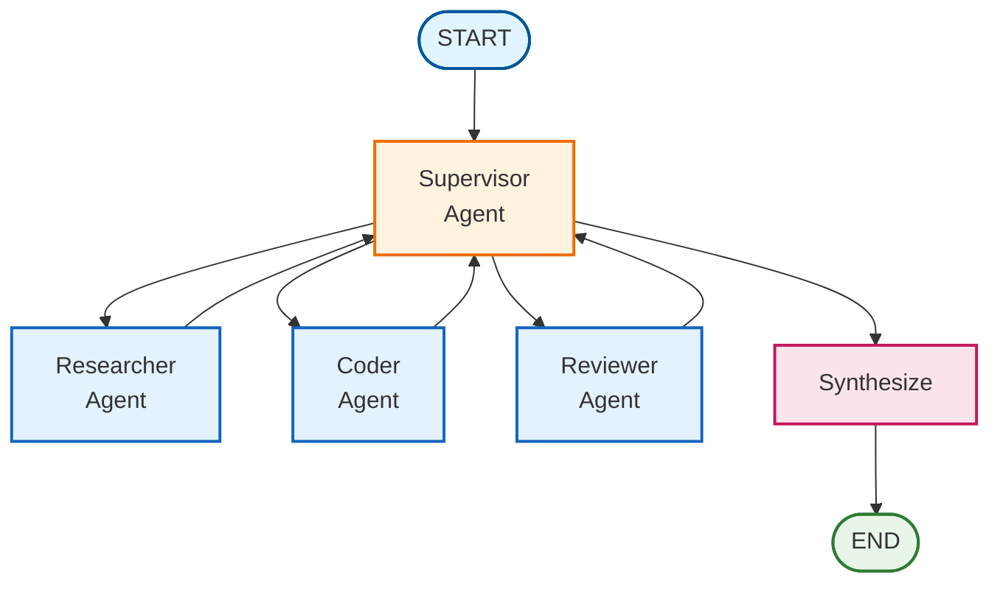

# Multi-Agent Collaboration

## Overview

Multi-agent collaboration enables complex tasks by coordinating multiple specialized agents under a central supervisor. This pattern is ideal when tasks require different skills (research, coding, review) or benefit from iterative refinement.

## Architecture



## When to Use

Use multi-agent collaboration when:

- **Tasks require multiple skill sets**: Research, implementation, and review
- **Quality matters**: Review cycles catch errors before final output
- **Tasks are complex**: Breaking down into specialized steps improves results
- **Iteration helps**: Multiple passes refine the output

## Key Components

### 1. State Schema

```python
from typing import Annotated
from typing_extensions import TypedDict
from langgraph.graph.message import add_messages
import operator

class MultiAgentState(TypedDict):
    messages: Annotated[list, add_messages]  # Conversation history
    task: str                                 # Current task
    next_agent: str                           # Supervisor's routing decision
    agent_outputs: Annotated[list[dict], operator.add]  # Accumulated outputs
    iteration: int                            # Current iteration
    max_iterations: int                       # Safety limit
    final_result: str                         # Synthesized result
```

### 2. Supervisor Node

The supervisor uses structured output to make reliable routing decisions:

```python
from pydantic import BaseModel, Field
from typing import Literal

class SupervisorDecision(BaseModel):
    next_agent: Literal["researcher", "coder", "reviewer", "FINISH"]
    reasoning: str

def create_supervisor_node(llm):
    structured_llm = llm.with_structured_output(SupervisorDecision)

    def supervisor(state):
        # Build context from progress
        # Ask LLM to decide next agent
        decision = structured_llm.invoke(messages)
        return {"next_agent": decision.next_agent, "iteration": state["iteration"] + 1}

    return supervisor
```

### 3. Specialized Agents

Each agent has a focused role:

```python
def create_agent_node(llm, agent_name):
    def agent(state):
        response = llm.invoke([
            SystemMessage(content=AGENT_PROMPTS[agent_name]),
            HumanMessage(content=f"Task: {state['task']}")
        ])
        return {"agent_outputs": [{"agent": agent_name, "output": response.content}]}
    return agent
```

### 4. Routing Logic

```python
def route_supervisor(state):
    if state["iteration"] >= state["max_iterations"]:
        return "synthesize"
    if state["next_agent"] == "FINISH":
        return "synthesize"
    return state["next_agent"].lower()
```

### 5. Graph Construction

```python
from langgraph.graph import StateGraph, START, END

workflow = StateGraph(MultiAgentState)

# Add nodes
workflow.add_node("supervisor", create_supervisor_node(llm))
workflow.add_node("researcher", create_agent_node(llm, "researcher"))
workflow.add_node("coder", create_agent_node(llm, "coder"))
workflow.add_node("reviewer", create_agent_node(llm, "reviewer"))
workflow.add_node("synthesize", synthesize_node)

# Add edges
workflow.add_edge(START, "supervisor")
workflow.add_conditional_edges("supervisor", route_supervisor, {...})
workflow.add_edge("researcher", "supervisor")
workflow.add_edge("coder", "supervisor")
workflow.add_edge("reviewer", "supervisor")
workflow.add_edge("synthesize", END)

graph = workflow.compile()
```

## Usage

### Basic Usage

```python
from langgraph_ollama_local import LocalAgentConfig
from langgraph_ollama_local.agents import create_multi_agent_graph, run_multi_agent_task

config = LocalAgentConfig()
llm = config.create_chat_client()
graph = create_multi_agent_graph(llm)

result = run_multi_agent_task(
    graph,
    "Create a Python function to validate email addresses",
    max_iterations=5
)
print(result["final_result"])
```

### With Custom Tools

```python
from langchain_core.tools import tool

@tool
def search_docs(query: str) -> str:
    """Search documentation."""
    return "Search results..."

graph = create_multi_agent_graph(
    llm,
    researcher_tools=[search_docs],
)
```

## Best Practices

1. **Set reasonable max_iterations**: 5-10 is usually sufficient
2. **Use structured output**: Ensures reliable routing decisions
3. **Keep agent prompts focused**: Each agent should have a clear, limited role
4. **Accumulate outputs**: Use `operator.add` reducer to collect all work
5. **Include synthesis**: Combine outputs into a coherent final result

## Common Pitfalls

| Pitfall | Solution |
|---------|----------|
| Infinite loops | Always set `max_iterations` |
| Unclear routing | Use structured output with Pydantic |
| Lost context | Include previous work in agent prompts |
| Over-iteration | Guide supervisor to finish when task is complete |

## Related Patterns

- [Hierarchical Teams](15-hierarchical-teams.md) - Nested team structures
- [Subgraph Patterns](16-subgraphs.md) - Composable graph components
- [Research Assistant](../core/07-research-assistant.md) - Single-agent orchestration

## Quiz

Test your understanding of multi-agent collaboration:

<Quiz
  question="What is the primary role of the supervisor in multi-agent collaboration?"
  tutorial-id="14-multi-agent-collaboration"
  :options="[
    { text: 'Execute all tasks directly without delegation', correct: false },
    { text: 'Coordinate and route tasks to specialized agents based on task requirements', correct: true },
    { text: 'Store all agent outputs in a database', correct: false },
    { text: 'Validate and approve every agent response before proceeding', correct: false }
  ]"
  explanation="The supervisor acts as a central coordinator that analyzes the task and progress, then routes work to appropriate specialized agents. It orchestrates the workflow without executing tasks itself."
  :hints="[
    { text: 'Think about what makes a supervisor different from a worker', penalty: 10 },
    { text: 'The supervisor decides WHO should work, not HOW the work is done', penalty: 15 }
  ]"
/>

<Quiz
  question="Why is structured output (Pydantic) recommended for supervisor routing decisions?"
  tutorial-id="14-multi-agent-collaboration"
  :options="[
    { text: 'It makes the code shorter and more readable', correct: false },
    { text: 'It ensures reliable, parseable routing decisions that will not fail due to free-form text parsing', correct: true },
    { text: 'It automatically improves LLM reasoning quality', correct: false },
    { text: 'It reduces API costs by compressing output', correct: false }
  ]"
  explanation="Structured output with Pydantic ensures the supervisor returns consistent, machine-readable routing decisions. This prevents failures from parsing errors that could occur with free-form text responses, making the system more robust."
  :hints="[
    { text: 'Consider what could go wrong with unstructured LLM text output', penalty: 10 },
    { text: 'The key benefit is ensuring the routing decision can be reliably extracted', penalty: 15 }
  ]"
/>

<Quiz
  question="What happens when max_iterations is reached in a multi-agent system?"
  tutorial-id="14-multi-agent-collaboration"
  :options="[
    { text: 'The system throws an error and crashes', correct: false },
    { text: 'The supervisor chooses a random agent to finish', correct: false },
    { text: 'The system routes to completion/synthesis to produce a final result', correct: true },
    { text: 'All agents run in parallel to complete faster', correct: false }
  ]"
  explanation="The max_iterations safety limit prevents infinite loops by forcing the system to complete and synthesize results when the limit is reached. This ensures the system always produces output, even if the task is not fully complete."
  :hints="[
    { text: 'max_iterations is a safety mechanism - what would it prevent?', penalty: 10 },
    { text: 'The system needs to gracefully finish, not crash or hang indefinitely', penalty: 15 }
  ]"
/>

<Quiz
  question="In the multi-agent state schema, what is the purpose of using operator.add as the reducer for agent_outputs?"
  tutorial-id="14-multi-agent-collaboration"
  :options="[
    { text: 'To mathematically sum numeric values from agents', correct: false },
    { text: 'To accumulate outputs from multiple agents into a growing list', correct: true },
    { text: 'To concatenate string responses into one message', correct: false },
    { text: 'To average scores from different agents', correct: false }
  ]"
  explanation="The operator.add reducer accumulates outputs from multiple agents into a growing list. Each time an agent produces output, it gets appended to the existing list rather than replacing it, preserving all work done by all agents."
  :hints="[
    { text: 'Think about what happens when multiple agents each produce output', penalty: 10 },
    { text: 'The Annotated type with operator.add is used for list accumulation', penalty: 15 }
  ]"
/>

<Quiz
  question="When should you use multi-agent collaboration instead of a single agent?"
  tutorial-id="14-multi-agent-collaboration"
  type="true-false"
  :options="[
    { text: 'When tasks require multiple specialized skill sets and benefit from iterative refinement', correct: true },
    { text: 'For any task, since more agents always produce better results', correct: false }
  ]"
  explanation="Multi-agent collaboration is beneficial when tasks require multiple skill sets (research, coding, review), when quality matters and review cycles help catch errors, and when complex tasks benefit from specialization. Using multiple agents for simple tasks adds unnecessary overhead."
  :hints="[
    { text: 'Consider the overhead of coordinating multiple agents', penalty: 10 },
    { text: 'Multi-agent is best when specialization and iteration add value', penalty: 15 }
  ]"
/>

---

<div class="tutorial-nav">
  <a href="../rag/13-adaptive-rag.md" class="nav-link prev">← Previous: Adaptive RAG</a>
  <a href="15-hierarchical-teams.md" class="nav-link next">Next: Hierarchical Teams →</a>
</div>
