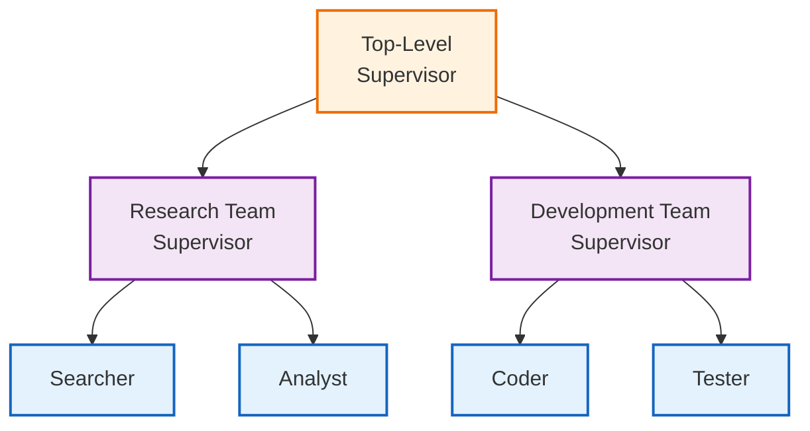

# Hierarchical Agent Teams

## Overview

Hierarchical agent teams extend the supervisor pattern with nested team structures. A top-level supervisor coordinates team supervisors, who in turn manage specialized team members. This enables complex organizational structures for sophisticated tasks.

## Architecture



## When to Use

Use hierarchical teams when:

- **Many agents**: More than 5-6 agents become hard for one supervisor
- **Clear domains**: Research, development, QA are distinct areas
- **Independent work**: Teams can make progress without constant coordination
- **Scalability**: Adding teams shouldn't require restructuring

## Key Components

### 1. Team State

```python
class TeamState(TypedDict):
    messages: Annotated[list, add_messages]
    task: str
    team_name: str
    next_member: str
    member_outputs: Annotated[list[dict], operator.add]
    iteration: int
    max_iterations: int
    team_result: str
```

### 2. Hierarchical State

```python
class HierarchicalState(TypedDict):
    messages: Annotated[list, add_messages]
    task: str
    active_team: str
    team_results: dict[str, str]
    iteration: int
    max_iterations: int
    final_result: str
```

### 3. Team Building

```python
from langgraph_ollama_local.agents.hierarchical import create_team_graph

research_team = create_team_graph(
    llm,
    "research",
    members=[
        ("searcher", "Search for information.", None),
        ("analyst", "Analyze and summarize.", None),
    ]
)
```

### 4. Hierarchical Graph

```python
from langgraph_ollama_local.agents.hierarchical import create_hierarchical_graph

graph = create_hierarchical_graph(
    llm,
    {
        "research": research_team,
        "development": dev_team,
    }
)
```

## Usage

```python
from langgraph_ollama_local.agents.hierarchical import (
    create_team_graph,
    create_hierarchical_graph,
    run_hierarchical_task,
)

# Create teams
research = create_team_graph(llm, "research", [
    ("searcher", "Search for solutions.", None),
    ("analyst", "Analyze findings.", None),
])

dev = create_team_graph(llm, "development", [
    ("coder", "Write code.", None),
    ("tester", "Write tests.", None),
])

# Create hierarchical graph
graph = create_hierarchical_graph(llm, {"research": research, "development": dev})

# Run task
result = run_hierarchical_task(graph, "Build a password validator")
print(result["final_result"])
```

## State Transformation

Teams need state transformation when wrapped as nodes:

```python
def create_team_wrapper(team_graph, team_name):
    def team_node(state: HierarchicalState) -> dict:
        # Transform to team state
        team_input = {
            "messages": [],
            "task": state["task"],
            "team_name": team_name,
            "next_member": "",
            "member_outputs": [],
            "iteration": 0,
            "max_iterations": 4,
            "team_result": "",
        }

        # Run team
        team_output = team_graph.invoke(team_input)

        # Update hierarchical state
        new_results = state.get("team_results", {}).copy()
        new_results[team_name] = team_output["team_result"]

        return {"team_results": new_results}

    return team_node
```

## Best Practices

1. **Keep teams focused**: Each team should have a clear domain
2. **Limit team size**: 2-4 members per team works best
3. **Set iteration limits**: Both team and top-level iterations
4. **Clear handoffs**: Teams should produce complete, usable outputs

## Comparison: Flat vs Hierarchical

| Aspect | Flat Multi-Agent | Hierarchical |
|--------|------------------|--------------|
| Agents | 3-5 | 6+ |
| Structure | Single supervisor | Nested supervisors |
| Communication | Direct to all | Through team leads |
| Complexity | Lower | Higher |
| Scalability | Limited | Better |

## Common Patterns

### Sequential Team Flow
Research → Development → QA

### Parallel Team Work
Multiple teams work simultaneously, results merged

### Iterative Refinement
Teams can be called multiple times

## Related Patterns

- [Multi-Agent Collaboration](14-multi-agent-collaboration.md) - Flat supervisor pattern
- [Subgraph Patterns](16-subgraphs.md) - Composable graph components

## Quiz

Test your understanding of hierarchical agent teams:

<Quiz
  question="When should you use hierarchical teams instead of flat multi-agent collaboration?"
  tutorial-id="15-hierarchical-teams"
  :options="[
    { text: 'When you have only 2-3 agents total', correct: false },
    { text: 'When you have 6+ agents or distinct team domains that benefit from organization', correct: true },
    { text: 'When tasks are very simple and require minimal coordination', correct: false },
    { text: 'When all agents need to work strictly sequentially', correct: false }
  ]"
  explanation="Hierarchical teams are ideal when you have many agents (6+) or clear domain boundaries (research, development, QA) that benefit from team-level organization. A single supervisor managing too many agents becomes a bottleneck."
  :hints="[
    { text: 'Consider the span of control problem - how many direct reports can one supervisor handle?', penalty: 10 },
    { text: 'Think about organizational structures in real companies', penalty: 15 }
  ]"
/>

<Quiz
  question="What is the recommended team size for each sub-team in a hierarchical structure?"
  tutorial-id="15-hierarchical-teams"
  :options="[
    { text: '1 member per team', correct: false },
    { text: '2-4 members per team', correct: true },
    { text: '5-10 members per team', correct: false },
    { text: 'As many members as needed for the task', correct: false }
  ]"
  explanation="Keeping teams small (2-4 members) ensures they remain focused and manageable, while still providing the benefits of specialization within each team. Larger teams reintroduce the coordination problems hierarchies are meant to solve."
  :hints="[
    { text: 'Smaller teams are easier to coordinate', penalty: 10 },
    { text: 'The sweet spot balances specialization with manageability', penalty: 15 }
  ]"
/>

<Quiz
  question="What is the purpose of state transformation in hierarchical teams?"
  tutorial-id="15-hierarchical-teams"
  :options="[
    { text: 'To encrypt sensitive data passing between teams', correct: false },
    { text: 'To convert between parent (hierarchical) and team state schemas', correct: true },
    { text: 'To compress large datasets for efficient processing', correct: false },
    { text: 'To validate and filter agent outputs before storage', correct: false }
  ]"
  explanation="State transformation bridges the gap between the hierarchical state (top-level) and team state schemas, allowing teams to operate with their own state structure while integrating with the parent system. It converts inputs going into the team and outputs coming out."
  :hints="[
    { text: 'Teams may need different state fields than the parent graph', penalty: 10 },
    { text: 'Think about how data flows in and out of subgraphs', penalty: 15 }
  ]"
/>

<Quiz
  question="In the comparison table, which aspect is better handled by hierarchical teams compared to flat multi-agent?"
  tutorial-id="15-hierarchical-teams"
  :options="[
    { text: 'Lower complexity and simpler implementation', correct: false },
    { text: 'Direct communication between all agents', correct: false },
    { text: 'Better scalability when adding more agents', correct: true },
    { text: 'Faster execution time for simple tasks', correct: false }
  ]"
  explanation="Hierarchical teams provide better scalability because adding new teams or team members does not require restructuring the entire system. The nested supervisor structure localizes coordination within teams, preventing the supervisor bottleneck problem."
  :hints="[
    { text: 'Think about what happens when you need to add more agents to each structure', penalty: 10 },
    { text: 'Hierarchies allow local changes without global restructuring', penalty: 15 }
  ]"
/>

<Quiz
  question="Which pattern best describes how teams communicate in a hierarchical structure?"
  tutorial-id="15-hierarchical-teams"
  type="fill-blank"
  :accepted-answers="['through team leads', 'through team supervisors', 'via supervisors', 'through supervisors']"
  explanation="In hierarchical teams, communication flows through team leads (supervisors) rather than directly between all agents. This reduces the communication complexity from O(n^2) to a more manageable structure."
  :hints="[
    { text: 'Look at the comparison table in the tutorial', penalty: 10 },
    { text: 'The key difference from flat structure is HOW agents communicate', penalty: 15 }
  ]"
/>

---

<div class="tutorial-nav">
  <a href="14-multi-agent-collaboration.md" class="nav-link prev">← Previous: Multi-Agent Collaboration</a>
  <a href="16-subgraphs.md" class="nav-link next">Next: Subgraph Patterns →</a>
</div>
