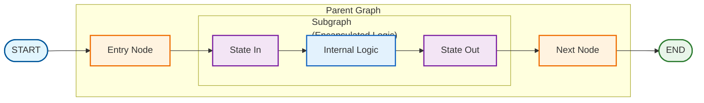

# Subgraph Patterns

## Overview

Subgraphs enable modular, reusable graph components that can be embedded within larger parent graphs. This pattern supports encapsulation, testing, and composition of complex agent systems.

## Architecture



## Key Concepts

### State Transformation

Subgraphs can have different state schemas than parent graphs. Transformation functions bridge the gap:

- **state_in**: Convert parent state to subgraph input
- **state_out**: Convert subgraph output to parent state updates

```python
def state_in(parent_state: ParentState) -> SubgraphState:
    """Transform parent state to subgraph input."""
    return {
        "query": parent_state["user_question"],
        "documents": [],
        "answer": "",
    }

def state_out(subgraph_state: SubgraphState, parent_state: ParentState) -> dict:
    """Transform subgraph output to parent updates."""
    return {
        "rag_answer": subgraph_state["answer"],
        "sources": subgraph_state["documents"],
    }
```

## Usage

### Basic Subgraph Wrapping

```python
from langgraph_ollama_local.patterns.subgraphs import create_subgraph_node

# Create wrapped node
rag_node = create_subgraph_node(
    rag_graph,
    state_in,
    state_out,
)

# Add to parent graph
parent.add_node("rag", rag_node)
```

### Field Mappers

For simple field renaming:

```python
from langgraph_ollama_local.patterns.subgraphs import (
    field_mapper_in,
    field_mapper_out,
)

state_in = field_mapper_in(
    ("user_question", "query"),  # parent_field -> subgraph_field
    ("context", "documents"),
)

state_out = field_mapper_out(
    ("answer", "rag_response"),  # subgraph_field -> parent_field
)
```

### Chaining Subgraphs

```python
from langgraph_ollama_local.patterns.subgraphs import chain_subgraphs

chained = chain_subgraphs([
    (retrieval_graph, retrieve_in, retrieve_out),
    (grading_graph, grade_in, grade_out),
    (generation_graph, generate_in, generate_out),
])

parent.add_node("rag_pipeline", chained)
```

### Conditional Subgraphs

```python
from langgraph_ollama_local.patterns.subgraphs import conditional_subgraph

def needs_web_search(state):
    return len(state.get("documents", [])) < 2

node = conditional_subgraph(
    needs_web_search,
    (web_search_graph, ws_in, ws_out),
    (direct_answer_graph, da_in, da_out),
)
```

### Retry Pattern

```python
from langgraph_ollama_local.patterns.subgraphs import retry_subgraph

def should_retry(output, state):
    return output.get("quality_score", 0) < 0.7

node = retry_subgraph(
    generation_graph,
    gen_in, gen_out,
    should_retry,
    max_retries=3,
)
```

## Available Functions

| Function | Purpose |
|----------|---------|
| `create_subgraph_node` | Wrap subgraph as parent node |
| `create_subgraph_node_async` | Async version |
| `field_mapper_in` | Create state_in from field mappings |
| `field_mapper_out` | Create state_out from field mappings |
| `passthrough_state_in` | Identity transform (same schema) |
| `passthrough_state_out` | Identity transform (same schema) |
| `chain_subgraphs` | Run subgraphs sequentially |
| `conditional_subgraph` | Choose subgraph based on condition |
| `parallel_subgraphs` | Run subgraphs and merge outputs |
| `retry_subgraph` | Add retry logic to subgraph |

## Best Practices

1. **Keep subgraphs focused**: One responsibility per subgraph
2. **Test independently**: Verify subgraphs work before composing
3. **Clear interfaces**: Document state_in and state_out contracts
4. **Handle errors**: Consider what happens if subgraph fails

## Common Patterns

### RAG as Subgraph

```python
class RAGState(TypedDict):
    query: str
    documents: list
    answer: str

# Build RAG subgraph
rag_graph = build_rag_graph(retriever, llm)

# Embed in agent
agent.add_node("rag", create_subgraph_node(
    rag_graph,
    lambda s: {"query": s["question"], "documents": [], "answer": ""},
    lambda out, s: {"rag_answer": out["answer"]},
))
```

### Tool as Subgraph

Complex tools can be subgraphs with their own logic:

```python
# Calculator subgraph with validation and computation
calc_graph = build_calculator_graph()

# Wrap as tool-like node
agent.add_node("calculator", create_subgraph_node(
    calc_graph,
    lambda s: {"expression": s["tool_input"]},
    lambda out, s: {"tool_result": out["result"]},
))
```

## When to Use Subgraphs

| Use Subgraphs | Use Regular Nodes |
|---------------|-------------------|
| Reusable across multiple graphs | Single-use logic |
| Different state schema needed | Same state schema |
| Complex multi-step logic | Simple operations |
| Need independent testing | Tightly coupled to parent |
| Swappable implementations | Fixed implementation |

## Related Patterns

- [Multi-Agent Collaboration](14-multi-agent-collaboration.md)
- [Hierarchical Teams](15-hierarchical-teams.md)

## Quiz

Test your understanding of subgraph patterns:

<Quiz
  question="What is the primary benefit of using subgraphs in LangGraph?"
  tutorial-id="16-subgraphs"
  :options="[
    { text: 'They make graphs run significantly faster', correct: false },
    { text: 'They enable modular, reusable graph components that can be embedded in larger graphs', correct: true },
    { text: 'They automatically reduce API costs', correct: false },
    { text: 'They optimize LLM calls by batching them together', correct: false }
  ]"
  explanation="Subgraphs allow you to create modular, testable components that can be reused across different graphs, promoting code reuse and better organization. They support encapsulation and composition of complex agent systems."
  :hints="[
    { text: 'Think about software engineering principles like modularity and reuse', penalty: 10 },
    { text: 'Subgraphs allow you to develop and test components independently', penalty: 15 }
  ]"
/>

<Quiz
  question="What are state_in and state_out functions used for in subgraphs?"
  tutorial-id="16-subgraphs"
  :options="[
    { text: 'To validate user input before processing', correct: false },
    { text: 'To transform between parent and subgraph state schemas', correct: true },
    { text: 'To persist state in a database', correct: false },
    { text: 'To encrypt sensitive data in transit', correct: false }
  ]"
  explanation="state_in transforms parent state to subgraph input format, while state_out transforms subgraph output back to parent state updates. This allows subgraphs to have different state schemas than their parents while maintaining clean interfaces."
  :hints="[
    { text: 'Subgraphs can have completely different state fields than parent graphs', penalty: 10 },
    { text: 'state_in goes INTO the subgraph, state_out goes OUT to the parent', penalty: 15 }
  ]"
/>

<Quiz
  question="When should you use regular nodes instead of subgraphs?"
  tutorial-id="16-subgraphs"
  :options="[
    { text: 'When logic is complex and multi-step', correct: false },
    { text: 'When you need to reuse the component across multiple graphs', correct: false },
    { text: 'When the logic is simple and tightly coupled to the parent graph', correct: true },
    { text: 'When different state schemas are needed', correct: false }
  ]"
  explanation="Regular nodes are more appropriate for simple operations that are tightly coupled to the parent graph and use the same state schema. Subgraphs add overhead that is only justified for more complex, reusable components."
  :hints="[
    { text: 'Consider the tradeoff between modularity overhead and benefit', penalty: 10 },
    { text: 'Check the comparison table in the tutorial for guidance', penalty: 15 }
  ]"
/>

<Quiz
  question="Which function would you use to create state transformation for simple field renaming between schemas?"
  tutorial-id="16-subgraphs"
  :options="[
    { text: 'create_subgraph_node()', correct: false },
    { text: 'passthrough_state_in()', correct: false },
    { text: 'field_mapper_in() and field_mapper_out()', correct: true },
    { text: 'chain_subgraphs()', correct: false }
  ]"
  explanation="field_mapper_in() and field_mapper_out() create state transformation functions from simple field mappings, making it easy to rename fields between parent and subgraph schemas without writing custom transformation logic."
  :hints="[
    { text: 'Look at the Available Functions table in the tutorial', penalty: 10 },
    { text: 'The function names suggest their purpose - mapping fields', penalty: 15 }
  ]"
/>

<Quiz
  question="What pattern would you use to run a subgraph multiple times until a quality threshold is met?"
  tutorial-id="16-subgraphs"
  :options="[
    { text: 'chain_subgraphs() to chain multiple copies', correct: false },
    { text: 'parallel_subgraphs() to run in parallel and pick best', correct: false },
    { text: 'retry_subgraph() with a should_retry condition', correct: true },
    { text: 'conditional_subgraph() to check quality first', correct: false }
  ]"
  explanation="retry_subgraph() adds retry logic to a subgraph, allowing it to run multiple times with a should_retry function that checks quality. You can set max_retries to control how many attempts are made."
  :hints="[
    { text: 'The key is running the SAME subgraph repeatedly until success', penalty: 10 },
    { text: 'Look for a function specifically designed for retrying failed operations', penalty: 15 }
  ]"
/>

---

<div class="tutorial-nav">
  <a href="15-hierarchical-teams.md" class="nav-link prev">← Previous: Hierarchical Teams</a>
  <a href="17-agent-handoffs.md" class="nav-link next">Next: Agent Handoffs →</a>
</div>
