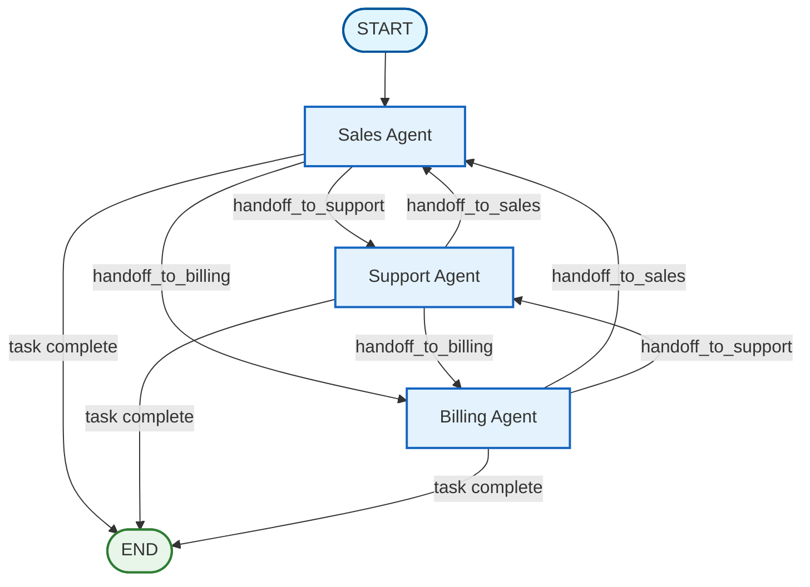

# Agent Handoffs

## Overview

Agent handoffs enable peer-to-peer collaboration where agents explicitly transfer control to other agents based on their expertise boundaries. Unlike the supervisor pattern where a central coordinator makes routing decisions, handoffs give individual agents the autonomy to decide when and to whom to transfer conversations.

## Architecture



## When to Use

Use agent handoffs when:

- **Clear role boundaries**: Each agent has well-defined expertise areas
- **Service scenarios**: Customer service, triage, support workflows
- **Agent autonomy**: Agents can assess their own capabilities
- **Peer collaboration**: Direct agent-to-agent communication is natural
- **Linear handoff chains**: Expected flow is mostly sequential transfers

## Supervisor vs Handoffs

| Aspect | Supervisor Pattern | Handoff Pattern |
|--------|-------------------|-----------------|
| **Decision Making** | Central supervisor decides routing | Individual agents decide handoffs |
| **Structure** | Hierarchical (supervisor + workers) | Peer-to-peer (equal agents) |
| **Routing Mechanism** | Supervisor analyzes task + progress | Agents use tools to signal handoff |
| **Communication** | All through supervisor | Direct agent-to-agent |
| **Agent Autonomy** | Low (supervisor controls) | High (agents control) |
| **Best For** | Complex multi-step tasks | Service/triage scenarios |
| **Example** | Research → Code → Review | Sales → Support → Billing |

## Key Components

### 1. State Schema

```python
from typing import Annotated
from typing_extensions import TypedDict
from langgraph.graph.message import add_messages
import operator

class HandoffState(TypedDict):
    messages: Annotated[list, add_messages]      # Conversation history
    task: str                                     # User's request
    current_agent: str                            # Currently active agent
    handoff_target: str                           # Agent to hand off to
    context: Annotated[list[dict], operator.add]  # Accumulated work
    handoff_history: Annotated[list[str], operator.add]  # Handoff chain
    iteration: int                                # Handoff count
    max_iterations: int                           # Safety limit
    final_result: str                             # Final response
```

### 2. Handoff Tools

Handoff tools enable agents to explicitly transfer control:

```python
from langgraph_ollama_local.patterns.handoffs import create_handoff_tool

# Create handoff tools
handoff_to_support = create_handoff_tool(
    target_agent="support",
    description="Transfer to support for technical issues or bugs",
)

handoff_to_billing = create_handoff_tool(
    target_agent="billing",
    description="Transfer to billing for payment or invoice questions",
)

handoff_to_sales = create_handoff_tool(
    target_agent="sales",
    description="Transfer to sales for product questions or purchases",
)
```

**Tool Behavior:**
- Tool name format: `handoff_to_<agent>`
- Takes `reason` parameter: Brief explanation for the handoff
- Returns confirmation message
- Signals routing system to transfer control

### 3. Agent Nodes

Each agent can:
1. Process requests in their domain
2. Use handoff tools when requests are outside their expertise

```python
from langgraph_ollama_local.patterns.handoffs import create_handoff_agent_node

sales_agent = create_handoff_agent_node(
    llm,
    agent_name="sales",
    agent_role="Handle product inquiries, pricing, and sales",
    handoff_tools=[handoff_to_support, handoff_to_billing],
)

support_agent = create_handoff_agent_node(
    llm,
    agent_name="support",
    agent_role="Handle technical issues and troubleshooting",
    handoff_tools=[handoff_to_billing, handoff_to_sales],
)

billing_agent = create_handoff_agent_node(
    llm,
    agent_name="billing",
    agent_role="Handle payments, invoices, and refunds",
    handoff_tools=[handoff_to_sales, handoff_to_support],
)
```

**Agent Behavior:**
- Receives task and previous context
- Decides whether to handle or hand off
- If handling: Provides response, sets `handoff_target = ""`
- If handing off: Uses handoff tool, sets `handoff_target = <agent>`

### 4. Routing Logic

Routing is based on agent decisions:

```python
from langgraph_ollama_local.patterns.handoffs import route_handoffs

def route_handoffs(state):
    """
    Route based on handoff decisions.

    - If handoff_target is set → route to that agent
    - If no handoff → agent completed task → go to completion
    - If at max iterations → force completion
    """
    if state["iteration"] >= state["max_iterations"]:
        return "complete"

    if state["handoff_target"]:
        return state["handoff_target"]  # Route to specified agent

    return "complete"  # No handoff means task complete
```

### 5. Graph Construction

```python
from langgraph.graph import StateGraph, START, END
from langgraph_ollama_local.patterns.handoffs import create_handoff_graph

# Method 1: Using the builder function
graph = create_handoff_graph(
    llm,
    agents={
        "sales": ("Handle sales inquiries", [handoff_to_support, handoff_to_billing]),
        "support": ("Handle technical issues", [handoff_to_billing, handoff_to_sales]),
        "billing": ("Handle payments", [handoff_to_sales, handoff_to_support]),
    },
    entry_agent="sales",  # First agent handles all requests
    max_iterations=10,
)

# Method 2: Manual construction
workflow = StateGraph(HandoffState)

# Add agent nodes
workflow.add_node("sales", sales_agent)
workflow.add_node("support", support_agent)
workflow.add_node("billing", billing_agent)
workflow.add_node("complete", complete_node)

# Entry point
workflow.add_edge(START, "sales")

# Conditional edges for each agent
for agent_name in ["sales", "support", "billing"]:
    workflow.add_conditional_edges(
        agent_name,
        route_handoffs,
        {
            "sales": "sales",
            "support": "support",
            "billing": "billing",
            "complete": "complete",
        },
    )

# End
workflow.add_edge("complete", END)

graph = workflow.compile()
```

## Usage

### Basic Usage

```python
from langgraph_ollama_local import LocalAgentConfig
from langgraph_ollama_local.patterns.handoffs import (
    create_handoff_graph,
    create_handoff_tool,
    run_handoff_conversation,
)

config = LocalAgentConfig()
llm = config.create_chat_client()

# Create handoff tools
handoff_to_support = create_handoff_tool("support", "Technical issues")
handoff_to_billing = create_handoff_tool("billing", "Payment questions")
handoff_to_sales = create_handoff_tool("sales", "Product questions")

# Build graph
graph = create_handoff_graph(
    llm,
    agents={
        "sales": (
            "Handle product inquiries and sales",
            [handoff_to_support, handoff_to_billing],
        ),
        "support": (
            "Handle technical issues",
            [handoff_to_billing, handoff_to_sales],
        ),
        "billing": (
            "Handle payments and invoices",
            [handoff_to_sales, handoff_to_support],
        ),
    },
    entry_agent="sales",
)

# Run conversation
result = run_handoff_conversation(
    graph,
    "My app keeps crashing when I export data",
    entry_agent="sales",
    max_iterations=5,
)

print(result["final_result"])
print("Handoff chain:", " -> ".join(result["handoff_history"]))
```

### Manual Invocation

```python
from langchain_core.messages import HumanMessage

initial_state = {
    "messages": [HumanMessage(content="I need help with my invoice")],
    "task": "I need help with my invoice",
    "current_agent": "sales",
    "handoff_target": "",
    "context": [],
    "handoff_history": [],
    "iteration": 0,
    "max_iterations": 5,
    "final_result": "",
}

result = graph.invoke(initial_state)

# Access results
print("Final result:", result["final_result"])
print("Agents involved:", [c["agent"] for c in result["context"]])
print("Handoffs:", result["handoff_history"])
print("Total iterations:", result["iteration"])
```

## Best Practices

### 1. Define Clear Agent Boundaries

```python
# Good: Clear, distinct roles
agents = {
    "sales": ("Product questions, pricing, purchases", [...]),
    "support": ("Technical issues, troubleshooting, how-to", [...]),
    "billing": ("Payments, invoices, refunds, account billing", [...]),
}

# Bad: Overlapping responsibilities
agents = {
    "general": ("Handle everything", [...]),
    "specialist": ("Also handle everything", [...]),
}
```

### 2. Provide Handoff Guidance

```python
# Good: Specific, actionable descriptions
handoff_to_support = create_handoff_tool(
    "support",
    "Transfer for: app crashes, error messages, login issues, feature not working",
)

# Bad: Vague descriptions
handoff_to_support = create_handoff_tool(
    "support",
    "Transfer for support stuff",
)
```

### 3. Set Reasonable Iteration Limits

```python
# Good: Prevents infinite loops, allows necessary handoffs
graph = create_handoff_graph(llm, agents, max_iterations=5)

# Bad: Too low (prevents necessary handoffs)
graph = create_handoff_graph(llm, agents, max_iterations=1)

# Bad: Too high (allows excessive handoffs)
graph = create_handoff_graph(llm, agents, max_iterations=50)
```

## Common Patterns

### Customer Service Triage

```python
# Entry: Sales handles all requests, hands off as needed
agents = {
    "sales": ("Product info, pricing", [to_support, to_billing]),
    "support": ("Technical help", [to_billing, to_sales]),
    "billing": ("Payments, refunds", [to_sales, to_support]),
}
entry_agent = "sales"
```

### Technical Support Escalation

```python
# Entry: L1 support, escalates to L2/L3
agents = {
    "l1_support": ("Basic troubleshooting", [to_l2, to_billing]),
    "l2_support": ("Advanced troubleshooting", [to_l3, to_l1]),
    "l3_support": ("Engineering escalation", [to_l2]),
    "billing": ("Account issues", [to_l1]),
}
entry_agent = "l1_support"
```

### Medical Triage

```python
# Entry: Intake nurse, routes to specialists
agents = {
    "intake": ("Initial assessment", [to_general, to_urgent, to_mental]),
    "general": ("General medicine", [to_specialist]),
    "urgent": ("Urgent care", [to_emergency]),
    "mental": ("Mental health", [to_crisis]),
}
entry_agent = "intake"
```

## Common Pitfalls

| Pitfall | Solution |
|---------|----------|
| **Infinite handoff loops** | Set `max_iterations` to reasonable value (5-10) |
| **Unclear handoff reasons** | Provide specific tool descriptions |
| **Lost context** | System preserves context automatically |
| **Too many handoffs** | Review agent roles for overlap |
| **Wrong entry agent** | Choose triage/generalist as entry |
| **Agents don't complete tasks** | Instruct agents to avoid unnecessary handoffs |

## Related Patterns

- [Multi-Agent Collaboration](14-multi-agent-collaboration.md) - Supervisor pattern for comparison
- [Hierarchical Teams](15-hierarchical-teams.md) - Nested team structures
- [Subgraph Patterns](16-subgraphs.md) - Composable graph components

## Quiz

Test your understanding of agent handoffs:

<Quiz
  question="What is the key difference between supervisor and handoff patterns?"
  tutorial-id="17-agent-handoffs"
  :options="[
    { text: 'Handoffs are inherently faster than supervisor patterns', correct: false },
    { text: 'In handoffs, agents decide routing themselves; in supervisor, a central coordinator decides', correct: true },
    { text: 'Handoffs always use fewer LLM calls', correct: false },
    { text: 'Supervisor pattern requires more agents to function', correct: false }
  ]"
  explanation="The handoff pattern is decentralized with agents making their own routing decisions via handoff tools, while the supervisor pattern has a central coordinator that analyzes progress and routes work to agents. This is the fundamental architectural difference."
  :hints="[
    { text: 'Think about who makes the decision about which agent works next', penalty: 10 },
    { text: 'In handoffs, agents have high autonomy to decide transfers', penalty: 15 }
  ]"
/>

<Quiz
  question="What is the purpose of handoff tools in the agent handoff pattern?"
  tutorial-id="17-agent-handoffs"
  :options="[
    { text: 'To call external APIs and fetch data', correct: false },
    { text: 'To enable agents to explicitly transfer control to other peer agents', correct: true },
    { text: 'To validate and approve agent responses before output', correct: false },
    { text: 'To store and retrieve conversation history', correct: false }
  ]"
  explanation="Handoff tools allow agents to signal when they want to transfer control to a specific peer agent, including a reason for the handoff. The routing system then directs the conversation to the target agent."
  :hints="[
    { text: 'The tool name format is handoff_to_<agent>', penalty: 10 },
    { text: 'Agents use these tools to say I cannot handle this, send to X', penalty: 15 }
  ]"
/>

<Quiz
  question="What scenario is best suited for the handoff pattern over the supervisor pattern?"
  tutorial-id="17-agent-handoffs"
  :options="[
    { text: 'Complex research and analysis tasks requiring iteration', correct: false },
    { text: 'Customer service triage with clear expertise boundaries between agents', correct: true },
    { text: 'Tasks requiring multiple review cycles', correct: false },
    { text: 'Multi-step code generation and review pipelines', correct: false }
  ]"
  explanation="Handoffs excel in service/triage scenarios like customer support where agents have clear, distinct domains (sales, support, billing) and can autonomously decide when to transfer based on expertise boundaries."
  :hints="[
    { text: 'Think about scenarios where each agent has a clear, bounded area of expertise', penalty: 10 },
    { text: 'Customer service is the classic example - sales, support, billing are distinct', penalty: 15 }
  ]"
/>

<Quiz
  question="What happens when an agent sets handoff_target to an empty string?"
  tutorial-id="17-agent-handoffs"
  :options="[
    { text: 'The system throws an error', correct: false },
    { text: 'The supervisor takes over routing', correct: false },
    { text: 'The task is considered complete and routes to completion', correct: true },
    { text: 'The conversation continues with the same agent', correct: false }
  ]"
  explanation="When an agent sets handoff_target to an empty string, it signals that the agent has handled the request and no further handoff is needed. The routing logic then directs to the completion node."
  :hints="[
    { text: 'Look at the route_handoffs function in the tutorial', penalty: 10 },
    { text: 'Empty handoff_target means the agent completed their work', penalty: 15 }
  ]"
/>

<Quiz
  question="Why is setting a reasonable max_iterations limit important in the handoff pattern?"
  tutorial-id="17-agent-handoffs"
  :options="[
    { text: 'To reduce API costs', correct: false },
    { text: 'To prevent infinite handoff loops between agents', correct: true },
    { text: 'To improve response quality', correct: false },
    { text: 'To ensure all agents get called at least once', correct: false }
  ]"
  explanation="The max_iterations limit is a safety mechanism that prevents infinite loops where agents keep handing off to each other without completing the task. A value of 5-10 is usually reasonable for most scenarios."
  :hints="[
    { text: 'What could happen if agents keep handing off without limit?', penalty: 10 },
    { text: 'The Common Pitfalls table lists infinite handoff loops as a key issue', penalty: 15 }
  ]"
/>

---

<div class="tutorial-nav">
  <a href="16-subgraphs.md" class="nav-link prev">← Previous: Subgraph Patterns</a>
  <a href="18-agent-swarm.md" class="nav-link next">Next: Agent Swarm →</a>
</div>
