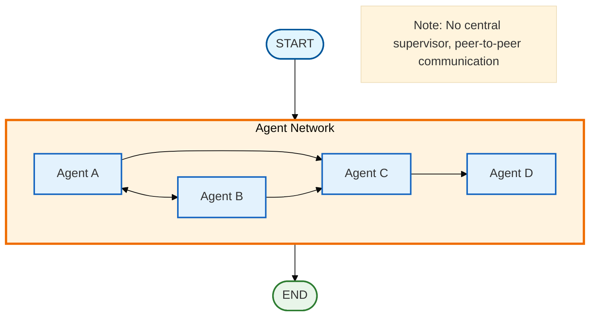

# Agent Swarm/Network

## Overview

The agent swarm pattern enables decentralized, peer-to-peer agent collaboration without a central supervisor. Agents communicate directly, share context, and dynamically decide which peer should work next. This creates flexible, adaptive systems where complex behaviors emerge from simple local interactions.

## Architecture



## When to Use

Use agent swarms when:

- **Decentralized decision-making is preferred**: No single point of control
- **Tasks benefit from adaptive routing**: Agents choose best peers dynamically
- **Rich context sharing is needed**: All agents see all work
- **Emergent behavior is desired**: Complex patterns from simple rules
- **Network topology matters**: Define specific agent connections
- **Flexible collaboration**: Agents adapt based on peer outputs

## Key Components

### 1. State Schema

The swarm state differs from supervisor state in key ways:

```python
from typing import Annotated, Any
from typing_extensions import TypedDict
from langgraph.graph.message import add_messages
import operator

class SwarmState(TypedDict):
    messages: Annotated[list, add_messages]         # Conversation history
    task: str                                        # Overall task
    agents_state: dict[str, dict[str, Any]]         # Per-agent state
    shared_context: Annotated[list[dict], operator.add]  # Accumulated outputs
    current_agent: str                               # Current agent (set by peer)
    iteration: int                                   # Current iteration
    max_iterations: int                              # Safety limit
    final_result: str                                # Aggregated result
```

**Key differences from supervisor pattern:**
- `agents_state`: Per-agent state tracking (not centralized)
- `shared_context`: All agents see all outputs (full transparency)
- `current_agent`: Set by previous agent, not by supervisor

### 2. Agent Configuration

Define agents with their connections (network topology):

```python
from pydantic import BaseModel, Field

class SwarmAgent(BaseModel):
    name: str = Field(description="Unique name for the agent")
    system_prompt: str = Field(description="System prompt defining role")
    connections: list[str] = Field(
        default_factory=list,
        description="List of agent names this agent can hand off to"
    )
    tools: list | None = Field(default=None, description="Optional tools")
```

Example swarm configuration:

```python
agents = [
    SwarmAgent(
        name="researcher",
        system_prompt="Research and gather information",
        connections=["analyst", "fact_checker"],  # Can route to either
    ),
    SwarmAgent(
        name="analyst",
        system_prompt="Analyze findings",
        connections=["writer"],  # Routes to writer
    ),
    SwarmAgent(
        name="fact_checker",
        system_prompt="Verify claims",
        connections=["analyst", "writer"],  # Can route to either
    ),
    SwarmAgent(
        name="writer",
        system_prompt="Write final report",
        connections=[],  # Terminal node
    ),
]
```

### 3. Swarm Routing Function

Unlike supervisor pattern, routing simply reads the peer's decision:

```python
def route_swarm(state: SwarmState) -> str:
    """Route based on previous agent's decision."""
    if state["iteration"] >= state["max_iterations"]:
        return "aggregate"
    if state["current_agent"] == "DONE" or not state["current_agent"]:
        return "aggregate"
    return state["current_agent"]  # Route to peer's choice
```

**Key difference**: No central decision-maker! Each agent sets `current_agent` for the next peer.

### 4. Graph Construction

```python
from langgraph.graph import StateGraph, START, END
from langgraph_ollama_local.patterns.swarm import create_swarm_graph

graph = create_swarm_graph(llm, agents, entry_agent="researcher")
```

## Usage

### Basic Usage

```python
from langgraph_ollama_local import LocalAgentConfig
from langgraph_ollama_local.patterns import (
    SwarmAgent,
    create_swarm_graph,
    run_swarm_task,
)

config = LocalAgentConfig()
llm = config.create_chat_client()

# Define swarm
agents = [
    SwarmAgent(
        name="researcher",
        system_prompt="Research and gather information",
        connections=["analyst"],
    ),
    SwarmAgent(
        name="analyst",
        system_prompt="Analyze findings and draw insights",
        connections=["writer"],
    ),
    SwarmAgent(
        name="writer",
        system_prompt="Write comprehensive report",
        connections=[],  # Terminal
    ),
]

# Create and run
graph = create_swarm_graph(llm, agents)
result = run_swarm_task(
    graph,
    "Research the benefits of microservices architecture",
    max_iterations=8
)

print(result["final_result"])
```

### With Tools

```python
from langchain_core.tools import tool

@tool
def search_web(query: str) -> str:
    """Search the web."""
    # Implementation
    return "Search results..."

agents = [
    SwarmAgent(
        name="researcher",
        system_prompt="Research using web search",
        connections=["analyst"],
        tools=[search_web],  # Provide tools
    ),
    # ... other agents
]

graph = create_swarm_graph(llm, agents)
```

### Custom Entry Agent

```python
# Start with a specific agent
graph = create_swarm_graph(
    llm,
    agents,
    entry_agent="fact_checker"  # Start here instead of first agent
)
```

## Network Topologies

### Fully Connected

Every agent can communicate with every other agent:

```python
agents = [
    SwarmAgent(name="a", system_prompt="...", connections=["b", "c", "d"]),
    SwarmAgent(name="b", system_prompt="...", connections=["a", "c", "d"]),
    SwarmAgent(name="c", system_prompt="...", connections=["a", "b", "d"]),
    SwarmAgent(name="d", system_prompt="...", connections=["a", "b", "c"]),
]
```

**Use when:** Maximum flexibility needed

### Linear Pipeline

Agents form a sequential pipeline:

```python
agents = [
    SwarmAgent(name="a", system_prompt="...", connections=["b"]),
    SwarmAgent(name="b", system_prompt="...", connections=["c"]),
    SwarmAgent(name="c", system_prompt="...", connections=["d"]),
    SwarmAgent(name="d", system_prompt="...", connections=[]),
]
```

**Use when:** Clear sequential workflow

### Star Network

One central agent connects to all others:

```python
agents = [
    SwarmAgent(name="hub", system_prompt="...", connections=["a", "b", "c"]),
    SwarmAgent(name="a", system_prompt="...", connections=["hub"]),
    SwarmAgent(name="b", system_prompt="...", connections=["hub"]),
    SwarmAgent(name="c", system_prompt="...", connections=["hub"]),
]
```

**Use when:** Central coordination with peer specialization

### Custom Topology

Define specific communication patterns:

```python
agents = [
    SwarmAgent(name="researcher", connections=["analyst", "fact_checker"]),
    SwarmAgent(name="analyst", connections=["writer"]),
    SwarmAgent(name="fact_checker", connections=["analyst", "writer"]),
    SwarmAgent(name="writer", connections=[]),
]
```

## Best Practices

1. **Design clear connections**: Define agent connections that match your task structure
2. **Set reasonable max_iterations**: Swarms can iterate more than supervisors (8-12 typical)
3. **Share context wisely**: Use `share_context=False` for internal work
4. **Validate topology**: Ensure all connections reference valid agents
5. **Use terminal nodes**: Have at least one agent with no connections
6. **Monitor iterations**: Track which agents contribute and how often
7. **Test routing logic**: Verify agents make sensible routing decisions

## Comparison: Swarm vs Supervisor

| Aspect | Supervisor Pattern | Swarm Pattern |
|--------|-------------------|---------------|
| **Control** | Centralized (supervisor decides) | Decentralized (peers decide) |
| **Routing** | Supervisor routes all agents | Each agent routes to peers |
| **Context** | Supervisor sees all, agents see subset | All agents see all context |
| **Topology** | Star (hub-and-spoke) | Any (define connections) |
| **Iteration** | Supervisor controls flow | Emerges from peer decisions |
| **Scalability** | Supervisor is bottleneck | Distributed decision-making |
| **Predictability** | More predictable | Less predictable (emergent) |
| **Debugging** | Easier (central control) | Harder (distributed) |
| **Flexibility** | Fixed routing logic | Adaptive routing |
| **Best for** | Structured, hierarchical tasks | Flexible, collaborative tasks |

## When to Use Each

### Use Swarm Pattern when:
- Tasks benefit from flexible, adaptive routing
- No clear hierarchical structure exists
- Agents need rich context from all peers
- Emergent behavior is desired
- Decentralized decision-making is preferred
- Network topology is important

### Use Supervisor Pattern when:
- Clear task structure and agent roles
- Centralized control and monitoring needed
- Predictable routing is important
- Quality control via central oversight
- Simpler to reason about and debug
- Sequential or parallel agent execution

### Hybrid Approach:
- Use hierarchical teams where each team is a swarm
- Combine supervisor coordination with swarm sub-teams
- Use swarms for exploration, supervisors for orchestration

## Common Patterns

### Research Swarm

```python
agents = [
    SwarmAgent(name="researcher", connections=["analyst", "fact_checker"]),
    SwarmAgent(name="analyst", connections=["writer"]),
    SwarmAgent(name="fact_checker", connections=["analyst"]),
    SwarmAgent(name="writer", connections=[]),
]
```

### Analysis Pipeline

```python
agents = [
    SwarmAgent(name="collector", connections=["preprocessor"]),
    SwarmAgent(name="preprocessor", connections=["analyzer"]),
    SwarmAgent(name="analyzer", connections=["reporter", "validator"]),
    SwarmAgent(name="validator", connections=["reporter"]),
    SwarmAgent(name="reporter", connections=[]),
]
```

### Collaborative Editing

```python
agents = [
    SwarmAgent(name="drafter", connections=["reviewer", "editor"]),
    SwarmAgent(name="reviewer", connections=["editor", "drafter"]),
    SwarmAgent(name="editor", connections=["reviewer", "finalizer"]),
    SwarmAgent(name="finalizer", connections=[]),
]
```

## Related Patterns

- [Multi-Agent Collaboration](14-multi-agent-collaboration.md) - Supervisor pattern
- [Hierarchical Teams](15-hierarchical-teams.md) - Nested team structures
- [Subgraph Patterns](16-subgraphs.md) - Composable graph components

## Quiz

Test your understanding of agent swarm/network patterns:

<Quiz
  question="What is the key characteristic that distinguishes swarm pattern from supervisor pattern?"
  tutorial-id="18-agent-swarm"
  :options="[
    { text: 'Swarms always use fewer agents than supervisor patterns', correct: false },
    { text: 'Swarms have decentralized decision-making where agents route directly to peers', correct: true },
    { text: 'Swarms execute faster due to optimized routing', correct: false },
    { text: 'Swarms require less code to implement', correct: false }
  ]"
  explanation="In the swarm pattern, there is no central supervisor. Instead, each agent decides which peer agent should work next, creating a decentralized, peer-to-peer collaboration system where routing emerges from local decisions."
  :hints="[
    { text: 'Think about control: is it centralized or distributed?', penalty: 10 },
    { text: 'In swarms, agents directly decide their successor without a coordinator', penalty: 15 }
  ]"
/>

<Quiz
  question="What does the 'connections' field in SwarmAgent configuration represent?"
  tutorial-id="18-agent-swarm"
  :options="[
    { text: 'Database connections for the agent to use', correct: false },
    { text: 'API endpoints the agent can call', correct: false },
    { text: 'Other agents this agent can route work to (network topology)', correct: true },
    { text: 'Tools the agent has access to', correct: false }
  ]"
  explanation="The connections field defines the network topology by listing which other agents a given agent can hand off work to, determining the possible routing paths in the swarm. An empty connections list indicates a terminal node."
  :hints="[
    { text: 'Think about who each agent can talk to or pass work to', penalty: 10 },
    { text: 'The connections define the graph structure of the swarm', penalty: 15 }
  ]"
/>

<Quiz
  question="When should you prefer swarm pattern over supervisor pattern?"
  tutorial-id="18-agent-swarm"
  :options="[
    { text: 'When you need predictable, structured task execution with clear quality control', correct: false },
    { text: 'When tasks benefit from flexible, adaptive routing and emergent behavior', correct: true },
    { text: 'When you have only 2-3 agents to coordinate', correct: false },
    { text: 'When debugging and tracing are the top priorities', correct: false }
  ]"
  explanation="Swarms excel when tasks benefit from flexible collaboration, adaptive routing based on context, and emergent behaviors from peer interactions, rather than fixed hierarchical workflows. Supervisors are better for predictable, controlled execution."
  :hints="[
    { text: 'Swarms trade predictability for flexibility', penalty: 10 },
    { text: 'When you want complex patterns to emerge from simple rules, use swarms', penalty: 15 }
  ]"
/>

<Quiz
  question="What network topology would you use if every agent needs to be able to route to every other agent?"
  tutorial-id="18-agent-swarm"
  :options="[
    { text: 'Linear Pipeline topology', correct: false },
    { text: 'Star Network topology', correct: false },
    { text: 'Fully Connected topology', correct: true },
    { text: 'Custom Topology', correct: false }
  ]"
  explanation="In a Fully Connected topology, every agent lists all other agents in their connections field, enabling maximum routing flexibility. This is useful when any agent may need to route to any other agent based on the task context."
  :hints="[
    { text: 'Look at the Network Topologies section in the tutorial', penalty: 10 },
    { text: 'Fully connected means everyone can talk to everyone', penalty: 15 }
  ]"
/>

<Quiz
  question="How does context sharing differ between swarm and supervisor patterns?"
  tutorial-id="18-agent-swarm"
  :options="[
    { text: 'Supervisor shares more context than swarm', correct: false },
    { text: 'In swarms, all agents see all context (full transparency); in supervisor, agents may see a subset', correct: true },
    { text: 'There is no difference in context sharing', correct: false },
    { text: 'Swarms do not support context sharing', correct: false }
  ]"
  explanation="In the swarm pattern, shared_context is accumulated and all agents can see all outputs (full transparency). In the supervisor pattern, the supervisor sees all context but may selectively share relevant portions with individual agents."
  :hints="[
    { text: 'Check the comparison table in the tutorial', penalty: 10 },
    { text: 'Swarms promote transparency while supervisors can filter context', penalty: 15 }
  ]"
/>

---

<div class="tutorial-nav">
  <a href="17-agent-handoffs.md" class="nav-link prev">← Previous: Agent Handoffs</a>
  <a href="19-map-reduce-agents.md" class="nav-link next">Next: Map-Reduce Agents →</a>
</div>
