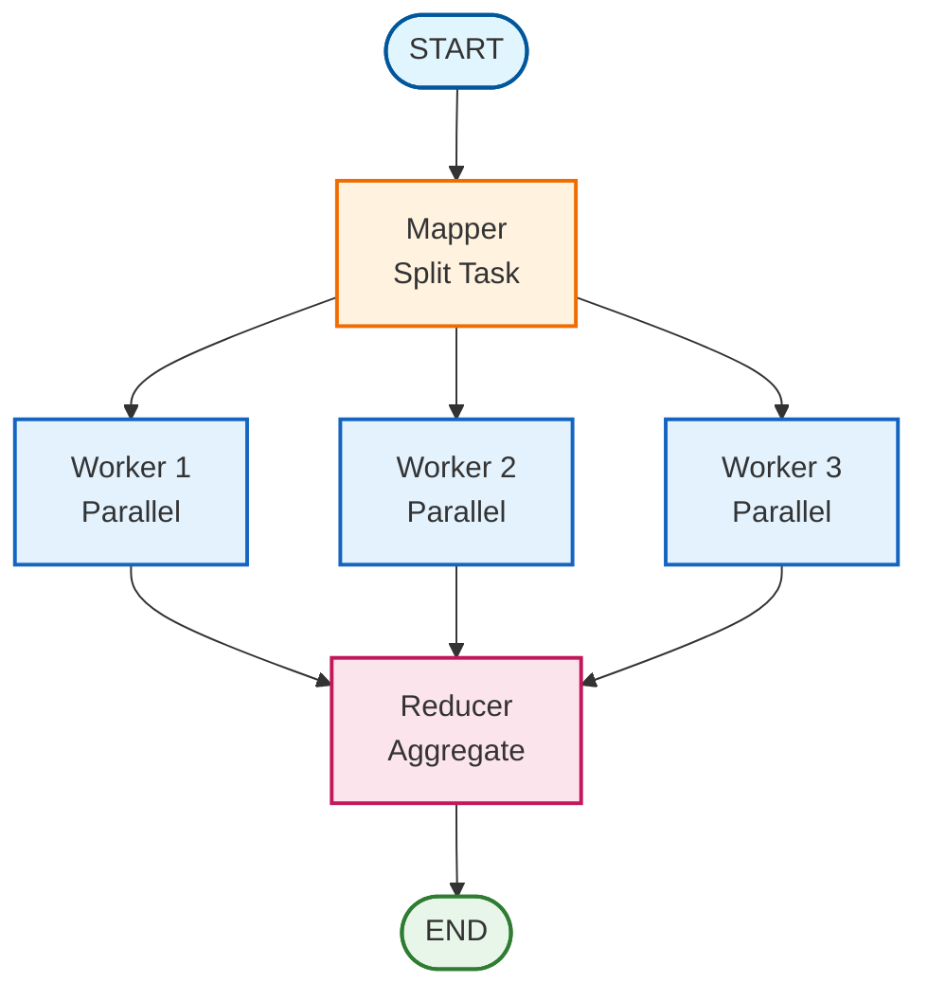

# Map-Reduce Agents

## Overview

The map-reduce pattern enables parallel agent execution with result aggregation. This pattern is ideal for tasks that can be split into independent subtasks, processed in parallel, and then synthesized into a final result.

## Architecture



## When to Use

Use map-reduce when:

- **Tasks are parallelizable**: Subtasks can be completed independently
- **Speed matters**: Parallel execution is faster than sequential
- **Scale is needed**: Large workloads benefit from distributed processing
- **No interdependencies**: Workers don't need to coordinate with each other

## Common Use Cases

### 1. Document Analysis
Each worker analyzes a section of a document, and the reducer synthesizes findings.

```python
task = "Analyze this research paper in detail"
# Mapper splits into: intro, methods, results, conclusion
# Workers analyze their sections in parallel
# Reducer combines all analyses
```

### 2. Multi-Perspective Analysis
Each worker takes a different perspective on the same topic.

```python
task = "Analyze AI impact on society"
# Mapper creates: economic, ethical, technological perspectives
# Workers each analyze from their perspective
# Reducer synthesizes all perspectives
```

### 3. Large-Scale Data Processing
Each worker processes a chunk of data independently.

```python
task = "Process customer feedback from Q4"
# Mapper splits by category or time period
# Workers process their chunks
# Reducer aggregates insights
```

## Key Components

### 1. State Schema

```python
from typing import Annotated
from typing_extensions import TypedDict
import operator

class MapReduceState(TypedDict):
    task: str                                        # Main task
    subtasks: list[str]                              # Created by mapper
    worker_results: Annotated[list[dict], operator.add]  # Accumulated outputs
    final_result: str                                # Aggregated result
```

### 2. Mapper Node

The mapper splits the task into independent subtasks:

```python
from pydantic import BaseModel, Field

class MapperOutput(BaseModel):
    subtasks: list[str] = Field(description="List of independent subtasks")
    reasoning: str = Field(description="Explanation of split")

def create_mapper_node(llm, num_workers=3):
    structured_llm = llm.with_structured_output(MapperOutput)

    def mapper(state):
        output = structured_llm.invoke([
            SystemMessage(content=f"Split into {num_workers} subtasks"),
            HumanMessage(content=f"Task: {state['task']}")
        ])
        return {"subtasks": output.subtasks[:num_workers]}

    return mapper
```

### 3. Worker Nodes

Workers process subtasks independently:

```python
def create_worker_node(llm, worker_id, worker_prompt=""):
    def worker(state):
        subtask = state["subtasks"][worker_id]

        response = llm.invoke([
            SystemMessage(content=f"Process your subtask. {worker_prompt}"),
            HumanMessage(content=f"Subtask: {subtask}")
        ])

        return {
            "worker_results": [{
                "worker_id": worker_id,
                "subtask": subtask,
                "output": response.content,
            }]
        }

    return worker
```

### 4. Reducer Node

The reducer aggregates all worker results:

```python
class ReducerOutput(BaseModel):
    final_result: str = Field(description="Synthesized result")
    summary: str = Field(description="Brief summary")

def create_reducer_node(llm):
    structured_llm = llm.with_structured_output(ReducerOutput)

    def reducer(state):
        # Combine all worker outputs
        results_text = "\n\n".join([
            f"Worker {r['worker_id']}: {r['output']}"
            for r in state["worker_results"]
        ])

        output = structured_llm.invoke([
            SystemMessage(content="Synthesize all results"),
            HumanMessage(content=f"Results:\n{results_text}")
        ])

        return {"final_result": output.final_result}

    return reducer
```

## Graph Construction

### Basic Graph

```python
from langgraph.graph import StateGraph, START, END

workflow = StateGraph(MapReduceState)

# Add nodes
workflow.add_node("mapper", create_mapper_node(llm, num_workers=3))
for i in range(3):
    workflow.add_node(f"worker_{i}", create_worker_node(llm, i))
workflow.add_node("reducer", create_reducer_node(llm))

# Build structure
workflow.add_edge(START, "mapper")

# Fan-out: mapper to all workers (parallel)
for i in range(3):
    workflow.add_edge("mapper", f"worker_{i}")

# Fan-in: all workers to reducer
for i in range(3):
    workflow.add_edge(f"worker_{i}", "reducer")

workflow.add_edge("reducer", END)

graph = workflow.compile()
```

### Execution

```python
result = graph.invoke({
    "task": "Analyze this document comprehensively",
    "subtasks": [],
    "worker_results": [],
    "final_result": "",
})

print(result["final_result"])
```

## Advanced Patterns

### Specialized Workers

Give each worker a specific role:

```python
worker_prompts = [
    "Focus on technical aspects",
    "Focus on business impact",
    "Focus on user experience",
]

for i in range(3):
    workflow.add_node(
        f"worker_{i}",
        create_worker_node(llm, i, worker_prompts[i])
    )
```

### Custom LLMs per Role

Use different models for different roles:

```python
from langgraph_ollama_local.patterns import create_custom_map_reduce_graph

graph = create_custom_map_reduce_graph(
    mapper_llm=ChatOllama(model="llama3.1:70b"),    # Larger for planning
    worker_llm=ChatOllama(model="llama3.1:8b"),     # Smaller for processing
    reducer_llm=ChatOllama(model="llama3.1:70b"),   # Larger for synthesis
    num_workers=5
)
```

### Dynamic Worker Count

Adjust workers based on task complexity:

```python
def determine_workers(task: str) -> int:
    """Determine optimal worker count based on task."""
    # Simple heuristic: more workers for longer tasks
    if len(task) > 1000:
        return 5
    elif len(task) > 500:
        return 3
    else:
        return 2

num_workers = determine_workers(task)
graph = create_map_reduce_graph(llm, num_workers=num_workers)
```

## Pattern Comparison

### Map-Reduce vs Supervisor Pattern

| Aspect | Map-Reduce | Supervisor |
|--------|------------|------------|
| **Execution** | Parallel workers | Sequential agents |
| **Coordination** | None (independent) | High (supervisor decides) |
| **Use Case** | Independent subtasks | Interdependent tasks |
| **Speed** | Fast (parallel) | Slower (sequential) |
| **Complexity** | Simple (fan-out/fan-in) | Complex (routing logic) |

### Map-Reduce vs Hierarchical Teams

| Aspect | Map-Reduce | Hierarchical |
|--------|------------|--------------|
| **Structure** | Flat (mapper-workers-reducer) | Nested (teams and supervisors) |
| **Coordination** | Minimal | High (multi-level) |
| **Scalability** | Horizontal (add workers) | Vertical (add teams) |
| **Complexity** | Low | High |

## Best Practices

### 1. Task Decomposition

Ensure subtasks are truly independent:

```python
# Good: Independent sections
subtasks = [
    "Analyze introduction section",
    "Analyze methodology section",
    "Analyze results section",
]

# Bad: Sequential dependencies
subtasks = [
    "Read the document",
    "Based on reading, identify themes",  # Depends on first
    "Based on themes, write summary",     # Depends on second
]
```

### 2. Load Balancing

Create subtasks of similar complexity:

```python
# Good: Balanced subtasks
subtasks = [
    "Analyze chapters 1-3",
    "Analyze chapters 4-6",
    "Analyze chapters 7-9",
]

# Bad: Unbalanced
subtasks = [
    "Analyze chapter 1",
    "Analyze chapters 2-9",  # Much more work
]
```

### 3. Error Handling

Handle cases where workers fail:

```python
def reducer_with_error_handling(state):
    results = state.get("worker_results", [])

    if not results:
        return {"final_result": "No results available"}

    # Check for incomplete results
    if len(results) < expected_workers:
        partial_note = f"Note: Only {len(results)}/{expected_workers} workers completed."
    else:
        partial_note = ""

    # Synthesize available results
    synthesis = synthesize_results(results)

    return {"final_result": f"{synthesis}\n\n{partial_note}"}
```

### 4. Result Quality

Ensure reducer does true synthesis, not just concatenation:

```python
# Good: Synthesis with analysis
reducer_prompt = """
Synthesize the worker results by:
1. Identifying common themes across all outputs
2. Resolving any conflicts or inconsistencies
3. Organizing information logically
4. Providing integrated insights
"""

# Bad: Simple concatenation
# Don't just join worker outputs with "\n\n".join()
```

## Performance Considerations

### Worker Count

More workers ≠ always better:

- **Too few**: Underutilized parallelism
- **Too many**: Overhead, diminishing returns
- **Sweet spot**: Usually 3-5 workers for most tasks

### LLM Selection

Choose models based on role requirements:

```python
# Mapper: Needs good reasoning (larger model)
mapper_llm = ChatOllama(model="llama3.1:70b")

# Workers: Can use smaller models (parallel execution)
worker_llm = ChatOllama(model="llama3.1:8b")

# Reducer: Needs synthesis ability (larger model)
reducer_llm = ChatOllama(model="llama3.1:70b")
```

## Complete Example

```python
from langgraph_ollama_local import LocalAgentConfig
from langgraph_ollama_local.patterns import (
    create_map_reduce_graph,
    run_map_reduce_task,
)

# Setup
config = LocalAgentConfig()
llm = config.create_chat_client()

# Create graph
graph = create_map_reduce_graph(
    llm,
    num_workers=3,
    worker_prompt="Provide detailed analysis with examples."
)

# Run task
result = run_map_reduce_task(
    graph,
    """Analyze the environmental, economic, and social impacts
    of renewable energy adoption in developing countries."""
)

print(f"Processed {len(result['worker_results'])} subtasks")
print(f"\nFinal Result:\n{result['final_result']}")
```

## Related Patterns

- [Multi-Agent Collaboration](14-multi-agent-collaboration.md) - Supervisor pattern
- [Hierarchical Teams](15-hierarchical-teams.md) - Nested team structures
- [Agent Swarm](18-agent-swarm.md) - Decentralized collaboration

## Quiz

Test your understanding of map-reduce agents:

<Quiz
  question="What is the primary advantage of the map-reduce pattern?"
  tutorial-id="19-map-reduce-agents"
  :options="[
    { text: 'It uses less memory than other patterns', correct: false },
    { text: 'It enables parallel processing of independent subtasks for faster execution', correct: true },
    { text: 'It requires fewer agents than supervisor patterns', correct: false },
    { text: 'It automatically optimizes LLM model selection', correct: false }
  ]"
  explanation="The map-reduce pattern excels at parallelizing work by splitting tasks into independent subtasks that can be processed simultaneously by multiple workers, then aggregating the results. This significantly reduces total execution time for parallelizable tasks."
  :hints="[
    { text: 'Think about what happens when multiple workers can work at the same time', penalty: 10 },
    { text: 'The key benefit is speed through parallel execution', penalty: 15 }
  ]"
/>

<Quiz
  question="What is the role of the mapper in the map-reduce pattern?"
  tutorial-id="19-map-reduce-agents"
  :options="[
    { text: 'Aggregate and synthesize all worker results', correct: false },
    { text: 'Execute all subtasks sequentially', correct: false },
    { text: 'Split the main task into independent subtasks that can be processed in parallel', correct: true },
    { text: 'Monitor worker performance and handle errors', correct: false }
  ]"
  explanation="The mapper analyzes the main task and breaks it down into independent subtasks that can be processed in parallel by workers. Good task decomposition is critical for effective map-reduce execution."
  :hints="[
    { text: 'Think about the map in map-reduce - what does mapping do?', penalty: 10 },
    { text: 'The mapper transforms one task into many subtasks', penalty: 15 }
  ]"
/>

<Quiz
  question="What is the recommended worker count for most map-reduce tasks?"
  tutorial-id="19-map-reduce-agents"
  :options="[
    { text: '1-2 workers', correct: false },
    { text: '3-5 workers', correct: true },
    { text: '10-20 workers', correct: false },
    { text: 'As many workers as possible for maximum parallelism', correct: false }
  ]"
  explanation="While it depends on the task, 3-5 workers is typically the sweet spot that balances parallelism benefits with overhead. Too few underutilizes parallelism, while too many adds unnecessary overhead with diminishing returns."
  :hints="[
    { text: 'More is not always better due to coordination overhead', penalty: 10 },
    { text: 'Check the Performance Considerations section for guidance', penalty: 15 }
  ]"
/>

<Quiz
  question="What is a key best practice for task decomposition in map-reduce?"
  tutorial-id="19-map-reduce-agents"
  :options="[
    { text: 'Create subtasks with sequential dependencies for better flow', correct: false },
    { text: 'Ensure subtasks are truly independent with no dependencies between them', correct: true },
    { text: 'Make the first subtask much larger to front-load work', correct: false },
    { text: 'Always split into exactly 3 subtasks regardless of task size', correct: false }
  ]"
  explanation="Subtasks must be truly independent for map-reduce to work effectively. If subtasks have dependencies (e.g., 'Based on the previous analysis...'), they cannot be parallelized and the pattern loses its benefit."
  :hints="[
    { text: 'Workers cannot communicate with each other during execution', penalty: 10 },
    { text: 'If one subtask needs results from another, parallelism breaks', penalty: 15 }
  ]"
/>

<Quiz
  question="What should the reducer do with worker results?"
  tutorial-id="19-map-reduce-agents"
  :options="[
    { text: 'Simply concatenate all worker outputs with newlines', correct: false },
    { text: 'Pick the best single worker output and discard others', correct: false },
    { text: 'Synthesize results by identifying themes, resolving conflicts, and providing integrated insights', correct: true },
    { text: 'Average the numeric scores from each worker', correct: false }
  ]"
  explanation="A good reducer does true synthesis - identifying common themes across outputs, resolving inconsistencies, organizing information logically, and providing integrated insights. Simple concatenation wastes the opportunity for meaningful synthesis."
  :hints="[
    { text: 'The reducer is where value gets added by combining insights', penalty: 10 },
    { text: 'Look at the Result Quality best practice section', penalty: 15 }
  ]"
/>

---

<div class="tutorial-nav">
  <a href="18-agent-swarm.md" class="nav-link prev">← Previous: Agent Swarm</a>
  <a href="20-multi-agent-evaluation.md" class="nav-link next">Next: Multi-Agent Evaluation →</a>
</div>
