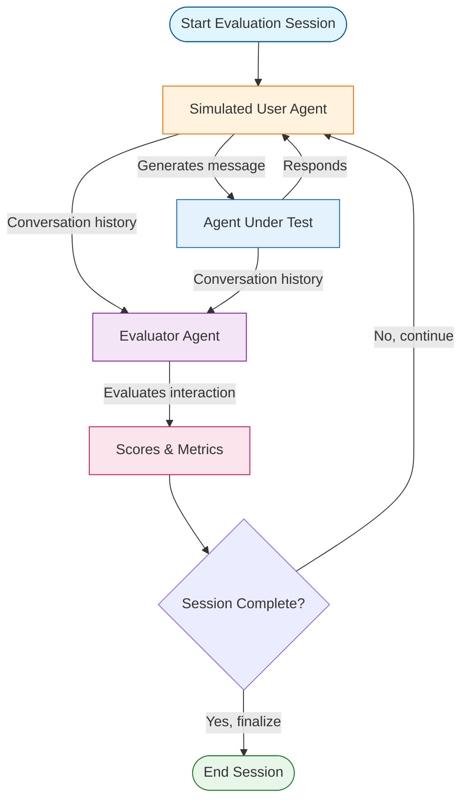

# Multi-Agent Evaluation

## Overview

Multi-agent evaluation enables systematic testing of agents through simulated user interactions and automated scoring. This pattern combines simulated user agents, evaluator agents, and metrics aggregation to provide objective quality assessment.

## Architecture



## When to Use

Use multi-agent evaluation when:

- **Systematic testing needed**: Manual testing doesn't scale
- **Quality metrics required**: Need objective, consistent scores
- **Multiple scenarios**: Test agent with various user behaviors
- **Regression testing**: Ensure changes don't degrade quality
- **A/B testing**: Compare different agent implementations

## Key Components

### 1. State Schema

```python
from typing import Annotated
from typing_extensions import TypedDict
from langgraph.graph.message import add_messages
import operator

class EvaluationState(TypedDict):
    messages: Annotated[list, add_messages]              # Conversation history
    conversation: str                                     # Formatted for evaluator
    evaluator_scores: Annotated[list[dict], operator.add]  # Accumulated scores
    turn_count: int                                       # Current turn
    max_turns: int                                        # Maximum turns
    session_complete: bool                                # Done flag
    final_metrics: dict[str, float]                       # Aggregated metrics
```

### 2. Simulated User Configuration

Define realistic user behavior:

```python
from pydantic import BaseModel, Field
from typing import Literal

class SimulatedUser(BaseModel):
    persona: str = Field(
        description="User's background and situation"
    )
    goals: list[str] = Field(
        description="What the user wants to accomplish"
    )
    behavior: Literal["friendly", "impatient", "confused", "technical", "casual"] = "friendly"
    initial_message: str | None = None

# Example
user = SimulatedUser(
    persona="Frustrated customer with damaged product",
    goals=["Get refund", "Express dissatisfaction"],
    behavior="impatient",
    initial_message="My order arrived damaged and I want a refund!"
)
```

### 3. Evaluation Criteria

Structured scoring with Pydantic:

```python
class EvaluationCriteria(BaseModel):
    helpfulness: int = Field(ge=1, le=5, description="How helpful? (1-5)")
    accuracy: int = Field(ge=1, le=5, description="How accurate? (1-5)")
    empathy: int = Field(ge=1, le=5, description="How empathetic? (1-5)")
    efficiency: int = Field(ge=1, le=5, description="How efficient? (1-5)")
    goal_completion: int = Field(ge=0, le=1, description="Goals met? (0/1)")
    reasoning: str = Field(description="Explanation of scores")
```

### 4. Simulated User Node

Creates user messages based on persona:

```python
from langgraph_ollama_local.patterns.evaluation import create_simulated_user_node

user_config = SimulatedUser(
    persona="Tech-savvy customer",
    goals=["Troubleshoot issue"],
    behavior="technical"
)

user_node = create_simulated_user_node(llm, user_config)
```

### 5. Evaluator Node

Scores conversations objectively:

```python
from langgraph_ollama_local.patterns.evaluation import create_evaluator_node

evaluator = create_evaluator_node(llm)
# Uses structured output to ensure consistent scoring
```

### 6. Graph Construction

Orchestrate agent, user, and evaluator:

```python
from langgraph_ollama_local.patterns.evaluation import create_evaluation_graph

graph = create_evaluation_graph(
    llm,
    agent_node,              # Agent being tested
    user_config,             # Simulated user config
    evaluate_every_n_turns=2 # Score every 2 turns
)
```

## Usage

### Basic Evaluation

```python
from langgraph_ollama_local import LocalAgentConfig
from langgraph_ollama_local.patterns.evaluation import (
    SimulatedUser,
    create_evaluation_graph,
    run_evaluation_session,
)

config = LocalAgentConfig()
llm = config.create_chat_client()

# Define agent to test
def my_agent(state):
    # Agent implementation
    return {"messages": [AIMessage(content="How can I help?")]}

# Configure simulated user
user = SimulatedUser(
    persona="Customer with billing question",
    goals=["Understand charge", "Get refund if incorrect"],
    behavior="friendly"
)

# Create and run evaluation
graph = create_evaluation_graph(llm, my_agent, user)
result = run_evaluation_session(graph, max_turns=10)

print(result["final_metrics"])
# {
#   'helpfulness_avg': 4.2,
#   'accuracy_avg': 4.0,
#   'empathy_avg': 4.5,
#   'efficiency_avg': 3.8,
#   'goal_completion_rate': 1.0,
#   'num_scores': 5
# }
```

### Multiple Evaluation Sessions

Test with multiple runs for robustness:

```python
from langgraph_ollama_local.patterns.evaluation import run_multiple_evaluations

results = run_multiple_evaluations(
    graph,
    num_sessions=5,    # Run 5 evaluation sessions
    max_turns=10
)

# Access aggregate metrics
print(results["aggregate_metrics"])
# {
#   'helpfulness_avg': 4.1,
#   'accuracy_avg': 4.2,
#   'empathy_avg': 4.3,
#   'efficiency_avg': 3.9,
#   'goal_completion_rate': 0.8,
#   'num_sessions': 5
# }

# Access individual session results
for i, session in enumerate(results["sessions"]):
    print(f"Session {i+1}: {session['final_metrics']}")
```

### Testing Different Scenarios

```python
# Scenario 1: Impatient customer
impatient_user = SimulatedUser(
    persona="Frustrated customer waiting 2 weeks for refund",
    goals=["Get immediate refund", "Express anger"],
    behavior="impatient"
)

# Scenario 2: Confused user
confused_user = SimulatedUser(
    persona="Elderly user not tech-savvy",
    goals=["Track order", "Understand website"],
    behavior="confused"
)

# Scenario 3: Technical user
tech_user = SimulatedUser(
    persona="Developer troubleshooting API",
    goals=["Debug API error", "Get technical details"],
    behavior="technical"
)

# Test all scenarios
for user_config in [impatient_user, confused_user, tech_user]:
    graph = create_evaluation_graph(llm, my_agent, user_config)
    result = run_evaluation_session(graph)
    print(f"Scenario: {user_config.persona}")
    print(f"Metrics: {result['final_metrics']}\n")
```

### Custom Metrics Aggregation

```python
from langgraph_ollama_local.patterns.evaluation import aggregate_scores

# Manually aggregate scores
scores = [
    {"helpfulness": 4, "accuracy": 5, "empathy": 3, "efficiency": 4, "goal_completion": 1},
    {"helpfulness": 5, "accuracy": 4, "empathy": 4, "efficiency": 5, "goal_completion": 1},
]

metrics = aggregate_scores(scores)
print(metrics)
# {
#   'helpfulness_avg': 4.5,
#   'accuracy_avg': 4.5,
#   'empathy_avg': 3.5,
#   'efficiency_avg': 4.5,
#   'goal_completion_rate': 1.0,
#   'num_scores': 2
# }
```

## Evaluation Metrics

### Score Dimensions

| Metric | Range | Description |
|--------|-------|-------------|
| **Helpfulness** | 1-5 | How helpful were the agent's responses? |
| **Accuracy** | 1-5 | How factually correct was the information? |
| **Empathy** | 1-5 | How empathetic was the agent? |
| **Efficiency** | 1-5 | How concise and direct were responses? |
| **Goal Completion** | 0-1 | Were user's goals achieved? |

### Aggregated Metrics

From `aggregate_scores()`:
- `helpfulness_avg` - Average helpfulness score
- `accuracy_avg` - Average accuracy score
- `empathy_avg` - Average empathy score
- `efficiency_avg` - Average efficiency score
- `goal_completion_rate` - Percentage of goals completed
- `num_scores` - Number of evaluations aggregated

## Best Practices

### 1. Diverse Test Scenarios

Test multiple user types:
```python
scenarios = [
    ("friendly", "Happy customer with simple question"),
    ("impatient", "Frustrated customer demanding refund"),
    ("confused", "User struggling with technical interface"),
    ("technical", "Developer needing API documentation"),
]

for behavior, persona in scenarios:
    user = SimulatedUser(persona=persona, goals=[...], behavior=behavior)
    # Run evaluation
```

### 2. Clear User Goals

Define specific, measurable objectives:
```python
# Good: Specific and measurable
goals = ["Get refund processed", "Receive confirmation number", "Understand timeline"]

# Bad: Vague
goals = ["Be satisfied", "Resolve issue"]
```

### 3. Multiple Evaluation Runs

Run 3-5 sessions per scenario for reliability:
```python
results = run_multiple_evaluations(graph, num_sessions=5)
# More reliable than single run
```

### 4. Periodic Evaluation

Score conversations as they progress:
```python
# Evaluate every 2 turns to track quality over time
graph = create_evaluation_graph(
    llm, agent, user,
    evaluate_every_n_turns=2  # Not just at the end
)
```

### 5. Track Improvements

Compare metrics before/after changes:
```python
# Before changes
baseline_metrics = run_evaluation_session(graph_v1)

# After changes
improved_metrics = run_evaluation_session(graph_v2)

# Compare
for metric in ["helpfulness_avg", "empathy_avg"]:
    delta = improved_metrics[metric] - baseline_metrics[metric]
    print(f"{metric}: {delta:+.2f}")
```

## Common Patterns

### A/B Testing Agents

```python
def compare_agents(agent_a, agent_b, user_config, num_sessions=5):
    """Compare two agent implementations."""

    graph_a = create_evaluation_graph(llm, agent_a, user_config)
    graph_b = create_evaluation_graph(llm, agent_b, user_config)

    results_a = run_multiple_evaluations(graph_a, num_sessions)
    results_b = run_multiple_evaluations(graph_b, num_sessions)

    print("Agent A vs Agent B:")
    for metric in ["helpfulness_avg", "accuracy_avg", "empathy_avg"]:
        a_score = results_a["aggregate_metrics"][metric]
        b_score = results_b["aggregate_metrics"][metric]
        print(f"{metric}: {a_score:.2f} vs {b_score:.2f}")
```

### Regression Testing

```python
def regression_test(agent, test_suite, threshold=4.0):
    """Ensure agent meets quality threshold."""

    all_passing = True

    for scenario_name, user_config in test_suite.items():
        graph = create_evaluation_graph(llm, agent, user_config)
        result = run_evaluation_session(graph)

        avg_score = (
            result["final_metrics"]["helpfulness_avg"] +
            result["final_metrics"]["accuracy_avg"]
        ) / 2

        passing = avg_score >= threshold
        all_passing = all_passing and passing

        print(f"{scenario_name}: {'PASS' if passing else 'FAIL'} ({avg_score:.2f})")

    return all_passing
```

### Custom Evaluator

Create domain-specific evaluators:

```python
class TechnicalSupportCriteria(BaseModel):
    """Custom criteria for technical support."""
    troubleshooting_quality: int = Field(ge=1, le=5)
    technical_accuracy: int = Field(ge=1, le=5)
    documentation_provided: int = Field(ge=0, le=1)
    escalation_appropriate: int = Field(ge=0, le=1)
    reasoning: str

def create_tech_support_evaluator(llm):
    structured_llm = llm.with_structured_output(TechnicalSupportCriteria)

    def evaluator(state):
        # Custom evaluation logic
        ...

    return evaluator
```

## Common Pitfalls

| Pitfall | Solution |
|---------|----------|
| **Single test scenario** | Test multiple user behaviors and personas |
| **Vague user goals** | Define specific, measurable objectives |
| **Single evaluation run** | Run 3-5 sessions for statistical reliability |
| **Only end-of-conversation scoring** | Use periodic evaluation to track quality |
| **Ignoring edge cases** | Test impatient, confused, and difficult users |
| **No baseline comparison** | Track metrics over time to measure improvement |
| **Fixed max_turns too low** | Allow enough turns for realistic conversations |

## Related Patterns

- [Multi-Agent Collaboration](14-multi-agent-collaboration.md) - Supervisor pattern basics
- [Hierarchical Teams](15-hierarchical-teams.md) - Nested team evaluation
- [Subgraph Patterns](16-subgraphs.md) - Modular evaluation components

## Quiz

Test your understanding of multi-agent evaluation:

<Quiz
  question="What is the primary purpose of the simulated user agent in multi-agent evaluation?"
  tutorial-id="20-multi-agent-evaluation"
  :options="[
    { text: 'To completely replace human testers in all scenarios', correct: false },
    { text: 'To generate realistic user interactions for systematic, repeatable agent testing', correct: true },
    { text: 'To make agents run faster during evaluation', correct: false },
    { text: 'To reduce API costs by caching responses', correct: false }
  ]"
  explanation="The simulated user agent creates realistic user interactions based on different personas and behaviors, enabling systematic, repeatable testing of agents across various scenarios without manual intervention. It enables testing at scale."
  :hints="[
    { text: 'Think about the benefits of automated testing over manual testing', penalty: 10 },
    { text: 'Simulated users allow consistent, reproducible test scenarios', penalty: 15 }
  ]"
/>

<Quiz
  question="Why should you run multiple evaluation sessions instead of just one?"
  tutorial-id="20-multi-agent-evaluation"
  :options="[
    { text: 'To use more API credits for better results', correct: false },
    { text: 'To make the evaluation code more complex', correct: false },
    { text: 'To get statistically reliable results and account for LLM response variability', correct: true },
    { text: 'To test more features in a single run', correct: false }
  ]"
  explanation="Running 3-5 evaluation sessions per scenario provides more statistically reliable results by accounting for LLM response variability. A single run might be an outlier - multiple runs give a better picture of average agent performance."
  :hints="[
    { text: 'LLM responses can vary even with the same input', penalty: 10 },
    { text: 'Statistical reliability requires multiple samples', penalty: 15 }
  ]"
/>

<Quiz
  question="What makes a good user goal for evaluation purposes?"
  tutorial-id="20-multi-agent-evaluation"
  :options="[
    { text: 'Vague and open-ended goals like Be satisfied', correct: false },
    { text: 'Specific and measurable goals like Get refund processed', correct: true },
    { text: 'Technical and complex goals requiring domain expertise', correct: false },
    { text: 'Long and detailed goals covering many scenarios', correct: false }
  ]"
  explanation="Good user goals are specific and measurable (e.g., 'Get refund processed', 'Receive confirmation number') rather than vague (e.g., 'Be satisfied'), making it easier for the evaluator to objectively assess goal completion."
  :hints="[
    { text: 'How would an evaluator know if a vague goal was achieved?', penalty: 10 },
    { text: 'Measurable goals allow objective scoring of goal_completion', penalty: 15 }
  ]"
/>

<Quiz
  question="What are the five evaluation metrics measured in the EvaluationCriteria schema?"
  tutorial-id="20-multi-agent-evaluation"
  :options="[
    { text: 'Speed, accuracy, cost, latency, throughput', correct: false },
    { text: 'Helpfulness, accuracy, empathy, efficiency, goal_completion', correct: true },
    { text: 'Grammar, spelling, tone, length, formatting', correct: false },
    { text: 'Response time, token count, model version, temperature, context length', correct: false }
  ]"
  explanation="The evaluation criteria include: helpfulness (1-5), accuracy (1-5), empathy (1-5), efficiency (1-5), and goal_completion (0/1). These cover both qualitative interaction quality and concrete task success."
  :hints="[
    { text: 'Look at the EvaluationCriteria Pydantic model in the tutorial', penalty: 10 },
    { text: 'The metrics combine interaction quality with task completion', penalty: 15 }
  ]"
/>

<Quiz
  question="What is the recommended approach for testing agent quality across different user types?"
  tutorial-id="20-multi-agent-evaluation"
  :options="[
    { text: 'Test only with friendly, cooperative users', correct: false },
    { text: 'Test with a single challenging user persona', correct: false },
    { text: 'Test with diverse scenarios including friendly, impatient, confused, and technical users', correct: true },
    { text: 'Skip user persona testing and focus only on task completion', correct: false }
  ]"
  explanation="Testing with diverse user types (friendly, impatient, confused, technical) ensures the agent can handle various real-world scenarios. Edge cases like impatient or confused users often reveal weaknesses not visible with friendly users."
  :hints="[
    { text: 'Real users come in many different types and moods', penalty: 10 },
    { text: 'The Common Pitfalls table mentions ignoring edge cases as a problem', penalty: 15 }
  ]"
/>

---

<div class="tutorial-nav">
  <a href="19-map-reduce-agents.md" class="nav-link prev">← Previous: Map-Reduce Agents</a>
  <span class="nav-link disabled">End of Multi-Agent Patterns</span>
</div>
