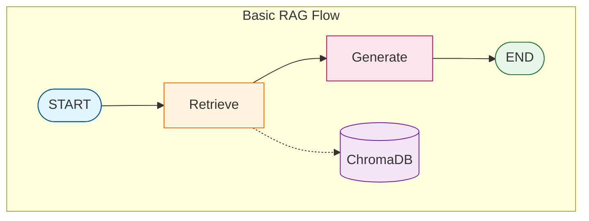

# Tutorial 08: Basic RAG (Retrieval-Augmented Generation)

This tutorial introduces the foundational RAG pattern - combining document retrieval with LLM generation for grounded, accurate responses.

## Overview

**RAG** (Retrieval-Augmented Generation) enhances LLM responses by:
1. **Retrieving** relevant documents for the user's question
2. **Augmenting** the prompt with retrieved context
3. **Generating** an answer grounded in the retrieved information

This addresses key LLM limitations:
- Knowledge cutoffs (outdated information)
- Hallucinations (making up facts)
- Lack of domain-specific knowledge

## Architecture



## RAG Pipeline Components

### 1. Document Loading

Load documents from various formats:

```python
from langgraph_ollama_local.rag import DocumentLoader

loader = DocumentLoader()

# Load single file
docs = loader.load_pdf("paper.pdf")

# Load directory
docs = loader.load_directory("sources/")
```

**Supported formats:**
- PDF (`.pdf`)
- Text (`.txt`)
- Markdown (`.md`, `.markdown`)

### 2. Document Chunking

Split documents into searchable pieces:

```python
from langgraph_ollama_local.rag import DocumentIndexer
from langgraph_ollama_local.rag.indexer import IndexerConfig

config = IndexerConfig(
    chunk_size=1000,      # Characters per chunk
    chunk_overlap=200,    # Overlap between chunks
)

indexer = DocumentIndexer(config=config)
chunks = indexer.chunk_documents(documents)
```

**Chunking considerations:**
| Parameter | Recommendation | Trade-off |
|-----------|---------------|-----------|
| `chunk_size` | 500-1500 chars | Larger = more context, but less precise |
| `chunk_overlap` | 10-20% of size | More overlap = better continuity |

### 3. Embeddings

Convert text to vectors using sentence-transformers:

```python
from langgraph_ollama_local.rag import LocalEmbeddings

embeddings = LocalEmbeddings(model_name="all-mpnet-base-v2")

# Embed documents
vectors = embeddings.embed_documents(["text1", "text2"])

# Embed query
query_vector = embeddings.embed_query("What is RAG?")
```

**Available models:**
| Model | Dimensions | Quality | Size |
|-------|------------|---------|------|
| `all-mpnet-base-v2` | 768 | High | 420MB |
| `all-MiniLM-L6-v2` | 384 | Good | 90MB |

### 4. Vector Storage (ChromaDB)

Store and query embeddings:

```python
# Index documents
indexer.index_documents(chunks)

# Query later
from langgraph_ollama_local.rag import LocalRetriever

retriever = LocalRetriever()
results = retriever.retrieve("query", k=4)
```

ChromaDB features:
- Persistent storage (survives restarts)
- Cosine similarity search
- Metadata filtering

### 5. RAG Generation

Combine retrieval with LLM generation:

```python
RAG_PROMPT = """Answer based on the context.

Context:
{context}

Question: {question}

Answer:"""
```

## Complete Implementation

### State Definition

```python
from typing import List
from typing_extensions import TypedDict
from langchain_core.documents import Document

class RAGState(TypedDict):
    question: str              # User's question
    documents: List[Document]  # Retrieved documents
    generation: str            # Generated answer
```

### Node Functions

```python
def retrieve(state: RAGState) -> dict:
    """Retrieve relevant documents."""
    docs = retriever.retrieve_documents(state["question"], k=4)
    return {"documents": docs}

def generate(state: RAGState) -> dict:
    """Generate answer using context."""
    context = "\n\n".join([d.page_content for d in state["documents"]])
    messages = rag_prompt.format_messages(
        context=context,
        question=state["question"]
    )
    response = llm.invoke(messages)
    return {"generation": response.content}
```

### Graph Construction

```python
from langgraph.graph import StateGraph, START, END

graph = StateGraph(RAGState)
graph.add_node("retrieve", retrieve)
graph.add_node("generate", generate)
graph.add_edge(START, "retrieve")
graph.add_edge("retrieve", "generate")
graph.add_edge("generate", END)

rag_app = graph.compile()
```

### Usage

```python
result = rag_app.invoke({"question": "What is Self-RAG?"})
print(result["generation"])
```

## Adding Source Citations

Track and display sources for transparency:

```python
def format_sources(documents: List[Document]) -> str:
    """Format sources for citation."""
    sources = []
    for doc in documents:
        filename = doc.metadata.get('filename', 'Unknown')
        page = doc.metadata.get('page', '')
        if page:
            sources.append(f"- {filename} (page {page})")
        else:
            sources.append(f"- {filename}")
    return "\n".join(sources)
```

## Indexing Pipeline

One-time setup to index your documents:

```python
from langgraph_ollama_local.rag import DocumentIndexer, DocumentLoader

# 1. Load documents
loader = DocumentLoader()
docs = loader.load_directory("sources/")

# 2. Create indexer
indexer = DocumentIndexer()

# 3. Index (chunks, embeds, and stores)
indexer.index_directory("sources/")

# 4. Check stats
print(indexer.get_stats())
```

## Configuration

Environment variables for customization:

```bash
# .env
RAG_CHUNK_SIZE=1000
RAG_CHUNK_OVERLAP=200
RAG_COLLECTION_NAME=documents
RAG_PERSIST_DIRECTORY=.chromadb
EMBEDDING_MODEL_NAME=all-mpnet-base-v2
```

## Limitations

Basic RAG has limitations addressed in later tutorials:

| Limitation | Solution | Tutorial |
|------------|----------|----------|
| No relevance check | Document grading | Self-RAG (09) |
| Hallucinations | Answer grading | Self-RAG (09) |
| Retrieval failures | Web search fallback | CRAG (10) |
| Single strategy | Query routing | Adaptive RAG (11) |
| Single retrieval | Multi-step retrieval | Agentic RAG (12) |

## Best Practices

1. **Chunk size tuning**: Start with 1000 chars, adjust based on results
2. **Overlap**: Use 10-20% overlap to maintain context
3. **K value**: Start with k=4, increase for complex questions
4. **Temperature**: Use 0 for factual RAG, higher for creative tasks
5. **Prompt engineering**: Be explicit about using only the context

## Graph Visualization


## Quiz

Test your understanding of Basic RAG:

<Quiz
  question="What are the three main steps in the RAG pipeline?"
  tutorial-id="08-basic-rag"
  :options="[
    { text: 'Load, Process, Store', correct: false },
    { text: 'Retrieve, Augment, Generate', correct: true },
    { text: 'Query, Search, Respond', correct: false },
    { text: 'Index, Search, Answer', correct: false }
  ]"
  explanation="RAG stands for Retrieval-Augmented Generation. The three core steps are: (1) Retrieve relevant documents for the user's question, (2) Augment the prompt with retrieved context, and (3) Generate an answer grounded in the retrieved information."
  :hints="[
    { text: 'The acronym RAG itself reveals the three steps', penalty: 10 },
    { text: 'Think about what happens first (getting documents), then (adding context), then (creating response)', penalty: 15 }
  ]"
/>

<Quiz
  question="What is the recommended chunk overlap percentage for document chunking?"
  tutorial-id="08-basic-rag"
  :options="[
    { text: '0-5%', correct: false },
    { text: '10-20%', correct: true },
    { text: '30-40%', correct: false },
    { text: '50% or more', correct: false }
  ]"
  explanation="A chunk overlap of 10-20% provides better continuity between chunks without excessive redundancy. This helps maintain context across chunk boundaries and ensures important information at chunk edges is not lost."
  :hints="[
    { text: 'Too little overlap loses context, too much creates redundancy', penalty: 10 },
    { text: 'The tutorial mentions this as a best practice for maintaining context', penalty: 15 }
  ]"
/>

<Quiz
  question="Which limitation does Basic RAG NOT address that is solved by later tutorials?"
  tutorial-id="08-basic-rag"
  :options="[
    { text: 'Knowledge cutoffs (outdated information)', correct: false },
    { text: 'Hallucinations (making up facts)', correct: false },
    { text: 'Lack of domain-specific knowledge', correct: false },
    { text: 'Document relevance checking', correct: true }
  ]"
  explanation="While Basic RAG addresses knowledge cutoffs, reduces hallucinations, and provides domain-specific knowledge, it does NOT include document relevance checking. This feature is added in Self-RAG (Tutorial 09), which grades documents for relevance before using them."
  :hints="[
    { text: 'Check the Limitations table in the tutorial', penalty: 10 },
    { text: 'Self-RAG adds this capability through document grading', penalty: 15 }
  ]"
/>

<Quiz
  question="What is the purpose of using embeddings in RAG?"
  tutorial-id="08-basic-rag"
  :options="[
    { text: 'To compress documents for storage', correct: false },
    { text: 'To convert text into vectors for similarity search', correct: true },
    { text: 'To encrypt sensitive information', correct: false },
    { text: 'To format documents for display', correct: false }
  ]"
  explanation="Embeddings convert text into high-dimensional vectors (e.g., 768 dimensions for all-mpnet-base-v2). These vectors capture semantic meaning, allowing the system to find documents with similar meaning to the query through cosine similarity search in ChromaDB."
  :hints="[
    { text: 'Think about how you would find similar documents without exact keyword matching', penalty: 10 },
    { text: 'The embedding models output vectors with hundreds of dimensions', penalty: 15 }
  ]"
/>

<Quiz
  question="True or False: Basic RAG always retrieves the most relevant documents for any question."
  tutorial-id="08-basic-rag"
  type="true-false"
  :options="[
    { text: 'True', correct: false },
    { text: 'False', correct: true }
  ]"
  explanation="False. Basic RAG retrieves documents based on similarity scores but does not verify their relevance. It may return documents that are semantically similar but not actually useful for answering the question. This is why Self-RAG adds document grading to filter irrelevant results."
  :hints="[
    { text: 'Consider what happens if the vector search returns similar but unhelpful documents', penalty: 10 },
    { text: 'The Limitations section mentions this as something solved by Self-RAG', penalty: 15 }
  ]"
/>
