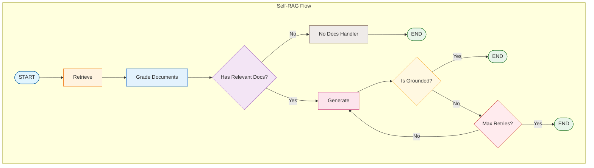

# Tutorial 09: Self-RAG (Self-Reflective RAG)

Self-RAG enhances traditional RAG with self-reflection capabilities - the system grades its own work to ensure quality.

## Overview

**Self-RAG** adds reflection at multiple stages:
1. **Document Grading**: Are retrieved documents relevant?
2. **Hallucination Detection**: Is the answer grounded in facts?
3. **Answer Grading**: Does the answer address the question?
4. **Retry Logic**: Re-generate when checks fail

## Architecture



## Graders

### Document Grader

Filters irrelevant documents before generation:

```python
from langgraph_ollama_local.rag import DocumentGrader

doc_grader = DocumentGrader(llm)

# Grade single document
is_relevant = doc_grader.grade(document, question)

# Grade multiple documents
relevant, irrelevant = doc_grader.grade_documents(documents, question)
```

### Hallucination Grader

Checks if the answer is grounded in the provided documents:

```python
from langgraph_ollama_local.rag import HallucinationGrader

hallucination_grader = HallucinationGrader(llm)

# Check if grounded
is_grounded = hallucination_grader.grade(documents, generation)
```

### Answer Grader

Verifies the answer actually addresses the question:

```python
from langgraph_ollama_local.rag import AnswerGrader

answer_grader = AnswerGrader(llm)

# Check if useful
is_useful = answer_grader.grade(question, generation)
```

## State Definition

```python
class SelfRAGState(TypedDict):
    question: str                      # User's question
    documents: List[Document]          # Retrieved documents
    filtered_documents: List[Document] # After relevance grading
    generation: str                    # Generated answer
    retry_count: int                   # Current retry count
    max_retries: int                   # Maximum allowed retries
```

## Node Functions

### Retrieve
```python
def retrieve(state: SelfRAGState) -> dict:
    docs = retriever.retrieve_documents(state["question"], k=5)
    return {"documents": docs}
```

### Grade Documents
```python
def grade_documents(state: SelfRAGState) -> dict:
    relevant, _ = doc_grader.grade_documents(
        state["documents"],
        state["question"]
    )
    return {"filtered_documents": relevant}
```

### Generate
```python
def generate(state: SelfRAGState) -> dict:
    if not state["filtered_documents"]:
        return {"generation": "No relevant documents found."}

    context = "\n".join([d.page_content for d in state["filtered_documents"]])
    response = llm.invoke(prompt.format(context=context, question=state["question"]))
    return {"generation": response.content}
```

## Conditional Routing

```python
def route_after_generation(state: SelfRAGState) -> str:
    """Route based on hallucination check."""
    is_grounded = hallucination_grader.grade(
        state["filtered_documents"],
        state["generation"]
    )

    if is_grounded:
        return "end"
    elif state["retry_count"] < state["max_retries"]:
        return "retry"
    else:
        return "end"  # Max retries reached
```

## Graph Construction

```python
from langgraph.graph import StateGraph, START, END

graph = StateGraph(SelfRAGState)

# Add nodes
graph.add_node("retrieve", retrieve)
graph.add_node("grade_documents", grade_documents)
graph.add_node("generate", generate)
graph.add_node("retry", lambda s: {"retry_count": s["retry_count"] + 1})

# Add edges
graph.add_edge(START, "retrieve")
graph.add_edge("retrieve", "grade_documents")
graph.add_edge("grade_documents", "generate")

# Conditional routing after generation
graph.add_conditional_edges(
    "generate",
    route_after_generation,
    {"end": END, "retry": "retry"}
)

graph.add_edge("retry", "generate")

self_rag = graph.compile()
```

## Usage

```python
result = self_rag.invoke({
    "question": "What is Self-RAG?",
    "retry_count": 0,
    "max_retries": 3,
})

print(result["generation"])
print(f"Retries needed: {result['retry_count']}")
```

## Benefits Over Basic RAG

| Aspect | Basic RAG | Self-RAG |
|--------|-----------|----------|
| Document quality | Uses all retrieved | Filters irrelevant |
| Answer accuracy | May hallucinate | Verifies grounding |
| Error handling | None | Retry mechanism |
| Transparency | Black box | Grading visible |

## Configuration

```bash
# Environment variables
SELF_RAG_MAX_RETRIES=3
SELF_RAG_GRADING_MODEL=llama3.2:3b
```

## Best Practices

1. **Use smaller models for grading**: Grading is simple yes/no, doesn't need large models
2. **Set reasonable retry limits**: 2-3 retries usually sufficient
3. **Log grading decisions**: Helps debug quality issues
4. **Consider async grading**: Grade documents in parallel

## Quiz

Test your understanding of Self-RAG:

<Quiz
  question="What are the three types of graders used in Self-RAG?"
  tutorial-id="09-self-rag"
  :options="[
    { text: 'Document, Source, Quality', correct: false },
    { text: 'Document, Hallucination, Answer', correct: true },
    { text: 'Relevance, Accuracy, Completeness', correct: false },
    { text: 'Input, Output, Feedback', correct: false }
  ]"
  explanation="Self-RAG uses three graders: (1) Document Grader - filters irrelevant documents before generation, (2) Hallucination Grader - checks if the answer is grounded in the provided documents, and (3) Answer Grader - verifies the answer actually addresses the question."
  :hints="[
    { text: 'Each grader checks a different aspect: documents, truthfulness, and usefulness', penalty: 10 },
    { text: 'One grader checks for made-up facts, another filters documents, another checks the answer quality', penalty: 15 }
  ]"
/>

<Quiz
  question="What happens when the hallucination grader detects that an answer is not grounded in the documents?"
  tutorial-id="09-self-rag"
  :options="[
    { text: 'The system stops immediately and returns an error', correct: false },
    { text: 'The answer is returned anyway with a warning', correct: false },
    { text: 'The system retries generation (up to max_retries)', correct: true },
    { text: 'The system searches for more documents', correct: false }
  ]"
  explanation="When hallucinations are detected, Self-RAG enters a retry loop. It increments the retry count and regenerates the answer, continuing until either a grounded answer is produced or max_retries is reached. This self-correction mechanism is key to Self-RAG's reliability."
  :hints="[
    { text: 'Look at the route_after_generation function in the tutorial', penalty: 10 },
    { text: 'The state includes retry_count and max_retries fields for a reason', penalty: 15 }
  ]"
/>

<Quiz
  question="Why is it recommended to use smaller models for grading tasks?"
  tutorial-id="09-self-rag"
  :options="[
    { text: 'Smaller models are more accurate', correct: false },
    { text: 'Grading is simple yes/no classification that does not require large model capabilities', correct: true },
    { text: 'Smaller models have better memory', correct: false },
    { text: 'Larger models cannot perform grading', correct: false }
  ]"
  explanation="Smaller models are recommended for grading because the task is simple binary classification (yes/no or relevant/irrelevant). This provides faster processing, lower computational cost, and reduced latency while maintaining sufficient accuracy for these straightforward decisions."
  :hints="[
    { text: 'Consider what the graders are actually deciding - it is not complex reasoning', penalty: 10 },
    { text: 'The configuration shows SELF_RAG_GRADING_MODEL can be a smaller model like llama3.2:3b', penalty: 15 }
  ]"
/>

<Quiz
  question="What is stored in the 'filtered_documents' field of SelfRAGState?"
  tutorial-id="09-self-rag"
  :options="[
    { text: 'All retrieved documents', correct: false },
    { text: 'Documents that failed the relevance check', correct: false },
    { text: 'Documents that passed the relevance grading', correct: true },
    { text: 'Documents from web search', correct: false }
  ]"
  explanation="The filtered_documents field contains only the documents that passed the Document Grader's relevance check. The grade_documents function returns relevant documents in this field, filtering out irrelevant ones before the generation step."
  :hints="[
    { text: 'The grade_documents function returns relevant and irrelevant documents separately', penalty: 10 },
    { text: 'Only the relevant documents are used for generation', penalty: 15 }
  ]"
/>

<Quiz
  question="How does Self-RAG improve transparency compared to Basic RAG?"
  tutorial-id="09-self-rag"
  type="fill-blank"
  :accepted-answers="['grading visible', 'grading is visible', 'visible grading', 'grading decisions visible', 'grading decisions are visible']"
  explanation="Self-RAG makes grading decisions visible, allowing developers to see why documents were filtered and whether answers passed hallucination checks. This transparency helps debug quality issues and understand system behavior, unlike Basic RAG which operates as a 'black box'."
  :hints="[
    { text: 'Check the Benefits Over Basic RAG comparison table', penalty: 10 },
    { text: 'The table shows Transparency as Black box vs something visible', penalty: 15 }
  ]"
/>
