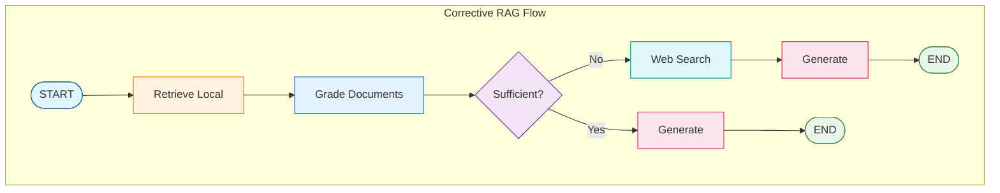

# Tutorial 10: CRAG (Corrective RAG)

CRAG extends RAG with corrective capabilities - when local retrieval fails, it falls back to web search to find answers.

## Overview

**CRAG** (Corrective RAG) adds a corrective mechanism:
1. Retrieve from local documents
2. Grade document relevance
3. If insufficient, search the web
4. Combine knowledge sources
5. Generate answer

## Architecture



## When to Use CRAG

- Document corpus may not cover all topics
- Users ask about recent events
- Need to supplement local with external knowledge
- Building research assistants

## State Definition

```python
class CRAGState(TypedDict):
    question: str                      # User's question
    documents: List[Document]          # Local documents
    web_results: List[Document]        # Web search results
    combined_documents: List[Document] # Merged for generation
    knowledge_source: str              # "local", "web", "combined"
    generation: str                    # Final answer
```

## Web Search Integration

### Using Tavily (Recommended)

```python
from tavily import TavilyClient
import os

def web_search(query: str, max_results: int = 3) -> List[Document]:
    client = TavilyClient(api_key=os.environ["TAVILY_API_KEY"])
    response = client.search(query, max_results=max_results)

    return [
        Document(
            page_content=r["content"],
            metadata={"source": r["url"], "title": r["title"], "type": "web"}
        )
        for r in response["results"]
    ]
```

### Using DuckDuckGo (Free)

```python
from duckduckgo_search import DDGS

def web_search(query: str, max_results: int = 3) -> List[Document]:
    with DDGS() as ddgs:
        results = list(ddgs.text(query, max_results=max_results))
        return [
            Document(
                page_content=r["body"],
                metadata={"source": r["href"], "title": r["title"], "type": "web"}
            )
            for r in results
        ]
```

## Node Functions

### Grade and Decide

```python
def grade_documents(state: CRAGState) -> dict:
    """Grade documents and decide knowledge source."""
    relevant, _ = doc_grader.grade_documents(
        state["documents"],
        state["question"]
    )

    if len(relevant) >= 2:
        return {"combined_documents": relevant, "knowledge_source": "local"}
    elif len(relevant) == 1:
        return {"combined_documents": relevant, "knowledge_source": "combined"}
    else:
        return {"combined_documents": [], "knowledge_source": "web"}
```

### Web Search Node

```python
def search_web(state: CRAGState) -> dict:
    """Search the web for additional information."""
    web_docs = web_search(state["question"], max_results=3)

    # Combine with any existing relevant docs
    combined = state["combined_documents"] + web_docs

    return {
        "web_results": web_docs,
        "combined_documents": combined,
    }
```

## Routing Logic

```python
def route_after_grading(state: CRAGState) -> str:
    """Route based on knowledge source decision."""
    if state["knowledge_source"] == "local":
        return "generate"
    else:
        return "web_search"
```

## Graph Construction

```python
from langgraph.graph import StateGraph, START, END

graph = StateGraph(CRAGState)

# Nodes
graph.add_node("retrieve_local", retrieve_local)
graph.add_node("grade_documents", grade_documents)
graph.add_node("web_search", search_web)
graph.add_node("generate", generate)

# Edges
graph.add_edge(START, "retrieve_local")
graph.add_edge("retrieve_local", "grade_documents")
graph.add_conditional_edges(
    "grade_documents",
    route_after_grading,
    {"generate": "generate", "web_search": "web_search"}
)
graph.add_edge("web_search", "generate")
graph.add_edge("generate", END)

crag = graph.compile()
```

## Source Attribution

Track where answers come from:

```python
def generate(state: CRAGState) -> dict:
    """Generate with source attribution."""
    context_parts = []
    for i, doc in enumerate(state["combined_documents"], 1):
        source_type = doc.metadata.get("type", "local")
        source_name = doc.metadata.get("filename", doc.metadata.get("title", "Unknown"))
        context_parts.append(f"[Source {i} ({source_type}): {source_name}]\n{doc.page_content}")

    context = "\n\n".join(context_parts)
    # Generate with context...
```

## Configuration

```bash
# Environment variables
TAVILY_API_KEY=your-key-here
CRAG_MIN_RELEVANT_DOCS=2
CRAG_WEB_RESULTS_COUNT=3
```

## Best Practices

1. **Rate limiting**: Respect web search API limits
2. **Caching**: Cache web results for repeated queries
3. **Source diversity**: Balance local and web sources
4. **Freshness**: Prefer web for time-sensitive queries
5. **Attribution**: Always cite web sources

## Comparison

| Aspect | Self-RAG | CRAG |
|--------|----------|------|
| Primary focus | Quality | Coverage |
| Failure handling | Retry | Fallback |
| External dependencies | None | Web search API |
| Best for | Accuracy | Comprehensiveness |

## Quiz

Test your understanding of CRAG (Corrective RAG):

<Quiz
  question="What does CRAG do when local document retrieval is insufficient?"
  tutorial-id="10-crag"
  :options="[
    { text: 'Returns an error message', correct: false },
    { text: 'Falls back to web search', correct: true },
    { text: 'Retries local retrieval with different parameters', correct: false },
    { text: 'Uses a default pre-written answer', correct: false }
  ]"
  explanation="CRAG's corrective mechanism automatically falls back to web search when local document retrieval does not yield sufficient relevant documents. This ensures comprehensive answers even when the local corpus lacks the needed information."
  :hints="[
    { text: 'CRAG stands for Corrective RAG - think about what it corrects', penalty: 10 },
    { text: 'The architecture diagram shows what happens when documents are insufficient', penalty: 15 }
  ]"
/>

<Quiz
  question="Which web search API is recommended in the tutorial for CRAG?"
  tutorial-id="10-crag"
  :options="[
    { text: 'Google Custom Search API', correct: false },
    { text: 'Bing Web Search API', correct: false },
    { text: 'Tavily', correct: true },
    { text: 'SerpAPI', correct: false }
  ]"
  explanation="Tavily is recommended as it provides a simple API specifically designed for AI applications. DuckDuckGo is also shown as a free alternative, but Tavily is the primary recommendation for its AI-optimized features."
  :hints="[
    { text: 'Look at the Web Search Integration section', penalty: 10 },
    { text: 'The recommended option requires an API key (TAVILY_API_KEY)', penalty: 15 }
  ]"
/>

<Quiz
  question="What is the primary focus difference between Self-RAG and CRAG?"
  tutorial-id="10-crag"
  :options="[
    { text: 'Self-RAG focuses on speed, CRAG on accuracy', correct: false },
    { text: 'Self-RAG focuses on quality, CRAG on coverage', correct: true },
    { text: 'Self-RAG uses local docs, CRAG only uses web', correct: false },
    { text: 'Self-RAG is for questions, CRAG is for summarization', correct: false }
  ]"
  explanation="Self-RAG focuses on answer quality through grading and retry mechanisms, ensuring accuracy. CRAG focuses on comprehensive coverage by supplementing local retrieval with web search when local sources are insufficient."
  :hints="[
    { text: 'Check the Comparison table at the end of the tutorial', penalty: 10 },
    { text: 'Self-RAG retries to improve quality, CRAG adds more sources for coverage', penalty: 15 }
  ]"
/>

<Quiz
  question="What are the three possible values for the 'knowledge_source' field in CRAGState?"
  tutorial-id="10-crag"
  :options="[
    { text: 'primary, secondary, fallback', correct: false },
    { text: 'local, web, combined', correct: true },
    { text: 'fast, medium, slow', correct: false },
    { text: 'cached, fresh, mixed', correct: false }
  ]"
  explanation="The knowledge_source field tracks where the answer's information came from: 'local' (sufficient local documents), 'web' (no relevant local docs, used web search), or 'combined' (partial local coverage supplemented with web search)."
  :hints="[
    { text: 'Look at the State Definition section for CRAGState', penalty: 10 },
    { text: 'The grade_documents function sets this based on how many relevant docs were found', penalty: 15 }
  ]"
/>

<Quiz
  question="True or False: CRAG requires an external web search API to function."
  tutorial-id="10-crag"
  type="true-false"
  :options="[
    { text: 'True', correct: true },
    { text: 'False', correct: false }
  ]"
  explanation="True. Unlike Self-RAG which has no external dependencies, CRAG requires a web search API (Tavily recommended, DuckDuckGo as free alternative) to perform its corrective fallback mechanism when local retrieval is insufficient."
  :hints="[
    { text: 'Check the Comparison table for External dependencies', penalty: 10 },
    { text: 'The web search fallback is the core feature that differentiates CRAG', penalty: 15 }
  ]"
/>
