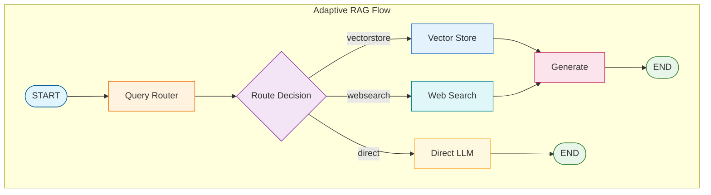

# Tutorial 11: Adaptive RAG

Adaptive RAG intelligently routes queries to the optimal retrieval strategy based on question type.

## Overview

Not all questions need the same approach:
- **Document questions** → Vector store
- **Current events** → Web search
- **Simple factual** → Direct LLM response

Adaptive RAG classifies and routes accordingly.

## Architecture



## Query Router

The QueryRouter classifies questions:

```python
from langgraph_ollama_local.rag.graders import QueryRouter

router = QueryRouter(llm)

# Route examples
router.route("What is Self-RAG?")         # → "vectorstore"
router.route("Latest AI news today?")     # → "websearch"
router.route("What is 2 + 2?")            # → "direct"
```

## State Definition

```python
class AdaptiveRAGState(TypedDict):
    question: str
    query_type: Literal["vectorstore", "websearch", "direct"]
    documents: List[Document]
    generation: str
```

## Node Functions

### Query Classification

```python
def classify_query(state: AdaptiveRAGState) -> dict:
    """Classify the query type."""
    query_type = router.route(state["question"])
    return {"query_type": query_type}
```

### Vector Store Retrieval

```python
def retrieve_vectorstore(state: AdaptiveRAGState) -> dict:
    """Retrieve from local vector store."""
    docs = retriever.retrieve_documents(state["question"], k=4)
    return {"documents": docs}
```

### Web Search

```python
def retrieve_websearch(state: AdaptiveRAGState) -> dict:
    """Search the web for current information."""
    web_docs = web_search(state["question"], max_results=3)
    return {"documents": web_docs}
```

### Direct Response

```python
def direct_answer(state: AdaptiveRAGState) -> dict:
    """Answer directly without retrieval."""
    response = llm.invoke(state["question"])
    return {"generation": response.content}
```

## Routing Logic

```python
def route_query(state: AdaptiveRAGState) -> str:
    """Route based on query classification."""
    return state["query_type"]

# In graph construction
graph.add_conditional_edges(
    "classify",
    route_query,
    {
        "vectorstore": "vectorstore",
        "websearch": "websearch",
        "direct": "direct",
    }
)
```

## Graph Construction

```python
from langgraph.graph import StateGraph, START, END

graph = StateGraph(AdaptiveRAGState)

# Nodes
graph.add_node("classify", classify_query)
graph.add_node("vectorstore", retrieve_vectorstore)
graph.add_node("websearch", retrieve_websearch)
graph.add_node("direct", direct_answer)
graph.add_node("generate", generate)

# Edges
graph.add_edge(START, "classify")

# Conditional routing after classification
graph.add_conditional_edges(
    "classify",
    route_query,
    {
        "vectorstore": "vectorstore",
        "websearch": "websearch",
        "direct": "direct",
    }
)

# Routes to generation
graph.add_edge("vectorstore", "generate")
graph.add_edge("websearch", "generate")
graph.add_edge("direct", END)
graph.add_edge("generate", END)

adaptive_rag = graph.compile()
```

## Usage Examples

```python
# Document question - routes to vectorstore
result = adaptive_rag.invoke({
    "question": "What is Self-RAG?"
})

# Current events - routes to web search
result = adaptive_rag.invoke({
    "question": "What are the latest AI breakthroughs in 2024?"
})

# Simple factual - direct answer
result = adaptive_rag.invoke({
    "question": "What is 15 + 27?"
})
```

## Query Router Prompt

The router uses structured output to classify queries:

```python
ROUTER_PROMPT = """You are an expert at routing questions.

Route questions as follows:
- vectorstore: Questions about specific documents or domain knowledge
- websearch: Questions about current events or recent information
- direct: Simple factual or math questions that don't need retrieval

Question: {question}

Route to:"""
```

## Benefits

| Aspect | Fixed RAG | Adaptive RAG |
|--------|-----------|--------------|
| Simple questions | Full retrieval | Direct answer |
| Coverage | Local only | Multi-source |
| Efficiency | Same for all | Optimized per query |
| Latency | Higher | Lower (when skipping retrieval) |

## Configuration

```bash
# Environment variables
ADAPTIVE_RAG_ROUTER_MODEL=llama3.2:3b
ADAPTIVE_RAG_ENABLE_DIRECT=true
```

## Best Practices

1. **Use small models for routing**: Classification is lightweight
2. **Monitor routing decisions**: Track which route is chosen
3. **Tune routing prompt**: Adjust for your specific use case
4. **Add confidence scores**: Route to multiple paths when uncertain
5. **Cache routing decisions**: Reuse for similar queries

## Performance Considerations

Adaptive RAG can significantly improve efficiency:

- **Direct route**: Saves ~2-3 seconds (no retrieval)
- **Web search route**: Fresher information for time-sensitive queries
- **Vectorstore route**: Best for domain-specific knowledge

## Quiz

Test your understanding of Adaptive RAG:

<Quiz
  question="What are the three routing options in Adaptive RAG?"
  tutorial-id="11-adaptive-rag"
  :options="[
    { text: 'Local, Remote, Cache', correct: false },
    { text: 'Fast, Medium, Slow', correct: false },
    { text: 'Vectorstore, Websearch, Direct', correct: true },
    { text: 'Simple, Complex, Hybrid', correct: false }
  ]"
  explanation="Adaptive RAG routes queries to three destinations: 'vectorstore' for document-based questions, 'websearch' for current events and recent information, and 'direct' for simple factual questions that can be answered by the LLM without retrieval."
  :hints="[
    { text: 'Think about the different sources of knowledge: local docs, internet, and the LLM itself', penalty: 10 },
    { text: 'Check the query_type field type definition: Literal[vectorstore, websearch, direct]', penalty: 15 }
  ]"
/>

<Quiz
  question="Which type of question would be routed to the 'direct' path?"
  tutorial-id="11-adaptive-rag"
  :options="[
    { text: 'What is Self-RAG?', correct: false },
    { text: 'What are the latest AI breakthroughs in 2024?', correct: false },
    { text: 'What is 2 + 2?', correct: true },
    { text: 'Summarize the uploaded document', correct: false }
  ]"
  explanation="Simple factual or mathematical questions like 'What is 2 + 2?' are routed directly to the LLM without retrieval. These questions do not require document search or web lookup - the LLM already knows the answer."
  :hints="[
    { text: 'Direct routing skips retrieval entirely - what questions need no external knowledge?', penalty: 10 },
    { text: 'The example in the tutorial shows math questions going to direct', penalty: 15 }
  ]"
/>

<Quiz
  question="What is the primary efficiency benefit of Adaptive RAG compared to fixed RAG?"
  tutorial-id="11-adaptive-rag"
  :options="[
    { text: 'Uses less memory', correct: false },
    { text: 'Trains faster', correct: false },
    { text: 'Optimizes processing per query type, skipping retrieval when not needed', correct: true },
    { text: 'Has better accuracy on all questions', correct: false }
  ]"
  explanation="Adaptive RAG's main efficiency benefit is query-specific optimization. The direct route saves 2-3 seconds by skipping retrieval for simple questions. Web search provides fresher data for time-sensitive queries. Vectorstore is used only when domain knowledge is needed."
  :hints="[
    { text: 'Check the Performance Considerations section', penalty: 10 },
    { text: 'The Benefits table compares Fixed RAG (same for all) vs Adaptive RAG (optimized per query)', penalty: 15 }
  ]"
/>

<Quiz
  question="What component classifies the query type in Adaptive RAG?"
  tutorial-id="11-adaptive-rag"
  :options="[
    { text: 'Document Grader', correct: false },
    { text: 'Query Router', correct: true },
    { text: 'Hallucination Checker', correct: false },
    { text: 'Answer Grader', correct: false }
  ]"
  explanation="The QueryRouter is responsible for classifying questions into one of three categories (vectorstore, websearch, or direct). It uses structured output from the LLM to make routing decisions based on the question characteristics."
  :hints="[
    { text: 'Look at the first code example after the Architecture section', penalty: 10 },
    { text: 'The component is imported from langgraph_ollama_local.rag.graders', penalty: 15 }
  ]"
/>

<Quiz
  question="Why is it recommended to use small models for query routing?"
  tutorial-id="11-adaptive-rag"
  type="fill-blank"
  :accepted-answers="['classification is lightweight', 'lightweight', 'lightweight classification', 'routing is lightweight', 'classification is simple', 'simple classification']"
  explanation="Small models are recommended for routing because classification is a lightweight task. Determining whether a question needs documents, web search, or direct answer is simple compared to generation, so smaller models provide faster responses with lower cost while maintaining accuracy."
  :hints="[
    { text: 'Check the Best Practices section for recommendations', penalty: 10 },
    { text: 'The first best practice mentions why small models work for this task', penalty: 15 }
  ]"
/>
