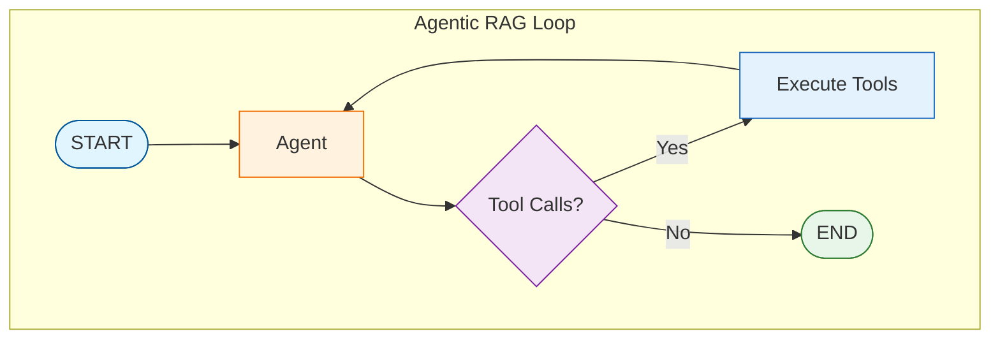

# Tutorial 12: Agentic RAG

Agentic RAG gives an LLM agent control over the retrieval process - deciding when, what, and how to retrieve.

## Overview

Previous patterns use fixed retrieval flows. Agentic RAG:
- Agent decides when to retrieve
- Multiple retrieval rounds possible
- Query decomposition for complex questions
- Iterative refinement

## Architecture



## Retrieval as a Tool

```python
from langchain_core.tools import tool

@tool
def search_documents(query: str) -> str:
    """Search the document database for information.

    Args:
        query: The search query.

    Returns:
        Retrieved document contents.
    """
    docs = retriever.retrieve_documents(query, k=3)
    return "\n\n".join([doc.page_content for doc in docs])

tools = [search_documents]
llm_with_tools = llm.bind_tools(tools)
```

## Agent System Prompt

```python
SYSTEM_PROMPT = """You are a research assistant with document search.

Strategy:
1. Break complex questions into sub-questions
2. Search for each aspect separately
3. Synthesize information from multiple searches
4. Provide comprehensive answers with sources

You can search multiple times if needed."""
```

## State Definition

```python
from langchain_core.messages import BaseMessage

class AgenticRAGState(TypedDict):
    messages: List[BaseMessage]  # Conversation history
```

## Node Functions

### Agent Node

```python
def agent(state: AgenticRAGState) -> dict:
    """Agent decides next action."""
    messages = [SystemMessage(content=SYSTEM_PROMPT)] + state["messages"]
    response = llm_with_tools.invoke(messages)
    return {"messages": [response]}
```

### Tool Execution Node

```python
from langgraph.prebuilt import ToolNode

# Create tool execution node
tool_node = ToolNode(tools)

# Or implement custom execution
def execute_tools(state: AgenticRAGState) -> dict:
    """Execute tool calls from agent."""
    last_message = state["messages"][-1]
    tool_calls = last_message.tool_calls

    tool_messages = []
    for tool_call in tool_calls:
        tool_result = search_documents.invoke(tool_call["args"])
        tool_messages.append(
            ToolMessage(
                content=tool_result,
                tool_call_id=tool_call["id"]
            )
        )

    return {"messages": tool_messages}
```

## ReAct Loop

```python
def should_continue(state: AgenticRAGState) -> str:
    last_message = state["messages"][-1]

    if hasattr(last_message, "tool_calls") and last_message.tool_calls:
        return "tools"
    return "end"

graph.add_conditional_edges(
    "agent",
    should_continue,
    {"tools": "tools", "end": END}
)
graph.add_edge("tools", "agent")  # Loop back
```

## Graph Construction

```python
from langgraph.graph import StateGraph, START, END

graph = StateGraph(AgenticRAGState)

# Nodes
graph.add_node("agent", agent)
graph.add_node("tools", execute_tools)

# Edges
graph.add_edge(START, "agent")
graph.add_conditional_edges(
    "agent",
    should_continue,
    {"tools": "tools", "end": END}
)
graph.add_edge("tools", "agent")

agentic_rag = graph.compile()
```

## Usage

```python
from langchain_core.messages import HumanMessage

# Simple question - single retrieval
result = agentic_rag.invoke({
    "messages": [HumanMessage(content="What is Self-RAG?")]
})

# Complex question - multiple retrievals
result = agentic_rag.invoke({
    "messages": [HumanMessage(content="Compare Self-RAG and CRAG")]
})

print(result["messages"][-1].content)
```

## Advanced: Multiple Tools

Provide multiple retrieval strategies:

```python
@tool
def search_documents(query: str) -> str:
    """Search local documents."""
    docs = retriever.retrieve_documents(query, k=3)
    return format_docs(docs)

@tool
def search_web(query: str) -> str:
    """Search the web for current information."""
    results = web_search_api(query)
    return format_web_results(results)

@tool
def list_available_documents() -> str:
    """List all available documents in the database."""
    return retriever.list_documents()

tools = [search_documents, search_web, list_available_documents]
```

## Query Decomposition Example

The agent can break down complex queries:

```
User: "Compare Self-RAG and CRAG, and explain which is better for current events."

Agent Reasoning:
1. Search for "Self-RAG" → Gets Self-RAG info
2. Search for "CRAG" → Gets CRAG info
3. Search for "current events RAG" → Gets info on temporal queries
4. Synthesizes comparison and recommendation
```

## Benefits

| Aspect | Standard RAG | Agentic RAG |
|--------|--------------|-------------|
| Control | Fixed flow | Agent decides |
| Queries | Single | Multiple |
| Complexity | Simple | Complex supported |
| Adaptability | Predefined | Dynamic |

## Best Practices

1. **Clear tool descriptions**: Help agent choose right tool
2. **Max iterations**: Prevent infinite loops
3. **Cost monitoring**: Multiple LLM calls can add up
4. **Tool result formatting**: Make results easy for agent to parse
5. **Error handling**: Handle tool failures gracefully

## Configuration

```bash
# Environment variables
AGENTIC_RAG_MAX_ITERATIONS=10
AGENTIC_RAG_AGENT_MODEL=llama3.2:3b
```

## Comparison with Previous Patterns

| Pattern | Retrieval Control | Best For |
|---------|------------------|----------|
| Basic RAG | None | Simple Q&A |
| Self-RAG | Quality checks | Accuracy |
| CRAG | Fallback logic | Coverage |
| Adaptive RAG | Query routing | Efficiency |
| Agentic RAG | Full agent control | Complex research |

## Quiz

Test your understanding of Agentic RAG:

<Quiz
  question="What is the key difference between Agentic RAG and previous RAG patterns?"
  tutorial-id="12-agentic-rag"
  :options="[
    { text: 'Agentic RAG is faster than other patterns', correct: false },
    { text: 'The agent decides when, what, and how to retrieve', correct: true },
    { text: 'Agentic RAG only uses web search', correct: false },
    { text: 'Agentic RAG does not support multiple sources', correct: false }
  ]"
  explanation="Unlike previous patterns with fixed retrieval flows, Agentic RAG gives the LLM agent full control over the retrieval process. The agent decides when to retrieve, what query to use, and can perform multiple retrieval rounds with query decomposition for complex questions."
  :hints="[
    { text: 'Previous patterns follow predetermined flows, but Agentic RAG is different', penalty: 10 },
    { text: 'The agent has control over the entire retrieval process dynamically', penalty: 15 }
  ]"
/>

<Quiz
  question="What is the ReAct loop in Agentic RAG?"
  tutorial-id="12-agentic-rag"
  :options="[
    { text: 'A retrieval optimization technique', correct: false },
    { text: 'A reasoning and acting cycle where the agent decides and executes tools', correct: true },
    { text: 'A type of neural network architecture', correct: false },
    { text: 'A caching mechanism for faster responses', correct: false }
  ]"
  explanation="ReAct stands for Reasoning + Acting. The loop allows the agent to alternate between reasoning about what to do next and executing tools (like search_documents). After tool execution, control returns to the agent, which continues until no more tool calls are needed."
  :hints="[
    { text: 'ReAct combines two words that describe what happens in the loop', penalty: 10 },
    { text: 'Look at the should_continue function and the graph edges that create a loop', penalty: 15 }
  ]"
/>

<Quiz
  question="Why might Agentic RAG perform multiple retrievals for a single question?"
  tutorial-id="12-agentic-rag"
  :options="[
    { text: 'To increase response speed', correct: false },
    { text: 'To handle complex questions by breaking them into sub-questions', correct: true },
    { text: 'To reduce API costs', correct: false },
    { text: 'Multiple retrievals are always required', correct: false }
  ]"
  explanation="Agentic RAG can decompose complex questions into sub-questions. For example, 'Compare Self-RAG and CRAG' might trigger separate searches for each topic. The agent synthesizes information from multiple retrievals into a comprehensive answer."
  :hints="[
    { text: 'Check the Query Decomposition Example in the tutorial', penalty: 10 },
    { text: 'Complex questions often need information about multiple topics that should be searched separately', penalty: 15 }
  ]"
/>

<Quiz
  question="How is retrieval implemented in Agentic RAG?"
  tutorial-id="12-agentic-rag"
  :options="[
    { text: 'As a fixed pipeline step', correct: false },
    { text: 'As a tool that the agent can invoke', correct: true },
    { text: 'As a background process', correct: false },
    { text: 'As a separate microservice', correct: false }
  ]"
  explanation="In Agentic RAG, retrieval is implemented as a tool (using the @tool decorator) that the agent can invoke when needed. The search_documents tool is bound to the LLM, allowing the agent to call it with specific queries during its reasoning process."
  :hints="[
    { text: 'Look at the Retrieval as a Tool section', penalty: 10 },
    { text: 'The @tool decorator and llm.bind_tools() are key implementation details', penalty: 15 }
  ]"
/>

<Quiz
  question="What best practice helps prevent infinite loops in Agentic RAG?"
  tutorial-id="12-agentic-rag"
  :options="[
    { text: 'Using smaller models', correct: false },
    { text: 'Setting max iterations limit', correct: true },
    { text: 'Caching all results', correct: false },
    { text: 'Disabling web search', correct: false }
  ]"
  explanation="Setting a maximum iterations limit (AGENTIC_RAG_MAX_ITERATIONS=10 in the configuration) prevents the agent from running indefinitely. This is crucial because the ReAct loop could otherwise continue making tool calls forever if the agent never reaches a satisfactory answer."
  :hints="[
    { text: 'Check the Best Practices section', penalty: 10 },
    { text: 'The Configuration section shows an environment variable for this', penalty: 15 }
  ]"
/>
