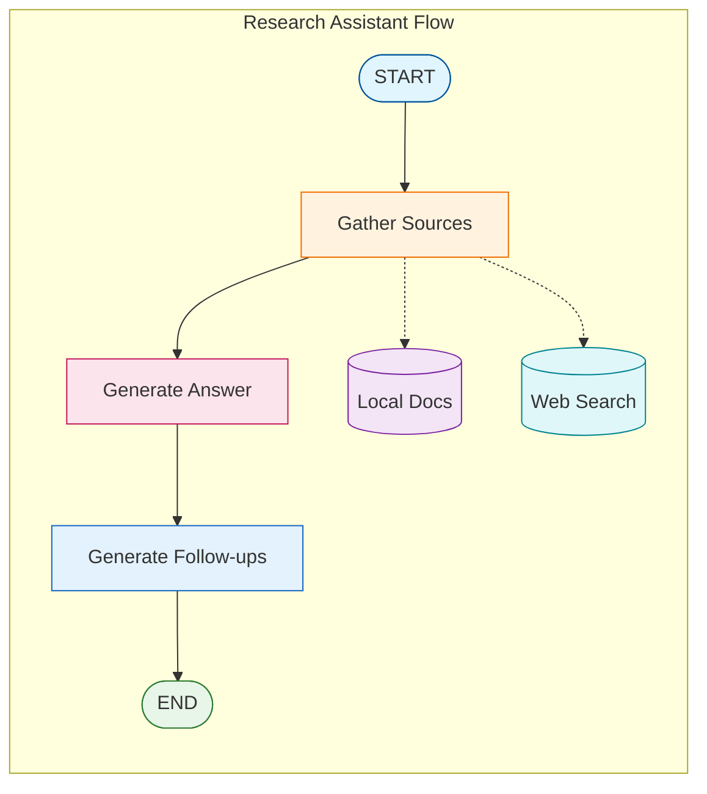

# Tutorial 13: Perplexity-Style Research Assistant

Build a full-featured research assistant with in-text citations, source metadata, and follow-up suggestions.

## Overview

This tutorial combines all RAG patterns into a polished research experience:
- In-text citations `[1]`, `[2]`
- Source cards with metadata
- Multi-source synthesis
- Follow-up question suggestions

## Architecture



## Source Data Model

```python
@dataclass
class Source:
    index: int              # Citation number [1], [2], etc.
    title: str              # Source title
    url: str                # URL or file path
    content: str            # Relevant excerpt
    source_type: str        # "local" or "web"
    page: Optional[int]     # Page number if applicable
    relevance_score: float  # Similarity score
```

## State Definition

```python
class ResearchState(TypedDict):
    question: str                    # User's question
    sources: List[Source]            # All gathered sources
    answer: str                      # Answer with citations
    follow_up_questions: List[str]   # Suggested questions
```

## Citation Prompt

```python
RESEARCH_PROMPT = """You are a research assistant.

IMPORTANT: Cite sources using [1], [2], etc. inline.
Every factual claim should have a citation.

Sources:
{sources}

Question: {question}

Answer with inline citations:"""
```

## Web Search Setup

### Tavily API (Recommended)

1. Sign up at https://tavily.com
2. Get your free API key
3. Add to `.env`:
   ```
   TAVILY_API_KEY=tvly-your-key-here
   ```

### Usage in Code

```python
from tavily import TavilyClient
import os

client = TavilyClient(api_key=os.environ["TAVILY_API_KEY"])
results = client.search(query, max_results=3)
```

## Node Functions

### Gather Sources

```python
def gather_sources(state: ResearchState) -> dict:
    """Gather sources from multiple locations."""
    sources = []

    # Local documents
    local_docs = retriever.retrieve_documents(state["question"], k=3)
    for i, doc in enumerate(local_docs, 1):
        sources.append(Source(
            index=i,
            title=doc.metadata.get("filename", "Unknown"),
            url=doc.metadata.get("source", ""),
            content=doc.page_content,
            source_type="local",
            page=doc.metadata.get("page"),
            relevance_score=doc.metadata.get("score", 0.0)
        ))

    # Web search
    web_results = web_search(state["question"], max_results=3)
    for j, result in enumerate(web_results, len(sources) + 1):
        sources.append(Source(
            index=j,
            title=result["title"],
            url=result["url"],
            content=result["content"],
            source_type="web",
            page=None,
            relevance_score=result.get("score", 0.0)
        ))

    return {"sources": sources}
```

### Generate Answer with Citations

```python
def generate_answer(state: ResearchState) -> dict:
    """Generate answer with inline citations."""
    # Format sources for prompt
    sources_text = "\n\n".join([
        f"[{s.index}] {s.title}\n{s.content}"
        for s in state["sources"]
    ])

    # Generate answer
    prompt = RESEARCH_PROMPT.format(
        sources=sources_text,
        question=state["question"]
    )
    response = llm.invoke(prompt)

    return {"answer": response.content}
```

### Generate Follow-up Questions

```python
FOLLOWUP_PROMPT = """Based on this question and answer, suggest 3 related follow-up questions.

Original Question: {question}
Answer: {answer}

Follow-up questions (one per line):"""

def generate_followups(state: ResearchState) -> dict:
    """Generate follow-up question suggestions."""
    prompt = FOLLOWUP_PROMPT.format(
        question=state["question"],
        answer=state["answer"]
    )
    response = llm.invoke(prompt)

    # Parse questions (one per line)
    questions = [
        q.strip().lstrip("123456789.-) ")
        for q in response.content.split("\n")
        if q.strip()
    ][:3]

    return {"follow_up_questions": questions}
```

## Graph Construction

```python
from langgraph.graph import StateGraph, START, END

graph = StateGraph(ResearchState)

# Nodes
graph.add_node("gather_sources", gather_sources)
graph.add_node("generate_answer", generate_answer)
graph.add_node("generate_followups", generate_followups)

# Edges
graph.add_edge(START, "gather_sources")
graph.add_edge("gather_sources", "generate_answer")
graph.add_edge("generate_answer", "generate_followups")
graph.add_edge("generate_followups", END)

research_assistant = graph.compile()
```

## Output Formatting

```python
def format_response(result: dict) -> str:
    output = []

    # Answer with citations
    output.append(result["answer"])

    # Sources section
    output.append("\n" + "─" * 50)
    output.append("Sources:")
    for src in result["sources"]:
        icon = "🌐" if src.source_type == "web" else "📄"
        score = f"[{src.relevance_score*100:.0f}%]"

        if src.page:
            output.append(f"[{src.index}] {icon} {src.title} (page {src.page}) {score}")
        else:
            output.append(f"[{src.index}] {icon} {src.title} {score}")

        if src.url:
            output.append(f"    {src.url}")

    # Follow-ups
    output.append("\n" + "─" * 50)
    output.append("Related Questions:")
    for q in result["follow_up_questions"]:
        output.append(f"• {q}")

    return "\n".join(output)
```

## Usage

```python
result = research_assistant.invoke({
    "question": "What is Self-RAG and how does it differ from CRAG?"
})

print(format_response(result))
```

## Example Output

```
Self-RAG is a framework that enhances LLMs with self-reflection [1].
It grades retrieved documents for relevance and checks answers for
hallucinations [1][2]. CRAG differs by adding web search as a
fallback mechanism [3].

──────────────────────────────────────────────────
Sources:
[1] 📄 self_rag_paper.pdf (page 3) [92%]
    /path/to/self_rag_paper.pdf
[2] 📄 rag_survey.pdf (page 12) [87%]
    /path/to/rag_survey.pdf
[3] 🌐 "Corrective RAG Explained" [85%]
    https://example.com/crag-explained

──────────────────────────────────────────────────
Related Questions:
• What are the performance benchmarks for Self-RAG?
• How does CRAG handle web search failures?
• Can Self-RAG and CRAG be combined?
```

## Advanced Features

### Source Ranking

```python
def rank_sources(sources: List[Source]) -> List[Source]:
    """Rank sources by relevance and recency."""
    return sorted(
        sources,
        key=lambda s: (s.relevance_score, s.source_type == "web"),
        reverse=True
    )
```

### Source Deduplication

```python
def deduplicate_sources(sources: List[Source]) -> List[Source]:
    """Remove duplicate or very similar sources."""
    unique_sources = []
    seen_content = set()

    for source in sources:
        # Simple dedup based on first 100 chars
        content_hash = hash(source.content[:100])
        if content_hash not in seen_content:
            unique_sources.append(source)
            seen_content.add(content_hash)

    return unique_sources
```

## Configuration

```bash
# .env
TAVILY_API_KEY=tvly-your-key-here
RAG_COLLECTION_NAME=documents
EMBEDDING_MODEL_NAME=all-mpnet-base-v2
RESEARCH_MAX_LOCAL_SOURCES=3
RESEARCH_MAX_WEB_SOURCES=3
```

## Best Practices

1. **Source diversity**: Balance local and web sources
2. **Citation verification**: Ensure all claims are cited
3. **Source quality**: Filter low-relevance sources
4. **User experience**: Format output for readability
5. **Rate limiting**: Respect API limits for web search

## Congratulations!

You've completed the RAG Patterns tutorial series. You can now build:
- Basic RAG systems
- Self-reflective RAG with quality grading
- Corrective RAG with web fallback
- Adaptive RAG with query routing
- Agentic RAG with agent control
- Full research assistants with citations

All running locally with Ollama!

## Quiz

Test your understanding of the Perplexity-Style Research Assistant:

<Quiz
  question="What are the three main components of the research assistant's output?"
  tutorial-id="13-perplexity-clone"
  :options="[
    { text: 'Query, Search, Results', correct: false },
    { text: 'Answer with citations, Sources section, Follow-up suggestions', correct: true },
    { text: 'Introduction, Body, Conclusion', correct: false },
    { text: 'Question, Raw answer, References', correct: false }
  ]"
  explanation="The research assistant provides three key components: (1) an answer with inline citations like [1], [2], (2) a sources section with metadata about each cited source, and (3) follow-up question suggestions to guide further exploration."
  :hints="[
    { text: 'Look at the Example Output section to see the complete response format', penalty: 10 },
    { text: 'The flow includes nodes for generating the answer and generating follow-ups', penalty: 15 }
  ]"
/>

<Quiz
  question="How are citations formatted in the research assistant's answers?"
  tutorial-id="13-perplexity-clone"
  :options="[
    { text: '(Author, Year) format', correct: false },
    { text: 'Superscript numbers', correct: false },
    { text: 'Inline brackets like [1], [2]', correct: true },
    { text: 'Footnotes at the bottom', correct: false }
  ]"
  explanation="Citations use inline brackets like [1], [2] to reference sources directly in the text. This Perplexity-style format makes it easy to track which claims come from which sources, with the full source details shown in the Sources section below."
  :hints="[
    { text: 'Check the RESEARCH_PROMPT for citation instructions', penalty: 10 },
    { text: 'The Example Output shows the exact citation format used', penalty: 15 }
  ]"
/>

<Quiz
  question="What fields does the Source data model include?"
  tutorial-id="13-perplexity-clone"
  :options="[
    { text: 'Only title and URL', correct: false },
    { text: 'Index, title, URL, content, source_type, page, relevance_score', correct: true },
    { text: 'Just the document content', correct: false },
    { text: 'Author and publication date only', correct: false }
  ]"
  explanation="The Source dataclass captures comprehensive metadata: index (citation number), title, url (or file path), content (relevant excerpt), source_type ('local' or 'web'), page (optional page number), and relevance_score (similarity score from retrieval)."
  :hints="[
    { text: 'Look at the Source Data Model section', penalty: 10 },
    { text: 'The model needs to track both local documents and web results', penalty: 15 }
  ]"
/>

<Quiz
  question="What is the purpose of the follow-up questions feature?"
  tutorial-id="13-perplexity-clone"
  :options="[
    { text: 'To test user knowledge', correct: false },
    { text: 'To guide further exploration and research', correct: true },
    { text: 'To correct errors in the answer', correct: false },
    { text: 'To summarize the sources', correct: false }
  ]"
  explanation="Follow-up questions are generated based on the original question and answer to suggest related topics for further exploration. This helps users continue their research by highlighting interesting directions they might not have considered."
  :hints="[
    { text: 'Check the FOLLOWUP_PROMPT to understand the purpose', penalty: 10 },
    { text: 'This is a key feature of Perplexity-style assistants', penalty: 15 }
  ]"
/>

<Quiz
  question="True or False: The research assistant only uses local documents, not web search."
  tutorial-id="13-perplexity-clone"
  type="true-false"
  :options="[
    { text: 'True', correct: false },
    { text: 'False', correct: true }
  ]"
  explanation="False. The research assistant combines BOTH local documents and web search results. The gather_sources function retrieves from both the local vector store (retriever.retrieve_documents) and web search (using Tavily API), then combines them for comprehensive coverage."
  :hints="[
    { text: 'Look at the Architecture diagram showing data sources', penalty: 10 },
    { text: 'The gather_sources function pulls from multiple knowledge sources', penalty: 15 }
  ]"
/>
