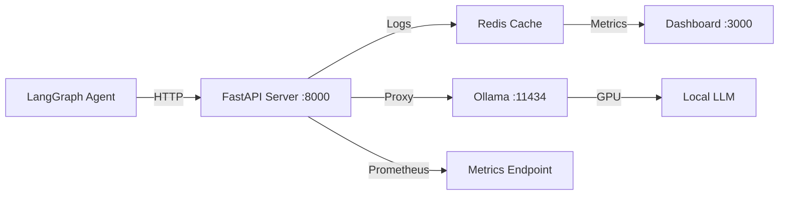

# Setup Guide

This guide will help you set up your development environment for building LangGraph agents with local LLMs via Ollama. Follow these steps to ensure everything works before starting the tutorials.

## Prerequisites

Before you begin, make sure you have:

### 1. Python 3.12 or Higher

Check your Python version:

```bash
python --version
# or
python3 --version
```

If you need to install or upgrade Python:

- **macOS**: `brew install python@3.12`
- **Ubuntu/Debian**: `sudo apt install python3.12 python3.12-venv python3-pip`
- **Windows**: Download from [python.org](https://www.python.org/downloads/)

:::tip Why Python 3.12+?
This project uses modern Python features like type hints and async syntax that require Python 3.12 or newer. Python 3.13 is also supported.
:::

### 2. Ollama Setup Options

You have two options for running Ollama with your agents. Choose based on your needs:

#### Option 1: Ollama Local Serve (Recommended)

::: tip Recommended for Production & Learning
**ollama-local-serve** provides production-grade observability with real-time monitoring, request/response logging, GPU metrics, and LangChain integration. Perfect for development, debugging, and production deployments.
:::

[ollama-local-serve](https://github.com/AbhinaavRamesh/ollama-local-serve) is a complete Ollama wrapper with built-in monitoring and observability:

**Key Features:**
- Real-time monitoring dashboard with GPU metrics
- Request/response logging and tracing
- Prometheus metrics for production monitoring
- Redis-backed response caching
- Docker and Kubernetes ready
- Built-in LangChain integration
- LAN/network deployment support

**Quick Start with pip:**
```bash
# Install with all features
pip install ollama-local-serve[all]

# Initialize configuration and start services
make init && make up
```

**Quick Start with Docker:**
```bash
# Clone the repository
git clone https://github.com/AbhinaavRamesh/ollama-local-serve.git
cd ollama-local-serve

# Start all services
docker-compose up -d
```

**Access Points:**
- **Dashboard**: `http://localhost:3000` - Real-time monitoring UI
- **API Server**: `http://localhost:8000` - FastAPI with logging
- **Ollama**: `http://localhost:11434` - Standard Ollama API

**LangChain Integration Example:**
```python
from langchain_community.llms import Ollama

# Use the monitored endpoint instead of direct Ollama
llm = Ollama(
    base_url="http://localhost:8000",  # ollama-local-serve endpoint
    model="llama3.2:3b"
)

# All requests are now logged and monitored
response = llm.invoke("Explain LangGraph")
# View request/response in dashboard at localhost:3000
```

**Architecture Overview:**



See the [ollama-local-serve GitHub repository](https://github.com/AbhinaavRamesh/ollama-local-serve) for full documentation.

---

#### Option 2: Basic Ollama Setup

::: warning Quick Prototyping Only
Basic Ollama setup is great for quick experiments but lacks monitoring, logging, and production features. Consider using ollama-local-serve for serious development.
:::

For minimal setup without monitoring features:

**Install Ollama:**

**macOS and Linux:**
```bash
curl -fsSL https://ollama.com/install.sh | sh
```

**Windows:**
Download the installer from [ollama.com](https://ollama.com/download)

**Verify Ollama is Running:**

```bash
ollama --version
# Should output: ollama version 0.x.x

# Check if the service is running
curl http://localhost:11434/api/version
# Should return JSON with version info
```

If Ollama isn't running, start it:
- **macOS/Windows**: Ollama starts automatically on login
- **Linux**: `systemctl start ollama` or run `ollama serve` in a terminal

---

#### Comparison: When to Use Each Option

| Feature | ollama-local-serve | Basic Ollama |
|---------|-------------------|--------------|
| **Setup Time** | 2-3 minutes | 1 minute |
| **Monitoring Dashboard** | ✅ Real-time UI | ❌ None |
| **Request Logging** | ✅ Full tracing | ❌ None |
| **GPU Metrics** | ✅ Yes | ❌ No |
| **Response Caching** | ✅ Redis-backed | ❌ No |
| **Production Ready** | ✅ Yes | ⚠️ Limited |
| **Docker Support** | ✅ Full support | ⚠️ Manual |
| **Prometheus Metrics** | ✅ Built-in | ❌ None |
| **LAN Deployment** | ✅ Easy | ⚠️ Manual |
| **Debugging Tools** | ✅ Extensive | ❌ None |

**Use ollama-local-serve if:**
- You want to monitor your agent's LLM calls
- You're building production applications
- You need request/response debugging
- You want GPU utilization metrics
- You're deploying to Docker/Kubernetes
- You need response caching for performance

**Use basic Ollama if:**
- You're doing quick one-off experiments
- You don't need any monitoring
- You want the absolute minimal setup

### 3. Git (for cloning the repository)

```bash
git --version
```

If not installed:
- **macOS**: `brew install git`
- **Ubuntu/Debian**: `sudo apt install git`
- **Windows**: Download from [git-scm.com](https://git-scm.com/downloads)

---

## Installation

### Option 1: Install from PyPI (Recommended)

The easiest way to get started is to install the package directly from PyPI:

```bash
# Create and activate a virtual environment (recommended)
python -m venv venv
source venv/bin/activate  # On Windows: venv\Scripts\activate

# Install with all features
pip install langgraph-ollama-local[all]

# Verify installation
langgraph-local check
```

**Install only what you need:**

```bash
# Core patterns only (tutorials 1-7)
pip install langgraph-ollama-local

# Add RAG dependencies (tutorials 8-13)
pip install langgraph-ollama-local[rag]

# Add notebook support
pip install langgraph-ollama-local[notebooks]

# All features
pip install langgraph-ollama-local[all]
```

### Option 2: Install from Source (For Development)

If you want to modify the code or contribute:

```bash
git clone https://github.com/AbhinaavRamesh/langgraph-ollama-tutorial.git
cd langgraph-ollama-tutorial

# Create virtual environment
python -m venv venv

# Activate it
# On macOS/Linux:
source venv/bin/activate

# On Windows:
venv\Scripts\activate

# Install in development mode with all dependencies
pip install -e ".[all]"
```

You should see `(venv)` in your terminal prompt when activated.

### What Gets Installed

The `[all]` option installs:
- Core LangGraph and LangChain dependencies
- RAG dependencies (ChromaDB, FAISS, embeddings)
- Persistence backends (SQLite, Redis support)
- Development tools (pytest, linting)
- Jupyter notebook support

### Verify Installation

```bash
langgraph-local check
```

This command will:
- Verify Ollama connection
- Check if required models are available
- Display your current configuration

Expected output:
```
Checking Ollama connection...
✓ Connected to Ollama at http://127.0.0.1:11434
✓ Ollama version: 0.x.x

Checking for models...
✗ Recommended model 'llama3.2:3b' not found

Configuration:
  OLLAMA_HOST: 127.0.0.1
  OLLAMA_PORT: 11434
  OLLAMA_MODEL: llama3.2:3b
```

---

## Ollama Model Setup

### Recommended Model: llama3.2:3b

For the best balance of speed and quality on consumer hardware, we recommend `llama3.2:3b`:

```bash
ollama pull llama3.2:3b
```

This model:
- **Size**: ~2GB download
- **RAM**: Requires ~4GB
- **Speed**: Fast responses on CPU
- **Quality**: Good for most tutorial tasks

### Verify the Model

```bash
ollama list
```

You should see `llama3.2:3b` in the output:
```
NAME              ID              SIZE      MODIFIED
llama3.2:3b       a80c4f17acd5    2.0 GB    2 days ago
```

### Alternative Models

Depending on your hardware, you might prefer:

| Model | Size | RAM | Use Case |
|-------|------|-----|----------|
| `llama3.2:1b` | 1.3GB | 2GB | Fastest, limited capability |
| `llama3.2:3b` | 2.0GB | 4GB | **Recommended** - best balance |
| `llama3.1:8b` | 4.7GB | 8GB | Better quality, slower |
| `qwen2.5:7b` | 4.7GB | 8GB | Good for code tasks |
| `llama3.1:70b` | 40GB | 64GB | Highest quality, GPU recommended |

To use a different model:

```bash
# Pull the model
ollama pull llama3.1:8b

# Set it as default in .env (see Configuration below)
OLLAMA_MODEL=llama3.1:8b
```

:::tip Model Performance
Smaller models (1b, 3b) work well for learning but may struggle with complex multi-agent scenarios. For production use, consider 7b or larger models.
:::

---

## Configuration

### Create Environment File

```bash
cp .env.example .env
```

Edit `.env` with your settings based on which Ollama option you chose:

**For ollama-local-serve (Option 1):**
```bash
# Ollama Configuration
OLLAMA_HOST=127.0.0.1          # localhost or LAN server IP
OLLAMA_PORT=8000               # ollama-local-serve API port (for monitoring)
OLLAMA_MODEL=llama3.2:3b       # model to use by default

# Monitoring & Caching (ollama-local-serve)
MONITORING_ENABLED=true
REDIS_HOST=localhost
REDIS_PORT=6379

# Optional: Web Search (for CRAG tutorials 10, 13)
TAVILY_API_KEY=                # Get free key at tavily.com
```

**For basic Ollama (Option 2):**
```bash
# Ollama Configuration
OLLAMA_HOST=127.0.0.1          # localhost or LAN server IP
OLLAMA_PORT=11434              # default Ollama port
OLLAMA_MODEL=llama3.2:3b       # model to use by default

# Optional: Web Search (for CRAG tutorials 10, 13)
TAVILY_API_KEY=                # Get free key at tavily.com

# Monitoring disabled for basic setup
MONITORING_ENABLED=false
```

### Configuration Options

| Variable | Default | Description |
|----------|---------|-------------|
| `OLLAMA_HOST` | `127.0.0.1` | Ollama server IP address |
| `OLLAMA_PORT` | `11434` or `8000` | Use `8000` for ollama-local-serve, `11434` for basic Ollama |
| `OLLAMA_MODEL` | `llama3.2:3b` | Default model for all agents |
| `MONITORING_ENABLED` | `false` | Enable monitoring features (ollama-local-serve only) |
| `REDIS_HOST` | `localhost` | Redis server for caching (ollama-local-serve only) |
| `REDIS_PORT` | `6379` | Redis port (ollama-local-serve only) |
| `TAVILY_API_KEY` | (optional) | Web search API key for CRAG tutorials |
| `LOG_LEVEL` | `INFO` | Logging level: DEBUG, INFO, WARNING |

### Verify Configuration

```bash
langgraph-local config
```

Expected output (with ollama-local-serve):
```
Current Configuration:
  Ollama Host: http://127.0.0.1:8000
  Default Model: llama3.2:3b
  Web Search: Disabled (no Tavily key)
  Monitoring: Enabled
  Redis: localhost:6379
```

Expected output (basic Ollama):
```
Current Configuration:
  Ollama Host: http://127.0.0.1:11434
  Default Model: llama3.2:3b
  Web Search: Disabled (no Tavily key)
  Monitoring: Disabled
```

---

## Optional: Web Search Setup

Tutorials 10 (CRAG) and 13 (Perplexity Clone) use web search for retrieving external information. This is optional but recommended for the full experience.

### Get a Tavily API Key

1. Sign up at [tavily.com](https://tavily.com)
2. Get your free API key (1000 searches/month)
3. Add to `.env`:

```bash
TAVILY_API_KEY=tvly-your-key-here
```

### Test Web Search

```python
from tavily import TavilyClient

client = TavilyClient(api_key="tvly-your-key")
results = client.search("What is LangGraph?")
print(results)
```

:::info Alternative Search Tools
You can also use DuckDuckGo (no API key required) or Google Custom Search. See the CRAG tutorial for alternatives.
:::

---

## Optional: LAN Server Setup

Running Ollama on a GPU-equipped server and accessing it from laptops/workstations? This is a common setup for teams or when you want to centralize GPU resources.

### Using ollama-local-serve (Recommended)

::: tip Best for LAN Deployments
ollama-local-serve is specifically designed for LAN deployments with built-in monitoring and multi-client support. See [Option 1 above](#option-1-ollama-local-serve-recommended) for features and benefits.
:::

**On your GPU server:**

```bash
# Install ollama-local-serve
pip install ollama-local-serve[all]

# Configure for LAN access
# Edit .env to set OLLAMA_HOST=0.0.0.0
make init

# Start all services (Ollama, FastAPI, Dashboard, Redis)
make up

# Access dashboard at http://your-server-ip:3000
```

**On your development machine(s):**

Update your project's `.env`:
```bash
OLLAMA_HOST=192.168.1.100      # your GPU server IP
OLLAMA_PORT=8000               # ollama-local-serve API port (for monitoring)
# OR use port 11434 for direct Ollama access (no monitoring)

MONITORING_ENABLED=true
REDIS_HOST=192.168.1.100       # for shared caching
```

**Benefits of LAN Setup with ollama-local-serve:**
- All team members can monitor LLM usage in real-time
- Shared Redis cache improves response times
- Centralized logging and metrics
- GPU utilization visible to everyone
- No configuration changes needed in your LangGraph code

### Manual Ollama LAN Setup

If you prefer the basic Ollama setup without monitoring:

**On the server:**
```bash
# Configure Ollama to bind to all interfaces
export OLLAMA_HOST=0.0.0.0:11434
ollama serve
```

**On your development machine:**
```bash
# Test connection
curl http://your-server-ip:11434/api/version

# Update .env
OLLAMA_HOST=your-server-ip
OLLAMA_PORT=11434
```

:::warning Security Note
Ollama and ollama-local-serve have no built-in authentication. Only expose on trusted networks or use a VPN/SSH tunnel for remote access. Consider using a reverse proxy with authentication for production deployments.
:::

---

## Verifying Installation

### Quick Test

Create a simple test file `test_setup.py`:

```python
from langgraph_ollama_local import LocalAgentConfig
from langchain_core.messages import HumanMessage

# Initialize
config = LocalAgentConfig()
llm = config.create_chat_client()

# Test basic call
response = llm.invoke([HumanMessage(content="Say hello!")])
print(response.content)
```

Run it:
```bash
python test_setup.py
```

Expected output:
```
Hello! How can I help you today?
```

### Run Example Notebook

```bash
# Start Jupyter
jupyter lab

# Open examples/core_patterns/01_chatbot_basics.ipynb
```

Run all cells. If everything works, you're ready to start the tutorials!

---

## Troubleshooting

### Ollama Connection Issues

**Problem**: `Connection refused to localhost:11434`

**Solutions**:
- Check if Ollama is running: `curl http://localhost:11434/api/version`
- Restart Ollama: `ollama serve` (Linux) or restart the app (macOS/Windows)
- Check firewall settings if using a remote server

---

### Model Not Found

**Problem**: `Model 'llama3.2:3b' not found`

**Solutions**:
```bash
# List available models
ollama list

# Pull the model
ollama pull llama3.2:3b

# Or use a different model
OLLAMA_MODEL=llama3.1:8b
```

---

### Import Errors

**Problem**: `ModuleNotFoundError: No module named 'langgraph'`

**Solutions**:
```bash
# Make sure virtual environment is activated
source venv/bin/activate  # or venv\Scripts\activate on Windows

# Reinstall
pip install -e ".[all]"

# Or install specific dependencies
pip install langgraph langchain-core
```

---

### Slow Generation

**Problem**: Model takes too long to respond

**Solutions**:
- Use a smaller model: `ollama pull llama3.2:1b`
- Check CPU/memory usage: `top` or `htop`
- Consider using a GPU server with LAN setup
- Reduce context length in configuration

---

### Memory Errors

**Problem**: `RuntimeError: Out of memory`

**Solutions**:
- Switch to a smaller model (1b instead of 3b)
- Close other applications
- Increase system swap/page file
- Use quantized models: `ollama pull llama3.2:3b-q4_0`

---

### Jupyter Kernel Issues

**Problem**: Jupyter can't find the installed packages

**Solutions**:
```bash
# Install ipykernel in your venv
pip install ipykernel

# Create kernel spec
python -m ipykernel install --user --name=langgraph-env

# Select 'langgraph-env' as kernel in Jupyter
```

---

## Next Steps

Once everything is installed and verified:

1. **Start with Tutorial 01**: [Chatbot Basics](./core/01-chatbot-basics.md)
2. **Browse all tutorials**: [Tutorial Index](./index.md)
3. **Join the community**: [GitHub Discussions](https://github.com/AbhinaavRamesh/langgraph-ollama-tutorial/discussions)

## Additional Resources

- [Ollama Documentation](https://github.com/ollama/ollama/blob/main/docs/README.md)
- [LangGraph Documentation](https://langchain-ai.github.io/langgraph/)
- [LangChain Python Docs](https://python.langchain.com/)

## Need Help?

- Check [GitHub Issues](https://github.com/AbhinaavRamesh/langgraph-ollama-tutorial/issues) for known problems
- Ask in [GitHub Discussions](https://github.com/AbhinaavRamesh/langgraph-ollama-tutorial/discussions)
- FAQ section (coming soon)

---

Ready to start building? Head to [Tutorial 01: Chatbot Basics](./core/01-chatbot-basics.md) to begin your LangGraph journey!
